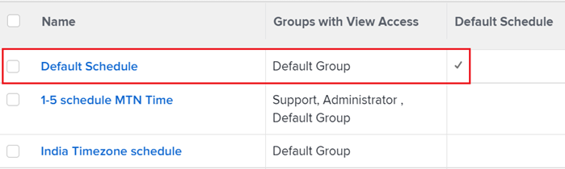

# Overzicht van schema&#39;s

<!-- Audited: 1/2024 -->

<!--
The highlighted information on this page refers to functionality not yet generally available. It is available only in the Preview environment for all customers. After the monthly releases to Production, the same features are also available in the Production environment for customers who enabled fast releases.    

For information about fast releases, see [Enable or disable fast releases for your organization](/help/quicksilver/administration-and-setup/set-up-workfront/configure-system-defaults/enable-fast-release-process.md).   

-->

U kunt uw werkweek bepalen gebruikend programma&#39;s en een programma associëren met een gebruiker of een project. Hierdoor kunnen in [!DNL Adobe Workfront] tijdlijnen en de beschikbaarheid van de gebruiker worden berekend. Voor instructies, zie [ een programma ](../../../administration-and-setup/set-up-workfront/configure-timesheets-schedules/create-schedules.md) creëren.

Houd rekening met het volgende wanneer u werkt met planningen in Workfront:

* De [!DNL Workfront] beheerder identificeert de uren van verrichting voor de organisatie in een programma.

  Op dezelfde manier kan een groepsbeheerder de bedrijfsuren van een programma identificeren dat door een groep wordt beheerd die zij leiden. Voor meer informatie over groepsbeheerders, zie [ de beheerders van de Groep ](../../../administration-and-setup/manage-groups/group-roles/group-administrators.md).

  Een schema kan bijvoorbeeld als volgt worden gedefinieerd: maandag tot en met vrijdag, 08.00 tot 17.00 uur, met een pauze voor de lunch.

* [!DNL Workfront] gebruikt het schema om te bepalen wanneer de het werkdag begint en beëindigt.

  Dit belet niet dat een gebruiker buiten de normale kantooruren aan [!DNL Workfront] werkt of het werk voltooit. Over het algemeen, is het niet noodzakelijk om een nieuw programma of een planningsuitzondering tot stand te brengen om zich op het werk te concentreren dat in de avond wordt gepland.

  Uw organisatie kan ook flexibele aankomsttijden voor uw werkdag hebben. U kunt een reeks werknemers hebben die bij 8 AM en een andere reeks aankomt die bij 9 AM aankomt. Het is niet nodig om unieke schema&#39;s voor elke groep tot stand te brengen, als de groepen gelijkaardige of identieke programma&#39;s hebben. Maar als de groepen drastisch verschillende programma&#39;s hebben, zouden hun gebruikers aan unieke programma&#39;s moeten worden geassocieerd. Een werknemer begrijpt of een opdracht om 17.00 uur moet worden voltooid, dit betekent dat het werk tegen het einde van de werkdag moet zijn gedaan, ongeacht het tijdstip waarop zij aan het werk komen.

* Wij adviseren dat u afzonderlijke programma&#39;s voor elke tijdzone verbonden aan de organisatie creeert.

  U kunt een specifieke tijdzone voor elk programma toewijzen om ervoor te zorgen dat het werk geschikt is gepland voor gebruikers die in verschillende tijdzones werken.

* Het [!DNL Workfront] standaardschema wordt gebruikt in chronologieberekeningen wanneer de gebruikers of de projecten niet met een programma worden geassocieerd.

  Het standaardschema wordt geleverd bij uw [!DNL Workfront] -systeem en kan alleen worden verwijderd als het wordt vervangen door een nieuw schema dat u maakt.

* Naast het berekenen van tijdlijnen, gebruikt [!DNL Workfront] programma&#39;s om gebruikersbeschikbaarheid te berekenen.

  >[!IMPORTANT]
  >
  >[!DNL Workfront] gebruikt of de gebruiker of het projectprogramma om middelbeschikbaarheid in de Planner van het Middel te bepalen. Welk schema wordt gebruikt, hangt af van wat de [!DNL Workfront] beheerder voor het [!UICONTROL Calculate Resource Availability Using] plaatsen selecteerde. Voor informatie over de montages van het Beheer van het Middel, zie [ de voorkeur van het Beheer van het Middel ](../../../administration-and-setup/set-up-workfront/configure-system-defaults/configure-resource-mgmt-preferences.md) vormen.

## Hiërarchie van schema&#39;s

Als een taak aan een gebruiker wordt toegewezen die met een programma wordt geassocieerd, en op een project verblijft dat met een tweede programma wordt geassocieerd, hebt u minstens 2 programma&#39;s die potentieel op uw chronologieberekeningen zouden kunnen worden toegepast.

>[!IMPORTANT]
>
>[!DNL Workfront] gebruikt het schema van een gebruiker alleen wanneer de instelling [!UICONTROL Calculate Resource Availability Using] is ingesteld op [!UICONTROL The User's Schedule] in het [!UICONTROL Resource Management] gebied van [!UICONTROL Setup] . Voor informatie over hoe het [!UICONTROL Calculate Resource Availability Using] plaatsen beïnvloedt welk programma voor het Beheer van het Middel wordt gebruikt, zie [ de voorkeur van het Beheer van het Middel ](../../../administration-and-setup/set-up-workfront/configure-system-defaults/configure-resource-mgmt-preferences.md) vormen.

De volgorde waarin de schema&#39;s door het systeem worden gebruikt wanneer er meer dan één bestaat, is:

<!--Replace the first bullet below with this when the setting releases: 
* When one user is assigned to a task, the following scenarios exist, depending on what environment you use: 

   * In the Production environment, [!DNL Workfront] uses the user's schedule for calculating the timeline of the task. This also includes the personal time of the user. The schedule of the project is ignored.

      For more information about personal time, see [Configure personal time off](../../../workfront-basics/manage-your-account-and-profile/configuring-your-user-profile/personal-time-overview.md).

   * In the Preview environment, [!DNL Workfront] uses either one of the following schedules, as defined in the [!UICONTROL Project Preferences] area of [!UICONTROL Setup]:

      * The schedule of the user who is assigned to the task 
      * The schedule associated with the project.

-->

* Wanneer een gebruiker aan een taak wordt toegewezen, gebruikt [!DNL Workfront] het programma van de gebruiker voor het berekenen van de chronologie van de taak. Dit omvat ook de persoonlijke tijd van de gebruiker. Het schema van het project wordt genegeerd.

  Voor meer informatie over persoonlijke tijd, zie [ persoonlijke tijd van ](../../../workfront-basics/manage-your-account-and-profile/configuring-your-user-profile/personal-time-overview.md) vormen.

* Wanneer meerdere gebruikers aan een taak zijn toegewezen en de gebruikers verschillende schema&#39;s hebben tijdens het tijdframe van de taak, gebruikt [!DNL Workfront] een van de volgende schema&#39;s, zoals gedefinieerd in het [!UICONTROL Project Preferences] gebied van [!UICONTROL Setup] :

   * Het schema van de gebruiker die als primaire ontvanger is aangewezen
   * Het programma verbonden aan het project.

     Voor meer informatie over projectvoorkeur, zie [ systeem-brede projectvoorkeur ](../../../administration-and-setup/set-up-workfront/configure-system-defaults/set-project-preferences.md) vormen.

* Als de gebruiker aan de taak wordt toegewezen geen programma heeft, of de taak slechts aan een baanrol, een team wordt toegewezen, of unassigned, [!DNL Workfront] gebruikt het projectprogramma voor de chronologieberekeningen.
* Als de gebruiker die aan de taak wordt toegewezen geen programma heeft, of de taak slechts aan een baanrol, een team wordt toegewezen, of unassigned, en het project heeft geen programma, dan gebruikt [!DNL Workfront] het programma in het systeem dat als StandaardProgramma voor chronologieberekeningen wordt aangewezen.

  

## Collaboration in [!DNL Workfront] in verschillende tijdzones

Voor informatie over het gebruiken van programma&#39;s om gebruikers te helpen in [!DNL Workfront] over tijdstreken samenwerken, zie [ Werkend over tijdstreken ](../../../workfront-basics/tips-tricks-and-troubleshooting/working-across-timezones.md).
