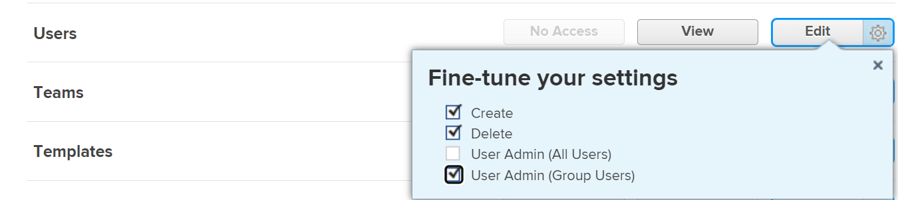

# Een bedrijf deactiveren of opnieuw activeren

<!--The highlighted information on this page refers to functionality not yet generally available. It is available only in the Preview Sandbox environment, and is being released in a phased rollout to Production.-->

U kunt een bedrijf deactiveren dat u niet meer gebruikt terwijl het behouden van al zijn bijbehorende historische gegevens. Als u een bedrijf deactiveert dat al ergens in het systeem in gebruik is, blijft het functioneren net als altijd. Het wordt niet verwijderd of geblokkeerd.

## Toegangsvereisten

+++ Breid uit om de toegangseisen voor de functionaliteit in dit artikel weer te geven.

<table style="table-layout:auto">
 <tbody> 
  <tr> 
   <td> 
[!DNL Workfront] package
 </td> 
   <td>
Alle

   </td> 
  </tr> 
  <tr> 
   <td> 
[!DNL Adobe Workfront] licentie
 </td> 
   <td>
[!UICONTROL Plan]

   
[!UICONTROL Standard]

   </td> 
  </tr>
  <tr> 
   <td>Configuraties op toegangsniveau</td> 
  <td> 
U moet een van de volgende opties hebben:
 
    <ul> 
     <li> 
Het toegangsniveau van [!UICONTROL System Administrator], dat u toestaat om het even welk bedrijf in het systeem uit te geven.
 </li> 
     <li> 
Administratieve toegang om bedrijven te beheren, die u toestaat om het even welk bedrijf in het systeem uit te geven.
 </li> 
    </ul> 
<b> NOTA </b>:
     <ul> 
      <li> 
U kunt ook bedrijven beheren die zijn gekoppeld aan een groep waaraan u als groepsbeheerder bent toegewezen.
 </li> 
      <li> 
Als u gebruikers wilt toevoegen aan en verwijderen uit het [!DNL Workfront] -systeem, moet u over een van de volgende opties beschikken:
 
       <ul> 
        <li> 
Het toegangsniveau van [!UICONTROL System Administrator]. 
 </li> 
        <li> 
<b>[!UICONTROL Users]</b> het instellen in uw toegangsniveau dat is geconfigureerd voor <b>[!UICONTROL Edit]</b> toegang, waarbij <b>[!UICONTROL Create]</b> en ten minste een van de twee <b>[!UICONTROL User Admin]</b> -opties is ingeschakeld onder <b>[!UICONTROL Fine-tune your settings]</b>  . 
 
  
 
Als <b>[!UICONTROL User Admin (Group Users)]</b> is ingeschakeld, moet u een groepbeheerder zijn van een groep waarvan de gebruiker lid is.
 </li> 
       </ul>
       </li> 
     </ul> 
 </td>
  </tr> 
 </tbody> 
</table>

Voor informatie, zie [&#x200B; vereisten van de Toegang in de documentatie van Workfront &#x200B;](/help/quicksilver/administration-and-setup/add-users/access-levels-and-object-permissions/access-level-requirements-in-documentation.md).

+++

## Een bedrijf deactiveren of opnieuw activeren

{{step-1-to-setup}}

1. In het linkerpaneel, klik **[!UICONTROL Companies]** .

1. Selecteer een of meer bedrijven om te deactiveren of opnieuw te activeren.
1. Klik op **[!UICONTROL Edit]**. <!--MAKE THIS A SEPARATE NUMBERED LINEIn the Preview environment, disable the **[!UICONTROL Is Active]** option to deactivate it, or enable the option to activate it.-->
1. Voor één bedrijf schakelt u de optie **[!UICONTROL Is Active]** uit om het te deactiveren of schakelt u de optie in om het te activeren. <!--ADD TO THE FRONT OF THIS SENTENCE In the Production environment, -->

   of

   Voor meerdere bedrijven selecteert u **[!UICONTROL No]** in de vervolgkeuzelijst **[!UICONTROL Is Active]** om de bedrijven te deactiveren of **[!UICONTROL Yes]** om de bedrijven te activeren.

1. Klik op **[!UICONTROL Save Changes]**.
