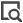

# Objecten vergelijken tussen omgevingen

U kunt objecten vergelijken tussen omgevingen om ervoor te zorgen dat uw pakketten voor milieubescherming de objecten bevatten die u nodig hebt.

U selecteert de omgevingen en typen objecten die u wilt vergelijken. Workfront vergelijkt alle objecten van de geselecteerde typen in beide omgevingen en geeft gegevens weer met betrekking tot de objectverschillen.

## Toegangsvereisten

U moet het volgende hebben:

<table>
  <tr>
   <td>Adobe Workfront-pakket
   </td>
   <td> 
Prime of Ultimate

   </td>
  </tr>
  <tr>
   <td><strong> de vergunningen van Workfront </strong>
   </td>
   <td> 
Standard
&gt;
   </td>
  </tr>
   <tr>
   <td>Configuraties op toegangsniveau
   </td>
   <td>
U moet een Workfront-beheerder zijn.

   </td>
  </tr>
</table>

Voor informatie, zie [&#x200B; vereisten van de Toegang in de documentatie van Workfront &#x200B;](/help/quicksilver/administration-and-setup/add-users/access-levels-and-object-permissions/access-level-requirements-in-documentation.md).

## Vereisten

Uw organisatie moet zich op het Adobe Business Platform bevinden om objecten tussen omgevingen te vergelijken.

## Een objectvergelijking genereren

1. Ga naar een omgeving waarin u een object wilt vergelijken.
1. Klik het **[!UICONTROL Main Menu]** pictogram  in de hoger-juiste hoek van Adobe Workfront, of (als beschikbaar), klik het **[!UICONTROL Main Menu]** pictogram  in de upper-left hoek, dan klik **[!UICONTROL Setup]** .
1. Selecteer **Systeem** in de linkernavigatie, dan selecteren **Bevordering van het Milieu**.
1. Klik **vergelijken milieu&#39;s** dichtbij de hoger-juiste hoek van het scherm.
1. Op het **milieu van Source** gebied, selecteer het milieu dat u het pakket binnen wilt creëren. Dit is het milieu dat u voorwerpen **van** kopieert.
1. Op het **milieu van het Doel** gebied, selecteer het milieu waar u het pakket wilt installeren. Dit is het milieu dat u voorwerpen **aan** kopieert.
1. In de **Voorwerpen om** gebied te vergelijken, selecteer de objecten types die u tussen milieu&#39;s wilt vergelijken.
1. Klik **produceren vergelijking** dichtbij de hoger-juiste hoek van het scherm.

   Het kan enige tijd duren om de vergelijking te genereren, afhankelijk van het aantal en de grootte van de vergeleken objecten.

## Objectvergelijking weergeven

Nadat de vergelijking is voltooid, wordt de vergelijking weergegeven.

De lijst bevat objecten van de geselecteerde type(n) die in de bronomgeving aanwezig zijn, of die objecten ontbreken in de doelomgeving en of er veldverschillen zijn tussen de twee.

>[!BEGINSHADEBOX]

In dit voorbeeld:

* De eerste regel toont een object dat aanwezig is in de doelomgeving, maar verschilt van de bronomgeving.
* De tweede regel toont een object dat zich in de doelomgeving bevindt en dat hetzelfde is als in de bronomgeving.
* De derde regel toont een object dat niet aanwezig is in de doelomgeving.

>[!ENDSHADEBOX]

Specifieke objectverschillen weergeven:

1. Klik het vergrootglaspictogram  in de lijn voor dat voorwerp.

   Er wordt een venster geopend met alle velden van dat object. verschillen zijn rood.

## Een pakket maken op basis van een objectvergelijking

U kunt een pakket rechtstreeks op basis van een objectvergelijking maken.

Voor instructies, zie [&#x200B; een pakket van een objecten vergelijking &#x200B;](/help/quicksilver/administration-and-setup/set-up-workfront/workfront-testing-environments/environment-promotion-create-package.md#create-a-package-from-an-object-comparison) in artikel creëren of uitgeven een pakket van de milieubevordering.
