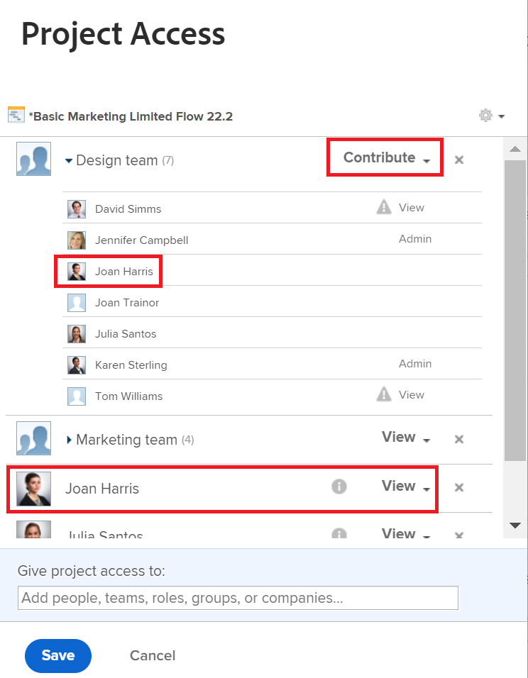

# Bij delen worden meerdere machtigingen weergegeven

## Vraag

In het venster Delen worden twee verschillende machtigingen voor één gebruiker weergegeven. Welke wordt er gebruikt?

## Antwoord

Gebruikers hebben de hoogste machtigingen die worden weergegeven op het scherm voor delen. Voor meer informatie over toestemmingen, zie het artikel [ Overzicht van het delen van toestemmingen op voorwerpen ](../../workfront-basics/grant-and-request-access-to-objects/sharing-permissions-on-objects-overview.md).

