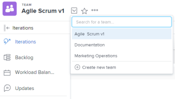

# Een bestandsteam maken

<!--Audited: 01/2024-->

Met [!DNL Adobe Workfront] kunnen mobiele teams hun werk op een incrementele, georganiseerde manier voltooien.

Om het even welke gebruiker in de organisatie kan het agile team zien en alle agile componenten voor het team, met inbegrip van de achterstand, herhalingen, verhaalraad, en individuele verhalen bekijken. Alleen teamleden met [!UICONTROL Edit] toegang tot het werk kunnen echter wijzigingen aanbrengen in het werk dat aan het team is toegewezen.

[!DNL Workfront] biedt ondersteuning voor de volgende methoden:

* **[!UICONTROL Scrum]**: Teams hebben een achterstand in hun werk die moet worden uitgevoerd. Wanneer het team aan een specifiek segment van het werk klaar is te werken, wordt het werk verplaatst van de achterstand naar een herhaling. Voor meer gedetailleerde informatie over het beheren van een team van het Trommel, zie [ Trommel in een flexibel team ](../../agile/use-scrum-in-an-agile-team/scrum-in-an-agile-team.md).

* **[!UICONTROL Kanban]:** de teams bewegen het werk in de mening Kanban over vooraf bepaalde statussen. De standaardstatussen zijn: achterstand, in-proces, en gedaan. Voor meer gedetailleerde informatie over het beheren van een team Kanban, zie [ Kanban in een flexibel team ](../../agile/use-kanban-in-an-agile-team/using-kanban-in-an-agile-team.md).

## Toegangsvereisten

+++ Breid uit om de toegangseisen voor de functionaliteit in dit artikel weer te geven.

U moet de volgende toegang hebben om de stappen in dit artikel uit te voeren:

<table style="table-layout:auto"> 
 <col> 
 </col> 
 <col> 
 </col> 
 <tbody> 
  <tr> 
   <td role="rowheader"><strong>[!DNL Adobe Workfront] plan*</strong></td> 
   <td> 
Alle
 </td> 
  </tr> 
  <tr> 
   <td role="rowheader"><strong>[!DNL Adobe Workfront] licentie*</strong></td> 
   <td> 
Nieuw: Standaard

   Huidige: 
   <ul><li>
[!UICONTROL Plan] om een nieuw team te creëren
</li> 
   <li>
[!UICONTROL Work] of hoger om een team om te zetten in een flexibel team
</li></ul> </td> 
  </tr> 
 </tbody> 
</table>

Neem contact op met de [!DNL Workfront] -beheerder als u wilt weten welk abonnement- of licentietype u hebt.

+++

## Beslissen over een flexibele methode

U kunt voor uw mobiele team een methode gebruiken voor Scrum of Kanban. Elke methode biedt verschillende voordelen. De manier waarop uw mobiele team werkt, bepaalt de flexibele methode die u kiest.

Met de methoden Scrum en Kanban agile in [!DNL Workfront] kunt u artikelen over een artikelbord verplaatsen om een statuswijziging en de voortgang van het artikel aan te geven.

De methoden Scrum en Kanban agile in [!DNL Workfront] verschillen op de volgende manieren:

### Voordelen van het gebruik van Kanban in [!DNL Workfront]

Met de [!DNL Kanban] &#39;agile&#39;-methode in [!DNL Workfront] kunt u artikelen gemakkelijker over een &#39;agile story&#39;-board verplaatsen en tegelijkertijd de hoeveelheid werk die wordt uitgevoerd, beperken. Er zijn geen begin- en einddatums wanneer u de methode [!DNL Kanban] AGile gebruikt.

Deze methode wordt ondersteund door de volgende functionaliteit:

* Geef de achtergrond weer op de [!DNL Kanban] -kaart voor een nieuw artikel.\
   Voor meer informatie, zie [ de achterstand aan de [!UICONTROL Kanban] raad ](../../agile/use-kanban-in-an-agile-team/view-the-backlog-on-the-kanban-board.md) toevoegen.

* Configureer de items op de achtergrond die automatisch aan de [!UICONTROL Kanban] agile story-board moeten worden toegevoegd wanneer andere items naar een status worden verplaatst die gelijk is aan Voltooien.\
   Voor meer informatie, zie de sectie [ verhalen vormen die automatisch van de achterstand ](../../agile/get-started-with-agile-in-workfront/configure-kanban.md#configur5) in het artikel [ worden toegevoegd Kanban ](../../agile/get-started-with-agile-in-workfront/configure-kanban.md) vormen.

* Configureer een WIP-limiet (Work In progress) die moet worden weergegeven op de [!UICONTROL Kanban] -kaart voor onregelmatig artikel.\
   Voor meer informatie, zie [ leiden het werk lopend (WIP) grens op de raad Kanban ](../../agile/use-kanban-in-an-agile-team/work-in-progress-limit-on-the-kanban-board.md).

### Voordelen van het gebruik van Scrum in [!DNL Workfront]

Met de methode voor de rol van de trommel in [!DNL Workfront] kunt u een set artikelen toevoegen aan een flexibele herhaling en een artikelbord voor die herhaling maken. De herhaling is gebaseerd op de begin- en einddatum die u definieert.

Deze methode wordt ondersteund door de volgende functionaliteit:

* Inclusief problemen op de whiteboard van [!UICONTROL Scrum]
* Inclusief problemen op de achtergrond van een bestandsteam
* Subtaken kunnen worden weergegeven op het [!UICONTROL Scrum] artikelbord
* Een uitvouwdiagram weergeven om de voortgang tegen artikelen tijdens de herhaling te bekijken\
   Voor meer informatie, zie [ Overzicht van de de burndown grafiek van de Gelijkheid ](../../agile/use-scrum-in-an-agile-team/burndown/burndown-chart-overview.md).

## Een bestandsteam maken

{{step1-to-team}}

1. Klik het **[!UICONTROL Switch Teams]** pictogram van het pictogram , dan klik **[!UICONTROL Create new team]**.

   

   Het vak Nieuw team wordt weergegeven.

1. Geef de volgende informatie op:

   <table style="table-layout:auto"> 
    <col> 
    <col> 
    <tbody> 
     <tr> 
      <td role="rowheader"><strong>[!UICONTROL Team Name]</strong> </td> 
      <td>Typ een naam voor het nieuwe bestandsteam.</td> 
     </tr> 
     <tr> 
      <td role="rowheader"><strong>[!UICONTROL This is an Agile Team]</strong> </td> 
      <td>Selecteer deze optie om dit nieuwe team te vormen om een flexibel team te worden.</td> 
     </tr>

   <tr> 
      <td role="rowheader"><strong>[!UICONTROL Is Active]</strong> </td> 
      <td>Selecteer deze optie om dit team te activeren. Inactieve teams zijn niet zichtbaar voor andere gebruikers om toe te wijzen aan het werk. </td> 
     </tr>

   <tr data-mc-conditions="QuicksilverOrClassic.Quicksilver"> 
      <td role="rowheader"><strong>[!UICONTROL Group]</strong> </td> 
      <td> 
Typ de naam van een groep die u aan het team wilt toevoegen en selecteer vervolgens de naam wanneer deze in de vervolgkeuzelijst wordt weergegeven.
 
<b>OPMERKING</b>
 
 Wanneer een team aan een groep of subgroep wordt toegewezen, kunnen om het even welke groepsbeheerders van die groep of subgroep het team beheren zonder een lid van het team te zijn. Groepbeheerders kunnen vanuit [!UICONTROL Main Menu] naar het gebied [!UICONTROL Teams] gaan en op [!UICONTROL Switch Teams] pijl  klikken om alle teams weer te geven die zijn toegewezen aan de groepen die ze beheren.
 </td> 
     </tr> 
     <tr> 
      <td role="rowheader"><strong>[!UICONTROL Team Members]</strong> </td> 
      <td>Typ de naam van een gebruiker die zich in het team moet bevinden en selecteer vervolgens de naam wanneer deze wordt weergegeven in de vervolgkeuzelijst.  herhaal dit proces om veelvoudige gebruikers aan het team toe te voegen.  omdat de gebruikers op meer dan één team kunnen zijn, kunnen zij op zowel flexibele als niet-flexibele teams zijn.</td> 
     </tr> 
     <tr> 
      <td role="rowheader"><strong>[!UICONTROL Description]</strong> </td> 
      <td>
Typ een beschrijving voor het team.
 
De beschrijving wordt rechtsboven in het [!UICONTROL Teams] -gebied weergegeven wanneer het team is geselecteerd.

      
Als de beschrijving lang is, kunt u erop klikken om de volledige beschrijving in een pop-up te tonen. Als u toegang hebt om de [!UICONTROL team settings] te bewerken, kunt u de beschrijving ook rechtstreeks in het pop-upvenster bewerken.
</td>
     </tr> 
    </tbody> 
   </table>

1. Klik op **[!UICONTROL Create]**.

   Raadpleeg de volgende artikelen voor informatie over het configureren van een Agile-team:

   * [Configureren [!UICONTROL Kanban]](../../agile/get-started-with-agile-in-workfront/configure-kanban.md)
   * [Configureren [!UICONTROL Scrum]](../../agile/get-started-with-agile-in-workfront/configure-scrum.md)

## Een bestaand team converteren naar een flexibel team

U kunt een bestaand team omzetten in een flexibel team:

1. Klik op het **[!UICONTROL Main Menu]** pictogram  rechtsboven in [!DNL Adobe Workfront] en klik vervolgens op **[!UICONTROL Teams]** .
1. Klik het **[!UICONTROL Switch team]** pictogram van het pictogram , dan of selecteer een nieuw team van het drop-down menu of onderzoek naar een team in de onderzoeksbar.

1. Selecteer het team dat u in een flexibel team wilt omzetten.
1. Klik op het menu **[!UICONTROL More]** en selecteer vervolgens **[!UICONTROL Edit]** .\
   Deze optie wordt alleen weergegeven voor teamleden met een [!UICONTROL Plan] - of [!UICONTROL Work] -licentie.\
   

1. Selecteer **[!UICONTROL This is an Agile Team]** in de sectie **[!UICONTROL Agile]** .

1. Geef in de sectie **[!UICONTROL Methodology]** op of het team een **[!UICONTROL Scrum]** - of **[!UICONTROL Kanban]** -methode gebruikt.

1. Klik **sparen Veranderingen.**

   Het team wordt opgeslagen als een Agile-team. U kunt het nieuwe team als Trommel of een team vormen Kanban wanneer u het team uitgeeft.

   Raadpleeg de volgende artikelen voor meer informatie:

   * [Configureren [!UICONTROL Kanban]](../../agile/get-started-with-agile-in-workfront/configure-kanban.md)
   * [Configureren [!UICONTROL Scrum]](../../agile/get-started-with-agile-in-workfront/configure-scrum.md)
