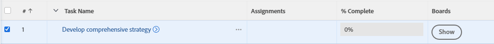

# Bestaande taken of problemen toevoegen aan een [!DNL Adobe Workfront] board of workstream

{{highlighted-preview-article-level}}

U kunt elke taak of uitgave toevoegen aan een board of een workstream in [!DNL Adobe Workfront] in een lijst- of rapportweergave.

## Toegangsvereisten

U moet de volgende toegang hebben om de stappen in dit artikel uit te voeren:

<table style="table-layout:auto">
 <col>
 <col>
 <tbody>
  <tr>
   <td role="rowheader"><strong>[!DNL Adobe Workfront] plan*</strong></td>
   <td> 
Alle
 </td>
  </tr>
  <tr>
   <td role="rowheader"><strong>[!DNL Adobe Workfront] licentie*</strong></td>
   <td> 
[!UICONTROL Work] of hoger
 </td>
  </tr>
  <tr>
   <td role="rowheader"><strong>Objectmachtigingen</strong></td>
   <td> 
[!UICONTROL View] of hogere machtigingen voor de taak of uitgave
 
Voor informatie over het aanvragen van aanvullende toegang raadpleegt u <a href="/help/quicksilver/workfront-basics/grant-and-request-access-to-objects/request-access.md" class="MCXref xref">Toegang tot objecten aanvragen </a>.
 </td>
  </tr>
 </tbody>
</table>

&#42;Neem contact op met uw [!DNL Workfront] beheerder.

## Bestaande taken of problemen aan een board toevoegen

1. Klik op de knop **[!UICONTROL Main Menu]** pictogram  in de rechterbovenhoek van [!DNL Adobe Workfront].
1. Kies een van de volgende opties: **[!UICONTROL Projects]**, **[!UICONTROL Reporting]**, of **[!UICONTROL Dashboards]**.
1. Ga naar het project, het rapport, of het dashboard dat de taak of de kwestie bevat u aan de raad wilt toevoegen.
1. Selecteer een of meer taken of problemen.
1. Klikken [!UICONTROL **Meer**] > [!UICONTROL **Toevoegen aan kamers**].
1. In de [!UICONTROL Add To] selecteert u het board waaraan u de items wilt toevoegen.

   Met deze optie zijn alleen zelfstandige borden beschikbaar, geen borden die deel uitmaken van werkstromen.

1. Klikken [!UICONTROL **Toevoegen**].

   De taak of kwestie wordt toegevoegd aan de raad. Als op de kaart kolombeleid is toegepast voor status, wordt de kaart toegevoegd in de kolom die overeenkomt met de status. Anders wordt deze weergegeven in de eerste kolom aan de linkerkant, exclusief de inlaatkolom.

   Voor informatie over kolombeleid raadpleegt u [Bordkolommen beheren](/help/quicksilver/agile/get-started-with-boards/manage-board-columns.md).

## Bestaande taken of problemen toevoegen aan een werkstroom

1. Klik op de knop **[!UICONTROL Main Menu]** pictogram  in de rechterbovenhoek van [!DNL Adobe Workfront].
1. Kies een van de volgende opties: **[!UICONTROL Projects]**, **[!UICONTROL Reporting]**, of **[!UICONTROL Dashboards]**.
1. Ga naar het project, het rapport, of het dashboard dat de taak of de kwestie bevat u aan de werkstroom wilt toevoegen.
1. Selecteer een of meer taken of problemen.
1. Klikken [!UICONTROL **Meer**] > [!UICONTROL **Toevoegen aan Workstream**].
1. In de [!UICONTROL Add To] selecteert u de werkstream waaraan u de items wilt toevoegen.
1. Klikken [!UICONTROL **Toevoegen**].

   De taak of kwestie wordt toegevoegd aan de de kaartlijst van de werkstroom als ongeplande kaart.

## Borden weergeven die zijn gekoppeld aan een taak of uitgave

1. Ga naar het project, het rapport, of het dashboard dat de taak of de kwestie bevat u plankeninformatie voor wilt zien.
1. Selecteer een weergave die de kolom Borden bevat of maak een nieuwe weergave met de kolom Borden.
Voor informatie over weergaven raadpleegt u [Weergaven maken of bewerken in Adobe Workfront](/help/quicksilver/reports-and-dashboards/reports/reporting-elements/create-edit-views.md).
1. Klikken [!UICONTROL **Tonen**] in de kolom om de lijst met borden weer te geven, is de taak of uitgave ingeschakeld.

   

1. Klik op de naam van een board om de verbonden taak of uitgave in de board te openen.

   
