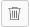

# Tags toevoegen

U kunt codes aan kaarten toevoegen om visueel aan te tonen dat deze op elkaar lijken. Vervolgens kunt u met deze tags filteren om verwante kaarten weer te geven.

>[!NOTE]
>
>Tags worden niet tussen tekengebieden gedeeld.

## Toegangsvereisten

U moet de volgende toegang hebben om de stappen in dit artikel uit te voeren:

<table style="table-layout:auto"> 
 <col> 
 </col> 
 <col> 
 </col> 
 <tbody> 
  <tr> 
   <td role="rowheader"><strong>[!DNL Adobe Workfront] plan*</strong></td> 
   <td> 
Alle
 </td> 
  </tr> 
  <tr> 
   <td role="rowheader"><strong>[!DNL Adobe Workfront] licentie*</strong></td> 
   <td> 
[!UICONTROL Request] of hoger
 </td> 
  </tr> 
 </tbody> 
</table>

&#42;Neem contact op met uw [!DNL Workfront] beheerder.

## Tags maken voor een bord

{{step1-to-boards}}

1. Toegang tot een bord. Zie voor meer informatie [Een board maken of bewerken](../../agile/get-started-with-boards/create-edit-board.md).
1. Klik op de knop **[!UICONTROL More]** menu  naast de naam van het tekengebied, kiest u **[!UICONTROL Tag Manager]**.

   

1. In de [!UICONTROL Tag Manager] dialoogvenster selecteert u [!UICONTROL **Tag toevoegen**] in de [!UICONTROL Board Tags] sectie.
1. Typ de tagnaam in het gemarkeerde vak en kies vervolgens een kleur voor dit label in het vervolgkeuzemenu. De tag wordt automatisch opgeslagen.
1. (Voorwaardelijk) Herhaal stap 4-5 om extra labels te maken.
1. Klikken **[!UICONTROL Done]** in de rechterbovenhoek van het vak.

   

## Tags maken voor een werkstroom

>[!IMPORTANT]
>
>Workstreams zijn alleen beschikbaar voor een specifieke groep klanten.

Workstream-tags zijn beschikbaar voor alle boards in een werkstream.

{{step1-to-boards}}

1. Klik op het dashboard op [!UICONTROL **Werkstroom weergeven**] om een werkstroom te openen.
1. Open een bord. Klik op de knop **[!UICONTROL More]** menu  naast de naam van het tekengebied, kiest u **[!UICONTROL Tag Manager]**.

   of

   Klikken [!UICONTROL **Configureren**] om de [!UICONTROL Configure Workstream] deelvenster. Klik vervolgens op **[!UICONTROL Tag Manager]**.

1. In de [!UICONTROL Tag Manager] dialoogvenster selecteert u [!UICONTROL **Tag toevoegen**] in de sectie Workstream-tags.
1. Typ de tagnaam in het gemarkeerde vak en kies vervolgens een kleur voor dit label in het vervolgkeuzemenu. De tag wordt automatisch opgeslagen.
1. (Voorwaardelijk) Herhaal stap 4-5 om extra labels te maken.
1. Klikken **[!UICONTROL Done]** in de rechterbovenhoek van het vak.

   

## Een tag toevoegen aan een kaart

1. Toegang tot een bord.
1. Als u de kaartgegevens wilt bewerken, klikt u op de kaart (niet op de kaartnaam).

   of

   Klik op de knop **[!UICONTROL More]** menu ![[!UICONTROL More menu]](assets/more-icon-spectrum.png) op de kaart en selecteer **[!UICONTROL Edit]**.

1. In de **[!UICONTROL Tags]** typt u de naam van een bestaande tag en selecteert u deze in de zoekresultaten.\
   of\
   Klik op de knop **[!UICONTROL Edit]**&#x200B;  en maak een nieuwe tag in Tagbeheer. Klikken **Gereed** om terug te keren naar de kaart, selecteert u het label op de kaart.
1. Klikken **Sluiten**.

## Een tag bewerken

1. Toegang tot een bord.
1. Klik op de knop **[!UICONTROL More]** menu  naast de naam van het tekengebied, kiest u **[!UICONTROL Tag Manager]**.

   

1. (Voorwaardelijk) Klik op de tagnaam om de tekst te bewerken.
1. (Voorwaardelijk) Klik op de knop [!UICONTROL color] vervolgkeuzelijst om de kleur van de tag te wijzigen.
1. Klik op **[!UICONTROL Done]**.

## Een tag van een kaart verwijderen

1. Toegang tot een bord.
1. Als u de kaartgegevens wilt bewerken, klikt u op de kaart (niet op de kaartnaam).

   of

   Klik op de knop **[!UICONTROL More]** menu ![[!UICONTROL More menu]](assets/more-icon-spectrum.png) op de kaart en selecteer **[!UICONTROL Edit]**.

1. Zoek het label dat u van de kaart wilt verwijderen en klik vervolgens op de knop **[!UICONTROL Remove]** pictogram .
1. Klik op **[!UICONTROL Close]**.

## Een tag verwijderen

1. Toegang tot een bord.
1. Klik op de knop **[!UICONTROL More]** menu ![[!UICONTROL More menu]](assets/more-icon-spectrum.png) naast de naam van het tekengebied, kiest u **[!UICONTROL Tag Manager]**.

   

1. Zoek de tag die u wilt verwijderen en klik op de knop **[!UICONTROL Delete]** pictogram .
1. Klik op **[!UICONTROL Done]**.
