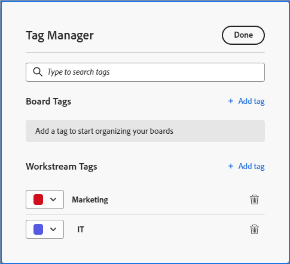

# Tags toevoegen

U kunt codes aan kaarten toevoegen om visueel aan te tonen dat deze op elkaar lijken. Vervolgens kunt u met deze tags filteren om verwante kaarten weer te geven.

>[!NOTE]
>
>Tags worden niet tussen tekengebieden gedeeld.

## Toegangsvereisten

+++ Breid uit om de toegangseisen voor de functionaliteit in dit artikel weer te geven.

U moet de volgende toegang hebben om de stappen in dit artikel uit te voeren:

<table style="table-layout:auto"> 
 <col> 
 <col> 
 <tbody> 
  <tr> 
   <td role="rowheader">[!DNL Adobe Workfront]</td> 
   <td> 
Alle
 </td> 
  </tr> 
  <tr> 
   <td role="rowheader">[!DNL Adobe Workfront] licentie</td> 
   <td> 
   
Nieuw: [!UICONTROL Contributor] of hoger
 
   
of

   
Huidig: [!UICONTROL Request] of hoger

   </td> 
  </tr> 
 </tbody> 
</table>

Voor meer detail over de informatie in deze lijst, zie [ vereisten van de Toegang in de documentatie van Workfront ](/help/quicksilver/administration-and-setup/add-users/access-levels-and-object-permissions/access-level-requirements-in-documentation.md).

+++

## Tags maken voor een bord

{{step1-to-boards}}

1. Toegang tot een bord. Voor informatie, zie [ creeer of geef een raad ](../../agile/get-started-with-boards/create-edit-board.md) uit.
1. Klik het **[!UICONTROL More]** menu  naast de bordnaam, dan kies **[!UICONTROL Tag Manager]**.

   

1. In het [!UICONTROL Tag Manager] dialoogvakje, voegt de uitgezochte [!UICONTROL **markering**] in de [!UICONTROL Board Tags] sectie toe.
1. Typ de tagnaam in het gemarkeerde vak en kies vervolgens een kleur voor dit label in het vervolgkeuzemenu. De tag wordt automatisch opgeslagen.
1. (Voorwaardelijk) Herhaal stap 4-5 om extra labels te maken.
1. Klik op **[!UICONTROL Done]** in de rechterbovenhoek van het vak.

   

## Tags maken voor een werkstroom

>[!IMPORTANT]
>
>Workstreams zijn alleen beschikbaar voor een specifieke groep klanten.

Workstream-tags zijn beschikbaar voor alle boards in een werkstream.

{{step1-to-boards}}

1. Op het dashboard, klik [!UICONTROL **de werkstroom van de Mening**] om een werkstroom te openen.
1. Open een bord. Klik het **[!UICONTROL More]** menu  naast de bordnaam, dan kies **[!UICONTROL Tag Manager]**.

   of

   Klik [!UICONTROL **vormen**] om het [!UICONTROL Configure Workstream] paneel te openen. Klik vervolgens op **[!UICONTROL Tag Manager]** .

1. In het [!UICONTROL Tag Manager] dialoogvakje, voegt de uitgezochte [!UICONTROL **markering**] in de sectie van de Markeringen van de Werkstroom toe.
1. Typ de tagnaam in het gemarkeerde vak en kies vervolgens een kleur voor dit label in het vervolgkeuzemenu. De tag wordt automatisch opgeslagen.
1. (Voorwaardelijk) Herhaal stap 4-5 om extra labels te maken.
1. Klik op **[!UICONTROL Done]** in de rechterbovenhoek van het vak.

   

## Een tag toevoegen aan een kaart

1. Toegang tot een bord.
1. Als u de kaartgegevens wilt bewerken, klikt u op de kaart (niet op de kaartnaam).

   of

   Klik op het **[!UICONTROL More]** menu ![[!UICONTROL More menu]](assets/more-icon-spectrum.png) op de kaart en selecteer **[!UICONTROL Edit]** .

1. Typ in het vak **[!UICONTROL Tags]** de naam van een bestaande tag en selecteer deze in de zoekresultaten.\
   of\
   Klik het **[!UICONTROL Edit]** pictogram &#x200B;  en creeer een nieuwe markering in de Manager van de Markering. Klik **Gedaan** om aan de kaart terug te keren, dan de markering op de kaart te selecteren.
1. Klik **dicht**.

## Een tag bewerken

1. Toegang tot een bord.
1. Klik het **[!UICONTROL More]** menu  naast de bordnaam, dan kies **[!UICONTROL Tag Manager]**.

   

1. (Voorwaardelijk) Klik op de tagnaam om de tekst te bewerken.
1. (Voorwaardelijk) Klik het [!UICONTROL color] drop-down menu om de markeringskleur te veranderen.
1. Klik op **[!UICONTROL Done]**.

## Een tag van een kaart verwijderen

1. Toegang tot een bord.
1. Als u de kaartgegevens wilt bewerken, klikt u op de kaart (niet op de kaartnaam).

   of

   Klik op het **[!UICONTROL More]** menu ![[!UICONTROL More menu]](assets/more-icon-spectrum.png) op de kaart en selecteer **[!UICONTROL Edit]** .

1. Vind de markering u van de kaart wilt verwijderen, dan klik het **[!UICONTROL Remove]** pictogram .
1. Klik op **[!UICONTROL Close]**.

## Een tag verwijderen

1. Toegang tot een bord.
1. Klik op het **[!UICONTROL More]** menu ![[!UICONTROL More menu]](assets/more-icon-spectrum.png) naast de naam van het tekengebied en kies vervolgens **[!UICONTROL Tag Manager]** .

   

1. Vind de markering u wilt schrappen, dan klik het **[!UICONTROL Delete]** pictogram .
1. Klik op **[!UICONTROL Done]**.
