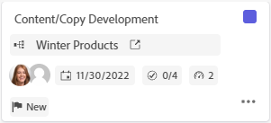

# Gekoppelde kaarten op borden gebruiken

<!-- Audited: 2/2024 -->

U kunt een kaart toevoegen aan uw board die is aangesloten op bestaande taken en problemen in [!DNL Workfront].

Wanneer een van de volgende gegevens voor de kaart op de ene locatie wordt bijgewerkt, wordt deze automatisch op de andere locatie bijgewerkt:

* [!UICONTROL Name]
* [!UICONTROL Description]
* [!UICONTROL Assignees]
* [!UICONTROL Status]
* [!UICONTROL Planned completion date]
* [!UICONTROL Estimation] / [!UICONTROL Story Points]
* [!UICONTROL Subtasks]
* [!UICONTROL Documents]

>[!NOTE]
>
>Eén verbonden taak of uitgave kan slechts eenmaal per board worden toegevoegd. Dezelfde taak of uitgave kan met meerdere borden worden verbonden.

## Toegangsvereisten

+++ Breid uit om de toegangseisen voor de functionaliteit in dit artikel weer te geven.

U moet de volgende toegang hebben om de stappen in dit artikel uit te voeren:

<table style="table-layout:auto"> 
 <tbody> 
  <tr> 
   <td role="rowheader">[!DNL Adobe Workfront] plan</td> 
   <td> 
Alle
 </td> 
  </tr> 
  <tr> 
   <td role="rowheader">[!DNL Adobe Workfront] licentie</td> 
   <td>
   
Nieuw: Medewerker of hoger

   
of

   
Huidig: Verzoek of hoger

 </td> 
  </tr> 
  <tr>
   <td role="rowheader">Configuraties op toegangsniveau</td>
   <td>
Toegang tot taken en problemen weergeven of vergroten
</td>
  </tr>
  <tr>
   <td role="rowheader">Objectmachtigingen</td>
   <td>
Machtigingen weergeven of hoger voor de Workfront-taak of -uitgave

   
<strong>Opmerking:</strong> Gebruikers met weergavemachtigingen voor een taak of uitgave kunnen geen actie ondernemen op kaarten die ermee zijn verbonden, zoals het verplaatsen van de kaart naar een andere kolom op de kaart. Gebruikers weergeven kunnen de kaart alleen openen om de eigenschappen te bekijken en de verbonden taak of uitgave te openen. Als u aanvullende toegang wilt aanvragen, opent u de taak of geeft u de uitgave op en vraagt u daar om toegang.</td>
  </tr>
 </tbody> 
</table>

Zie voor meer informatie over de informatie in deze tabel [Toegangsvereisten in Workfront-documentatie](/help/quicksilver/administration-and-setup/add-users/access-levels-and-object-permissions/access-level-requirements-in-documentation.md).

+++

## Een aangesloten kaart toevoegen

1. Klik op de knop **[!UICONTROL Main Menu]** pictogram  in de rechterbovenhoek van Adobe Workfront of (indien beschikbaar) op de knop **[!UICONTROL Main Menu]** pictogram  in de linkerbovenhoek klikt u op **[!UICONTROL Boards]**.
1. Toegang tot een bord. Zie voor meer informatie [Een board maken of bewerken](../../agile/get-started-with-boards/create-edit-board.md).
1. Klikken **[!UICONTROL Add card]>[!UICONTROL Connected card]**.
1. Kies een project en kies vervolgens een taak of uitgave die u als kaart aan de kaart wilt toevoegen.

   U kunt meerdere objecten selecteren en deze worden allemaal als aparte kaarten toegevoegd.

   >[!NOTE]
   >
   >* Alleen objecten waarvoor u machtigingen hebt, zijn beschikbaar in de zoekresultaten. Als een item grijs wordt weergegeven, is het al aan het bord toegevoegd.
   >* Wanneer u filtert op **[!UICONTROL Projects I Own]** of **[!UICONTROL Projects I'm On]**, worden projecten die overeenkomen met de status Voltooid, Dode of Geweigerd niet opgenomen. U kunt nog steeds naar die projecten zoeken met de **[!UICONTROL All]** filter.

1. Klik op **[!UICONTROL Add]**.

   

   De kaart wordt onder aan de linkerkolom toegevoegd. De aangesloten [!DNL Workfront] -object en de bijbehorende toewijzingen worden op de kaart weergegeven.

   

1. Klikken  om de [!DNL Workfront] taak of probleem op een nieuw browsertabblad.
1. Als u de kaartgegevens wilt bewerken, klikt u op de kaart (niet op de kaartnaam).

   of

   Klik op de knop **[!UICONTROL More]** menu  op de kaart en selecteer **[!UICONTROL Edit]**.

1. In de **[!UICONTROL Card Details]** de volgende gegevens toevoegen of bijwerken:

   <table style="table-layout:auto"> 
    <tbody> 
     <tr> 
      <td role="rowheader"><strong>[!UICONTROL Name]</strong></td> 
      <td>Als u de naam wijzigt, verandert ook de naam in de verbonden [!DNL Workfront] object.</td> 
     </tr> 
     <tr> 
      <td role="rowheader"><strong>[!UICONTROL Description]</strong></td> 
      <td>Als u de beschrijving wijzigt, verandert ook de beschrijving op de verbonden [!DNL Workfront] object. U kunt URL's toevoegen in de beschrijving en deze worden klikbare koppelingen wanneer de kaart wordt opgeslagen.</td> 
     </tr>
     <tr>
      <td role="rowheader"><strong>[!UICONTROL Column]</strong></td>
      <td>Selecteer de kolom voor de kaart.</td>
     </tr>
     <tr>
      <td role="rowheader"><strong>[!UICONTROL Status]</strong></td>
      <td>
Selecteer een status voor de kaart. De standaardinstellingen zijn [!UICONTROL New], [!UICONTROL In Progress], en [!UICONTROL Complete], maar alle aangepaste statussen die zijn gedefinieerd voor het item in [!DNL Workfront] zijn ook beschikbaar.

      
Als u kolombeleid hebt ingeschakeld voor het bijwerken van veldwaarden, wordt bij het wijzigen van de status op de kaart de kaart automatisch naar de corresponderende kolom verplaatst. Zie "Kolominstellingen en beleid definiëren" in het artikel voor meer informatie <a href="/help/quicksilver/agile/get-started-with-boards/manage-board-columns.md" class="MCXref xref">Bordkolommen beheren</a>.

      
Als u op <strong>[!UICONTROL Mark Complete]</strong> boven aan de kaart wordt de status automatisch gewijzigd in Voltooid.
</td>
     </tr>
     <tr>
      <td role="rowheader"><strong>[!UICONTROL Planned Completion]</strong></td>
      <td>Als u deze datum wijzigt, wordt ook de geplande voltooiingsdatum op de verbonden [!DNL Workfront] object.</td>
     </tr>
      <tr>
      <td role="rowheader"><strong>[!UICONTROL Estimation]</strong></td>
      <td>
Het aantal uren dat de kaart moet worden ingevuld.

Als u de schatting wijzigt, wordt ook de waarde van de artikelpunten in het verbonden object gewijzigd [!DNL Workfront] object.
</td>
     </tr>
     <tr>
      <td role="rowheader"><strong>[!UICONTROL Assignments]</strong></td>
      <td>
Als u meer personen of een team aan de kaart wilt toewijzen, klikt u op <strong>[!UICONTROL Add Assignment]</strong> en typ een naam in het zoekveld. Selecteer vervolgens de optie wanneer deze wordt weergegeven in de lijst met resultaten. U kunt zowel personen als teams toevoegen. Er is slechts één teamtoewijzing toegestaan op een aangesloten kaart.

      
Alle door u geselecteerde toewijzingen worden ook toegewezen aan de taak of uitgave in [!DNL Workfront].
</td>
     </tr>
     <tr>
      <td role="rowheader"><strong>[!UICONTROL Tags]</strong></td>
      <td>
Zoek naar en selecteer markeringen voor de kaart.

      
Voor informatie over het maken van nieuwe tags raadpleegt u <a href="../../agile/get-started-with-boards/add-tags.md" class="MCXref xref">Tags toevoegen</a>.
</td>
     </tr>
     <tr>
      <td role="rowheader"><strong>[!UICONTROL Custom fields]</strong></td>
      <td>
Aangepaste velden die u toevoegt, worden in dit gebied weergegeven.

      
Zie voor meer informatie <a href="/help/quicksilver/agile/get-started-with-boards/customize-fields-on-card.md">Aanpassen welke velden worden weergegeven op een kaart</a>.
</td>
     </tr>
     <tr>
     <tr>
      <td role="rowheader"><strong>[!UICONTROL Subtask]</strong></td>
      <td>
Eventuele bestaande subtaken voor de taak worden in deze sectie weergegeven. Klikken <strong>[!UICONTROL Add Subtask]</strong> om een nieuwe subtaak toe te voegen.

      
De teller bij de bovenkant van de sectie toont het aantal voltooide subtaken en het totale aantal subtaken.

      
Voor meer informatie over subtaken, zie <a href="/help/quicksilver/agile/get-started-with-boards/manage-subtasks-on-boards.md">Subtaken beheren op tekengebieden</a>.
</td>
     </tr>
     <tr> 
      <td role="rowheader"><strong>[!UICONTROL Checklist]</strong></td>
      <td>
Klik op <strong>[!UICONTROL Add checklist item]</strong>. Typ vervolgens de titel van het item en druk op Enter. Er wordt automatisch een ander item toegevoegd. Ga door met titels om meer objecten toe te voegen.

      
De teller boven aan de checklist toont het aantal voltooide items en het totale aantal items.
 
Zie voor meer informatie over controlelijstitems <a href="/help/quicksilver/agile/get-started-with-boards/manage-checklist-items.md">Controlelijstitems op kaarten beheren</a>.
</td>
     </tr>
     <tr>
      <td role="rowheader"><strong>[!UICONTROL Documents]</strong></td>
      <td>Voor een bestaand document beweegt u de muis boven de documentminiatuur en klikt u op <strong>Voorvertoning</strong> om het bestand in de browser of <strong>Downloaden</strong> om het bestand naar uw computer te downloaden. Zie voor een nieuw document <a href="/help/quicksilver/agile/get-started-with-boards/add-documents-on-cards.md">Documenten toevoegen aan kaarten</a>.</td>
     </tr>
     <tr>
      <td role="rowheader"><strong>[!UICONTROL Hours]</strong></td>
      <td>Zie "Loguren op een aangesloten kaart" hieronder.</td>
     </tr>
     <tr>
      <td role="rowheader"><strong>[!UICONTROL Comments]</strong></td>
      <td>
Klik in het dialoogvenster <strong>[!UICONTROL New comment]</strong> veld en typ uw opmerking. Gebruik de opmaakgereedschappen om de tekst op te maken. Als u een persoon of team wilt labelen, gebruikt u het zoekvak onder aan het gebied met opmerkingen. De gebruiker hoeft geen lid van de raad te zijn. Gecodeerde gebruikers op verbonden kaarten ontvangen e-mailmeldingen.

Klikken <strong>[!UICONTROL Submit]</strong> om de opmerking aan de kaart toe te voegen.

      
Zie voor meer informatie over opmerkingen <a href="/help/quicksilver/workfront-basics/updating-work-items-and-viewing-updates/update-work.md">Werk bijwerken</a>.
</td>
     </tr>
     <tr> 
      <td role="rowheader"><strong>[!UICONTROL System activity]</strong></td> 
      <td>
Als u <strong>Systeemactiviteit</strong> Wordt ingeschakeld als een kaartsectie, de activiteit wordt weergegeven in dit gebied.
 
Zie voor meer informatie <a href="/help/quicksilver/agile/get-started-with-boards/customize-fields-on-card.md">Aanpassen welke velden worden weergegeven op een kaart</a> en <a href="/help/quicksilver/administration-and-setup/set-up-workfront/system-tracked-update-feeds/system-tracked-update-feeds.md">Door het systeem bijgehouden updates</a>.
</td>
     </tr>     
    </tbody> 
   </table>

   Gebruik het linkernavigatievenster om tussen secties van gebieden op de kaartdetails te bewegen.

1. Klikken **[!UICONTROL Close]** om terug te keren naar de raad van bestuur.
Het verbonden object, de toewijzingen, de tags, de vervaldatum, de controlelijstteller, de geschatte uren en de status worden weergegeven op de kaart.

   

## Verbinding met een aangesloten kaart verbreken

U kunt een aangesloten kaart loskoppelen van het Workfront-object en de kaart blijft op het bord staan als een ad-hockaart die u kunt bewerken.

Verbinding verbreken op het niveau van het board:

1. Toegang tot het bord.
1. Klik op de knop **[!UICONTROL More]** menu  op de aangesloten kaart en selecteer **[!UICONTROL Disconnect]**.
1. Klikken **[!UICONTROL Disconnect]** in het bevestigingsbericht.

Verbinding verbreken op kaartniveau:

1. Open de kaart en open de kaart.
1. Klik op de knop **[!UICONTROL More]** menu  in het gebied Verbinding van de kaartdetails, en selecteer **[!UICONTROL Disconnect]**.
1. Klikken **[!UICONTROL Disconnect]** in het bevestigingsbericht.

## Een ad-hockaart converteren naar een aangesloten kaart

Nadat u een ad-hockaart hebt gemaakt, kunt u deze converteren naar een aangesloten kaart. Zie voor meer informatie over ad-hockaarten [Een ad-hockaart aan een kaart toevoegen](/help/quicksilver/agile/get-started-with-boards/add-card-to-board.md).

1. Open de kaart en open de ad-hockaart.
1. Controleer de naam en beschrijving op de kaart. Ze worden toegevoegd aan de taak of uitgave die u maakt in [!DNL Workfront].
1. In de [!UICONTROL Connection] gebied met kaartgegevens klikt u op **[!UICONTROL Connect with Workfront]**.
1. Op de [!UICONTROL Connect Card] selecteert u of u een taak of een uitgave maakt.
1. Zoek naar en selecteer een project om de taak of kwestie aan toe te voegen.

   >[!NOTE]
   >
   >* Alleen objecten waarvoor u machtigingen hebt, zijn beschikbaar in de zoekresultaten.
   >* Wanneer u filtert op **[!UICONTROL Projects I Own]** of **[!UICONTROL Projects I'm On]**, projecten die overeenkomen met een [!UICONTROL Complete], [!UICONTROL Dead], of [!UICONTROL Rejected] status worden niet opgenomen. U kunt nog steeds naar die projecten zoeken met de **[!UICONTROL All]** filter.

1. Klik op **[!UICONTROL Connect]**.

   

   De projectnaam wordt weergegeven in het gebied Verbinding op de kaartdetails.

1. Klikken **[!UICONTROL Close]** om terug te keren naar de raad van bestuur.

## Uren vastleggen op een aangesloten kaart

U moet over de juiste machtigingen beschikken om de uren te kunnen vastleggen voor de verbonden taak of uitgave.

De velden voor tijdregistratie worden standaard niet weergegeven op verbonden kaarten. U moet inschakelen [!UICONTROL **Uren**] in de [!UICONTROL Configure] areaal [!UICONTROL Cards]. Zie voor meer informatie [Aanpassen welke velden worden weergegeven op een kaart](/help/quicksilver/agile/get-started-with-boards/customize-fields-on-card.md).

1. Voer het aantal uren in voor de taak of uitgave.
1. Selecteer een [!UICONTROL Hour Type] in het keuzemenu als dit een andere instelling is dan de standaardinstelling.
1. Klikken [!UICONTROL **Logtijd**].

   

   De tijd die op de kaart wordt geregistreerd wordt ook bewaard op de verbonden taak of de kwestie.

De registratietijd op de kaart is hetzelfde als de tijd die u nodig hebt om u aan te melden bij een taak of uitgave. Voor meer informatie, zie &quot;tijd van het Logboek op een project, een taak, of een kwestie&quot;in het artikel [Logtijd](/help/quicksilver/timesheets/create-and-manage-timesheets/log-time.md).

