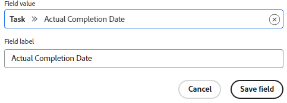

# Aanpassen welke velden worden weergegeven op een kaart

Standaard worden alle beschikbare velden op een kaart weergegeven, zowel in de volledige weergave wanneer de kaart is geopend als in de weergave Versmalde kaart op het bord. U kunt aanpassen welke velden worden weergegeven door:

* Een veld uitschakelen zodat het niet wordt weergegeven in een van beide weergaven
* Een veld verbergen in de weergave Versmalde kaart

Als een veld een waarde bevat en u het veld uitschakelt, blijft de waarde behouden als u het veld later weer inschakelt.

Secties (die worden weergegeven als de linkernavigatieopties op de kaartdetails) zijn ook beschikbaar voor weergave en verbergen.

U kunt ook aangepaste velden weergeven die eerder zijn gemaakt. U kunt geen nieuwe aangepaste velden in een board ontwerpen en maken.

>[!NOTE]
>
>Aanpassingen in velden die u aanbrengt, zijn alleen van toepassing op de kaart waarin u werkt.

## Toegangsvereisten

+++ Breid uit om de toegangseisen voor de functionaliteit in dit artikel weer te geven.

<table style="table-layout:auto"> 
 <col> 
 <col> 
 <tbody> 
  <tr> 
   <td role="rowheader">Adobe Workfront-pakket</td> 
   <td> 
Alle
 </td> 
  </tr> 
  <tr> 
   <td role="rowheader">Adobe Workfront-licentie</td> 
   <td> 
   
Medewerker of hoger
 
   
Aanvraag of hoger

   </td> 
  </tr> 
 </tbody> 
</table>

Voor meer detail over de informatie in deze lijst, zie [&#x200B; vereisten van de Toegang in de documentatie van Workfront &#x200B;](/help/quicksilver/administration-and-setup/add-users/access-levels-and-object-permissions/access-level-requirements-in-documentation.md).

+++

## Kaarten configureren {#configure-cards}

{{step1-to-boards}}

1. Toegang tot een bord. Voor informatie, zie [&#x200B; creeer of geef een raad &#x200B;](../../agile/get-started-with-boards/create-edit-board.md) uit.
1. Klik [!UICONTROL **vormen**] op het recht van de raad om het Configure paneel te openen.
1. Breid [!UICONTROL **Kaarten**] uit.

   De meeste velden en secties zijn standaard ingeschakeld.

1. Schakel een veld of sectie uit om het in beide kaartweergaven uit te schakelen.
1. Klik het pictogram van de Verbergen  naast een gebied of een sectie om het op de versmalde mening te verbergen.
1. Om alle gebieden en secties in beide meningen te tonen, klik [!UICONTROL **herstel alle gebieden aan gebrek**].
1. Klik [!UICONTROL **Verbergen vormen**] om het Configure paneel te sluiten.

## Aangepaste velden toevoegen aan kaarten

Aangepaste velden zijn beschikbaar op verbonden kaarten. Ze zijn alleen zichtbaar in de volledige kaartweergave, niet in de versmalde weergave op het bord.

De gegevens op aangepaste velden kunnen op de kaart worden bewerkt, maar bepaalde aangepaste elementen kunnen alleen in het oorspronkelijke veld worden bewerkt en niet op de kaart.

1. Heb toegang tot een raad en klik [!UICONTROL **vormen**] om het Configure paneel te openen.
1. Breid [!UICONTROL **Kaarten**] uit.
1. Onder [!UICONTROL Card Fields], klik [!UICONTROL **voeg douanegebied**] toe.
1. Selecteer [!UICONTROL **Taak**] of [!UICONTROL **Uitgave**].

   De categorieën van beschikbare gebieden voor taken of kwesties verschijnen. Vouw een categorie uit om alle velden weer te geven. U kunt ook naar een veld zoeken.

   

   >[!NOTE]
   >
   >De volgende veldtypen kunnen niet aan kaarten worden toegevoegd: Adobe XD, Image, PDF, Video.

1. Selecteer de veldnaam.
1. (Optioneel) Klik in het veld **[!UICONTROL Field value]** om dit aangepaste veld in een ander veld te wijzigen.
1. (Optioneel) Wijzig de **[!UICONTROL Field label]** in de veldnaam die u op de kaarten wilt weergeven.
1. Wanneer u wordt gebeëindigd die veranderingen aanbrengt, klik [!UICONTROL **sparen gebied**].

   

   Het aangepaste veld wordt toegevoegd aan de lijst met beschikbare velden en is standaard ingeschakeld. U kunt het douanegebied na de stappen in [&#x200B; onbruikbaar maken vormt kaarten &#x200B;](customize-fields-on-card.md#configure-cards) hierboven sectie, geeft het gebied uit, of schrapt het van alle kaarten.

>[!NOTE]
>
>Als u het aangepaste veld later in Workfront een andere naam geeft, moet u het veldlabel in het deelvenster Configureren bewerken, anders wordt het veld niet op de kaarten weergegeven.

## Gearchiveerde kaarten weergeven of verbergen

U moet een configuratie-instelling inschakelen om gearchiveerde kaarten op een bord weer te geven.

1. Heb toegang tot een raad en klik [!UICONTROL **vormen**] om het Configure paneel te openen.
1. Breid [!UICONTROL **Kaarten**] uit.
1. Zet [!UICONTROL **gearchiveerde kaarten van de Vertoning op de raad**] aan.

   Nu kunt u het bord filteren om kaarten weer te geven die zijn gearchiveerd. Voor details, zie [&#x200B; Filter en onderzoek in een raad &#x200B;](/help/quicksilver/agile/get-started-with-boards/filter-search-in-board.md).

1. Klik [!UICONTROL **Verbergen vormen**] om het Configure paneel te sluiten.

## Afvalfunctie van kaart configureren

Om kaarten van de raad na een periode automatisch te verwijderen, zie [&#x200B; kaart het wegvallen &#x200B;](/help/quicksilver/agile/use-boards-agile-planning-tools/configure-card-falloff.md) vormen.
