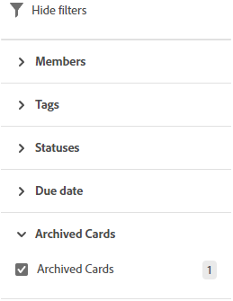

# Een kaart van een kaart verwijderen of archiveren

Wanneer u een kaart van een bord schrapt, wordt het permanent geschrapt en kan niet worden hersteld. Als u een kaart archiveert, wordt deze naar het archief verzonden en kunt u deze later terugzetten op het bord.

## Toegangsvereisten

U moet de volgende toegang hebben om de stappen in dit artikel uit te voeren:

<table style="table-layout:auto"> 
 <col> 
 <col> 
 <tbody> 
  <tr> 
   <td role="rowheader"><strong>[!DNL Adobe Workfront] plan*</strong></td> 
   <td> 
Alle
 </td> 
  </tr> 
  <tr> 
   <td role="rowheader"><strong>[!DNL Adobe Workfront] licentie*</strong></td> 
   <td> 
[!UICONTROL Request] of hoger
 </td> 
  </tr> 
 </tbody> 
</table>

&#42;Neem contact op met uw [!DNL Workfront] beheerder.

## Een kaart van de kaart verwijderen

1. Klik op de knop **[!UICONTROL Main Menu]** pictogram  in de rechterbovenhoek van [!DNL Adobe Workfront]en klik vervolgens op **[!UICONTROL Boards]**.
1. Toegang tot een bord. Zie voor meer informatie [Een board maken of bewerken](../../agile/get-started-with-boards/create-edit-board.md).
1. Klik op de knop **[!UICONTROL More]** menu  op de kaart en selecteer **[!UICONTROL Delete]**.
1. Klikken **[!UICONTROL Delete]** in het bevestigingsbericht.

## Een kaart archiveren van een kaart

1. Toegang tot het bord.
1. Klik op de knop **[!UICONTROL More]** menu  op de kaart en selecteer **[!UICONTROL Archive]**.

   Gearchiveerde kaarten worden verborgen van het bord, tenzij u een filter toepast om ze weer te geven. Zie voor meer informatie [Een kaart filteren om gearchiveerde kaarten weer te geven](#filter-a-board-to-show-archived-cards) in dit artikel.

   An [!UICONTROL Archive] pictogram  wordt weergegeven op gearchiveerde kaarten. U kunt een gearchiveerde kaart niet bewerken, maar u kunt de kaart wel verwijderen of naar een andere kolom verplaatsen.

1. Als u een gearchiveerde kaart wilt herstellen, klikt u op de knop **[!UICONTROL More]** menu  op de kaart en selecteer **[!UICONTROL Restore]**.

## Een kaart filteren om gearchiveerde kaarten weer te geven {#filter-a-board-to-show-archived-cards}

Standaard worden alleen actieve kaarten op een bord weergegeven. U kunt het bord filteren om ook gearchiveerde kaarten weer te geven.

1. Toegang tot het bord.
1. Klik op het filterpictogram , breid de [!UICONTROL Archived Cards] en selecteert u **[!UICONTROL Archived cards]** om gearchiveerde kaarten weer te geven.

   Het filter geeft het aantal gearchiveerde kaarten weer.

   

1. Selecteren **[!UICONTROL Archived cards]** om de optie te wissen en alleen actieve kaarten weer te geven.
