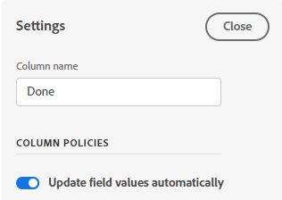
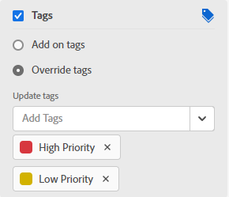

# Bordkolommen beheren

<!-- Audited: 05/2024 -->

Een nieuwe board bevat standaard drie kolommen. U kunt meer kolommen toevoegen, de orde van de kolommen veranderen, kolommen anders noemen, en om het even welke kolommen schrappen die u niet nodig hebt.

De montages van de kolom omvatten beleid, dat u toestaat om opties te bepalen voor wat met een kaart gebeurt wanneer het in die kolom wordt bewogen.

Voor informatie over het sorteren van de kaarten in kolommen, zie [ Filter en onderzoek in een raad ](/help/quicksilver/agile/get-started-with-boards/filter-search-in-board.md).

## Toegangsvereisten

U moet de volgende toegang hebben om de stappen in dit artikel uit te voeren:

<table style="table-layout:auto"> 
 <col> 
 </col> 
 <col> 
 </col> 
 <tbody> 
  <tr> 
   <td role="rowheader">[!DNL Adobe Workfront] plan</td> 
   <td> 
Alle
 </td> 
  </tr> 
  <tr> 
   <td role="rowheader">[!DNL Adobe Workfront] licentie</td> 
   <td> 
Nieuw: Medewerker of hoger 

        
of
 
        
Huidig: [!UICONTROL Request] of hoger 
</td> 
  </tr> 
 </tbody> 
</table>

Voor meer detail over de informatie in deze lijst, zie [ vereisten van de Toegang in de documentatie van Workfront ](/help/quicksilver/administration-and-setup/add-users/access-levels-and-object-permissions/access-level-requirements-in-documentation.md).

## Een kolom aan een board toevoegen

{{step1-to-boards}}

1. Toegang tot een bord. Voor informatie, zie [ creeer of geef een raad ](../../agile/get-started-with-boards/create-edit-board.md) uit.
1. Klik op **[!UICONTROL Add Column]** rechts van de bestaande kolommen.
1. Typ een naam in de nieuwe kolom en klik op **[!UICONTROL Add Column]** .

    toe

>[!TIP]
>
>Om een inlaatkolom toe te voegen, zie [ een inlaatkolom aan een raad ](/help/quicksilver/agile/use-boards-agile-planning-tools/add-intake-column-to-board.md) toevoegen.

## Kolommen opnieuw ordenen aan boord

1. Toegang tot het bord.
1. Sleep de kolommen in de juiste volgorde. Selecteer de bovenkant van de kolom voordat u deze naar een andere locatie sleept.

   

## De naam van een boardkolom wijzigen

1. Toegang tot het bord.
1. Klik op de kolomnaam, typ de nieuwe naam en druk op Enter.

   of

   Klik het **[!UICONTROL More]** menu  op de kolom en selecteer **[!UICONTROL Edit]**. Typ in het gebied Instellingen de nieuwe naam in het veld **[!UICONTROL Column name]** en klik op **[!UICONTROL Close]** .

## Een boardkolom verwijderen

Wanneer u een kolom van een board schrapt, kan het niet worden teruggekregen.

1. Toegang tot het bord.
1. Klik het **[!UICONTROL More]** menu  op de kolom, en selecteer **[!UICONTROL Delete]**.

   >[!NOTE]
   >
   >Kolommen die kaarten bevatten, inclusief gearchiveerde kaarten, kunnen niet worden verwijderd. Als u een kolom probeert te schrappen die kaarten bevat, moet u een andere kolom voor die kaarten kiezen.

## Aantal kaarten weergeven

U kunt een configuratie het plaatsen gebruiken om het aantal kaarten in elke kolom te tonen.

Als u de grens van het KLOOFJE op een kolom gebruikt, wordt een afzonderlijke kaartteller niet toegevoegd. Voor meer informatie over de grenzen van het WIP, zie [ de [!UICONTROL Work in Progress] (WIP) grens op een raad ](/help/quicksilver/agile/use-boards-agile-planning-tools/manage-wip-limit-on-board.md) beheren.

1. Toegang tot het bord.
1. Klik op **[!UICONTROL Configure]** rechts van de board om het deelvenster Configureren te openen.
1. Vouw **[!UICONTROL Column]** uit.
1. Schakel **[!UICONTROL Display a column card count]** in.

    aan

   De kaartteller wordt boven aan elke kolom weergegeven.

1. Klik op **[!UICONTROL Hide configure]** om het deelvenster [!UICONTROL Configure] te sluiten.

## Kolominstellingen en -beleid definiëren

Kolombeleid omvat het automatisch bijwerken van veldwaarden en het instellen van een limiet voor werkzaamheden in uitvoering.

Het beleid voor het bijwerken van de status werkt automatisch voor zowel de kaart als de kolom:

* Wanneer een kaart naar een kolom met een beleid wordt verplaatst, wordt de kaartstatus bijgewerkt aan de status die in het beleid wordt bepaald. Dit geldt zowel voor ad hoc als voor aangesloten kaarten.
* Wanneer een ad hoc of verbonden kaartstatus op de kaart wordt bijgewerkt om de kolomstatus in het beleid aan te passen, of een verbonden kaartstatus elders in Workfront wordt bijgewerkt, wordt de kaart automatisch naar die kolom verplaatst. Als een aangepaste status op een kaart overeenkomt met de systeemstatus die aan de kolom is toegewezen, wordt de kaart ook naar die kolom verplaatst.

Een kaart blijft in een kolom waar deze wordt geplaatst als de kaartstatus niet overeenkomt met een status die is ingesteld in een bestaand kolombeleid.

>[!NOTE]
>
>Dynamische borden plaatsen altijd kaarten in de kolom die hun status aanpast, ongeacht of het kolombeleid wordt toegelaten of onbruikbaar gemaakt. De kaarten zullen aan hun toegewezen kolommen terugkeren wanneer u de raad vernieuwt.
> 
>Als u voor alle typen kaarten een kaart verplaatst van de ene kolom naar een andere kolom met dezelfde status, wordt de kaart teruggezet naar de oorspronkelijke kolom wanneer u de kaart vernieuwt.

1. Toegang tot het bord.
1. Klik het **[!UICONTROL More]** menu  op de kolom, en selecteer **[!UICONTROL Edit]**.

   Het gebied [!UICONTROL Settings] wordt weergegeven. Met de instructie **[!UICONTROL Column name]** kunt u zien voor welke kolom u instellingen definieert.

1. Schakel het beleid van **[!UICONTROL Update field values automatically]** in om bepaalde veldwaarden automatisch te wijzigen wanneer een kaart naar deze kolom wordt verplaatst.

   

1. (Optioneel) Stel een waarde in voor de kaartstatus:

   1. Schakel het selectievakje **[!UICONTROL Status]** in.

   1. Selecteer de status die u wilt toepassen op een kaart wanneer deze naar deze kolom wordt verplaatst.

      

      De statusvertaalopties voor verbonden kaarten worden ook weergegeven. (De statusvertaling is niet van toepassing op ad-hockaarten.) Deze opties bepalen de aangepaste status die wordt toegepast op de taak of uitgave in [!DNL Workfront] wanneer een aangesloten kaart naar deze kolom wordt verplaatst.

   1. Selecteer de status van de a [!UICONTROL **Douane**] om op de kaart voor taken en voor kwesties van toepassing te zijn.

      Wanneer een kaart naar deze kolom wordt verplaatst, probeert [!DNL Workfront] eerst de aangepaste status toe te passen (bijvoorbeeld Opgelost). Als de geselecteerde aangepaste status niet beschikbaar is voor die kaart, wordt u gevraagd een andere status te kiezen die overeenkomt met de systeemstatus (in stap b hierboven). Voor meer informatie over statussen, zie [ Overzicht van Statussen ](/help/quicksilver/administration-and-setup/customize-workfront/creating-custom-status-and-priority-labels/statuses-overview.md).

      Als de status van de verbonden taak of uitgave wordt gewijzigd in de aangepaste of systeemstatus die is ingesteld in het kolombeleid, wordt de kaart automatisch naar de kolom verplaatst.

1. (Optioneel) Stel een waarde in voor de kaarttoewijzingen:

   1. Schakel het selectievakje **[!UICONTROL Assignees]** in.
   1. Selecteer een handeling.

      * **[!UICONTROL Add on assignees]:** de geselecteerde toewijzen worden toegevoegd aan de bestaande lijst met toewijzingen op een kaart wanneer deze naar deze kolom wordt verplaatst.
      * **[!UICONTROL Override assignees]:** de toegewezen die u selecteert treden alle andere wijzers met voeten, en worden de enige wijzers op een kaart wanneer het naar deze kolom wordt verplaatst.

   1. Klik [!UICONTROL **toevoegen Toewijzing**] en onderzoek naar een gebruiker. Selecteer de toewijzingen in de zoekresultaten. Alle Workfront-gebruikers en -teams kunnen kiezen uit.

      

1. (Optioneel) Stel een waarde in voor de kaartcodes:

   1. Schakel het selectievakje **[!UICONTROL Cards]** in.
   1. Selecteer een handeling.

      * **[!UICONTROL Add on tags]:** de markeringen u selecteert worden toegevoegd aan de bestaande lijst van markeringen op een kaart wanneer het aan deze kolom wordt verplaatst.
      * **[!UICONTROL Override tags]:** de markeringen u selecteert treden alle andere markeringen met voeten, en worden de enige markeringen op een kaart wanneer het wordt verplaatst naar deze kolom.

   1. Selecteer de labels in de vervolgkeuzelijst. Alleen tags die al in [!UICONTROL Tag Manager] zijn gemaakt, zijn beschikbaar om te kiezen. Voor informatie bij het toevoegen van nieuwe markeringen, zie [ markeringen ](/help/quicksilver/agile/get-started-with-boards/add-tags.md) toevoegen.

      

1. Schakel het beleid van **[!UICONTROL Work in progress limit]** in om het aantal kaarten te beperken dat aan de kolom kan worden toegevoegd. Typ vervolgens het limietnummer in het veld **[!UICONTROL Set limit]** .

   

   Voor meer informatie, zie [ leiden het Werk lopende (WIP) grens op een raad ](/help/quicksilver/agile/use-boards-agile-planning-tools/manage-wip-limit-on-board.md).

1. Klik op **[!UICONTROL Close]** om het gebied Instellingen te sluiten en de kolom en de bijbehorende kaarten weer te geven.
