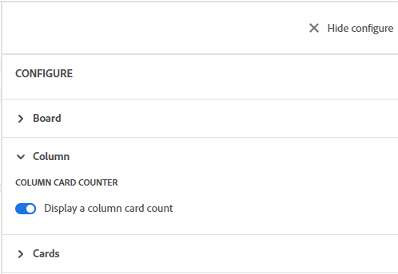

# Bordkolommen beheren

Een nieuwe board bevat standaard drie kolommen. U kunt meer kolommen toevoegen, de orde van de kolommen veranderen, kolommen anders noemen, en om het even welke kolommen schrappen die u niet nodig hebt.

De montages van de kolom omvatten beleid, dat u toestaat om opties te bepalen voor wat met een kaart gebeurt wanneer het in die kolom wordt bewogen.

Voor informatie over het sorteren van de kaarten in kolommen, zie [Filteren en zoeken in een board](/help/quicksilver/agile/get-started-with-boards/filter-search-in-board.md).

## Toegangsvereisten

U moet de volgende toegang hebben om de stappen in dit artikel uit te voeren:

<table style="table-layout:auto"> 
 <col> 
 </col> 
 <col> 
 </col> 
 <tbody> 
  <tr> 
   <td role="rowheader"><strong>[!DNL Adobe Workfront] plan*</strong></td> 
   <td> 
Alle
 </td> 
  </tr> 
  <tr> 
   <td role="rowheader"><strong>[!DNL Adobe Workfront] licentie*</strong></td> 
   <td> 
[!UICONTROL Request] of hoger
 </td> 
  </tr> 
 </tbody> 
</table>

&#42;Neem contact op met uw [!DNL Workfront] beheerder.

## Een kolom aan een board toevoegen

1. Klik op de knop **[!UICONTROL Main Menu]** pictogram  in de rechterbovenhoek van [!DNL Adobe Workfront]en klik vervolgens op **[!UICONTROL Boards]**.
1. Toegang tot een bord. Zie voor meer informatie [Een board maken of bewerken](../../agile/get-started-with-boards/create-edit-board.md).
1. Klikken **[!UICONTROL Add Column]** rechts van de bestaande kolommen.
1. Typ een naam in de nieuwe kolom en klik op **[!UICONTROL Add Column]**.

   

>[!TIP]
>
>Als u een inlaatkolom wilt toevoegen, raadpleegt u [Een inlaatkolom aan een bord toevoegen](/help/quicksilver/agile/use-boards-agile-planning-tools/add-intake-column-to-board.md).

## Kolommen opnieuw ordenen aan boord

1. Toegang tot het bord.
1. Sleep de kolommen in de juiste volgorde. Selecteer de bovenkant van de kolom voordat u deze naar een andere locatie sleept.

   

## De naam van een boardkolom wijzigen

1. Toegang tot het bord.
1. Klik op de kolomnaam, typ de nieuwe naam en druk op Enter.

   of

   Klik op de knop **[!UICONTROL More]** menu  in de kolom en selecteer **[!UICONTROL Edit]**. Typ in het gedeelte Instellingen de nieuwe naam in het dialoogvenster **[!UICONTROL Column name]** en klik op **[!UICONTROL Close]**.

## Een boardkolom verwijderen

Wanneer u een kolom van een board schrapt, kan het niet worden teruggekregen.

1. Toegang tot het bord.
1. Klik op de knop **[!UICONTROL More]** menu  in de kolom en selecteer **[!UICONTROL Delete]**.

   >[!NOTE]
   >
   >Kolommen die kaarten bevatten, inclusief gearchiveerde kaarten, kunnen niet worden verwijderd. Als u een kolom probeert te schrappen die kaarten bevat, moet u een andere kolom voor die kaarten kiezen.

## Aantal kaarten weergeven

U kunt een configuratie het plaatsen gebruiken om het aantal kaarten in elke kolom te tonen.

Als u de grens van het KLOOFJE op een kolom gebruikt, wordt een afzonderlijke kaartteller niet toegevoegd. Voor meer informatie over de grenzen van het WIP, zie [De [!UICONTROL Work in Progress] (WIP)-limiet aan boord](/help/quicksilver/agile/use-boards-agile-planning-tools/manage-wip-limit-on-board.md).

1. Toegang tot het bord.
1. Klikken **[!UICONTROL Configure]** rechts van de board om het Configure paneel te openen.
1. Uitbreiden **[!UICONTROL Column]**.
1. Inschakelen **[!UICONTROL Display a column card count]**.

   

   De kaartteller wordt boven aan elke kolom weergegeven.

1. Klikken **[!UICONTROL Hide configure]** om de [!UICONTROL Configure] deelvenster.

## Kolominstellingen en -beleid definiëren

1. Toegang tot het bord.
1. Klik op de knop **[!UICONTROL More]** menu  in de kolom en selecteer **[!UICONTROL Edit]**.

   De [!UICONTROL Settings] wordt weergegeven. De **[!UICONTROL Column name]** Hiermee weet u voor welke kolom u instellingen definieert.

1. De optie **[!UICONTROL Update field values automatically]** beleid om bepaalde veldwaarden automatisch te wijzigen wanneer een kaart naar deze kolom wordt verplaatst.

   

1. (Optioneel) Stel een waarde in voor de kaartstatus:

   1. Selecteer de **[!UICONTROL Status]** selectievakje.

   1. Selecteer de status die u wilt toepassen op een kaart wanneer deze naar deze kolom wordt verplaatst.

      

      De statusvertaalopties voor verbonden kaarten worden ook weergegeven. (De statusvertaling is niet van toepassing op ad-hockaarten.) Deze opties bepalen de aangepaste status die wordt toegepast op de taak of uitgave in [!DNL Workfront] wanneer een aangesloten kaart naar deze kolom wordt verplaatst.

   1. Selecteer een [!UICONTROL **Aangepast**] status die op de kaart moet worden toegepast voor taken en voor problemen.

      Wanneer een kaart naar deze kolom wordt verplaatst, [!DNL Workfront] probeert eerst de aangepaste status toe te passen (bijvoorbeeld Opgelost). Als de geselecteerde aangepaste status niet beschikbaar is voor die kaart, wordt u gevraagd een andere status te kiezen die overeenkomt met de systeemstatus (in stap b hierboven). Zie voor meer informatie over statussen [Overzicht van statussen](/help/quicksilver/administration-and-setup/customize-workfront/creating-custom-status-and-priority-labels/statuses-overview.md).

      Als de status van de verbonden taak of uitgave wordt gewijzigd in de aangepaste of systeemstatus die is ingesteld in het kolombeleid, wordt de kaart automatisch naar de kolom verplaatst.

1. (Optioneel) Stel een waarde in voor de kaarttoewijzingen:

   1. Selecteer de **[!UICONTROL Assignees]** selectievakje.
   1. Selecteer een handeling.

      * **[!UICONTROL Add on assignees]:** De geselecteerde toewijzingen worden toegevoegd aan de bestaande lijst met toewijzingen op een kaart wanneer deze naar deze kolom wordt verplaatst.
      * **[!UICONTROL Override assignees]:** De geselecteerde toewijzingen overschrijven alle andere toewijzingen en worden de enige toewijzingen op een kaart wanneer deze naar deze kolom wordt verplaatst.

   1. Klikken [!UICONTROL **Toewijzing toevoegen**] en zoek naar een gebruiker. Selecteer de toewijzingen in de zoekresultaten. Alle Workfront-gebruikers en -teams kunnen kiezen uit.

      

1. (Optioneel) Stel een waarde in voor de kaartcodes:

   1. Selecteer de **[!UICONTROL Cards]** selectievakje.
   1. Selecteer een handeling.

      * **[!UICONTROL Add on tags]:** De tags die u selecteert, worden toegevoegd aan de bestaande lijst met codes op een kaart wanneer deze naar deze kolom wordt verplaatst.
      * **[!UICONTROL Override tags]:** De tags die u selecteert, overschrijven alle andere tags en worden de enige tags op een kaart wanneer deze naar deze kolom wordt verplaatst.

   1. Selecteer de labels in de vervolgkeuzelijst. Alleen tags die al in het dialoogvenster [!UICONTROL Tag Manager] zijn beschikbaar waaruit u kunt kiezen. Zie voor informatie over het toevoegen van nieuwe tags [Tags toevoegen](/help/quicksilver/agile/get-started-with-boards/add-tags.md).

      

1. De optie **[!UICONTROL Work in progress limit]** beleid om het aantal kaarten te beperken dat aan de kolom kan worden toegevoegd. Typ vervolgens het limietnummer in het dialoogvenster **[!UICONTROL Set limit]** veld.

   

   Zie voor meer informatie [De WIP-limiet (Work in progress) op een bord beheren](/help/quicksilver/agile/use-boards-agile-planning-tools/manage-wip-limit-on-board.md).

1. Klikken **[!UICONTROL Close]** om het gebied van Montages weg te gaan en de kolom en zijn kaarten te bekijken.
