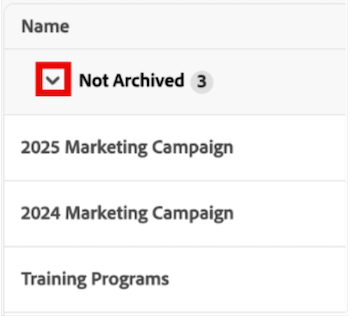

# De Admin-weergave voor raden beheren

De mening van Admin van Boards bevat een lijst van elke Raad in uw rekening die de Beheerders van het Systeem kunnen gebruiken om een snelle momentopname van de algemene details van Boards te krijgen, met inbegrip van toen zij het laatst werden bijgewerkt, hoeveel kaarten elk heeft, en meer.

Vanuit dit gebied kunt u de volgende handelingen uitvoeren:

* De lijst met deelvensters filteren
* De kolommen in de lijst met raden configureren
* Groeperen in de lijst van kamers

## Toegangsvereisten

+++ Vouw uit om de vereisten voor toegang weer te geven.

<table style="table-layout:auto"> 
 <col> 
 </col> 
 <col> 
 </col> 
 <tbody> 
  <tr> 
   <td role="rowheader">Adobe Workfront-pakket</td> 
   <td> 
Alle
 </td> 
  </tr> 
  <tr> 
   <td role="rowheader">Adobe Workfront-licentie</td> 
   <td> 
Standard

        
 Plan 
</td> 
  </tr> 
    <tr> 
   <td role="rowheader">Configuraties op toegangsniveau</td> 
   <td> 
Systeembeheerder 

        </td> 
  </tr> 
 </tbody> 
</table>

Voor meer detail over de informatie in deze lijst, zie [ vereisten van de Toegang in de documentatie van Workfront ](/help/quicksilver/administration-and-setup/add-users/access-levels-and-object-permissions/access-level-requirements-in-documentation.md).

+++

## Vereisten

U moet een raad creëren alvorens u het van de Admin Mening kunt bekijken.

Voor meer informatie, zie [ creeer of geef een raad ](/help/quicksilver/agile/get-started-with-boards/create-edit-board.md) uit.

## De lijst met deelvensters filteren

{{step1-to-boards}}

1. Voor de **Borden** pagina, selecteer de **Mening Admin** tabel.

1. Selecteer **Filter**. Het **paneel van Filters** opent.

1. Voer de onderstaande stappen uit om het filter te configureren:

   1. (Facultatief) klik het **pictogram van de Kalender** Kalender 

   1. (Facultatief) in de **sectie van het Malplaatje**, selecteer het type van malplaatje van de Raad dat de lijst door zal filtreren. U kunt meerdere sjabloontypen selecteren.
Voor meer informatie over de malplaatjetypes van de Raad, zie [ creeer of geef een raad ](/help/quicksilver/agile/get-started-with-boards/create-edit-board.md) uit.

   1. (Facultatief) in **wordt Gearchiveerd** sectie, uitgezocht als gearchiveerde of niet-gearchiveerde Borden zullen tonen. U kunt meerdere opties selecteren.

      

1. Klik buiten het **paneel van Filters** om het te sluiten. De filterselecties blijven toegepast op de lijst met kamers totdat de standaardweergave wordt hersteld.

   >[!NOTE]
   >
   >Om een filter te verwijderen, open het **paneel van Filters** en klik **terug aan gebrek** in de hoger-juiste hoek.

## De kolommen in de lijst met raden configureren

{{step1-to-boards}}

1. Voor de **Borden** pagina, selecteer de **Mening Admin** tabel.

1. Selecteer **Kolommen**. Het **zicht van Gebieden en orde** paneel opent.

1. Configureer welke kolommen in de lijst met kamers worden weergegeven door de schakeloptie in regel met elke kolom in of uit te schakelen:

   * **Eigenaar**
   * **laatst bijgewerkt**
   * **Leden**
   * **Gearchiveerd**
   * **Malplaatje**
   * **Aantal van de Kaart**

1. (Facultatief) om de orde aan te passen de gebieden binnen verschijnen, klik en houd het **pictogram van de Belemmering** links van een gebied, dan sleep het aan een nieuwe positie.

   

1. Klik buiten het **zicht van Gebieden en orde** paneel om het te sluiten. Uw kolomconfiguraties blijven van toepassing op de lijst van Boeken tot zij worden gewijzigd.

   >[!NOTE]
   >
   > Wanneer de de lijstkolomvertoning van Borden wordt gewijzigd, verschijnt een blauwe punt boven het **pictogram van Kolommen** om erop te wijzen dat de huidige mening van het gebrek is gewijzigd.

## Groepeer de lijst met kamers per specifiek veld

{{step1-to-boards}}

1. Voor de **Borden** pagina, selecteer de **Mening Admin** tabel.

1. Selecteer **Groep**. De **Groep door** paneel opent.

1. Selecteer het veld waarop u de lijst Boeken wilt groeperen:

   * **Gearchiveerd**
   * **Eigenaar**
   * **Malplaatje**

1. (Facultatief) om de groepering van de **Groep door** paneel uit te breiden of samen te vouwen, **samen te vouwen allen** of **allen** uitbreiden.

    samen

1. (Facultatief) om de de vertoningsorde van de groepering van A-Z in z-A te veranderen, selecteer het gebied de lijst momenteel door wordt gegroepeerd, dan uitgezocht **z-A** van drop-down.

   

1. Klik buiten de **Groep door** paneel om het te sluiten. Van hieruit kunt u de toegepaste groepering in de lijst samenvouwen of uitvouwen door de pijl naast de groeperingstitel te selecteren.

    uit

   >[!NOTE]
   >   
   >Wanneer de lijst van Boeken groeperende vertoning wordt gewijzigd, verschijnt een blauwe punt boven het **pictogram van de Groep** om erop te wijzen dat de huidige mening van het gebrek verschillend is.  
   >Als u een groepering wilt verwijderen, open de **Groep door** paneel en selecteer **allen** in de hoger-juiste hoek ontruimen.
