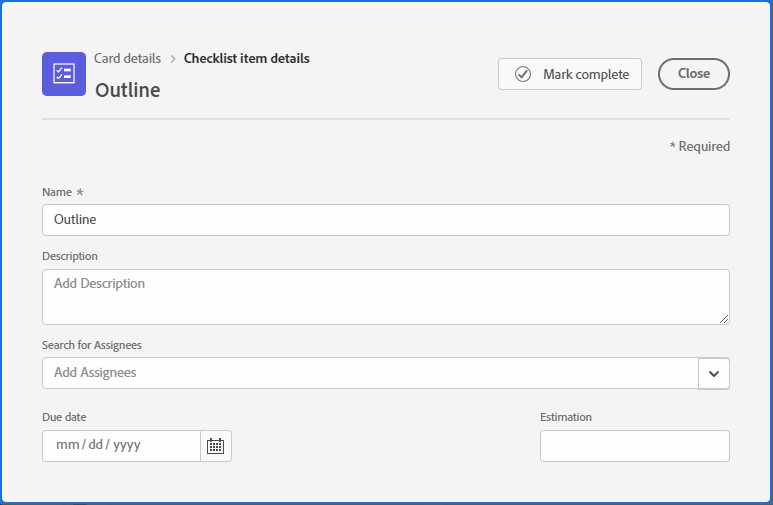

# Controlelijstitems op kaarten beheren

Met een controlelijst op een kaart kunt u het werk in kleinere stappen verdelen of notities aan de kaart toevoegen. De items op de controlelijst zijn zowel op ad-hockaarten als op gekoppelde kaarten beschikbaar.

Voor informatie over kaarten, zie [ een ad hoc kaart aan a raad ](/help/quicksilver/agile/get-started-with-boards/add-card-to-board.md) toevoegen, [ Gebruik verbonden kaarten op raad ](/help/quicksilver/agile/get-started-with-boards/connected-cards.md), en [ beheert kaarten ](/help/quicksilver/agile/get-started-with-boards/move-board-items.md).

## Toegangsvereisten

U moet de volgende toegang hebben om de stappen in dit artikel uit te voeren:

<table style="table-layout:auto"> 
 <col> 
 </col> 
 <col> 
 </col> 
 <tbody> 
  <tr> 
   <td role="rowheader"><strong>[!DNL Adobe Workfront] plan*</strong></td> 
   <td> 
Alle
 </td> 
  </tr> 
  <tr> 
   <td role="rowheader"><strong>[!DNL Adobe Workfront] licentie*</strong></td> 
   <td> 
[!UICONTROL Request] of hoger
 </td> 
  </tr> 
 </tbody> 
</table>

&#42; om te weten te komen welk plan, vergunningstype, of toegang u hebt, contacteer uw [!DNL Workfront] beheerder.

## Een controlelijst toevoegen aan een kaart

1. Klik op het **[!UICONTROL Main Menu]** pictogram  rechtsboven in Adobe Workfront en klik vervolgens op **[!UICONTROL Boards]** .
1. Toegang tot een bord. Voor informatie, zie [ creeer of geef een raad ](../../agile/get-started-with-boards/create-edit-board.md) uit.
1. Klik op de kaart om het vak [!UICONTROL Card Details] te openen.

   of

   Klik het **[!UICONTROL More]** menu  op de kaart, en selecteer **[!UICONTROL Edit]**.

1. Klik op **[!UICONTROL Add checklist item]** om een nieuw item toe te voegen. Typ vervolgens de titel van het item en druk op Enter. Er wordt automatisch een ander item toegevoegd. Ga door met titels om meer objecten toe te voegen.

   De teller boven aan de checklist toont het aantal voltooide items en het totale aantal items.

1. Klik  om de [!UICONTROL Checklist Item Details] doos te openen.

   

1. (Optioneel) Voeg een beschrijving, toewijzingen, vervaldatum en schattingsuren toe voor het item in de controlelijst.

   Voor informatie over om het even welk van deze gebieden, zie [ een ad hoc kaart aan een raad ](/help/quicksilver/agile/get-started-with-boards/add-card-to-board.md) toevoegen of [ Gebruik verbonden kaarten op planken ](/help/quicksilver/agile/get-started-with-boards/connected-cards.md).

1. Klik op **[!UICONTROL Close]** om terug te keren naar de kaartdetails en de volledige lijst met controlelijstitems.

   De toegewezen personen en de vervaldatum worden in het object weergegeven.

1. Om een punt te kopiëren, klik het **[!UICONTROL More]** menu  op het punt en selecteer **[!UICONTROL Copy]**.
1. Om een controlelijstitem te schrappen, klik het **[!UICONTROL More]** menu  op het punt en selecteer **[!UICONTROL Delete]**.

## Lijstitems voltooien

1. Open het bord en zoek de kaart waarop de controlelijst staat.
1. Klik op de kaart om het vak [!UICONTROL Card Details] te openen.

   of

   Klik het **[!UICONTROL More]** menu  op de kaart, en selecteer **[!UICONTROL Edit]**.

1. Schakel het selectievakje in naast het item dat is voltooid.

   De teller werkt bij om de voltooide punten te tonen.

   U kunt het selectievakje uitschakelen als u het item weer aan de lijst wilt toevoegen.

   

1. Klik op **[!UICONTROL Close]** om terug te keren naar het toetsenbord.

   De teller op de kaart wordt ook bijgewerkt.
