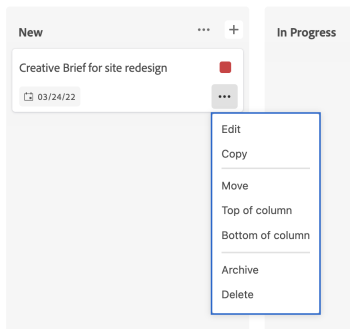

# Kaarten beheren

U kunt een kaart naar een willekeurige kolom op het bord verplaatsen of een kaart kopiëren.

Als u kolombeleid hebt ingeschakeld voor het bijwerken van veldwaarden, kunnen de status, toewijzingen en tags automatisch worden bijgewerkt wanneer u een kaart van de ene kolom naar de andere verplaatst. Voor meer informatie, zie &quot;kolommontages en beleid&quot;in het artikel [&#x200B; leiden boardkolommen &#x200B;](/help/quicksilver/agile/get-started-with-boards/manage-board-columns.md).

>[!NOTE]
>
>U kunt een kaart niet van één bord naar een andere raad verplaatsen.

## Toegangsvereisten

+++ Breid uit om de toegangseisen voor de functionaliteit in dit artikel weer te geven.

<table style="table-layout:auto"> 
 <col> 
 <col> 
 <tbody> 
  <tr> 
   <td role="rowheader">Adobe Workfront-pakket</td> 
   <td> 
Alle
 </td> 
  </tr> 
  <tr> 
   <td role="rowheader">Adobe Workfront-licentie</td> 
   <td> 
   
Medewerker of hoger
 
   
Aanvraag of hoger

   </td> 
  </tr> 
 </tbody> 
</table>

Voor meer detail over de informatie in deze lijst, zie [&#x200B; vereisten van de Toegang in de documentatie van Workfront &#x200B;](/help/quicksilver/administration-and-setup/add-users/access-levels-and-object-permissions/access-level-requirements-in-documentation.md).

+++

## Kaarten tussen kolommen verplaatsen

{{step1-to-boards}}

1. Toegang tot een bord. Voor informatie, zie [&#x200B; creeer of geef een raad &#x200B;](../../agile/get-started-with-boards/create-edit-board.md) uit.
1. Sleep de kaart naar een andere kolom op de gewenste positie.

   of

   Klik het **[!UICONTROL More]** menu  op de kaart, en selecteer **[!UICONTROL Move]**. Kies vervolgens in het vak **[!UICONTROL Move Item]** een andere kolom en selecteer **[!UICONTROL Move]** .

   

   >[!NOTE]
   >
   >Als u het vak **[!UICONTROL Move Item]** gebruikt, wordt de kaart altijd boven aan de kolom geplaatst.

## Kaarten naar de boven- of onderkant van een kolom verplaatsen

1. Toegang tot het bord.
1. Sleep de kaart naar de gewenste positie in de kolom.

   of

   Klik het **[!UICONTROL More]** menu  op de kaart, en selecteer **[!UICONTROL Top of column]** of **[!UICONTROL Bottom of column]**.

   

## Een kaart kopiëren

Door een ad-hockaart te kopiëren worden alle velden op de kaart gedupliceerd, inclusief items op de checklist.

>[!NOTE]
>
>U kunt geen verbonden kaarten kopiëren.

1. Toegang tot het bord.
1. Klik op het **[!UICONTROL More]** menu ![[!UICONTROL More menu]](assets/more-icon-spectrum.png) op de kaart en selecteer **[!UICONTROL Copy]** .

   

   Een nieuwe kaart wordt toegevoegd in de zelfde kolom met de titel &quot;exemplaar van - [ originele kaartnaam ].&quot;
