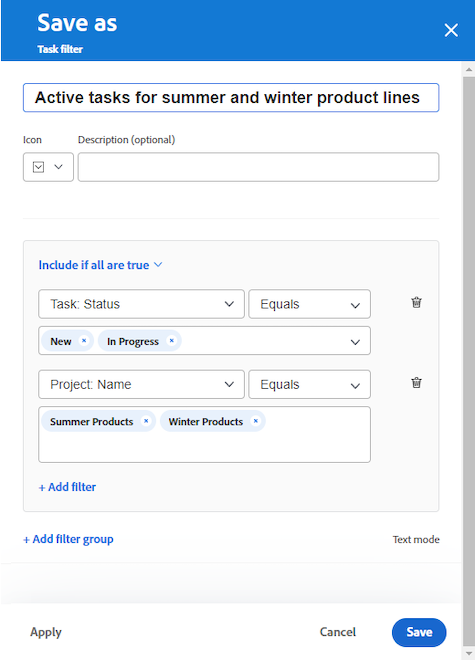

# Een inlaatkolom aan een bord toevoegen

U kunt desgewenst een inlaatkolom aan uw board toevoegen die taken en problemen automatisch ophaalt als verbonden kaarten wanneer deze worden toegevoegd in [!DNL Workfront] , op basis van filters die u definieert. De innamekolom kan als backlogkolom voor een team Kanban, een innamelocatie voor een steunteam dienen om kwesties te zien aangezien zij aan een verzoekrij, of een ander doel worden toegevoegd u wenst.

Er is slechts één inlaatkolom toegestaan op een bord en deze wordt altijd weergegeven als de meest linkse kolom.

De inlaatkolom is niet beschikbaar op een dynamisch bord. U kunt echter wel de filters bijwerken waarmee wordt gedefinieerd welke kaarten op een dynamische kaart worden geplaatst. Wanneer u deze filters wijzigt op een dynamisch bord, worden de kaartinstellingen die geen deel uitmaken van de Workfront-taak of -uitgave (zoals codes), opnieuw ingesteld.

>[!NOTE]
>
>Om veiligheidsredenen kan alleen de eigenaar van een board de bordfilters wijzigen in het deelvenster Configureren.

De inlaatkolom is beperkt tot 300 taken en 300 problemen. De standaardvolgorde van items in de inlaatkolom is als volgt:

Taken:

* Primaire bestelling: Projectnaam
* Secundaire volgorde: structuur van werkverdeling

Problemen:

* Primaire bestelling: Projectnaam
* Secundaire volgorde: Referentienummer

>[!IMPORTANT]
>
>Het wordt aanbevolen om het bord regelmatig te vernieuwen als meerdere gebruikers tegelijkertijd aan het bord werken. Door de pagina te vernieuwen, kunt u de visuele wijzigingen op het bord up-to-date houden en voorkomen dat problemen zoals dubbele kaarten uit de inlaatkolom naar het bord worden verplaatst.

Voor meer informatie over kolommen, zie [ de kolommen van het Comité beheren ](/help/quicksilver/agile/get-started-with-boards/manage-board-columns.md). Voor informatie over verbonden kaarten, zie [ Gebruik verbonden kaarten op raad ](/help/quicksilver/agile/get-started-with-boards/connected-cards.md).

## Toegangsvereisten

+++ Breid uit om de toegangseisen voor de functionaliteit in dit artikel weer te geven.

U moet de volgende toegang hebben om de stappen in dit artikel uit te voeren:

<table style="table-layout:auto"> 
 <col> 
 <col> 
 <tbody> 
  <tr> 
   <td role="rowheader">[!DNL Adobe Workfront]</td> 
   <td> 
Alle
 </td> 
  </tr> 
  <tr> 
   <td role="rowheader">[!DNL Adobe Workfront] licentie</td> 
   <td> 
   
Nieuw: [!UICONTROL Contributor] of hoger
 
   
of

   
Huidig: [!UICONTROL Request] of hoger

   </td> 
  </tr> 
 </tbody> 
</table>

Voor meer detail over de informatie in deze lijst, zie [ vereisten van de Toegang in de documentatie van Workfront ](/help/quicksilver/administration-and-setup/add-users/access-levels-and-object-permissions/access-level-requirements-in-documentation.md).

+++

## Een inlaatkolom maken met eenvoudige filters

{{step1-to-boards}}

1. Toegang tot een bord. Voor informatie, zie [ creeer of geef een raad ](../../agile/get-started-with-boards/create-edit-board.md) uit.
1. Klik op **[!UICONTROL Configure]** rechts van de board om het deelvenster Configureren te openen.
1. Vouw **[!UICONTROL Board]** uit.
1. Schakel **[!UICONTROL Dynamically intake items to board]** in.

   

   De inlaatkolom wordt links van het bord toegevoegd. Deze blijft leeg totdat u er filters op toepast.

1. (Facultatief) Onderzoek naar en selecteer [!DNL Workfront] [!UICONTROL **Projecten**].
1. (Facultatief) Onderzoek naar en selecteer gebruiker of team [!UICONTROL **Taken**].
1. Selecteer [!UICONTROL **omvatten voltooid werk**] om taken en kwesties met een Volledige status in de inlaatkolom te tonen.

   >[!NOTE]
   >
   >Als deze optie niet is geselecteerd en kaarten in andere statussen als voltooid zijn gemarkeerd, vallen ze van het bord en worden ze niet meer weergegeven.

1. Klik [!UICONTROL **toepassen**].

   Alle objecten worden in de innamekolom van het bord weergegeven als verbonden kaarten.

   

## Een inlaatkolom maken met behulp van geavanceerde filters

{{step1-to-boards}}

1. Toegang tot een bord. Voor informatie, zie [ creeer of geef een raad ](../../agile/get-started-with-boards/create-edit-board.md) uit.
1. Klik op **[!UICONTROL Configure]** rechts van de board om het deelvenster Configureren te openen.
1. Vouw **[!UICONTROL Board]** uit.
1. Schakel **[!UICONTROL Dynamically intake items to board]** in.

   De inlaatkolom wordt links van het bord toegevoegd. Deze blijft leeg totdat u er filters op toepast.

1. Klik [!UICONTROL **Geavanceerde filters van het Gebruik**].
1. Klik op **[!UICONTROL Add filter sources]** en selecteer **[!UICONTROL Tasks]** of **[!UICONTROL Issues]** .

   

   >[!NOTE]
   >
   >U kunt de inlaatkolom filteren om zowel taken als problemen op te nemen, maar u moet de filters voor elk objecttype afzonderlijk instellen.
   >
   >Opgeslagen filters en standaardfilters van het systeem kunnen ook worden geselecteerd.

1. Klik in het filterdeelvenster op **[!UICONTROL New filter]** om aan de slag te gaan.

   

1. Maak het filter en klik op **[!UICONTROL Save as new]** .

   

   In dit voorbeeld wordt een filter getoond voor taken van een specifiek project die de status [!UICONTROL New] of [!UICONTROL In Progress] hebben.

   >[!NOTE]
   >
   >Het wordt geadviseerd om &quot;me&quot;(het programma geopende gebruiker) geen vervanging op een bordeelfilter te gebruiken, omdat het niet gegarandeerd is om taken of kwesties voor de het programma geopende gebruiker altijd te tonen. Nadat de raad opstelling met de correcte taken en de kwesties is, kunt u de raad filtreren om punten voor een specifieke toegewezen te tonen. Voor meer informatie, zie [ Filter en onderzoek in een raad ](/help/quicksilver/agile/get-started-with-boards/filter-search-in-board.md).

   Voor meer details over de bouw van een filter, zie de sectie &quot;creeer of geef een filter in de standaardbouwer&quot;in artikel uit [ creeer of geef filters in  [!DNL Adobe Workfront]](/help/quicksilver/reports-and-dashboards/reports/reporting-elements/create-filters.md) uit.

1. Geef het filter een naam en klik op **[!UICONTROL Save]** .

   

   Als u het filter een unieke naam geeft, kunt u er later naar zoeken.

1. Het filter wordt weergegeven in de lijst met opgeslagen filters en wordt automatisch toegepast op de inlaatkolom. Klik op de X boven aan het filterdeelvenster om het te sluiten.

   

1. (Facultatief) om de filter met anderen te delen, over de bewaarde filter te bewegen, het **[!UICONTROL More]** menu  te klikken, en **[!UICONTROL Share]** te selecteren. Kies de gebruikers of teams waarmee u wilt delen in het vak Filter delen. Voor meer informatie, zie [ een filter, mening, of groepering ](/help/quicksilver/reports-and-dashboards/reports/reporting-elements/share-filter-view-grouping.md) delen.
1. (Optioneel) Als u zowel taken als problemen in de inlaatkolom wilt opnemen, klikt u op **[!UICONTROL Filter sources]** en selecteert u het andere object om een ander filter te maken.
1. Wanneer u klaar bent met het toevoegen van filters, bekijkt u de inlaatkolom om te controleren of de juiste taken en problemen worden weergegeven.

   

   >[!NOTE]
   >
   >U kunt de filters op elk gewenst moment bijwerken door het deelvenster Configureren te openen, op **[!UICONTROL Filter sources]** te klikken en **[!UICONTROL Tasks]** of **[!UICONTROL Issues]** te selecteren.

## De inlaatkolom gebruiken

Kaarten in de inlaatkolom kunnen pas worden bewerkt als u ze naar andere boardkolommen verplaatst. U kunt op de kaart klikken om het in een read-only mening te openen, of  te klikken om de taak of de kwestie in een nieuwe browser tabel te openen.

U kunt de volgorde van de items in de inlaatkolom handmatig wijzigen.

De pictogrammen op de bovenkant recht van de inlaatkolom tonen u hoeveel kaarten momenteel in de kolom zijn, en hoeveel filters worden toegepast.

1. (Facultatief) om naar een punt in de inlaatkolom te zoeken, klik  op de kolom.
1. (Optioneel) Als u een kaart van de inlaatkolom naar een andere kolom wilt verplaatsen, sleept u de kaart naar de gewenste positie.

   of

   Klik het **[!UICONTROL More]** menu  op de kaart, en selecteer **[!UICONTROL Move]**. Kies vervolgens in het vak **[!UICONTROL Move Item]** een andere kolom en selecteer **[!UICONTROL Move]** .

1. (Facultatief) om de inputkolom te schrappen, klik het **[!UICONTROL More]** menu  en selecteer **[!UICONTROL Delete]**.
