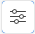

# Een herhaling in een werkstroom maken

>[!IMPORTANT]
>
>Workstreams zijn alleen beschikbaar voor een specifieke groep klanten.

Een herhaling is een ingestelde hoeveelheid tijd die is gereserveerd voor het voltooien van het werk. Sommige teams kunnen een herhaling als sprint verwijzen.

## Toegangsvereisten

+++ Breid uit om de toegangseisen voor de functionaliteit in dit artikel weer te geven.

<table style="table-layout:auto"> 
 <col> 
 <col> 
 <tbody> 
  <tr> 
   <td role="rowheader">Adobe Workfront-pakket</td> 
   <td> 
Alle
 </td> 
  </tr> 
  <tr> 
   <td role="rowheader">Adobe Workfront-licentie</td> 
   <td> 
   
Medewerker of hoger
 
   
Aanvraag of hoger

   </td> 
  </tr>  
 </tbody> 
</table>

Voor meer detail over de informatie in deze lijst, zie [ vereisten van de Toegang in de documentatie van Workfront ](/help/quicksilver/administration-and-setup/add-users/access-levels-and-object-permissions/access-level-requirements-in-documentation.md).

+++

## Een herhaling in een werkstroom maken

{{step1-to-boards}}

1. Open de werkstroom waar u de herhaling wilt toevoegen. Om een werkstroom te openen, klik [!UICONTROL **de werkstroom van de Mening**].
1. Maak een herhaling met een van de volgende methoden:

   * Voor het lusje van de Lijst van de Kaart, in de iteratiemening, klik [!UICONTROL **creeer herhaling**].
   * Voor het lusje van de Lijst van de Kaart, in de lijstmening, klik [!UICONTROL **creeer herhaling**].
   * Op het lusje van Boeken, klik [!UICONTROL **toevoegen raad**] en selecteer [!UICONTROL **Proces van de Herhaling**] als boardmalplaatje. Dan, open de iteratieraad en klik [!UICONTROL **vormen herhalingen**].

1. Voeg de volgende informatie toe in het dialoogvenster Interventiedetails:

   <table style="table-layout:auto"> 
    <tbody> 
     <tr> 
      <td><strong>[!UICONTROL Iteration name]</strong></td> 
      <td>De naam van de herhaling, bijvoorbeeld "Afdrukken 1".</td> 
     </tr> 
     <tr> 
      <td><strong>[!UICONTROL Iteration length]</strong></td> 
      <td>De lengte van de herhaling, in dagen, weken of maanden.</td> 
     </tr>
     <tr> 
      <td><strong>[!UICONTROL Start date]</strong></td> 
      <td>De datum waarop de herhaling begint. De einddatum wordt automatisch ingevoerd op basis van de herhalingslengte.</td> 
     </tr> 
    </tbody> 
   </table>

1. Klik [!UICONTROL **sparen**].

   De herhaling wordt nu weergegeven in de herhalingsweergave van de kaartlijst en in het metriekgebied op het iteratiebord.

   Om kaarten aan een herhaling toe te voegen, zie [ Gebruik de kaartlijst ](/help/quicksilver/agile/use-boards-agile-planning-tools/use-card-list.md).

## Een bestaande herhaling bewerken

1. Om een werkstroom te openen, klik [!UICONTROL **de werkstroom van de Mening**].
1. Open de herhaling op een van de volgende manieren:

   * Voor het lusje van de Lijst van de Kaart, in de herhalingsmening, klik de [!UICONTROL **pictogram**] details van de Interlatie 
   * Op de iteratieraad, klik de [!UICONTROL **pictogram**] details van de Interferatie 

1. Bewerk de herhaling naar wens in het deelvenster [!UICONTROL Iteration Configuration] .
1. Om de iteratienaam te veranderen, breid [!UICONTROL **details van de Interlatie**] uit.

   Nadat een herhaling is gestart, kunt u alleen de naam van de herhaling wijzigen en niet de datum- of herhalingslengte.

<!--   

1. To add goals to the iteration, expand [!UICONTROL **Goals**].
1. Click [!UICONTROL **Add goal**], and type the goal name.

   As goals are completed during the iteration, you can select the check box to mark them complete, or click the **Delete** icon  to delete a goal. The metrics area on the top right of the iteration shows how many goals exist and how many have been completed.

## Assign cards to the next iteration

Use the [!UICONTROL Next Iteration] column to move cards from the current iteration to the next iteration, without sending them to the backlog first.

1. Move a card to the [!UICONTROL **Next Iteration**] column, or add a new card directly in the column.
1. Access the next iteration by clicking the [!UICONTROL **Next Iteration**] column title, or by clicking the up-pointing arrow next to the iteration name on the top of the screen.

   The cards that you marked to come over to the next iteration are placed in the columns that correspond with their status.

-->

## Een herhaling verwijderen

1. Klik het [!UICONTROL **lusje van de Lijst van de Kaart**] op de werkstroom en open de herhalingsmening.
1. Klik het **pictogram van de Schrapping** 
1. Klik [!UICONTROL **herhaling van de Schrapping**] op het bevestigingsbericht.
