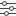

# Werkstromen beheren

>[!IMPORTANT]
>
>Workstreams zijn alleen beschikbaar voor een specifieke groep klanten.

Een werkstroom is een configureerbare groep borden en kaarten voor samenwerking op het werk. Workstreams kunnen verschillende typen borden bevatten die zijn gemaakt op basis van sjablonen en een kaartlijst met werkitems. In een werkstroom kunt u het werk in herhalingen of sprints volgen.

Voor meer informatie, zie [&#x200B; Gebruik de kaartlijst &#x200B;](/help/quicksilver/agile/use-boards-agile-planning-tools/use-card-list.md) en [&#x200B; creeer een herhaling in een werkstroom &#x200B;](/help/quicksilver/agile/use-boards-agile-planning-tools/create-an-iteration-in-workstream.md).

Workstreams worden op het dashboard weergegeven, samen met afzonderlijke borden waartoe u toegang hebt en die geen deel uitmaken van een werkstroom. Voor informatie over het dashboard van Borden, zie [&#x200B; Gebruik het dashboard van Borden &#x200B;](/help/quicksilver/agile/get-started-with-boards/use-boards-page.md). U kunt op een willekeurige bordnaam op het dashboard klikken om het te openen.

## Toegangsvereisten

+++ Vouw uit om de toegangsvereisten voor de functionaliteit in dit artikel weer te geven.

<table style="table-layout:auto"> 
 <col> 
 <col> 
 <tbody> 
  <tr> 
   <td role="rowheader">Adobe Workfront-pakket</td> 
   <td> 
Alle
 </td> 
  </tr> 
  <tr> 
   <td role="rowheader">Adobe Workfront-licentie</td> 
   <td> 
   
Medewerker of hoger
 
   
Verzoek of hoger

   </td> 
  </tr> 
 </tbody> 
</table>

Voor meer detail over de informatie in deze lijst, zie [&#x200B; vereisten van de Toegang in de documentatie van Workfront &#x200B;](/help/quicksilver/administration-and-setup/add-users/access-levels-and-object-permissions/access-level-requirements-in-documentation.md).

+++

## Een werkstroom maken

{{step1-to-boards}}

1. Klik op **[!UICONTROL Add workstream]** in het [!UICONTROL Workstreams] -gebied van het dashboard.
1. Typ een naam die u wilt vervangen **[!UICONTROL Untitled Workstream]** en druk op Enter.

   U kunt boards aan de werkstroom toevoegen of [!UICONTROL **klikken Alle Boards**] om aan het dashboard terug te keren.

## Een nieuw board maken in een werkstroom

1. Als u niet reeds in een werkstroom bent, klik [!UICONTROL **de werkstroom van de Mening**] op het dashboard om een bestaande werkstroom te openen.
1. Klik op **[!UICONTROL Add board]** op het tabblad [!UICONTROL Boards] van de werkstroom.
1. Selecteer een sjabloon voor het bord.

| Sjabloon | Beschrijving |
|---------|----------|
| Basisbord | Drie standaardkolommen worden verstrekt op het bord. U kunt nieuwe kolommen toevoegen en de standaardkolommen hernoemen of verwijderen. 
Er worden geen kolombeleid toegepast. |
| Kanban-bord | De volgende kolommen worden verstrekt op de raad: Achtergrond, Nieuw, Bezig, Voltooid, en op Greep. U kunt nieuwe kolommen toevoegen en de standaardkolommen hernoemen of verwijderen.
Als u de back-log wilt gebruiken, moet u filters instellen voor de inlaatkolom. Voor informatie, zie [&#x200B; een inlaatkolom aan een board &#x200B;](/help/quicksilver/agile/use-boards-agile-planning-tools/add-intake-column-to-board.md) toevoegen. 
Om het standaardbeleid voor elke kolom te herzien, klik [!UICONTROL **Meer** menu &#x200B;] op een kolom en selecteer [!UICONTROL **geef**] uit. U kunt al deze vooraf ingestelde beleidsvormen wijzigen. Voor informatie, zie [&#x200B; boardkolommen &#x200B;](/help/quicksilver/agile/get-started-with-boards/manage-board-columns.md) leiden. |
| Retrospectief board | De volgende kolommen staan aan boord: Wat is er goed gegaan? Wat zou verbeterd kunnen worden? Wie moeten we vieren? Wat kunnen we doen om sneller te gaan? U kunt nieuwe kolommen toevoegen en de standaardkolommen hernoemen of verwijderen. 
Geen kolombeleid toegepast. |
| Iteratieproces | Dit is het board dat wordt gebruikt om een herhaling te definiëren en uit te voeren. 
De volgende kolommen worden verstrekt op de raad: Achtergrond, Nieuw, Bezig, Voltooid, en op Greep. U kunt geen kolommen aan het bord toevoegen. 
Om het standaardbeleid voor elke kolom te herzien, klik [!UICONTROL **Meer**] menu op een kolom en selecteer [!UICONTROL **uitgeven**]. U kunt al deze vooraf ingestelde beleidsregels wijzigen. Voor informatie, zie [&#x200B; de kolommen van het Beheer &#x200B;](/help/quicksilver/agile/get-started-with-boards/manage-board-columns.md). |

Voor meer informatie bij vestiging de raad, zie [&#x200B; creeer of geef een raad &#x200B;](/help/quicksilver/agile/get-started-with-boards/create-edit-board.md) uit.

## De lijst met borden filteren in een werkstroom

Wanneer de filters buiten de gebreken op de boardlijst worden toegepast, wordt een indicator getoond op het toegepaste filter van het filterpictogram . Klik [!UICONTROL **ontruimen allen**] om alle filters te verwijderen, en [!UICONTROL **filters van de Huid**] te klikken om het filterpaneel te sluiten.

{{step1-to-boards}}

1. Op het dashboard, klik [!UICONTROL **de werkstroom van de Mening**] om een werkstroom te openen.
1. Klik het [!UICONTROL **Boards**] lusje als het niet reeds wordt getoond.
1. Klik [!UICONTROL **Filter**].
1. Selecteer de boards die u op status wilt zien (gearchiveerde boards, actieve boards of alle boards).
1. Selecteer de tekengebieden die u wilt zien op basis van een sjabloon.

## Leden toevoegen aan een werkstroom

Personen en teams moeten als leden aan de werkstream worden toegevoegd voordat ze de workstream en de inhoud ervan kunnen bekijken. Een workstreamlid kan leden toevoegen aan en verwijderen uit de werkstream en zien welke boards zich in de workflow bevinden.

>[!NOTE]
>
>Een workstreamlid kan pas een board openen in een workstream nadat deze als lid aan dat specifieke board zijn toegevoegd.

{{step1-to-boards}}

1. Op het dashboard, klik [!UICONTROL **de werkstroom van de Mening**] om een werkstroom te openen.
1. Klik het **[!UICONTROL Add member]** pictogram  toe om leden en teams aan de werkstroom toe te voegen.

   Dit is hetzelfde proces als het toevoegen van leden aan een bestuur. Voor meer informatie, zie [&#x200B; leden toevoegen of verwijderen uit een raad &#x200B;](/help/quicksilver/agile/get-started-with-boards/add-members-to-board.md).

## Bronnen toevoegen aan een werkstroom

Een bron bepaalt waar de kaarten in de werkstroom vandaan komen.

{{step1-to-boards}}

1. Klik het [!UICONTROL **pictogram van Bronnen**] pictogram  om een bron te bepalen om kaarten in de werkstroom in te voeren. Op dit moment is [!DNL Adobe Workfront] de enige beschikbare bron.
1. Voeg filters toe om taken en problemen uit Workfront als kaarten te importeren.

   Het toevoegen van filters voor werkstroombronnen is hetzelfde als het toevoegen van geavanceerde filters voor een inlaatkolom op een basisbord of Kanban-bord. Voor meer informatie, zie [&#x200B; een inlaatkolom aan een raad &#x200B;](/help/quicksilver/agile/use-boards-agile-planning-tools/add-intake-column-to-board.md) toevoegen.

## Een werkstroom configureren

{{step1-to-boards}}

1. Op het dashboard, klik [!UICONTROL **de werkstroom van de Mening**] om een werkstroom te openen.
1. Klik [!UICONTROL **vormen**] om het [!UICONTROL Configure Workstream] paneel te openen.
1. (Facultatief) breid [!UICONTROL **Werkstroom**] uit en typ een beschrijving van de werkstroom. Deze beschrijving wordt weergegeven op het dashboard.
1. (Facultatief) breid [!UICONTROL **Herhalingen**] uit om een herhalingsproces voor deze werkstroom te bepalen.

   Het totale aantal kaarten, het aantal wijzende kaarten en het aantal herhalingen worden weergegeven in de sectie Kaartlijst. Klik [!UICONTROL **lijst van de Mening**] om de lijst te openen en kaarten toe te voegen. Voor meer informatie, zie [&#x200B; Gebruik de kaartlijst &#x200B;](/help/quicksilver/agile/use-boards-agile-planning-tools/use-card-list.md).

   Als er al een herhaling is gedefinieerd, worden de begindatum, het aantal kaarten en het aantal punten weergegeven. Klik [!UICONTROL **de raad van de Mening**] om de herhalingsraad te openen. Voor meer informatie, zie [&#x200B; een herhaling in een werkstroom &#x200B;](/help/quicksilver/agile/use-boards-agile-planning-tools/create-an-iteration-in-workstream.md) creëren.

1. (Facultatief) breid [!UICONTROL **Markeringen**] uit om markeringen aan de werkstroom toe te voegen. Zoek naar een tag of typ een nieuwe tagnaam in het zoekvak en druk op Enter om de tag te maken.
