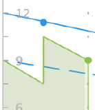

# Overzicht van gile burndown-diagram

Het burndown-diagram geeft een visuele weergave van hoe verhalen door de herhaling gaan. De daadwerkelijke burndown tarief wordt gemeten tegen het ideale burndown tarief voor de iteratiechronologie.

De burndown grafiek past zich op de geselecteerde dag aan. De huidige dag is de standaarddag. Wanneer een vorige dag wordt geselecteerd, worden alle gegevens in de burndown grafiek en alle waarden in de [!UICONTROL completion status] sectie boven de burndown grafiek opnieuw berekend om de gegevens te vertegenwoordigen aangezien het aan het eind van de geselecteerde dag was. (U kunt dagen of de huidige dag selecteren; u kunt geen dagen in de toekomst selecteren.)

## Visuele indicatoren

Het burndown-diagram bevat de volgende visuele indicatoren:

<table style="table-layout:auto"> 
 <col> 
 <col> 
 <tbody> 
  <tr> 
   <td role="rowheader">  </td> 
   <td> 
De ideale uitbetalingssnelheid is gebaseerd op het tijdstip waarop de iteratie begon.
 
Deze regel wordt niet weergegeven als het bereik van de herhaling nooit verandert (uren of punten worden nooit toegevoegd of verwijderd).
 
Deze regel wordt vlak weergegeven wanneer het werk op een willekeurige dag wordt uitgevoerd. Voor meer informatie, zie <a title="De versnellingsgrafiek gebruiken" href="#how-days-off-affect-the-burndown-chart" class="MCXref xref"> Hoe de dagen van de compensatie grafiek </a> beïnvloeden.
 </td> 
  </tr> 
  <tr> 
   <td role="rowheader">  </td> 
   <td> 
Ideaal omzettingstarief dat op huidige verhalen of taken wordt gebaseerd.
 
De huidige ideale uitzetsnelheid (effen blauwe lijn) verschilt van de oorspronkelijke ideale uitzettingssnelheid (stippelblauwe lijn) wanneer uren of punten worden toegevoegd aan of verwijderd uit de iteratie nadat de herhaling is gestart.
 
Deze regel wordt vlak weergegeven wanneer het werk op een willekeurige dag wordt uitgevoerd.
 
Voor meer informatie, zie <a title="De versnellingsgrafiek gebruiken" href="#how-days-off-affect-the-burndown-chart" class="MCXref xref"> Hoe de dagen van de compensatie grafiek </a> beïnvloeden.
 </td> 
  </tr> 
  <tr> 
   <td role="rowheader">  </td> 
   <td> 
De daadwerkelijke burndown rate wordt getoond in rood wanneer het burndown tarief minder dan ideaal is (meer punten of uren resterend per dag dan de ideale burndown berekening).
 
Voor de berekening van de werkelijke uitboekingsrente wordt de volgende formule gebruikt:
 
[SUM(Point or Hour Value of In-progress Work * Percent Complete) + Point or Uour Value of Completed Work]
 </td> 
  </tr> 
  <tr> 
   <td role="rowheader">  </td> 
   <td> 
De daadwerkelijke burndown-rente wordt in groen weergegeven wanneer de burndown-snelheid gelijk is aan of beter is dan het ideale (gelijk aan of minder punten per dag dan de ideale burndown-berekening).
 
Voor de berekening van de werkelijke uitboekingsrente wordt de volgende formule gebruikt:
 
[SUM(Point or Hour Value of In-progress Work * Percent Complete) + Point or Uour Value of Completed Work]
 </td> 
  </tr> 
  <tr> 
   <td role="rowheader">  </td> 
   <td> 
Wijziging in bereik (uren of punten worden toegevoegd aan of verwijderd uit de iteratie).
 
Wijzigingen in bereik worden altijd als een verticale lijn in het midden van de dag weergegeven. Bovendien wordt een blauwe stip weergegeven halverwege de dag waarop een bereikwijziging is opgetreden.
 
Op de verticale as van het uitvouwdiagram worden de artikelpunten of -uren weergegeven.
 </td> 
  </tr> 
  <tr> 
   <td role="rowheader">  </td> 
   <td> 
Verandering in datumbereik (de duur van de herhaling wordt verhoogd of verlaagd).
 
Er wordt een blauwe stip weergegeven halverwege de dag waarop de herhalingsduur is gewijzigd.
 </td> 
  </tr> 
  <tr> 
   <td role="rowheader">  </td> 
   <td> 
Op het moment dat het werk wordt afgebrand, wordt een groene of rode stip weergegeven met de werkelijke afbraaksnelheid. (Wanneer de daadwerkelijke burndown tarief op die dag rood is, is de punt rood; wanneer het daadwerkelijke burndown tarief op die dag groen is, is de punt groen.)
 
Het werk wordt verbrand wanneer om het even welk van het volgende voorkomt:
 
    <ul> 
     <li> De waarde [!UICONTROL Percent Complete] wordt verhoogd in het artikel. [!UICONTROL Percent Complete] wordt verhoogd wanneer: 
      <ul> 
       <li> 
Handmatig gewijzigd
 </li> 
       <li> 
Het aantal punten of uren wordt bijgewerkt in het artikel
 </li> 
      </ul></li>  
     <li>De status van het artikel wordt gewijzigd in [!UICONTROL Complete]</li> 
    </ul> </td> 
  </tr> 
 </tbody> 
</table>

## De invloed van vrije dagen op de burndown-grafiek {#how-days-off-affect-the-burndown-chart}

Het standaardschema dat in [!DNL Workfront] wordt gedefinieerd, is van invloed op het burndown-diagram door dagen uit (weekends en feestdagen) van de burndown uit te sluiten. Het burdown grafiek gebruikt het standaardprogramma om werkdagen (zoals die in  [&#x200B; creeer een programma &#x200B;](../../../administration-and-setup/set-up-workfront/configure-timesheets-schedules/create-schedules.md)).

De mobiele teams kunnen team-specifieke niet-werkdagen opnemen door een afwisselend programma (zoals die in het artikel [&#x200B; wordt beschreven Gebruik een afwisselend teamprogramma voor burndown grafieken &#x200B;](../../../agile/use-scrum-in-an-agile-team/burndown/use-alt-team-schedule-burndown-charts.md)) te bepalen. Dit afwisselende programma wordt dan weerspiegeld in de burndown grafiek van om het even welke herhaling die aan het team wordt toegewezen. Het afwisselende programma beïnvloedt slechts de burndown grafiek.

Dagen worden alleen in de uitbouwgrafiek weergegeven als:

* Het werk werd eerder een dag weg het programma geopend. (De dag waarop het werk werd geregistreerd wordt getoond.)

  Wanneer het werk wordt het programma geopend op een dag weg:

   * Om het even welk geregistreerd werk is niet inbegrepen wanneer het berekenen van de ideale inbraak omdat het team niet gepland is om het even welk werk te doen.
   * De ideale afbraaklijnen (de effen blauwe lijn en de onderbroken blauwe lijn) worden als plat weergegeven in het afbraakdiagram voor elke dag waarop het werk is uitgevoerd of op de dag waarop u de afbraakgrafiek weergeeft (als u de grafiek op een willekeurige dag weergeeft).
   * Bij de berekening van andere uitbouwstatistieken, zoals de geschatte voltooiing en de gemiddelde punten of uren per dag, wordt rekening gehouden met het geregistreerde werk.

* U bekijkt de burndown grafiek op een dag weg. (De dag die u bekijkt wordt getoond op de burndown grafiek.)
* U voltooit het totale resterende werk voor de herhaling op een vrije dag.

  Wanneer een gebruiker het totale resterende werk voor de herhaling op een vrije dag voltooit, toont het [!UICONTROL Estimated Completion] gebied de datum de herhaling werd voltooid.

  Wanneer u de herhaling plant en de einddatum van de herhaling instelt voor een niet-werkdag en de herhaling wordt bijgehouden zodat deze op tijd wordt voltooid, wordt de [!UICONTROL Estimated Completion] -datum ingesteld voor de laatste werkdag voorafgaand aan de einddatum van de herhaling die u instelt (omdat het werk volgens de planning niet op niet-werkdagen wordt afgebrand).

  De einddatum voor de herhaling wordt gespecificeerd wanneer de herhaling wordt gepland, zoals die in artikel [&#x200B; wordt beschreven creeer een herhaling &#x200B;](../../../agile/use-scrum-in-an-agile-team/iterations/create-an-iteration.md).
