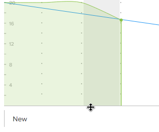

# Het formaat en de onderdrukkingsgrafiek samenvouwen

U kunt de grootte van het uitvouwdiagram wijzigen of het uitvouwdiagram samenvouwen om aan te passen hoeveel ruimte het inneemt op het artikelbord.

Wijzigingen die u aanbrengt in het formaat of de zichtbaarheid van het inbouwdiagram zijn alleen voor u zichtbaar en worden opnieuw ingesteld wanneer u de cache van de browser wist.

## Toegangsvereisten

+++ Breid uit om de toegangseisen voor de functionaliteit in dit artikel weer te geven.

<table style="table-layout:auto"> 
 <col> 
 </col> 
 <col> 
 </col> 
 <tbody> 
  <tr> 
   <td role="rowheader">Adobe Workfront-pakket</td> 
   <td> 
Alle
 </td> 
  </tr> 
  <tr> 
   <td role="rowheader">Adobe Workfront-licentie</td> 
   <td> 
Licht of hoger
 
   
Controleren of hoger
 </td> 
  </tr>
 </tbody> 
</table>

Voor meer detail over de informatie in deze lijst, zie [&#x200B; vereisten van de Toegang in de documentatie van Workfront &#x200B;](/help/quicksilver/administration-and-setup/add-users/access-levels-and-object-permissions/access-level-requirements-in-documentation.md).

+++

## Het formaat van het uitvouwdiagram wijzigen

{{step1-to-team}}

1. (Facultatief) klik het **[!UICONTROL Switch team]** pictogram van de pictogram , dan of selecteer een nieuw [!UICONTROL Scrum] team van het drop-down menu of onderzoek naar een team in de onderzoeksbar.

1. Ga naar de herhaling die de burndown grafiek bevat u resize.
1. Houd de cursor boven de onderste lijn van het onderste diagram en sleep het diagram naar de gewenste grootte.
   

## Het uitvouwdiagram samenvouwen

{{step1-to-team}}

1. (Facultatief) klik het **[!UICONTROL Switch team]** pictogram van de pictogram , dan of selecteer een nieuw [!UICONTROL Scrum] team van het drop-down menu of onderzoek naar een team in de onderzoeksbar.

1. Ga naar de herhaling die de burndown grafiek bevat u wilt ineenstorten.
1. Klik op het pijlpictogram links van de statusbalk van [!UICONTROL Percent Complete] .
