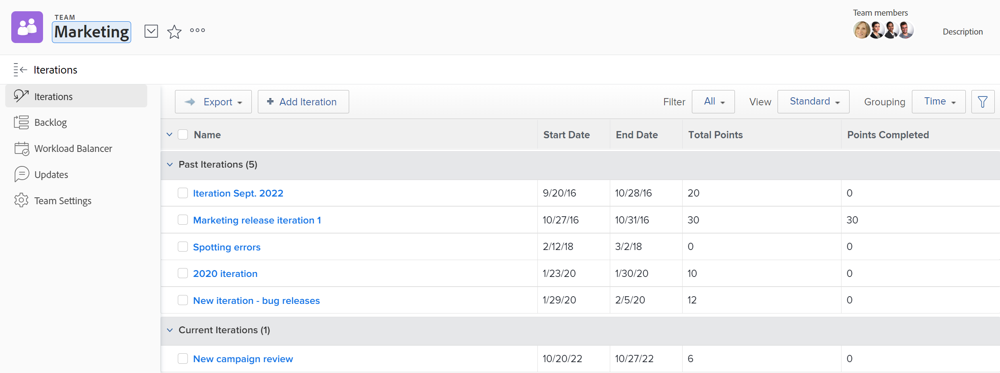

# Een herhaling weergeven

U kunt alle herhalingen voor een bepaald team bekijken, of u kunt een individuele herhaling bekijken. Bij herhalingen worden gegevens weergegeven over de artikelen, problemen en documenten in de herhaling.

## Toegangsvereisten

U moet de volgende toegang hebben om de stappen in dit artikel uit te voeren:

<table style="table-layout:auto"> 
 <col> 
 </col> 
 <col> 
 </col> 
 <tbody> 
  <tr> 
   <td role="rowheader"><strong>[!DNL Adobe Workfront] plan*</strong></td> 
   <td> 
Alle
 </td> 
  </tr> 
  <tr> 
   <td role="rowheader"><strong>[!DNL Adobe Workfront] licentie*</strong></td> 
   <td> 
[!UICONTROL Review] of hoger
 </td> 
  </tr> 
 </tbody> 
</table>

&#42; om te weten te komen welk plan of vergunningstype u hebt, contacteer uw [!DNL Workfront] beheerder.

## De herhalingen van de mening die aan een bepaald team worden toegewezen

1. Klik op het **[!UICONTROL Main Menu]** pictogram  rechtsboven in [!DNL Adobe Workfront] en klik vervolgens op **[!UICONTROL Teams]** .

1. (Facultatief) klik het **[!UICONTROL Switch team]** pictogram van de pictogram , dan of selecteer een nieuw team van het Trommel van het drop-down menu of onderzoek naar een team in de onderzoeksbar.

1. Selecteer in het linkerdeelvenster **[!UICONTROL Iterations]** om een specifieke herhaling te kiezen of selecteer **[!UICONTROL Current Iteration]** .

   

   >[!NOTE]
   >
   >**[!UICONTROL Current Iteration]** wordt alleen in het linkerdeelvenster weergegeven wanneer deze is toegewezen aan de lay-outsjabloon en er ten minste één taak of uitgave op de herhaling staat. Voor meer informatie, zie [ het linkerpaneel aanpassen gebruikend een lay-outmalplaatje ](/help/quicksilver/administration-and-setup/customize-workfront/use-layout-templates/customize-left-panel.md).

1. (Optioneel) Klik op de naam van de specifieke herhaling die u wilt weergeven.\
   De herhalingsartikelen worden weergegeven.

   ![[!UICONTROL Stories in iteration]](assets/iteration-stories-list-NWE.png)
