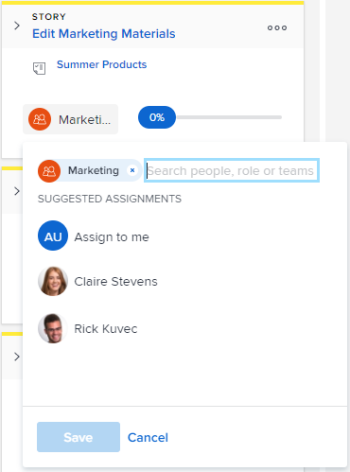

# Gebruikers toewijzen aan een artikel in het dialoogvenster [!UICONTROL Scrum] board

## Toegangsvereisten

U moet de volgende toegang hebben om de stappen in dit artikel uit te voeren:

<table style="table-layout:auto"> 
 <col> 
 </col> 
 <col> 
 </col> 
 <tbody> 
  <tr> 
   <td role="rowheader"><strong>[!DNL Adobe Workfront] plan*</strong></td> 
   <td> 
Alle
 </td> 
  </tr> 
  <tr> 
   <td role="rowheader"><strong>[!DNL Adobe Workfront] licentie*</strong></td> 
   <td> 
[!UICONTROL Work] of hoger
 </td> 
  </tr> 
  <tr> 
   <td role="rowheader"><strong>Configuraties op toegangsniveau*</strong></td> 
   <td> 
[!UICONTROL Worker] of hoger
 
Opmerking: Als u nog steeds geen toegang hebt, vraagt u [!DNL Workfront] beheerder als zij extra beperkingen in uw toegangsniveau plaatsen. Voor informatie over hoe een [!DNL Workfront] de beheerder kan uw toegangsniveau veranderen, zie <a href="../../../administration-and-setup/add-users/configure-and-grant-access/create-modify-access-levels.md" class="MCXref xref">Aangepaste toegangsniveaus maken of wijzigen</a>.
 </td> 
  </tr> 
 </tbody> 
</table>

&#42;Neem contact op met uw [!DNL Workfront] beheerder.

## Gebruikers toewijzen aan een artikel in het dialoogvenster [!UICONTROL Scrum] board

1. Klik op de knop **[!UICONTROL Main Menu]** pictogram  in de rechterbovenhoek van [!DNL Adobe Workfront]en klik vervolgens op **[!UICONTROL Teams]**.

1. (Optioneel) Klik op de knop **[!UICONTROL Switch team]** pictogram Selecteer vervolgens een nieuwe [!UICONTROL Scrum] team van het drop-down menu of onderzoek naar een team in de onderzoeksbar.

1. Ga naar de flexibele herhaling of het project dat de verhaalraad bevat waar u gebruikers wilt toewijzen. Voor informatie over hoe u naar een herhaling kunt navigeren, raadpleegt u [Een herhaling weergeven](../../../agile/use-scrum-in-an-agile-team/iterations/view-iteration.md).
1. Ga naar de artikeltegel op het artikelbord waar u een gebruiker wilt toevoegen.
1. Klik op de teamavatar op de artikeltegel (of een gebruikersavatar als er al een is toegewezen), typ de naam van de gebruiker die u aan het artikel wilt toewijzen en klik op de naam wanneer deze wordt weergegeven. U kunt ook een gesuggereerde gebruiker kiezen.

   >[!TIP]
   >
   >U kunt ook een taakrol toewijzen aan een artikel. U kunt alleen actieve gebruikers en actieve rollen toewijzen.

   
