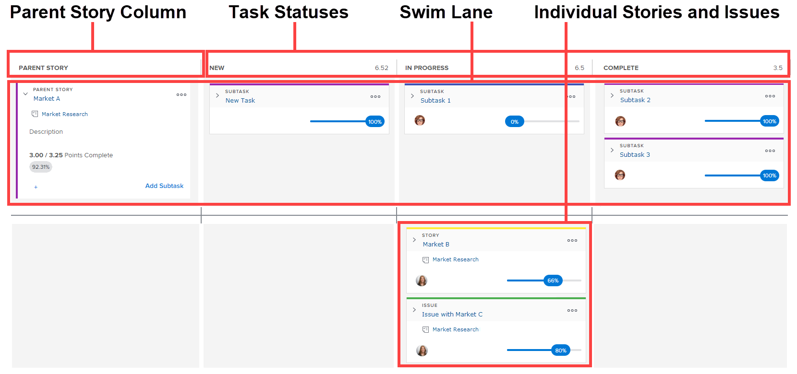

# [!UICONTROL Scrum] Overzicht van board

De [!UICONTROL Scrum] het agile verhaalbord verschijnt samen met de voltooiingsstatus en de burndown grafiek. Deze flexibele componenten zijn beschikbaar in de volgende situaties in [!UICONTROL Adobe Workfront]:

* Op niet-gele iteraties. Zie voor meer informatie over het gebruik van de &#39;agile story board&#39;, de &#39;burndown&#39;-grafiek en de voltooiingsstatus in een omgeving met alleen maar behendigheid (met backlogs en een herhaling) [Werken in een flexibele omgeving](../../../agile/work-in-an-agile-environment/work-in-an-agile-environment.md).
* Wanneer u een project in een flexibele weergave weergeeft. Voor informatie over hoe u de &#39;agile story board&#39;, de burndown grafiek, en de voltooiingsstatus binnen een bestaand project kunt gebruiken, zie [Een project beheren in de Google-weergave](../../../manage-work/projects/manage-projects/manage-projects-in-agile-view.md).

## Layout en functies van het artikelbord

De whiteboard bestaat uit de volgende elementen:

* **[!UICONTROL Parent Story]Kolom:** In tegenstelling tot de andere kolommen op het artikelbord, wordt het  [!UICONTROL Parent Story]  de kolom is geen taakstatus, maar bestaat eerder om het even welke verhalen te huisvesten die subtaken in de herhaling of het project bevatten. Alleen bovenliggende artikelen die ten minste één subtaak op de artikelkaart hebben, kunnen in deze kolom voorkomen. De bovenliggende artikelen gaan niet van status naar status over het hele artikel.

   In een herhaling wordt deze kolom alleen op het artikelbord weergegeven wanneer een of meer artikelen op het artikelbord ten minste één subtaak bevatten die aan de volgende vereisten voldoet:

   * Toegewezen aan het zelfde agile team zoals de oudertaak
   * Behoort tot de herhaling

      In een project, lijkt deze kolom wanneer een taak minstens één subtaak heeft.

      

* **Taakstatussen:** Geef aan hoe een artikel de herhaling of het project doorloopt op basis waarvan de statuskolom van het artikel wordt gebruikt.

   De statussen van de taak kunnen voor het project worden aangepast door de flexibele mening, zoals die in wordt beschreven te wijzigen [Een eenvoudige weergave maken of aanpassen](../../../reports-and-dashboards/reports/reporting-elements/views-overview.md#customizing-an-agile-view) in [Overzicht van weergaven in [!UICONTROL Adobe Workfront]](../../../reports-and-dashboards/reports/reporting-elements/views-overview.md).

* **Zwim Lane:** Wanneer een bovenliggend artikel en de bijbehorende subtaken op het artikelbord worden weergegeven, wordt een swim-pad gemaakt die specifiek is voor het artikel en de bijbehorende subtaken. Dit biedt een visueel onderscheid om beter te kunnen zien hoe de subtaken van een artikel zich over de hele whitepaper ontwikkelen.

   In een herhaling worden zwempaden alleen op het artikelbord weergegeven wanneer een artikel op het artikelbord ten minste één subtaak bevat die aan de volgende vereisten voldoet:

   * Toegewezen aan het zelfde agile team zoals de oudertaak
   * Behoort tot de herhaling

   In een project, verschijnen de zwemwegen wanneer een taak minstens één subtaak of één oudertaak heeft.

* **Afzonderlijke artikelen:** Afzonderlijke artikelen en problemen worden weergegeven onder de modepaden op het artikelbord. Dit geeft een visueel onderscheid ten opzichte van de verhalen die deel uitmaken van een zwembaan.

## Relatie tussen subtaken en artikelen

Als een artikel subtaken bevat, kunt u geen informatie over het bovenliggende artikel zelf bijwerken (zoals punten/uren of procent voltooid). Bovendien kunt u het artikel niet over de artikelkaart verplaatsen om de status bij te werken. Alle wijzigingen die u aanbrengt in de subtaken van het artikel, worden weerspiegeld in het artikel. De gecombineerde artikelpunten of -uren voor alle subtaken bepalen de punten of uren van het bovenliggende artikel.

Als een artikel bijvoorbeeld slechts één subtaak heeft die op 4 punten wordt gewaardeerd, heeft het artikel zelf ook vier punten. Als u de waarde voor het subtaakpunt wijzigt in 3, wordt de puntwaarde van het bovenliggende artikel gewijzigd in 3. Als u een andere subtaak voor hetzelfde artikel maakt en de puntwaarde voor die subtaak instelt op 4, wordt de puntwaarde voor het artikel gewijzigd in 7 om de gecombineerde puntwaarde voor beide subtaken weer te geven.

Deze zelfde logica is op subtaken op het tweede niveau (subtaken van subtaken) van toepassing. Als subtask één of meerdere subtasks op het tweede niveau heeft, wordt subtask berekend gebaseerd op de subtaken op het tweede niveau.

## Relatie tussen de Artikelraad en de Achtergrond

>[!NOTE]
>
>De informatie in deze sectie is alleen van toepassing op flexibele weergaven van een herhaling. Bestaande weergaven van een project gebruiken geen achterstand. (Voor meer informatie over de verschillen tussen flexibele meningen over een herhaling en een project, zie &quot;Verschillen wanneer het Gebruiken van [!UICONTROL Agile] Weergeven op een projectversie op een herhaling&quot; in [Een project beheren in de Google-weergave](../../../manage-work/projects/manage-projects/manage-projects-in-agile-view.md).)

De iteratieachterstand geeft alleen artikelen of subtaken weer waar u een schatting kunt instellen. Als een ouderverhaal subtaken heeft die op de verhaalraad worden getoond (omdat zij aan het zelfde agile team worden toegewezen en tot de herhaling behoren), wordt de oudertaak niet getoond op de backlog. In deze situatie worden alleen de subtaken weergegeven op de achtergrond, terwijl de subtaken en het bovenliggende artikel worden weergegeven op de artikellijst.

Bijvoorbeeld, veronderstel dat Artikel A Subtask 1 en Subtask 2 bevat (en beide subtaken worden toegewezen aan het zelfde agile team). In deze situatie wordt artikel A weergegeven op de whiteboard in een zwempad met Subtask 1 en Subtask 2. Nochtans, slechts worden Subtask 1 en Subtask 2 getoond in de backlog.

Deze zelfde logica is op subtaken op het tweede niveau (subtaken van subtaken) van toepassing. Als een subtask één of meerdere subtasks op het tweede niveau heeft die aan het zelfde agile team worden toegewezen en tot de herhaling behoren, slechts wordt de subtask van het tweede niveau getoond in de backlog.

Voor meer informatie over de achterstand, zie [De logboekregistratie voor bestanden beheren](../../../agile/work-in-an-agile-environment/manage-the-agile-backlog.md).
