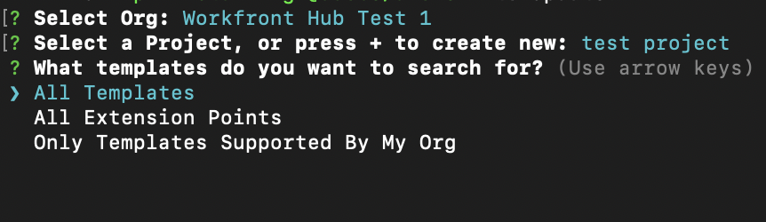

# Aangepaste toepassingen maken voor Workfront met Adobe App Builder

Met Workfront UI-extensies, aangedreven door Adobe App Builder, kunnen klanten en partners aangepaste gebruikerservaringen maken. Deze hulpmiddelen verbeteren efficiency, leveren naadloze, verbonden ervaringen, en beduidend verbeteren gebruikerstevredenheid, en helpen ondernemingen hun unieke visie realiseren.

Zonder Workfront UI-extensies moet een projectmanager bijvoorbeeld schakelen tussen Workfront en een afzonderlijk systeem voor het bijhouden van de tijd voor het bijhouden van de loguren. Met UI-extensies kan het bijhouden van tijd rechtstreeks in de Workfront-ervaring worden geïntegreerd, waardoor de workflow wordt gestroomlijnd en tijd wordt bespaard. Daarnaast kunt u aangepaste componenten toevoegen om de bruikbaarheid te verbeteren, herhalende taken te automatiseren en het inhoudsbeheer te verbeteren met functies zoals het labelen van metagegevens en voorvertoningen van inhoud. Adobe App Builder biedt ook schaalbaarheid en robuust identiteitsbeheer (IMS), waardoor veilige en efficiënte aanpassingen op elke schaal mogelijk zijn.

Workfront UI-extensies bieden verschillende belangrijke voordelen:

* Nauwkeurige aanpassing: de standaardsoftwareinterfaces voldoen vaak niet aan alle bedrijfsvereisten. Met UI-extensies kunnen ontwikkelaars de standaardgebruikersinterface aanpassen en uitbreiden om aan specifieke bedrijfsbehoeften te voldoen.
* Systeemintegratie: UI-extensies vergemakkelijken de integratie van andere systemen en zorgen voor naadloze workflows en gegevensconsistentie.
* Scalability: Aangezien de ondernemingen groeien, kunnen de Uitbreidingen UI worden ontwikkeld om nieuwe functionaliteit toe te voegen zonder de behoefte aan een volledige systeemrevisie.
* Minder ontwikkeltijd: vooraf gebouwde uitbreidingspunten en gereedschappen verminderen aanzienlijk de tijd en moeite die nodig is om aangepaste functies te implementeren.
* Verbeterde gebruikerstoepassing: een geoptimaliseerde gebruikerservaring kan de softwareacceptatie aanzienlijk verhogen. Aangepaste UI-elementen die zijn ontworpen om overeen te komen met gebruikersvoorkeuren kunnen de mate van acceptatie en de algehele tevredenheid verbeteren.
* Met behulp van Workfront UI-uitbreidingen kunnen bedrijven op maat gesneden gebruikerservaringen maken die de efficiëntie, integratie en gebruikerstevredenheid bevorderen.

Nadat een toepassing is gemaakt in de Adobe App Builder, kan een Workfront-beheerder deze toevoegen aan het Workfront Main Menu en het linkernavigatievenster met behulp van lay-outsjablonen. Een gebruiker met de lay-outsjabloon die op de toepassing klikt, ziet de toepassing ingesloten in Workfront in plaats van deze afzonderlijk te openen.

In dit artikel wordt beschreven hoe u toegang krijgt tot de App Builder en een sjabloon gebruikt om een toepassing te maken.

Voor informatie over het toevoegen van een douanetoepassing aan lay-outmalplaatjes, zie [&#x200B; het belangrijkste menu aanpassen gebruikend een lay-outmalplaatje &#x200B;](/help/quicksilver/administration-and-setup/customize-workfront/use-layout-templates/customize-main-menu.md) en [&#x200B; pas het linkerpaneel aan gebruikend een lay-outmalplaatje &#x200B;](/help/quicksilver/administration-and-setup/customize-workfront/use-layout-templates/customize-left-panel.md).

## Vereisten

U moet het volgende hebben:

* Een Workfront-account voor IMS
* Een dev-machine met knooppunt v18 en npm
* App Builder-licentie

## Adobe App Builder openen

Als u UI-extensies wilt maken, moet u toegang hebben tot Adobe App Builder in de Adobe Developer Console.

De extra instructies zijn beschikbaar op de [&#x200B; plaats van Adobe Developer &#x200B;](https://developer.adobe.com/uix/docs/guides/get-access/).

### Ontwikkelaars toevoegen aan de Adobe Admin Console

>[!IMPORTANT]
>
>Controleer of u de juiste IMS-organisatie hebt geselecteerd voor alle volgende stappen. Als u tot veelvoudige organisaties behoort, is het mogelijk om verkeerde te selecteren. Let erop dat u onder de juiste organisatie werkt. Deze wordt meestal in de rechterbovenhoek weergegeven.

1. Ga naar Productie: https://adminconsole.adobe.com/
1. In de **sectie van Gebruikers**, klik **Ontwikkelaars** > **voegt ontwikkelaars** toe.

    toe

   >[!NOTE]
   >
   >Als u geen optie ziet om ontwikkelaars te beheren, hebt u geen product dat ontwikkelaars toegang verleent.

1. Voeg de e-mail van de gebruiker toe. De toepassing moet zoeken naar bestaande gebruikers die al vanuit de Admin Console zijn toegevoegd.
1. Voeg noodzakelijke producten aan het ontwikkelaarprofiel toe en klik **sparen**.

    toe

### Toegang tot App Builder krijgen

Organisaties moeten met hun accountmanagers samenwerken om App Builder te kopen.

Als AppBuilder behoorlijk wordt gevormd, zou u project van malplaatje als deel van het creëren van een nieuw project moeten zien tot stand brengen.

## Een nieuw project maken in de Adobe Developer Console

U moet de Adobe Developer Console gebruiken om uw UI-extensie te maken.

De extra instructies zijn beschikbaar op de [&#x200B; plaats van Adobe Developer &#x200B;](https://developer.adobe.com/uix/docs/guides/creating-project-in-dev-console/).

1. Meld u met uw Adobe ID aan bij de Adobe Developer Console.
1. Kies uw account en uw profiel of organisatie.
1. Klik **creeer project van malplaatje** in het Snelle gebied van het Begin, of klik **creeer nieuw project > Project van malplaatje**.

   >[!IMPORTANT]
   >
   >Als u niet de optie ziet om een project van een malplaatje tot stand te brengen, dan bent u misconfigured in de Admin Console en hebt geen toegang tot de catalogus van App Builder. Deze optie wordt alleen weergegeven wanneer u toegang hebt tot AppBuilder.

   

1. Selecteer **App Builder**.
1. Ga de titel van het a **Project** en **App naam** in. Beide hebben gebreken, maar het is gemakkelijker om het project te identificeren u later wilt als u de waarde aanpast.
1. Laat **omvatten runtime** geselecteerd.
1. Klik **sparen**.

## Adobe Developer (aio) CLI gebruiken

Adobe biedt een open-source CLI die u kunt gebruiken om de App Builder-toepassing te maken.

De extra instructies zijn beschikbaar op GitHub en de plaats van Adobe Developer:

* https://github.com/adobe/aio-cli
* https://developer.adobe.com/app-builder/docs/getting_started/first_app/

1. Als u het gereedschap wilt installeren, voert u het volgende uit (zorg dat u zich eerst op knooppunt v18 bevindt): `npm install -g @adobe/aio-cli` .
1. Start de terminal en meld u aan bij AIO met de opdracht: `aio login` . Als u problemen hebt met het aanmelden op de juiste IMS-org, probeert u `aio login -f` een aanmeldingsprompt te forceren. Gebruik `aio where` om te zien in welke organisatie u bent aangemeld bij de juiste IMS-org. Gebruik `aio config` voor meer informatie.
1. Start het instellen van de app door deze uit te voeren: `aio app init example-app` vervang &#39;example-app&#39; door uw toepassingsnaam. Als u niet zeker bent van toepassingsnamen, ziet u een lijst met toepassingsnamen met de opdracht `aio console project list` .
1. Selecteer uw organisatie en project uit de beschikbare opties.

   
   

1. Blader door alle beschikbare sjablonen en kies de **@adobe/workfront-ui-ext-tpl** voor uw project.

   

1. Selecteer en typ de projectnaam die u in de Adobe Developer Console hebt gemaakt.

    in

1. Beantwoord de vragen voor de toepassing:

   * Geef de extensie een naam.
   * Geef een beschrijvend overzicht van de functionaliteit van de extensie.
   * Selecteer een eerste versienummer waarmee u wilt beginnen.
   * De sjabloon maakt de code voor een primaire navigatieknop als u &quot;Een aangepaste knop toevoegen aan hoofdmenu-item&quot; selecteert wanneer u wordt gevraagd wat u hierna wilt doen.&quot;

   

1. Bevestig de voltooiing door op Ik ben klaar te klikken. De code die wordt gegenereerd op basis van de sjabloon, wordt momenteel gegenereerd.

   

1. Wacht tot u een bericht ziet dat de app-initialisatie is voltooid. Dan kunt u het project in winde (de Code van Visual Studio wordt geadviseerd) openen en tot de src omslag toegang hebben.

   Voor meer informatie over de omslagen en de dossiers in uw project, zie de [&#x200B; de ontwikkelaarplaats van Adobe &#x200B;](https://developer.adobe.com/app-builder/docs/get_started/app_builder_get_started/first-app#anatomy-of-an-app-builder-application).

Voor meer informatie over de omslagen en de dossiers in uw project, zie de [&#x200B; plaats van Adobe Developer &#x200B;](https://developer.adobe.com/app-builder/docs/get_started/app_builder_get_started/first-app#anatomy-of-an-app-builder-application).

## De extensies maken in VSCode

De App.js- dossierconfiguratie wordt vereist voor het toelaten van navigatie via het Hoofdmenu van Workfront of secundaire navigatie (linkerpaneel).

De configuratie van het bestand ExtensionRegistration.js is vereist om de extensies weer te geven in Workfront-lay-outsjablonen.

In de volgende voorbeelden ziet u hoe u aangepaste toepassingen kunt toevoegen aan het Workfront-hoofdmenu en het linkerdeelvenster van een object met behulp van de UI-extensies.

### ExtensionRegistration.js configureren

Aangepaste toepassingen toestaan in het hoofdmenu van Workfront:

1. Ga naar ExtensionRegistration.js.

   In de functie ExtensionRegistration moet u de volgende code zien. Deze code is voor u gemaakt met de sjabloon. Deze code kan worden toegevoegd om extra menu-items te maken. Vervang id&#39;s en URL&#39;s.

   ```
   mainMenu: { 
   
           getItems() { 
   
               return [ 
   
               { 
   
                   id: 'main-menu-label', 
   
                   url: '/index.html#/main-menu-label', 
   
                   label: 'Main menu label', 
   
                   icon: icon1, 
   
               }, 
   
               ]; 
   
           }, 
   
           } 
   ```

1. Voeg het volgende codefragment toe:

   

   In dit voorbeeld ziet u een hoofdmenu-item. U moet de id, het label, het pictogram en de URL bijwerken naar de juiste namen voor uw toepassing. Wanneer u meerdere items toevoegt, moet u ervoor zorgen dat de id uniek is.

1. Sla uw werk op.

### Aangepaste toepassingen toestaan in navigatie in het linkerdeelvenster van Workfront

Aangepaste toepassingen toestaan in navigatie in het linkerdeelvenster van Workfront:

1. Ga naar ExtensionRegistration.js.
1. Voeg het volgende codefragment toe in de ExtensionRegistration-functie:

   ```
   secondaryNav: {
   
   TASK: {  
   
       getItems() {       return [         {           id: "TASK", 
   
   label: "My TASK",           icon: metricsIcon,           url: "/myTask",  
   
           },  
   
       ];  
   
       },  
   
   },  
   
   },  
   ```

   

   * In dit voorbeeld ziet u een navigatiepunt in het linkerdeelvenster met de naam Mijn taak. U moet de id, het label, het pictogram en de URL bijwerken naar de juiste namen voor uw toepassing.
   * In dit voorbeeld ziet u een navigatiepunt in het linkerdeelvenster voor het objecttype Project. U moet deze items afzonderlijk maken voor elk object waarvoor ze in Workfront worden ondersteund. De volgende objecten zijn beschikbaar: project, taak, uitgave, portfolio en programma.

1. Sla uw werk op.

### Een toepassing insluiten met een aangepast Workfront-formulier

Het extensiepunt van de formulierwidget is een mogelijkheid voor UI-extensies in Adobe Workfront waarmee u aangepaste widgets kunt maken die kunnen worden ingesloten in aangepaste Workfront-formulieren. In tegenstelling tot andere extensiepunten die navigatie-items of menuopties toevoegen, bieden widgets een manier om aangepaste inhoud weer te geven in specifieke deelvensters in aangepaste formuliervelden.

Widgets zijn modulaire UI-componenten die aan aangepaste Workfront-formulieren kunnen worden toegevoegd als formuliervelden. Ze bieden een manier om aangepaste functionaliteit, gegevensvisualisaties of externe inhoud direct binnen aangepaste formulierinterfaces te oppervlakken, zodat gebruikers kunnen communiceren met aangepaste logica terwijl ze formulieren invullen.

#### Een widgetextensie configureren

Net als UI-extensiepunten voor het hoofdmenu en de secundaire navigatie, wordt het uitbreidingspunt &quot;widgets&quot; geconfigureerd binnen het methodeobject van de component `ExtensionRegistration` meestal in het `ExtensionRegistration.js` -veld. Dit betekent dat voor het gebruik van de formulierwidget alleen een item &quot;widget&quot; in `extesionregistration` moet worden toegevoegd met een geldige route in uw app.js:

```
javascript 


Apply to ExtensionReg... 

widgets: { 

  getItems() { 

    return [ 

      { 

        id: "test2", 

        url: "/index.html#/widgets1", 

        label: "Test Widget with dimensions", 

        dimensions: { 

          height: 450, 

          width: 300, 

          maxHeight: 600, 

          maxWidth: 400, 

        }, 

      }, 

      { 

        id: "test", 

        url: "/index.html#/widgets1", 

        label: "Test Widget without dimensions", 

      }, 

    ]; 

  }, 

}, 
```

#### Eigenschappen van widget-configuratie

**Vereiste Eigenschappen**

* id (tekenreeks): Unieke id voor de widget. Moet uniek zijn voor alle widgets in uw extensie.

* url (tekenreeks): Het URL-pad naar de inhoud van de widget. Dit zou aan een route in uw uitbreiding moeten richten die de widgetcomponent teruggeeft.

* label (tekenreeks): de weergavenaam voor de widget die wordt weergegeven in de aangepaste interface voor het selecteren van formuliervelden.

**Facultatieve Eigenschappen**

* afmetingen (object): geeft de weergavegrootten van de widget op. Alle eigenschappen zijn optioneel. Dit zijn de enige mogelijke afmetingen:

* Hoogte (getal): Hoogte van de widget in pixels

* width (number): Width of the widget in pixels

* maxHeight (getal): Maximumhoogte van de widget in pixels

* maxWidth (getal): Maximale breedte van de widget in pixels

**Eigenschappen van Dimension**

Met het object Dimensies kunt u de grootte en lay-outbeperkingen van de widget instellen:

* hoogte en breedte: de oorspronkelijke/voorkeursgrootte van de widget instellen

* maxHeight en maxWidth: stel de bovengrenzen in om te voorkomen dat de widget te groot wordt

* Responsief gedrag: widgets kunnen binnen deze beperkingen reageren

* Formulierintegratie: dimensies helpen u ervoor te zorgen dat de widget goed past binnen de formulierveldindelingen

#### Voorbeeld Dimension-configuraties

```
// Fixed size widget 

dimensions: { 

  height: 300, 

  width: 250, 

} 

// Flexible height with width constraint 

dimensions: { 

  width: 300, 

  maxHeight: 500, 

} 

// Height constraint only 

dimensions: { 

  height: 400, 

  maxWidth: 350, 

} 

// No dimensions - uses default sizing 

{} 
```

#### Contextgegevens

Widgets hebben toegang tot dezelfde gedeelde context als andere extensiepunten, zoals:

* auth: Verificatiegegevens inclusief IMS-token

* objCode: Objecttypecode (TASK, PROJECT, ISSUE enz.)

* objID: Object-id

* hostnaam: hostnaam Workfront-instantie

* protocol: verbindingsprotocol

* gebruiker: Huidige gebruikersgegevens

* isLoginAs: Of de gebruiker is aangemeld als een andere gebruiker

* isInBulkEditing: als het formulier momenteel in de modus voor bulkbewerking wordt uitgevoerd. In dat geval bevat de context meerdere waarden voor Object-id.

#### Een widget toevoegen aan een aangepast Workfront-formulier

Een toepassing kan op een aangepast Workfront-formulier worden ingesloten met het veldtype &quot;UI Extensions&quot;. Wanneer u het veld hebt toegevoegd, selecteert u een formulierwidget, is de lijst met widgets gebaseerd op actieve apps op uw IMS-org of op de lokale actieve toepassing wanneer `extensionoverride=TRUE` .


### App.js configureren

1. Ga naar App.js.

1. Het malplaatje zal een route voor een Hoofdoptie van het Menu. Een route bepaalt de afbeelding tussen wegen URL en de componenten die voor die wegen worden teruggegeven. Om een route toe te voegen, gebruik het volgende codefragment, ben zeker om de nauwkeurige weg en het element met u te vervangen.

   ```
       <Route 
   
               exact path="custom-application" 
   
               element={<Customapplication />} 
   
           /> 
   ```

   
1. Sla uw werk op.

Voor meer informatie bij het ontwikkelen van en het runnen van de toepassing, zie de [&#x200B; de ontwikkelaarplaats van Adobe &#x200B;](https://developer.adobe.com/app-builder/docs/get_started/app_builder_get_started/first-app#develop-the-application).


## Gedeelde context

De gedeelde context wordt gebruikt om gegevens van Workfront aan een uitbreiding te delen UI. De gegevens die beschikbaar zijn via de gedeelde context, omvatten gebruikersgegevens en de toepassingscontext.


### Gebruiker

Workfront UI-extensies delen gebruikersgegevens. Het gebruikersobject dat beschikbaar is via de gedeelde context, bevat een Workfront-gebruikersnaam en het e-mailadres van de gebruiker.

`user = (conn?.sharedContext?.get("user")); // {ID: '1', email: 'test@aaa.com'} userID = user.ID userEmail = user.email`

### Toepassingscontext

Wanneer het toevoegen van een douanetoepassing die een Secundaire de uitbreidingspunt van de Navigatie gebruikt, is het gemeenschappelijk voor de douanetoepassing om contextgegevens zoals een project identiteitskaart of documentidentiteitskaart te gebruiken. Voor deze gegevens bevat de gedeelde context een objectcode en object-id.

Hier volgt een voorbeeld voor het ophalen van de toepassingscontext voor documenten:

`context = conn?.sharedContext; // Using the connection created above, grab the document details from the host tunnel. // conn?.host?.document?.getDocumentDetails().then(setDocDetails);`

## App in Workfront testen

Wanneer u een App Builder-toepassing voor Workfront ontwikkelt, moet u mogelijk uw app in Workfront testen zonder deze te publiceren.

In uw App Builder-app kunt u `aio app run` starten voor lokale ontwikkeling. U krijgt dan een URL, meestal iets als `https://localhost:9080` . U kunt `aio app deploy` ook uitvoeren om een statisch Adobe-domein te verkrijgen. Noteer deze URL&#39;s voor toekomstig gebruik.

Navigeer vervolgens naar de specifieke pagina die u wilt ontwikkelen in uw browser. Open de tools voor ontwikkelaars en open de Local Storage voor workfront.com of workfront.adobe.com. Hier moet u een item toevoegen. Gebruik `extensionOverride` als de sleutel en de eerder genoteerde App Builder URL als waarde.

Als de configuratie correct werd voltooid, wanneer u de pagina van het lay-outmalplaatje in Workfront opnieuw laadt, zult u de knopen van uw toepassing van App Builder zien. Voeg de app-knoppen toe aan het hoofdmenu en het linkerdeelvenster voor een object en controleer of deze in die gebieden correct worden weergegeven.

Op de Adobe Developer-site vindt u aanvullende instructies, bijvoorbeeld van AEM: https://developer.adobe.com/uix/docs/guides/preview-extension-locally/

### Markering uitschakelen om lokaal testen toe te staan op Chrome versie 142 en hoger

Chrome versie 142 introduceert Local Network Access Restrictions. Deze beperkingen kunnen problemen opleveren voor lokale testomgevingen.

U lost het probleem op door de lokale netwerktoegangscontrole uit te schakelen door de bijbehorende markering in Chrome-instellingen uit te schakelen: `chrome://flags/#local-network-access-check` .

De markering uitschakelen

1. Open Chrome en type `chrome://flags` in de adresbar, dan druk **gaat** binnen.
1. In de onderzoeksbar bij de bovenkant, type **de Lokale Controles van de Toegang van het Netwerk**.
1. Klik het dropdown menu naast de **Lokale markering van de Controles van de Toegang van het Netwerk** en selecteer Gehandicapten.
1. Klik de **opnieuw beginnen** knoop die bij de bodem van het scherm verschijnt om de veranderingen toe te passen.

## Toepassingen publiceren en de verzending goedkeuren

Om de toepassing te publiceren en het goed te keuren, volg de instructies op de [&#x200B; plaats van Adobe Developer &#x200B;](https://developer.adobe.com/uix/docs/guides/publication/).
