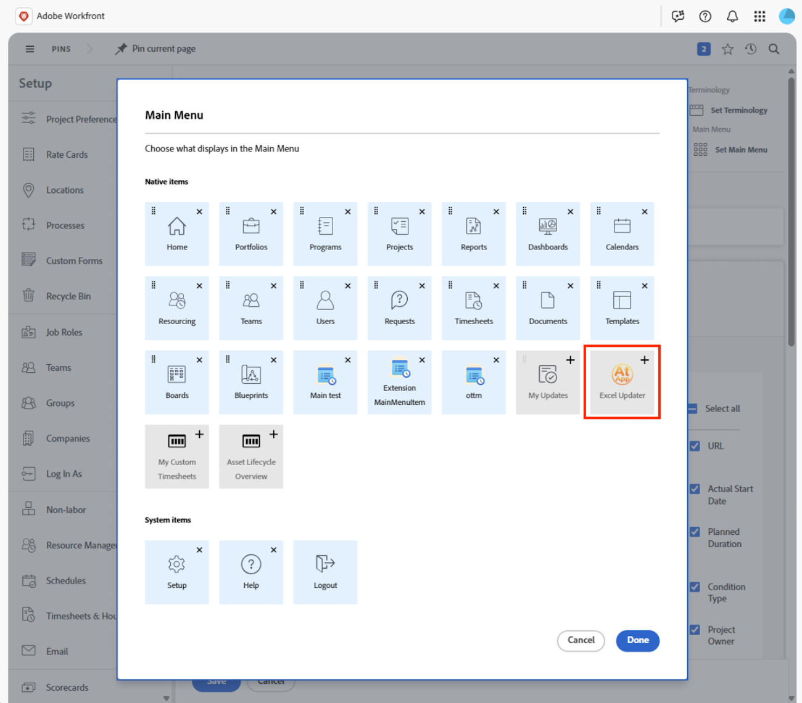

# Toepassingen ophalen en installeren vanuit Adobe Exchange

U kunt op partners gebaseerde toepassingen voor Workfront nu rechtstreeks vanuit Adobe Exchange installeren. Dit vermogen verbindt klanten met een groeiend ecosysteem van de partners van Adobe die speciaal-gebouwde hulpmiddelen leveren die productiviteit verbeteren, verrichtingen stroomlijnen, en de functionaliteit van Workfront uitbreiden. Via Adobe Exchange kunnen klanten toepassingen detecteren en installeren die naadloos in Workfront integreren met behulp van UI-extensies.

Adobe Exchange is de centrale markt voor toepassingen, extensies en integraties van derden in Adobe Experience Cloud, waaronder Adobe Workfront. Voor Workfront-klanten is het de bestemming om apps te ontdekken en installeren die de functionaliteit verbeteren, workflows stroomlijnen en integreren met externe systemen.

## Apps met Adobe-partners

Het Workfront Partner Network is een groeiend ecosysteem van technologiepartners, onafhankelijke softwareleveranciers (ISV&#39;s) die schaalbare, veilige en uitbreidbare apps maken met Adobe App Builder en Workfront UI Extensions.

Workfront-partners maken gebruik van Workfront UI Extensions, een krachtig framework waarmee toepassingen rechtstreeks in de Workfront-interface kunnen worden ingesloten. Als ze eenmaal vanuit Adobe Exchange zijn geïnstalleerd, kunnen Workfront-beheerders deze apps toevoegen aan lay-outsjablonen, zodat ze zichtbaar en toegankelijk zijn voor gebruikers in hun dagelijkse workflows. Deze naadloze integratie zorgt ervoor dat de gebruikers met partner-gebouwde hulpmiddelen-zoals dashboards, goedkeuringsstromen, of campagnecontrackers-kunnen interactie aangaan zonder het milieu van Workfront te verlaten.

### AtApp

#### Resultaten in realtime, direct in Adobe Workfront

InApp werkt samen met klanten van Adobe Workfront om dagelijkse knelpunten om te zetten in herhaalbare oplossingen met voorspelbare resultaten. De groeiende bibliotheek met oplossingen helpt nauwkeurigheid, snelheid en verantwoordingsplicht te bevorderen door live gegevens te gebruiken van waar mensen werken. InApp kunnen leiders zien wat er nu gebeurt en plannen wat er daarna moet gebeuren. Gebruikers kunnen de AtAppStore Adobe Exchange-apps bekijken die momenteel beschikbaar zijn en klaar zijn om te installeren, de apps selecteren die aan hun huidige prioriteiten voldoen en schalen wanneer hun behoeften toenemen.

* [&#x200B; Updater van Excel &#x200B;](https://exchange.adobe.com/apps/ec/abtt1rq7o9/atapp-excel-updater): De Updater van Excel biedt u een rendabele weg om gegevens in Workfront te integreren zonder het moeten API leren, code schrijven, of opstelling een server, en is ideaal voor zowel eenmalige als terugkomende gegevensladingen.

* [&#x200B; Recalc Helper &#x200B;](https://exchange.adobe.com/apps/ec/abv755903t/atapp-recalc-helper): De oplossing van de Helper van Recalc verstrekt u een snelle manier om de aangepaste vorm berekende uitdrukkingen, projectchronologie, of projectfinanciën voor alle punten gemakkelijk opnieuw te berekenen die een geselecteerd filter, recht van binnen Workfront aanpassen.

* UberTimesheet: UberTimesheet-oplossing kan de acceptatie van Workfront door uw gebruikers verbeteren en uitbreiden door het voor iedereen eenvoudig en handig te maken om de tijd van zijn browser, tablet of smartphone te volgen.

### Workfocus

WorkFocus is een Adobe Gold Solutions-partner die gespecialiseerd is in Adobe Workfront, Workfront Fusion, Workfront Planning, Firefly, AEM Assets en automatisering voor bedrijven. We helpen organisaties om automatisering op verantwoorde wijze te schalen door een Fusion Center of Excellence (FCoE) op te richten dat wordt aangedreven door onze eigen FCoE-toepassing.

#### Fusion Center of Excellence (FCoE)-toepassing

Met de toepassing WorkFocus Fusion Center of Excellence kunnen organisaties de waarde van Adobe Workfront Fusion in de hele onderneming beheren, schalen en maximaliseren.

Vele teams worstelen met gefragmenteerde scenario&#39;s van de Fusie, beperkte zichtbaarheid in automatiseringseigendom en waarde, inconsistente normen, en automatiseringswildgroei. De FCoE-toepassing lost deze uitdagingen op door een centraal systeem voor registratie voor Fusion-automatisering te bieden.

De belangrijkste mogelijkheden omvatten:

* Gecentraliseerd bestuur en eigendom van fusiescenario&#39;s
* Scenario-levenscyclusbeheer van inname via ondersteuning
* ROI en waardetracering
* Standaarden, documentatie en foutafhandeling op bedrijfsniveau
* Schaalbaar bedrijfsmodel voor bedrijfsacceptatie

Het resultaat is snellere tijd-aan-waarde, verminderd risico, en meetbare bedrijfsgevolgen van Fusion.

#### Aan de slag met WorkFocus

Het WorkFocus-team nodigt organisaties uit een aangepaste demonstratie van het Fusion Center of Excellence te plannen en een gratis proefversie van de toepassing in te stellen.

Vooruitblikkend, omvat de routekaart de release van het Workfront Core Center of Excellence en het Workfront Planning Center of Excellence in 2026. Door een klant te worden van het Fusion Center of Excellence, krijgen organisaties de kans om invloed uit te oefenen op de routekaart voor deze komende oplossingen en om de toekomst van het Workfront-bestuur van bedrijven vorm te geven.

WorkFocus is erg benieuwd hoe het als een strategische partner kan dienen in Workfront, Workfront Fusion, Workfront Planning, Firefly, AEM Assets en de end-to-end Content Supply chain.

## Vereisten en machtigingen

**Levering van App Builder**

* Klanten moeten App Builder hebben voorzien in hun Adobe Admin Console. Dit is een eerste vereiste voor het installeren van apps vanuit Adobe Exchange.

**Onderneming die Admins of Ontwikkelaars in werking stelt**

* Kan naar apps zoeken, **klikken krijgt**, en gaat met installatie te werk.

* Als app reeds door iemand in org wordt verworven, kunnen zij **beginnen Installatie** zien of **in plaats daarvan leiden**.

**niet-Admin Gebruikers**

* Kan overname starten, maar wordt gevraagd u aan te melden en er kunnen beperkingen optreden als de app beheerderstoestemming of speciale licenties vereist.

## Toepassingen ophalen en installeren vanuit Adobe Exchange

Adobe-klanten kunnen rechtstreeks vanuit de Adobe Exchange Marketplace bladeren naar apps, deze zoeken en installeren en ze gebruiken in Workfront.

Toepassingen die met Adobe App Builder worden gebouwd worden vermeld als _Toepassingen van App Builder_ op Adobe Exchange. Elke app-lijst bevat documentatie, screenshots en gebruiksinstructies om klanten te helpen de waarde van de app te begrijpen.

Als u toepassingen voor Workfront wilt weergeven, navigeert u naar Adobe Exchange en zoekt u naar Workfront-compatibele apps. U kunt ook aanbiedingen voor Workfront App Builder-apps filteren:

1. Klik op **Experience Cloud** in het linkerpaneel.
1. In het linkerpaneel, vind **Product**, dan uitgezochte **Workfront**.
1. Breid **Type van app** uit, dan kies **App Builder**.

### Toepassingen ophalen

Toepassingen moeten mogelijk worden aangeschaft bij Adobe Exchange of kunnen worden geïnstalleerd, maar hiervoor is een licentie vereist van de ontwikkelaar van de app.

Een app aanschaffen

1. Klik op de naam van de app.
1. Klik op de knop in de rechterbovenhoek van de appenlijst.
1. Klik **ja, ga** voort en keur dan de overeenkomst van de eindgebruikervergunning goed.
   

### Handelingen voor systeembeheerders

Wanneer een gebruiker app van Adobe Exchange verwerft, kunnen zij het volgende bericht zien: _Uw systeembeheerder moet uw verwerving goedkeuren alvorens u uw toepassing kunt installeren en gebruiken._

Dit betekent dat de toepassing goedkeuring op beheerdersniveau vereist voordat de installatie kan worden uitgevoerd. Systeembeheerders kunnen het verzoek vinden op de volgende locaties:

**Meldingen**

Systeembeheerders worden doorgaans per e-mail op de hoogte gesteld wanneer een gebruiker in hun organisatie een app verwerft.

**Admin Console**

Systeembeheerders kunnen zich aanmelden bij de Admin Console op [&#x200B; https://adminconsole.adobe.com/ &#x200B;](https://adminconsole.adobe.com/) en naar Producten > Toepassingsintegratie navigeren om alle opgehaalde of aangevraagde apps weer te geven.

Zodra een systeembeheerder toegang tot de verzoeken heeft, kunnen zij de toepassing herzien en goedkeuren. Sommige toepassingen vragen de beheerder mogelijk toestemming te geven voor gegevenstoegang en de app toe te wijzen aan productprofielen of specifieke gebruikers.

Nadat de app is goedgekeurd, kan deze worden geïnstalleerd.

 goed

## Toepassingen installeren

Zodra een app is aangeschaft, kan deze rechtstreeks in Workfront worden geïnstalleerd. Beheerders kunnen geïnstalleerde toepassingen beheren via de Workfront-interface, zodat ze correct zijn geconfigureerd en toegankelijk zijn voor gebruikers.

1. Zoek de toepassing die u wilt installeren en open het menu Handelingen aan de rechterkant van het scherm.
1. Klik op App-details weergeven.
1. Selecteer een omgeving links op het scherm of voeg een nieuwe omgeving toe.
1. Klik **opstellen**.
    op
1. Wijs installatie- of gebruiksrechten toe (indien vereist).

   Als uw organisatie de toegang tot toepassingen beheert via productprofielen of gebruikersgroepen, wijst u de toepassing toe aan het juiste profiel of de juiste groep zodat gebruikers door kunnen gaan met de installatie en het gebruik.

## Toevoegen aan lay-outsjabloon

Zodra opgesteld, zal partnerapp in het lay-outmalplaatje van Workfront beschikbaar zijn. U kunt de toepassing toevoegen aan primaire of secundaire navigatie voor gebruik in Workfront.

Als u de app aan de lay-outsjabloon wilt toevoegen, opent u de lay-outsjabloon en gaat u naar het hoofdmenu of het secundaire menugebied. Voeg de app toe met het pictogram Toevoegen.

## Contact opnemen met App-ondersteuning

Extensies die zijn geïnstalleerd vanuit Adobe Exchange, worden ondersteund door de eigenaars van de app. Van beheer apps, kunt u **klikken krijgt steun** om hulp met om het even welke kwesties te krijgen.
