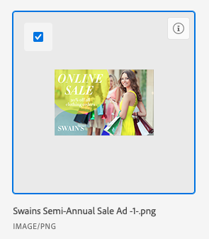

# Elementen en mappen koppelen vanuit Experience Manager Assets Essentials

U kunt een middel of een omslag van de Hoofdzaak van Experience Manager Assets aan om het even welk voorwerp van Adobe Workfront verbinden dat documenten steunt.

Om activa en omslagen van Experience Manager Assets te verbinden gebruikend de Adviseur van de Inhoud, zie [&#x200B; activa en omslagen van de Verbinding met de Adviseur van de Inhoud die door Experience Manager Assets &#x200B;](/help/quicksilver/documents/adobe-workfront-for-experience-manager-assets-essentials/link-to-aem.md) wordt aangedreven.

## Toegangsvereisten

+++ Breid uit om de toegangseisen voor de functionaliteit in dit artikel weer te geven.

<table style="table-layout:auto"> 
 <col> 
 <col> 
 <tbody> 
  <tr> 
   <td role="rowheader">Adobe Workfront-pakket</td> 
   <td> 
 Alle
 </td> 
  </tr> 
  <tr> 
   <td role="rowheader">Adobe Workfront-licenties</td> 
   <td> 
   
Medewerker of hoger
 
   
Aanvraag of hoger
 </td> 
  </tr> 
  <tr> 
   <td role="rowheader">Aanvullende producten</td> 
   <td>U moet Experience Manager as a Cloud Service of Assets Essentials hebben en u moet als gebruiker aan het product worden toegevoegd in de Admin Console.</td> 
  </tr> 
   <tr> 
    <td role="rowheader">Experience Manager-machtigingen</td> 
    <td>U moet schrijftoegang tot de map hebben.</td> 
   </tr>
  <tr> 
   <td role="rowheader">Configuraties op toegangsniveau</td> 
   <td> 
Toegang tot documenten bewerken
 </td> 
  </tr> 
  <tr> 
   <td role="rowheader">Objectmachtigingen</td> 
   <td> 
Toegang weergeven of hoger
 </td> 
  </tr> 
 </tbody> 
</table>

Voor meer detail over de informatie in deze lijst, zie [&#x200B; vereisten van de Toegang in de documentatie van Workfront &#x200B;](/help/quicksilver/administration-and-setup/add-users/access-levels-and-object-permissions/access-level-requirements-in-documentation.md).

+++

## Vereisten

Voordat u begint:

* Uw Workfront-beheerder moet een Experience Manager-integratie configureren. Voor meer informatie, zie [&#x200B; de integratie van de Hoofdzaak van Experience Manager Assets &#x200B;](/help/quicksilver/documents/adobe-workfront-for-experience-manager-assets-essentials/setup-asset-essentials.md) vormen.

## Middelen van Experience Manager Assets Essentials koppelen

1. Ga naar het **gebied van Documenten** in Workfront waar u het document wilt toevoegen.
1. Selecteer **toevoegen Nieuw**, dan selecteren de integratie van Experience Manager uw beheerderopstelling.

   >[!NOTE]
   >
   >De Workfront-beheerder kan elke naam voor deze integratie kiezen, dus Experience Manager Assets Essentials wordt niet specifiek genoemd.

1. Selecteer de gewenste elementen.

   

1. Klik **Uitgezocht**.

## Een nieuwe versie koppelen vanuit Experience Manager Assets Essentials

U kunt een nieuw element ophalen van Experience Manager Assets Essentials en het als een nieuwe versie toevoegen aan een bestaand element. Als het document al is gekoppeld en een nieuwe versie wordt toegevoegd in Experience Manager Assets Essentials, wordt de nieuwe versie automatisch weergegeven in Workfront.

Een nieuwe versie koppelen:

1. Ga naar het **gebied van Documenten** in Workfront waar u het document wilt toevoegen.
1. Selecteer het element dat u wilt vervangen door een nieuwe versie. U kunt geen nieuwe versie van een middel in een verbonden omslag tot stand brengen.
1. Selecteer **Nieuwe** toevoegen > **Versie**, dan de integratie van Experience Manager uw beheerderopstelling selecteren.

   >[!NOTE]
   >
   >De Workfront-beheerder kan elke naam voor deze integratie kiezen, dus Experience Manager Assets Essentials wordt er mogelijk niet specifiek door genoemd.

1. Selecteer het element dat u wilt koppelen.

1. Klik **Uitgezocht**.

## Een map koppelen vanuit Experience Manager Assets Essentials

Machtigingen om afzonderlijke elementen in een map weer te geven, zijn afhankelijk van Experience Manager Assets Essentials-machtigingen.

1. Ga naar het **gebied van Documenten** in Workfront waar u de omslag wilt.
1. Selecteer **toevoegen Nieuw**, dan selecteren de integratie van Experience Manager uw beheerderopstelling.

   >[!NOTE]
   >
   >De Workfront-beheerder kan elke naam voor deze integratie kiezen, dus Experience Manager Assets Essentials wordt er mogelijk niet specifiek door genoemd.

1. Selecteer de gewenste mappen.

   

1. Klik **Uitgezocht**.

## Overwegingen

* De functionaliteit van de Adviseur van de inhoud is niet beschikbaar voor de Hoofdzaak van Activa. Om activa en omslagen te verbinden die de Adviseur van de Inhoud gebruiken, zie [&#x200B; activa en omslagen van de Verbinding met de Adviseur van de Inhoud die door Experience Manager Assets &#x200B;](/help/quicksilver/documents/adobe-workfront-for-experience-manager-assets-essentials/link-to-aem.md) wordt aangedreven.

* Assets die vanuit Assets Essentials wordt verzonden, telt niet mee voor uw totale documentopslag in Workfront. Documenten die van Workfront naar Assets Essentials zijn geüpload en verzonden, tellen wel mee voor de totale opslag.

* Metagegevensvelden worden eerst toegewezen wanneer u middelen verzendt van Workfront naar Experience Manager Assets Essentials. Als uw Workfront-beheerder heeft ingesteld dat objectmetagegevenssynchronisatie is ingeschakeld, blijven de velden up-to-date als deze in een van beide toepassingen zijn gewijzigd.
