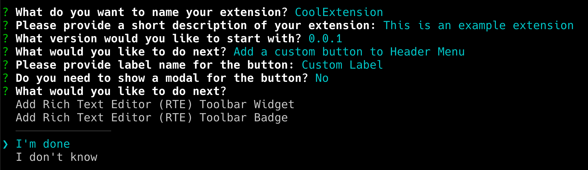

# AppBuilder in Workfront-documentgegevens

U kunt AppBuilder installeren via Documentdetails.

## Vereisten

U moet het volgende hebben:

* Een Workfront-account voor IMS
* Een dev-machine met knooppunt v18 en npm

## Ontwikkelaars toevoegen aan de beheerconsole

>[!IMPORTANT]
>
>Controleer of u de juiste IMS-organisatie hebt geselecteerd voor alle volgende stappen. Als u tot veelvoudige organisaties behoort, is het mogelijk om verkeerde te selecteren. Let erop dat u onder de juiste organisatie werkt. Deze wordt meestal in de rechterbovenhoek weergegeven.


1. Navigeer naar een van de volgende opties:

* Werkgebied: [https://stage.adminconsole.adobe.com/](https://stage.adminconsole.adobe.com/)
* Prod: [https://adminconsole.adobe.com/](https://adminconsole.adobe.com/)

1. Klik in de sectie Gebruikers op **Ontwikkelaars** > **Ontwikkelaars toevoegen**.

   

   >[!NOTE]
   >
   >Als u geen optie ziet om Ontwikkelaars te beheren, hebt u geen product dat voor ontwikkelaars toegang toestaat. Workfront biedt ontwikkelaars geen toegang, maar AEM wel. Als u dit niet ziet, moeten we erachter komen hoe we Workfront kunnen opnemen in de lijst met toepassingen die ontwikkelaars toestaat.

1. Voeg de e-mail van de gebruiker toe. Het zou bestaande gebruikers moeten zoeken die reeds van binnen de admin console zijn toegevoegd.

1. Voeg de benodigde producten toe aan het ontwikkelaarsprofiel en klik op **Opslaan**.


## Toegang tot AppBuilder verkrijgen

Organisaties moeten met hun accountmanagers samenwerken om AppBuilder te kunnen aanschaffen. Het exacte proces hiervoor is niet begrepen omdat we dit niet hoefden te doen voor de concepttest.

Als u de integratie met AppBuilder wilt testen, kunt u hier een gratis proefversie aanvragen voor IMS org:
[https://developer.adobe.com/app-builder/trial/#](https://developer.adobe.com/app-builder/trial/#)

Ik heb de indruk dat hoewel het een gratis 30-daagse rechtszaak is, ze het proces na die tijd niet echt zullen deactiveren.

Als AppBuilder behoorlijk wordt gevormd, zou u &quot;project van malplaatje&quot;als deel van het creëren van een nieuw project moeten zien (dat in de volgende sectie wordt behandeld).

## Een nieuw project maken in de Dev Console

1. Klikken **Project maken van sjabloon**.

   >[!IMPORTANT]
   >
   >Als deze optie niet wordt weergegeven, is de configuratie in de beheerconsole onjuist en hebt u geen toegang tot de catalogus van de App Builder. Deze optie wordt alleen weergegeven wanneer u toegang hebt tot AppBuilder.

   

1. Selecteren **App Builder**.

1. Voer een **Projecttitel** en **Toepassingsnaam**. Beide hebben gebreken, maar het zal gemakkelijker zijn om het Project te identificeren u later wilt als u de waarde aanpast.

   >[!NOTE]
   >
   >Er is een optie om extra werkruimten aan deze stap toe te voegen. Er werd ons voorgesteld een werkruimte te creëren voor elke ontwikkelaar. Dit houdt geheimen en plaatsingen gescheiden van elkaar aangezien devs werken. Geef de werkruimte een naam met de naam van de ontwikkelaar die de werkruimte gebruikt. De AIO-clip heeft opties voor het schakelen tussen de werkruimte, die we later zullen behandelen.


1. Verlaten **Inclusief runtime** geselecteerd.

1. Klikken **Opslaan**.

## Adobe IO (aio) CLI

Adobe verstrekt open bron CLI die kan worden gebruikt helpen de toepassingen van de Bouwer van de App tot stand brengen. Documentatie is hier te vinden: [https://github.com/adobe/aio-cli](https://github.com/adobe/aio-cli) en Adobe App Builder-instructies [https://developer.adobe.com/app-builder/docs/getting_started/first_app/](https://developer.adobe.com/app-builder/docs/getting_started/first_app/).

1. Installatie
   1. Als u het hulpprogramma wilt installeren, voert u het volgende uit (zorg dat u zich eerst op knooppunt v18 bevindt): `npm install -g @adobe/aio-cli `.

1. Verifiëren in terminal
   1. Start de terminal en meld u aan bij AIO met de opdracht: `aio login`.

1. Uw toepassing initialiseren
   1. Start het instellen van uw app door: `aio app init example-app`.

1. Configuratieselectie
   1. Ga door om uw Organisatie en Project van de verstrekte opties te selecteren.\
      
      

1. Sjabloonselectie en -instellingen
   1. Blader door alle beschikbare sjablonen en kies de **@adobe/aem-cf-editor-ui-ext-tpl** sjabloon voor uw project.
      
      

1. Uw extensie definiëren
   1. Geef de extensie een naam.
   1. Geef een beschrijvend overzicht van de functionaliteit van uw extensie.
   1. Selecteer een eerste versienummer waarmee u wilt beginnen.
   1. Bevestig voltooiing door te selecteren **Ik ben klaar**.
      

1. Ga naar uw projectmap
   1. De map src openen
   1. Naam van map wijzigen `aem-cf-editor-1` tot `workfront-doc-details-1`.

1. Configuratiebestanden wijzigen
   1. App.config.yaml openen
   1. De regel bijwerken vanuit `aem/cf-editor/1` tot `workfront/doc-details/1`.
   1. Het include-pad aanpassen vanuit `src/aem-cf-editor-1/ext.config.yaml` tot `src/workfront-doc-details-1/ext.config.yaml`.

1. De Extension Registration Component bewerken
   1. Open `src/workfront-doc-details-1/web-src/src/components/ExtensionRegistration.js`.
   1. Voeg in de sectie Methoden een functie toe `secondaryNav` die een asynchrone functie bevat `getButtons`.
   1. `getButtons` ontvangen een object met de volgende structuur:

      ```
          {
          docId: "String",  // Document ID
          docvId: "String", // Document version ID
          sharedContext: {
              hostname: "String",
              protocol: "String",
              auth: {
              imsOrgID: "String",    // Customer's IMS Org ID
              imsToken: "String",    // User's IMS token
              imsClientId: "String"
              }
          }
          }
      ```

1. Deze functie retourneert een array met knopobjecten die in de navigatie worden weergegeven:

   ```
       methods: {
       secondaryNav: {
           async getButtons({docId, docvId, sharedContext}) {
           return [
               { label: 'Registration', url: '/index.html' },
               { label: 'Review', url: '/index.html#review' }
           ];
           }
       }
       }
   ```

1. Toepassingsroutering configureren
   1. Open uw dossier App.js en vorm de routes om de onlangs ontwikkelde functionaliteit te omvatten. U zult aan opstellingsroutes voor de standaardmening en om het even welke extra meningen zoals de overzichtspagina moeten. Hier is hoe u deze routes zou kunnen bepalen:

      ```
          <Route index element={<ExtensionRegistration />} />
          <Route exact path="index.html" element={<ExtensionRegistration />} />
          <Route exact path="review" element={<Review />} />
      ```

1. Documentgegevens openen
   1. Voer de verstrekte functie uit `document.getDocumentDetails` in uw toepassing om essentiële documentspecificaties op te halen. Deze functie haalt een object op dat `docId` en `docvId`, naast een `sharedContext` object met `hostname`, `protocol`en verificatiegegevens. Zorg ervoor dat de toepassing deze gegevens op de juiste wijze verwerkt.

1. Gegevens ophalen in uw componenten integreren
   1. Voeg een nieuwe component aan de componentenomslag van uw toepassing toe. Stel binnen deze component een verbinding met Workfront tot stand om documentgegevens en verificatiegegevens op te halen via de verbinding die met de hosttoepassing is gemaakt. Hier is een voorbeeld van hoe u uw component kunt structureren om dit te behandelen:

      ```
          import { useEffect, useState } from 'react';
          import { attach } from "@adobe/uix-guest";
          import { extensionId } from "./Constants";
      
          function Review() {
              const [conn, setConn] = useState();
      
              useEffect(() => {
              const iife = async () => {
                  // "attach" the guest application to the host. This creates a "tunnel" from the host app that allows data to be passed to the iframe running this app.
                  const connection = await attach({
                  id: extensionId,
                  });
                  setConn(connection);
              };
      
              iife();
              }, []);
      
              useEffect(() => {
                  if (conn) {
                      // Using the connection created above, grab the document details from the host tunnel.
                      conn?.host?.document?.getDocumentDetails().then(setDocDetails);
                      // Pull the auth tokens from the sharedContext (see host app for details)
                      setAuth(conn?.sharedContext?.get("auth"));
                      setHostname(conn?.sharedContext?.get("hostname"));
                      setProtocol(conn?.sharedContext?.get("protocol"));
                  }
              }, [conn]);
      
          return (<>Text</>);
          }
      
          export default Review;
      ```

## Configuratie voor bestaande AIO-projecten

1. Configuratiebestanden bijwerken
   1. Open `app.config.yaml`.
   1. Wijzig de configuratie door de verwijzing van bij te werken `aem/cf-editor/1` tot `workfront/doc-details/1`. Met deze aanpassing worden de bestandspaden uitgelijnd op de huidige projectstructuur.

1. De Extension Registration Component herzien
   1. Zoek en open het bestand met de naam `ExtensionRegistration.js`.
   1. Voeg in de sectie Methoden een functie toe `secondaryNav` die een asynchrone functie bevat `getButtons`.
   1. `getButtons` ontvangen een object met de volgende structuur:

      ```
          {
          docId: "String",  // Document ID
          docvId: "String", // Document version ID
          sharedContext: {
              hostname: "String",
              protocol: "String",
              auth: {
              imsOrgID: "String",    // Customer's IMS Org ID
              imsToken: "String",    // User's IMS token
              imsClientId: "String"
              }
          }
          }
      ```

1. Deze functie retourneert een array met knopobjecten die in de navigatie worden weergegeven:

   ```
       methods: {
       secondaryNav: {
           async getButtons({docId, docvId, sharedContext}) {
           return [
               { label: 'Registration', url: '/index.html' },
               { label: 'Review', url: '/index.html#review' }
           ];
           }
       }
       }
   ```

1. Toepassingsroutering configureren
   1. Open uw `App.js`en vorm de routes om de onlangs ontwikkelde functionaliteit te omvatten. U zult aan opstellingsroutes voor de standaardmening en om het even welke extra meningen zoals de overzichtspagina moeten. Hier is hoe u deze routes zou kunnen bepalen:

      ```
          <Route index element={<ExtensionRegistration />} />
          <Route exact path="index.html" element={<ExtensionRegistration />} />
          <Route exact path="review" element={<Review />} />
      ```

1. Documentgegevens openen
   1. Voer de verstrekte functie uit `document.getDocumentDetails` in uw toepassing om essentiële documentspecificaties op te halen. Deze functie haalt een object op dat `docId` en `docvId`, naast een `sharedContext` object met `hostname`, `protocol`en verificatiegegevens. Zorg ervoor dat de toepassing deze gegevens op de juiste wijze verwerkt.

1. Gegevens ophalen in uw componenten integreren
   1. Voeg een nieuwe component aan de componentenomslag van uw toepassing toe. Stel binnen deze component een verbinding met Workfront tot stand om documentgegevens en verificatiegegevens op te halen via de verbinding die met de hosttoepassing is gemaakt. Hier is een voorbeeld van hoe u uw component kunt structureren om dit te behandelen:

      ```
          import { useEffect, useState } from 'react';
          import { attach } from "@adobe/uix-guest";
          import { extensionId } from "./Constants";
      
          function Review() {
              const [conn, setConn] = useState();
      
              useEffect(() => {
              const iife = async () => {
                  // "attach" the guest application to the host. This creates a "tunnel" from the host app that allows data to be passed to the iframe running this app.
                  const connection = await attach({
                  id: extensionId,
                  });
                  setConn(connection);
              };
      
              iife();
              }, []);
      
              useEffect(() => {
                  if (conn) {
                      // Using the connection created above, grab the document details from the host tunnel.
                      conn?.host?.document?.getDocumentDetails().then(setDocDetails);
                      // Pull the auth tokens from the sharedContext (see host app for details)
                      setAuth(conn?.sharedContext?.get("auth"));
                      setHostname(conn?.sharedContext?.get("hostname"));
                      setProtocol(conn?.sharedContext?.get("protocol"));
                  }
              }, [conn]);
      
          return (<>Text</>);
          }
      
          export default Review;
      ```

## Toepassingen publiceren

>[!IMPORTANT]
>
>Zorg ervoor dat u de juiste IMS org voor elk van de volgende stappen hebt geselecteerd.

Als een gasttoepassing in Workfront moet worden geladen, moet de toepassing naar de productiewerkruimte worden geduwd en ter goedkeuring worden ingediend.

1. De toepassing implementeren in de werkruimte Productie
   1. `aio app use -w Production `
   1. `aio app deploy `

1. Navigeren naar [https://developer-stage.adobe.com/](https://developer-stage.adobe.com/) of [https://developer.adobe.com/](https://developer.adobe.com/).
   1. Klikken **Console** in de rechterbovenhoek

1. Vind het project dat u gebruikte om de toepassing te creëren AppBuilder.

1. Selecteer de productiewerkruimte.
   

1. Verzend de toepassing voor privérevisie (u krijgt waarschuwingen die we niet publiceren naar de marketplace van de app-uitwisseling, wat prima is).

1. Vul het formulier in (titel, beschrijving, pictogram en opmerking voor de controleur).
   

>[!IMPORTANT]
>
>Na indiening moet een systeembeheerder voor de organisatie de indiening goedkeuren.

## De verzending goedkeuren

1. Als systeembeheerder navigeert u naar [https://stage.exchange.adobe.com/](https://stage.exchange.adobe.com/) of [https://exchange.adobe.com/](https://exchange.adobe.com/).

1. Klikken **Beheren** > **Experiencen Cloud**. De verzonden toepassingen worden weergegeven met opties voor goedkeuren/afwijzen.
Nadat de gepubliceerde toepassingsextensies zijn goedgekeurd, worden deze automatisch in uw Workfront-omgeving geladen.

   

## Aanvullende Help

Adobe heeft geweldige documentatie over hoe u apps voor AppBuilder kunt gaan ontwikkelen en hoe u deze kunt implementeren.

Hier volgen enkele handige koppelingen:

* [https://developer.adobe.com/app-builder/docs/getting_started/first_app/#4-bootstrapping-new-app-using-the-cli](https://developer.adobe.com/app-builder/docs/getting_started/first_app/#4-bootstrapping-new-app-using-the-cli)

* [https://developer.adobe.com/uix/docs/guides/publication/](https://developer.adobe.com/uix/docs/guides/publication/)

* [https://developer.adobe.com/uix/docs/services/aem-cf-console-admin/extension-development/](https://developer.adobe.com/uix/docs/services/aem-cf-console-admin/extension-development/)

## Lokale ontwikkeling

Wanneer u uw App Builder-toepassing voor Workfront ontwikkelt, is het mogelijk dat u uw app in Workfront moet testen zonder deze te publiceren. Gelukkig hebben we daarvoor een oplossing.

In uw app App Builder kunt u `aio app run` voor lokale ontwikkeling. Hiermee krijgt u een URL, meestal iets als `https://localhost:9080`. U kunt ook uitvoeren `aio app deploy` om een statisch domein van de Adobe te verkrijgen. Noteer deze URL&#39;s voor toekomstig gebruik.

Navigeer vervolgens naar de specifieke pagina met documentdetails die u wilt ontwikkelen in uw browser. Open de tools voor ontwikkelaars en open de Local Storage voor workfront.com of workfront.adobe.com. Hier, moet u een ingang toevoegen. Gebruiken `appBuilderDocDetailsOverride` als de sleutel en de eerder vermelde URL van de App Builder als de waarde.

Wanneer u de pagina opnieuw laadt, ziet u dat de knoppen uit de toepassing App Builder worden weergegeven. Als u op deze knoppen klikt, kunt u uw app in actie bekijken.