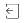

# Documenten controleren

U kunt een document uitchecken om te voorkomen dat andere gebruikers het document verwijderen of een nieuwe versie ervan uploaden. Slechts één gebruiker kan een document tegelijk uitchecken. U kunt elk document dat naar Adobe Workfront is geüpload, uitchecken en documenten die zijn gekoppeld aan externe documentproviders (Box, Dropbox, Google Drive, Webdam, Workfront DAM, SharePoint of een andere aangepaste provider). 

## Toegangsvereisten

+++ Breid uit om de toegangseisen voor de functionaliteit in dit artikel weer te geven.

<table style="table-layout:auto"> 
 <col> 
 <col> 
 <tbody> 
  <tr> 
   <td role="rowheader">Adobe Workfront-pakket</td> 
   <td> 
Alle
 </td> 
  </tr> 
  <tr> 
   <td role="rowheader">Adobe Workfront-licentie</td> 
   <td> 
   
Medewerker of hoger

   
Controleren of hoger
 </td> 
  </tr> 
  <tr> 
   <td role="rowheader">Configuraties op toegangsniveau</td> 
   <td> 
Toegang tot documenten bewerken
</td> 
  </tr> 
  <tr> 
   <td role="rowheader">Objectmachtigingen</td> 
   <td> 
Toegang tot het document beheren
 </td> 
  </tr> 
 </tbody> 
</table>

Voor meer detail over de informatie in deze lijst, zie [&#x200B; vereisten van de Toegang in de documentatie van Workfront &#x200B;](/help/quicksilver/administration-and-setup/add-users/access-levels-and-object-permissions/access-level-requirements-in-documentation.md).

+++

## Handelingen die zijn toegestaan voor uitgecheckte documenten

Gebruikers met beheerde toegang tot het document kunnen het volgende doen:

* Het document bewerken (documentnaam, beschrijving, aangepaste gegevens)
* Het document verplaatsen
* Het document delen
* Voorbeeld van het document bekijken
* Het document downloaden

  >[!TIP]
  >
  > Hoewel een gebruiker een document kan downloaden wanneer het door een andere gebruiker is uitgecheckt, raden we gebruikers aan te wachten totdat het document opnieuw is ingecheckt voordat het wordt gedownload. Wanneer een document is uitgecheckt, geeft dit vaak aan dat er nog werk wordt verricht in het document. Als u wacht tot een document weer is ingecheckt om het te downloaden, zorgt u ervoor dat de gebruiker de meest recente versie heeft.

* Goedkeuren of een goedkeuring op het document toepassen.
* Het document controleren in de proefdrukviewer

  Voor meer informatie over het proef, zie [&#x200B; het Bewijzen &#x200B;](../../review-and-approve-work/proofing/proofing.md)

## Een document uitchecken

Als u beheerdersmachtigingen voor een document hebt, kunt u het uitchecken om bepaalde handelingen in het document te verbieden. 

1. Ga naar het gebied waar het document is opgeslagen en selecteer het document. 

   Voor informatie over het toevoegen van documenten, zie [&#x200B; documenten aan Adobe Workfront van uw dossiersysteem &#x200B;](../../documents/adding-documents-to-workfront/add-documents-from-file-system.md) toevoegen.

1. Klik het **pictogram van de Controle uit** pictogram .

1. Een slotpictogram  toont rechts van de documentnaam. Het document blijft uitgecheckt nadat u zich hebt afgemeld bij Workfront.
1. Alleen de gebruiker die het document heeft uitgecheckt of de Workfront-beheerder kan het document inchecken.

## Uitgecheckte documenten beheren

Overweeg het volgende over uitgecheckte documenten:

* Voordat u een object kunt verwijderen waar een uitgecheckt document is opgeslagen, moet u het document eerst weer inchecken. 
* Als de Workfront-beheerder een gebruiker verwijdert die een document heeft uitgecheckt dat hij of zij niet bezat, wordt het document automatisch door Workfront ingecheckt.
* Als de Workfront-beheerder een gebruiker verwijdert die een document dat hij of zij heeft uitgecheckt en het document op een object wordt geüpload, blijft het document uitgecheckt. Alleen een Workfront-beheerder kan deze weer inchecken.
* Als de Workfront-beheerder een gebruiker verwijdert die een document dat hij of zij heeft uitgecheckt en het document alleen wordt geüpload in het gebied Documenten (niet in een object), wordt het document met de gebruiker verwijderd.

  Voor informatie over het schrappen van gebruikers, zie [&#x200B; gebruikers van de Schrapping &#x200B;](../../administration-and-setup/add-users/create-and-manage-users/delete-a-user.md).

* Als de Workfront-beheerder een gebruiker deactiveert, blijven alle uitgecheckte documenten uitgecheckt. Alleen een Workfront-beheerder kan ze weer inchecken. 

## Een document inchecken

U moet een document opnieuw inchecken voordat u een nieuwe versie kunt uploaden of verwijderen. 

Een document inchecken:

1. Ga naar het gebied waar het document is opgeslagen en selecteer het document. 

   Een slotpictogram  toont rechts van de documentnaam.

1. Klik het **pictogram van de Controle binnen** .
