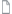

# Het gebied Documenten

In het gebied Documenten kunt u metagegevens voor naar Adobe Workfront geüploade documenten ordenen, beheren en weergeven. U kunt ook de bewijsbeslissing zien.

Er zijn twee typen documentgebieden. De eigenschappen en de functionaliteit zijn het zelfde voor beide:

* **documenteert gebied in een programma, een portefeuille, een project, een taak, of een kwestie:** maakt een lijst van alle documenten die u toegang tot voor een bepaald project, een taak, of een kwestie hebt. Om tot dit gebied toegang te hebben, klik **Documenten  in het linkerpaneel terwijl het bekijken van een project, een taak, of een kwestie.**

* **Globaal gebied van Documenten:** maakt een lijst van alle documenten die u toegang tot in Workfront hebt. Om tot dit gebied toegang te hebben, klik **Documenten  in het Belangrijkste pictogram van het Menu .**

Voor informatie over het uploaden van documenten aan Workfront, zie [ documenten aan Adobe Workfront van uw dossiersysteem ](../../documents/adding-documents-to-workfront/add-documents-from-file-system.md) toevoegen.

In het documentgebied wordt een aantal van de volgende items vastgelegd:

* Workfront-mappen
* Bestanden geüpload vanaf het bestandssysteem
* Bestanden die via integratie aan Workfront zijn toegevoegd
* Gekoppelde Experience Manager Assets

## Het deelvenster Samenvatting

Wanneer u een document selecteert in het documentgebied, kunt u de Samenvatting op het recht gebruiken om documentdetails te bekijken, documentupdates en goedkeuringen te beheren, versies van het document te bekijken, en Aangepaste Forms voor het document toe te voegen en uit te geven.

Als proefdrukken is ingesteld voor het document, bevat de sectie Details informatie zoals de proefdrukdatum en de huidige proefdrukvoortgang.

U kunt op de kop Details klikken om naar het volledige gebied Documentdetails te gaan wanneer u alle informatie over een document nodig hebt.

Voor informatie over de Samenvatting, zie [ Samenvatting voor documentoverzicht ](../../documents/managing-documents/summary-for-documents.md).

## Bewijs van beslissing

Zodra een bewijskrachtbesluit is genomen, verschijnt het in de lijst van het Document.

## Mappen

Voor een project, een taak, of een kwestie waar de documenten worden geupload, kunt u opstellingsomslagen om de documenten te organiseren. Voor meer informatie, zie [ documentomslagen ](../../documents/organizing-documents/create-documents-folder.md) creëren.

In het gebied van globale Documenten, kunt u opstelling twee types van omslagen om de documenten te organiseren u toegang hebt tot:

* **Slimme Omslagen:** toon slechts de documenten die u wilt zien. Voor meer informatie, zie [ Slimme Omslagen ](../../documents/organizing-documents/create-manage-smart-folders.md) creëren en beheren.

* **Mijn Omslagen:** organiseer documenten de manier u hen wilt. Voor meer informatie, zie [ documentomslagen ](../../documents/organizing-documents/create-documents-folder.md) creëren.

## Uitgebreide documentdetails

De pagina Documentdetails bevat een uitgebreidere versie van Documentdetails in het overzicht aan de rechterkant.
