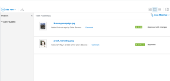

# Het gebied Documenten

In het gebied Documenten kunt u metagegevens voor naar Adobe Workfront geüploade documenten ordenen, beheren en weergeven. U kunt ook de bewijsbeslissing zien.

Workfront heeft momenteel twee versies van het gebied Documenten: het gebied met oudere documenten en het gebied met nieuwe documenten. De versie die uw organisatie gebruikt, hangt af van het feit of uw organisatie op verouderde Workfront-opslag of bedrijfsopslag werkt. Voor meer informatie over deze opslagtypes, zie [&#x200B; overzicht van de ondernemingsopslag van Adobe &#x200B;](/help/quicksilver/review-and-approve-work/esm-overview.md).

## Gebied met verouderde documenten

Er zijn twee typen documentgebieden. De eigenschappen en de functionaliteit zijn het zelfde voor beide:

* **documenteert gebied in een programma, een portefeuille, een project, een taak, of een kwestie:** maakt een lijst van alle documenten die u toegang tot voor een bepaald project, een taak, of een kwestie hebt. Om tot dit gebied toegang te hebben, klik **Documenten** pictogram van Documenten 

* **Globaal gebied van Documenten:** maakt een lijst van alle documenten die u toegang tot in Workfront hebt. Om tot dit gebied toegang te hebben, klik **Documenten** pictogram van Documenten  Belangrijkste 

Voor informatie over het uploaden van documenten aan Workfront, zie [&#x200B; documenten aan Adobe Workfront van uw dossiersysteem &#x200B;](../../documents/adding-documents-to-workfront/add-documents-from-file-system.md) toevoegen.

In het documentgebied wordt een aantal van de volgende items vastgelegd:

* Workfront-mappen
* Bestanden geüpload vanaf het bestandssysteem
* Bestanden die via integratie aan Workfront zijn toegevoegd
* Gekoppelde Experience Manager Assets

### Het deelvenster Samenvatting

Wanneer u een document selecteert in het documentgebied, kunt u de Samenvatting op het recht gebruiken om documentdetails te bekijken, documentupdates en goedkeuringen te beheren, versies van het document te bekijken, en Aangepaste Forms voor het document toe te voegen en uit te geven.

Als proefdrukken is ingesteld voor het document, bevat de sectie Details informatie zoals de proefdrukdatum en de huidige proefdrukvoortgang.

U kunt op de kop Details klikken om naar het volledige gebied Documentdetails te gaan wanneer u alle informatie over een document nodig hebt.

Voor informatie over de Samenvatting, zie [&#x200B; Samenvatting voor documentoverzicht &#x200B;](../../documents/managing-documents/summary-for-documents.md).

### Bewijs van beslissing

Zodra een bewijskrachtbesluit is genomen, verschijnt het in de lijst van het Document.

### Mappen

Voor een project, een taak, of een kwestie waar de documenten worden geupload, kunt u opstellingsomslagen om de documenten te organiseren. Voor meer informatie, zie [&#x200B; documentomslagen &#x200B;](../../documents/organizing-documents/create-documents-folder.md) creëren.

In het gebied van globale Documenten, kunt u opstelling twee types van omslagen om de documenten te organiseren u toegang hebt tot:

* **Slimme Omslagen:** toon slechts de documenten die u wilt zien. Voor meer informatie, zie [&#x200B; Slimme Omslagen &#x200B;](../../documents/organizing-documents/create-manage-smart-folders.md) creëren en beheren.

* **Mijn Omslagen:** organiseer documenten de manier u hen wilt. Voor meer informatie, zie [&#x200B; documentomslagen &#x200B;](../../documents/organizing-documents/create-documents-folder.md) creëren.

### Uitgebreide documentdetails

De pagina Documentdetails bevat een uitgebreidere versie van Documentdetails in het overzicht aan de rechterkant.

## Nieuw documentgebied

>[!NOTE]
>
>Het gebied met algemene documenten is niet beschikbaar in de nieuwe ervaring in het documentgebied. U hebt alleen toegang tot documenten vanuit programma&#39;s, portfolio&#39;s, projecten, taken of uitgaven.

### Het deelvenster Samenvatting gebruiken

Wanneer u een document selecteert in het documentgebied, kunt u het deelvenster Samenvatting aan de rechterkant gebruiken om details over het document weer te geven, aangepaste formulieren toe te voegen en te bewerken, goedkeuringswerkstromen te maken en te beheren, versies van het document weer te geven en meer.

#### Reviseren en goedkeuren met Frame.io

U kunt documenten in het nieuwe documentengebied bekijken en goedkeuren gebruikend de kijker Frame.io.

Voor meer informatie, zie [&#x200B; begonnen worden met de integratie Frame.io &#x200B;](/help/quicksilver/review-and-approve-work/native-integrations/frame-io/get-started-with-frame-integration.md).

#### Versies beheren

U kunt nieuwe versies van een document uploaden in het nieuwe documentengebied. Wanneer u een nieuwe versie uploadt, blijft de vorige versie behouden en kunt u deze openen vanuit het deelvenster Samenvatting. Versies krijgen automatisch een naam met de datum en tijd van het uploaden, maar kunnen zo nodig een andere naam krijgen.

U kunt ook een nieuwe goedkeuringswerkstroom starten voor een specifieke versie van een document.

#### Documentgeschiedenis weergeven

U kunt de geschiedenis van een document weergeven in het nieuwe documentgebied. De geschiedenis bevat de volgende soorten informatie:

* Wanneer het document is geüpload
* Wanneer nieuwe versies zijn geüpload
* Wanneer goedkeuringswerkstromen voor het document zijn uitgeschakeld
* En meer

### Mappen op systeemniveau voor documentmachtigingen

Workfront maakt automatisch een systeemmap wanneer het eerste document naar een taak of uitgave wordt geüpload. Deze omslagen erven toestemmingen van de taak of de kwestie en zijn zichtbaar in het project-vlakke documentengebied. Alle documenten die naar die taak of uitgave zijn geüpload, worden in die map opgeslagen en nemen er rechten van over. Dit is de primaire manier waarop machtigingen worden beheerd voor documenten in het nieuwe documentengebied. Voor meer informatie, zie {de toestemmingen van 0} Objecten en overzicht van het toegangsniveau voor het model van de ondernemingsopslag van Adobe [.](/help/quicksilver/review-and-approve-work/esm-access-permissions.md#how-document-permissions-work)