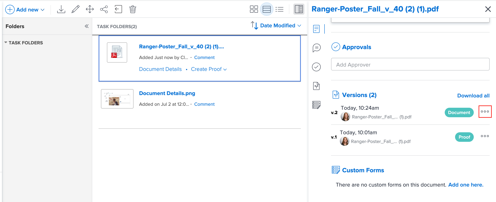

# Documentversies beheren

<!-- Audited: 5/2025 -->

U kunt meerdere versies van een document beheren in Workfront.

## Toegangsvereisten

+++ Breid uit om de toegangseisen voor de functionaliteit in dit artikel weer te geven.

<table style="table-layout:auto"> 
 <col> 
 <col> 
 <tbody> 
  <tr> 
   <td role="rowheader">Adobe Workfront-pakket</td> 
   <td> 
 Alle
 </td> 
  </tr> 
  <tr> 
   <td role="rowheader">Adobe Workfront-licenties</td> 
   <td> 
   
Medewerker of hoger

   
Aanvraag of hoger 

   </td> 
  </tr> 
  <tr> 
   <td role="rowheader">Configuraties op toegangsniveau</td> 
   <td> 
Toegang tot documenten weergeven
 </td> 
  </tr> 
  <tr> 
   <td role="rowheader">Objectmachtigingen</td> 
   <td> 
Toegang tot het document weergeven
</td> 
  </tr> 
 </tbody> 
</table>

Voor meer detail over de informatie in deze lijst, zie [&#x200B; vereisten van de Toegang in de documentatie van Workfront &#x200B;](/help/quicksilver/administration-and-setup/add-users/access-levels-and-object-permissions/access-level-requirements-in-documentation.md).

+++

## Vereisten

* In dit artikel wordt ervan uitgegaan dat het document meerdere versies heeft.

  Als u informatie over het uploaden van nieuwe versies van een document aan Workfront nodig hebt, zie [&#x200B; een nieuwe versie van een document &#x200B;](../../documents/managing-documents/upload-new-document-version.md) uploaden.

## Een lijst met alle versies van een document weergeven

{{step1-to-documents}}

1. Voor de **pagina van Documenten**, selecteer een document in de lijst.

1. In de hoger-juiste hoek van de pagina, klik het **Open Samenvatting** pictogram . Het **Samenvatting van het Document** zijpaneel opent.

1. De rol neer aan de **sectie van Versies** om alle documentversies te bekijken.

## Details voor een vorige documentversie weergeven en beheren

{{step1-to-documents}}

1. Beweeg over het document, dan klik **Details van het Document**.

1. Boven aan de **pagina van de Details van het Document**, klik het drop-down menu naast de naam, dan klik de naam van de versie u wilt bekijken en leiden.

   

   Samen met het bekijken van de details van de versie, kunt u veranderingen in de versie, zoals zijn naam, meta-gegevens, en het proef montages (als het een documentproef is) aanbrengen.

## Eén documentversie downloaden

{{step1-to-documents}}

1. Voor de **pagina van Documenten**, selecteer een document in de lijst.

1. In de hoger-juiste hoek van de pagina, klik het **Open Samenvatting** pictogram . Het **Samenvatting van het Document** zijpaneel opent.

1. In de **sectie van Versies**, klik de **Meer** menu  aan het recht van de versie, dan klik **Download** in de drop-down lijst die verschijnt.

   

## Alle versies van een document downloaden

{{step1-to-documents}}

1. Voor de **pagina van Documenten**, selecteer een document in de lijst.

1. In de hoger-juiste hoek van de pagina, klik het **Open Samenvatting** pictogram . Het **Samenvatting van het Document** zijpaneel opent.

1. De rol neer aan de **sectie van Versies** en klikt dan **allen van de Download**.

## Een documentversie verwijderen

Als u per ongeluk een versie van een document uploadt, of als een versie niet meer nodig is, kunt u de versie verwijderen en het originele document onderhouden.

>[!IMPORTANT]
>
>U kunt een documentversie die u afzonderlijk verwijdert, niet herstellen.

Houd rekening met het volgende wanneer u een documentversie verwijdert:

* Er kan slechts één versie tegelijk worden verwijderd. Als een versie wordt geschrapt, verschijnt deze actie in de sectie van Updates op het document.
* Als u een nieuwe versie uploadt nadat u een versie hebt verwijderd, ontvangt de nieuwe versie het volgende volgnummer. Als er bijvoorbeeld drie versies van een document zijn en u versie 3 verwijdert, wordt het volgende geüploade document versie 4.
* Systeemupdates en opmerkingen die in een versie zijn gemaakt, blijven behouden in Workfront nadat de versie is verwijderd.

  <!--
  <li data-mc-conditions="QuicksilverOrClassic.Draft mode">Deleting a document version in Workfront does not delete the Proof version.&nbsp;</li>
  -->

Een documentversie verwijderen:

{{step1-to-documents}}

1. Voor de **pagina van Documenten**, selecteer het document van de lijst.

1. In de hoger-juiste hoek van de pagina, klik het **Open Samenvatting** pictogram . Het **Samenvatting van het Document** zijpaneel opent.

1. De rol neer aan de **sectie van Versies** om alle documentversies te bekijken.
1. In de **sectie van Versies**, klik de **Meer** menu  rechts van de versie, dan klik **Schrapping** in de drop-down lijst die verschijnt.

   >[!NOTE]
   >
   >* De **schrapping** optie is zichtbaar slechts als er minstens 2 versies zijn.
   >* Als het document is gekoppeld aan een externe bron, wordt die koppeling verwijderd en is het document niet langer toegankelijk via Workfront.

   
