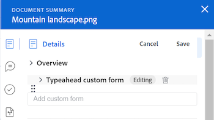

# Overzicht van documenten

<!--Audited: April, 2024-->

Met het deelvenster Samenvatting kunt u belangrijke gegevens rechtstreeks vanuit de documentenlijst openen en bijwerken.

+++ Breid uit om de toegangseisen voor de functionaliteit in dit artikel weer te geven.

## Toegangsvereisten

U moet de volgende toegang hebben om de stappen in dit artikel uit te voeren:

<table style="table-layout:auto"> 
 <col> 
 </col> 
 <col> 
 </col> 
 <tbody> 
  <tr> 
   <td role="rowheader">Adobe Workfront-pakket</td> 
   <td> 
 Alle
 </td> 
  </tr> 
  <tr> 
   <td role="rowheader">Adobe Workfront-licenties</td> 
   <td> 
Medewerker of hoger
 
   
Aanvraag of hoger

   </td> 
  </tr> 
  <tr data-mc-conditions=""> 
   <td role="rowheader">Configuraties op toegangsniveau</td> 
   <td> 
Toegang tot documenten bewerken
  </td> 
  </tr> 
  <tr data-mc-conditions=""> 
   <td role="rowheader">Objectmachtigingen</td> 
   <td> 
Toegang weergeven tot het object dat is gekoppeld aan het document
 </td> 
  </tr> 
 </tbody> 
</table>

Voor meer detail over de informatie in deze lijst, zie [ vereisten van de Toegang in de documentatie van Workfront ](/help/quicksilver/administration-and-setup/add-users/access-levels-and-object-permissions/access-level-requirements-in-documentation.md).

+++

## Samenvatting voor documenten in de ervaring met oudere documenten

Als uw organisatie zich in een verouderde Workfront-opslagruimte bevindt, ziet u het gebied met verouderde documenten wanneer u documenten in Workfront opent. Voor meer informatie over de opslag van erfenisWorkfront, zie [ Verschillen tussen de opslag van erfenisWorkfront en de ondernemingsopslag van Adobe ](/help/quicksilver/review-and-approve-work/esm-overview.md).

### De overzichtsweergave openen in de ervaring met oudere documenten

{{step1-to-documents}}

1. Voor de **pagina van Documenten**, selecteer een document in de lijst.

1. In de hoger-juiste hoek van de pagina, klik het **Open Samenvatting** pictogram . Het **Samenvatting van het Document** zijpaneel opent.

   

   Nadat u de samenvatting hebt geopend, blijft deze geopend op deze pagina (zelfs als u op andere documenten klikt) totdat u deze handmatig sluit.

### Details

In de sectie Details kunt u overzichtsgegevens op hoog niveau weergeven en communiceren met aangepaste formulieren. Klik op Details boven aan de sectie om naar de volledige pagina Documentdetails te gaan.

* [Overzicht](#overview)
* [Aangepaste Forms](#custom-forms)

#### Overzicht {#overview}

Vouw de sectie Overzicht uit om een miniatuur van een afbeelding weer te geven of te downloaden, open een proefdruk, werk de basisbeschrijving bij, check het document uit en nog veel meer.

#### Aangepaste Forms {#custom-forms}

Met de sectie Aangepaste Forms kunt u aangepaste formulieren die aan het document zijn gekoppeld, toevoegen, bewerken of weergeven. Typ de naam van het aangepaste formulier om het aan het document toe te voegen. Voor meer informatie, zie [ een douanevorm aan een document ](../../documents/managing-documents/add-custom-form-documents.md) toevoegen of uitgeven.

### Updates

In de sectie Updates kunt u een update weergeven van iemand die in het document of de proefdruk is aangebracht. In het overzicht worden de eerste twee opmerkingen weergegeven. Voor meer informatie over updates, zie [ Commentaar op een proef ](../../review-and-approve-work/proofing/reviewing-proofs-within-workfront/comment-on-a-proof/comment-on-proof.md).

### Goedkeuringen

Gebruik de sectie Goedkeuringen om goedkeuring van een document te vragen. U kunt iemand ook herinneren aan een goedkeuring, de goedkeuring opnieuw voorleggen en de vorige beslissing annuleren, of de goedkeuring schrappen. fiatteurs van documenten kunnen de samenvatting gebruiken om een beslissing te nemen.

Goedkeuringen van proefdrukken moeten worden toegevoegd aan de proefwerkstroom. Zie voor meer informatie over goedkeuringen

* [ goedkeurend het werk ](../../review-and-approve-work/manage-approvals/approving-work.md)
* [Documentgoedkeuring aanvragen](../../review-and-approve-work/manage-approvals/request-document-approvals.md)

### Versies

In de sectie Versies kunt u het aantal versies weergeven dat voor een bepaald document is gemaakt. Klik het Meer pictogram  om het volgende te doen:

* Open een proefdruk.
* Download een proefdruk of document.
* Een voorvertoning weergeven van een door de browser ondersteund document.
* Ga naar Documentdetails.
* Een proefdruk of document verwijderen.

## Overzicht van documenten in de nieuwe documentervaring

Als uw organisatie bedrijfsopslag gebruikt, zult u het nieuwe documentengebied zien wanneer u tot documenten in Workfront toegang hebt. Voor meer informatie over ondernemingsopslag, zie [ overzicht van de ondernemingsopslag van Adobe ](/help/quicksilver/review-and-approve-work/esm-overview.md).

### Details

In de sectie Details kunt u overzichtsgegevens op hoog niveau weergeven en communiceren met aangepaste formulieren.

### Goedkeuringen

Gebruik de sectie Goedkeuringen om een goedkeuringswerkstroom te maken. U kunt deelnemers ook herinneren aan een goedkeuring of de goedkeuring schrappen. Documentfiatteurs hebben toegang tot de viewer Frame.io of kunnen de samenvatting gebruiken om een beslissing te nemen.

Voor meer informatie over goedkeuringen en Frame.io, zie

* [Begin met de integratie Frame.io](/help/quicksilver/review-and-approve-work/native-integrations/frame-io/get-started-with-frame-integration.md)
* [ creeer een documentoverzicht of goedkeuringsverzoek ](/help/quicksilver/review-and-approve-work/document-reviews-and-approvals/manage-document-approvals/create-a-document-approval.md).

<!-- resubmit the approval and cancel the previous decision, or delete the approval. Document approvers can use the Summary to make a decision.-->

### Versies

In de sectie Versies kunt u het aantal versies weergeven dat voor een bepaald document is gemaakt. Klik op het pictogram Meer om het volgende te doen:

* De naam van een versie wijzigen
* Documentdetails weergeven
* Goedkeuring aanvragen voor een specifieke versie
* Openen in Frame.io
* De versie downloaden
* De versie delen
* De versie verwijderen

### Historie

In de sectie Historie kunt u een lijst weergeven met alle activiteiten die betrekking hebben op het document.

