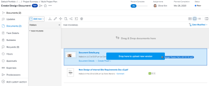

# Een nieuwe versie van een document uploaden

U kunt een nieuwe versie toevoegen van een document dat u eerder naar Adobe Workfront hebt geüpload.

Als de bestandsnaam van de nieuwe versie afwijkt van de bestandsnaam van de vorige versie, geeft Workfront het document weer met de nieuwere bestandsnaam.

Als het document een proef bevat en u een nieuwe versie van het beschermde document wilt tot stand brengen, zie de sectie [ een document uploaden en tot een nieuwe versie van een proef ](../../review-and-approve-work/proofing/creating-proofs-within-workfront/generate-proof-for-a-document.md#uploading-a-document-and-creating-a-new-version-of-a-proof) in het artikel [ leiden tot een proef voor een document ](../../review-and-approve-work/proofing/creating-proofs-within-workfront/generate-proof-for-a-document.md).

Voor informatie over het toevoegen van een nieuwe versie van een document verbonden aan Workfront van een externe toepassing, zie [ een nieuwe versie van een verbonden document ](../../documents/adding-documents-to-workfront/link-documents-from-external-apps.md#add) in [ de documenten van de Verbinding van externe toepassingen ](../../documents/adding-documents-to-workfront/link-documents-from-external-apps.md) toevoegen.

## Toegangsvereisten

U moet het volgende hebben:

<table style="table-layout:auto"> 
 <col> 
 </col> 
 <col> 
 </col> 
 <tbody> 
  <tr> 
   <td role="rowheader">Adobe Workfront-abonnement*</td> 
   <td> 
 Alle
 </td> 
  </tr> 
  <tr> 
   <td role="rowheader">Adobe Workfront-licenties*</td> 
   <td> 
Aanvraag of hoger
 </td> 
  </tr> 
  <tr data-mc-conditions=""> 
   <td role="rowheader">Configuraties op toegangsniveau*</td> 
   <td> 
Toegang tot documenten bewerken
 
Opmerking: als u nog steeds geen toegang hebt, vraag dan aan de Workfront-beheerder of deze aanvullende beperkingen op uw toegangsniveau heeft ingesteld. Voor informatie over hoe een beheerder van Workfront uw toegangsniveau kan wijzigen, zie <a href="../../administration-and-setup/add-users/configure-and-grant-access/create-modify-access-levels.md" class="MCXref xref"> tot douanetoegangsniveaus </a> leiden of wijzigen.
 </td> 
  </tr> 
  <tr data-mc-conditions=""> 
   <td role="rowheader">Objectmachtigingen</td> 
   <td> 
Toegang tot het aan het document gekoppelde object bewerken
 
Voor informatie bij het vragen van om extra toegang, zie <a href="../../workfront-basics/grant-and-request-access-to-objects/request-access.md" class="MCXref xref"> de toegang van het Verzoek tot voorwerpen </a>.
 </td> 
  </tr> 
 </tbody> 
</table>

&#42; om te weten te komen welk plan, vergunningstype, of toegang u hebt, contacteer uw beheerder van Workfront.

## Slepen en neerzetten gebruiken om een nieuwe versie toe te voegen

>[!NOTE]
>
>Slepen en neerzetten werkt niet met Internet Explorer.

1. Ga naar het gebied Documenten waar het document is geüpload.
1. Sleep de nieuwe versie van het document vanaf het bureaublad of een aparte tab voor de browser boven op de bestaande versie in Workfront.

   

   Terwijl u de nieuwe versie sleept, kunt u de muis boven een map met Workfront-documenten houden om deze te openen. Vervolgens kunt u omhoog en omlaag schuiven door de bestanden naar de boven- of onderkant van het scherm te slepen.

1. Daling de nieuwe versie bovenop het bestaande dossier op de **Documenten** tabel.

   Voor informatie over het beheren van documentversies, zie [ documentversies beheren ](../../documents/managing-documents/manage-document-versions.md).

## Voeg een nieuwe versie toe via het menu Meer

1. Selecteer het document waaraan u een nieuwe versie wilt toevoegen.
1. Klik **toevoegen Nieuw** > **Versie**.

   

1. Selecteer het type document dat u wilt uploaden en volg de aanwijzingen.
