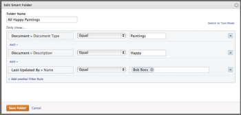

# Slimme mappen maken en beheren

De slimme omslagen worden gebruikt om documenten buiten een project, een taak, of een kwestie te beheren, en in het belangrijkste gebied van Documenten in het Belangrijkste Menu gevonden. U kunt een slimme map instellen om elementen te filteren en alleen die elementen weer te geven die voor u van belang zijn, in plaats van al uw elementen te doorzoeken.

Standaard hebt u de eerste keer dat u het gebied Documenten opent, toegang tot twee slimme mappen: Alle documenten en recent. U kunt slimme standaardmappen bewerken, hernoemen of kopiëren, maar u kunt ze niet verwijderen. U kunt aanvullende slimme mappen maken om te voldoen aan andere behoeften op het gebied van middelenbeheer.

## Toegangsvereisten

U moet de volgende toegang hebben om de stappen in dit artikel uit te voeren:

<table style="table-layout:auto"> 
 <col> 
 <col> 
 <tbody> 
  <tr> 
   <td role="rowheader">Adobe Workfront-abonnement*</td> 
   <td> 
Alle
 </td> 
  </tr> 
  <tr> 
   <td role="rowheader">Adobe Workfront-licentie*</td> 
   <td> 
Controleren of hoger
 </td> 
  </tr> 
  <tr> 
   <td role="rowheader">Configuraties op toegangsniveau*</td> 
   <td> 
Toegang tot documenten bewerken
 
Opmerking: Als u nog steeds geen toegang hebt, vraagt u de Workfront-beheerder of deze aanvullende beperkingen op uw toegangsniveau instelt. Voor informatie over hoe een beheerder van Workfront uw toegangsniveau kan wijzigen, zie <a href="../../administration-and-setup/add-users/configure-and-grant-access/create-modify-access-levels.md" class="MCXref xref">Aangepaste toegangsniveaus maken of wijzigen</a>.
 </td> 
  </tr> 
 </tbody> 
</table>

&#42;Neem contact op met uw Workfront-beheerder om te weten te komen welk plan, licentietype of toegang u hebt.

## Slimme mappen weergeven 

U kunt mappen weergeven in miniaturen, standaard- of lijstweergave. Als u de weergave wilt wijzigen, gebruikt u de weergaveopties in de rechterbovenhoek.

## Een slimme map maken 

1. Ga naar de **Documenten** gebied waar u de slimme map wilt maken.
1. Klikken **Nieuw toevoegen**.
1. Klikken **Slimme map**.
1. Geef een naam op voor de slimme map in het dialoogvenster **Mapnaam** veld.
1. Klikken **Filterregel toevoegen**.
1. Identificeer de informatie die in het rapport moet worden bevolkt door het aangewezen gegevenstype te selecteren.
1. Selecteer de gewenste filterkwalificatie. 
1. Voltooi de filterregel en klik vervolgens op **Map opslaan**.

## Een slimme map bewerken 

1. Ga naar de **Documenten** gebied dat de slimme map bevat die u wilt bewerken.
1. In de **Mappen** kolom, klikt u op de knop **Meer** pictogram  naast de slimme map die u wilt bewerken.
1. Klikken **Bewerken**.

   De **Slimme map bewerken** wordt weergegeven.\
   

1. Breng de gewenste wijzigingen aan en klik vervolgens op **Map opslaan**.

## De naam van een slimme map wijzigen 

1. Ga naar de **Documenten** gebied dat de slimme map bevat waarvan u de naam wilt wijzigen.
1. In de **Mappen** klikt u op de vervolgkeuzepijl naast de slimme map waarvan u de naam wilt wijzigen.
1. Geef een nieuwe naam voor de map op en druk op **Enter**.

## Een slimme map kopiëren

1. Ga naar de **Documenten** gebied dat de slimme map bevat die u wilt kopiëren.
1. In de **Mappen** klikt u op de vervolgkeuzepijl naast de slimme map die u wilt kopiëren.
1. Klikken **Kopiëren**.

   De **Slimme map bewerken** wordt weergegeven. De **Mapnaam** bevat de oorspronkelijke naam van de map, met het woord Kopiëren tussen haakjes.

1. Breng de gewenste wijzigingen aan en klik vervolgens op **Map opslaan**.

## Een slimme map verwijderen 

1. Ga naar de **Documenten** gebied dat de slimme map bevat die u wilt verwijderen.
1. In de **Mappen** klikt u op de vervolgkeuzepijl naast de slimme map die u wilt verwijderen.
1. Klikken **Verwijderen**.
1. Klikken **Ja, verwijderen**.
