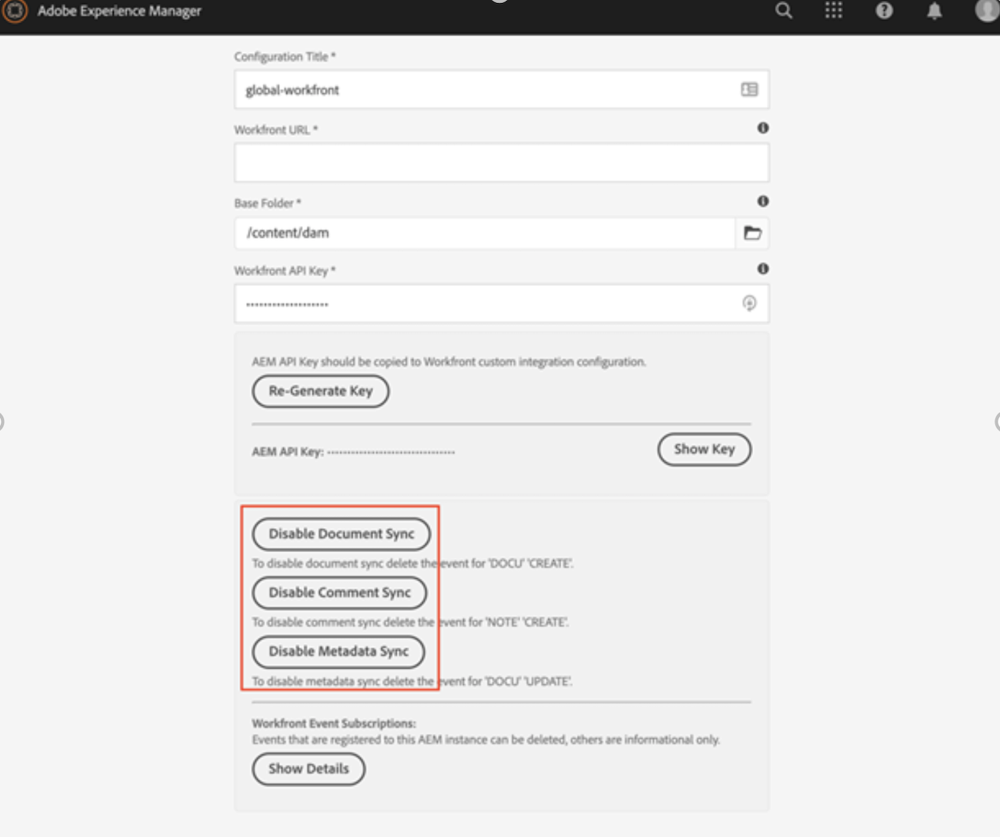

# De Workfront verwijderen met de verouderde Adobe Experience Manager-aansluiting

U moet de Workfront met de verouderde Adobe Experience Manager-aansluiting verwijderen voor de meest recente geïntegreerde verbinding tussen Workfront en Adobe Experience Manager Assets as a Cloud Service.

## Abonnement op Workfront opzeggen

1. Open Adobe Experience Manager.
1. In Experience Manager, ga naar **Hulpmiddelen** > **de Diensten van de Wolk** > **de Configuratie van de Integratie van Workfront**.
1. Selecteer uw configuratie (globaal-werkfront door gebrek), en klik **Eigenschappen**.

   

1. Documentsynchronisatie, Opmerking en Metagegevenssynchronisatie uitschakelen. De label moet dag uitgeschakeld zijn.
Hiermee worden de abonnementen in Workfront verwijderd en kan de gebruiker een nieuw abonnement maken met dezelfde URL als die is gedefinieerd in Day CQ Link Externalzer.

## Workfront Integration Configuration verwijderen

Na het verwijderen van het abonnement is het nu veilig om de Configuratie van de Integratie van Workfront te schrappen.

1. Open de configuratie, en selecteer **Schrapping**.

   

## Koppeling verwijderen

Vervolgens moet u de Workfront-eigenschappentoewijzing verwijderen.

1. In Experience Manager, ga **Hulpmiddelen** > **Assets** > **de Afbeelding van het Bezit van Workfront**.

1. Selecteer alle afbeeldingen, en klik **Schrapping**.

## Gebruikersmachtigingen

Alle gebruikers die AEM Dam benaderen vanuit Workfront, kregen leesmachtigingen voor `/content/dam` . Als een gebruiker dat niet meer nodig heeft, kunt u de toestemmingen verwijderen die aan genoemde gebruikers worden gegeven.

De connector werkt met behulp van de workfront-service van de systeemgebruiker. Dit wordt verwijderd wanneer u de aansluiting verwijdert.

>[!NOTE]
>
>Als u connecterversie 2.0.3 gebruikt en de groep `workfront-aem-connector-group` toevoegde, moet dit eveneens worden verwijderd door **Hulpmiddelen** te gaan > **Veiligheid** > **Groepen**.

## Day CQ Link ExternalAlizer

Als u de Day CQ Link Externalzer niet nodig hebt, kunt u deze terugzetten naar `localhost:4502` door naar `/system/console/configMgr` te gaan en op zoek te gaan naar &#39;Day CQ Link Externalzer&#39;.

>[!NOTE]
>
>Als u Adobe Experience Manager as a Cloud Service gebruikt, kunt u dit veranderen door in uw project te kijken en het dossier _com.day.cq.commons.impl.ExternalImpl.xml_ binnen _ui.apps/src/main/content/jcr_root/apps/mysite/config_ te vinden.

## Connector-pakket verwijderen

De stappen die nodig zijn om het schakelaarpakket te verwijderen, verschillen afhankelijk van welke versie van Adobe Experience Manager u hebt.

### Adobe Experience Manager op locatie

Als u Adobe Experience Manager op-gebouw gebruikt, ga _crx/packmgr/index.jsp_, en zoek `workfront-aem-connector.all-<version>.zip`, klik **Meer** en dan **desinstalleer**.

Schakel onder `/conf` in om te controleren of alle door Workfront gemaakte bestanden zijn verwijderd.

### Adobe Experience Manager as a Cloud Service

Voor Adobe Experience Manager as a Cloud Service, kunt u de gebiedsdelen voor de schakelaar uit pom.files van het project verwijderen.

## Firewall en Dispatcher

Vergeet niet je gewitste Workfront-URL&#39;s te verwijderen als communicatie niet meer nodig is. Bovendien gebruikt de connector de headers apiKey en de gebruikersnaam die op de dispatcher zijn ingesteld. Deze kunnen ook worden verwijderd.
