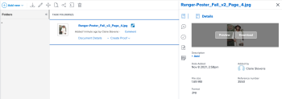

# Een gekoppeld element met de verbeterde connector weergeven of downloaden

U kunt een middel in Adobe Workfront bekijken of downloaden dat van Experience Manager Assets wordt verbonden.

## Toegangsvereisten

U moet het volgende hebben:

<table style="table-layout:auto"> 
 <col> 
 <col> 
 <tbody> 
  <tr> 
   <td role="rowheader">Adobe Workfront-abonnement*</td> 
   <td> 
 Alle
 </td> 
  </tr> 
  <tr> 
   <td role="rowheader">Adobe Workfront-licenties*</td> 
   <td> 
Aanvraag of hoger
 </td> 
  </tr> 
  <tr> 
   <td role="rowheader">Product</td> 
   <td>U moet een Experience Manager Assets Essentials-instantie hebben.</td> 
  </tr> 
  <tr> 
   <td role="rowheader">Configuraties op toegangsniveau*</td> 
   <td> 
Toegang tot documenten bewerken
 
Opmerking: als u nog steeds geen toegang hebt, vraag dan aan de Workfront-beheerder of deze aanvullende beperkingen op uw toegangsniveau heeft ingesteld. Voor informatie over hoe een beheerder van Workfront uw toegangsniveau kan wijzigen, zie <a href="../../../administration-and-setup/add-users/configure-and-grant-access/create-modify-access-levels.md" class="MCXref xref"> tot douanetoegangsniveaus </a> leiden of wijzigen.
 </td> 
  </tr> 
  <tr> 
   <td role="rowheader">Objectmachtigingen</td> 
   <td> 
Toegang weergeven of hoger
 
Voor informatie bij het vragen van om extra toegang, zie <a href="../../../workfront-basics/grant-and-request-access-to-objects/request-access.md" class="MCXref xref"> de toegang van het Verzoek tot voorwerpen </a>.
 </td> 
  </tr> 
 </tbody> 
</table>

&#42; om te weten te komen welk plan, vergunningstype, of toegang u hebt, contacteer uw beheerder van Workfront.

## Vereisten

Voordat u begint, moet u

* De Workfront for Experience Manager verbeterde connector installeren

## Een gekoppeld element weergeven of downloaden vanuit Experience Manager Assets

1. Zoek het document dat u wilt weergeven of downloaden.
1. Selecteer het document in de documentlijst.
1. In de Samenvatting van het Document op het recht, houd over de duimnagel bij de bovenkant en kies **Voorproef** of **Download**.

   
