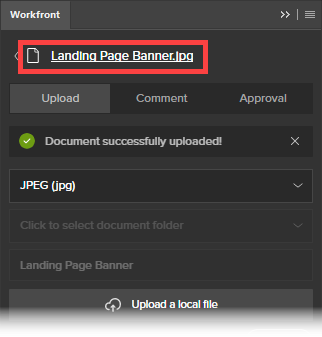

# De extensie Workfront voor Illustrator en InDesign gebruiken

<!--Audited: 01/2024-->

>[!IMPORTANT]
>
>Wij vervangen de uitbreiding van Workfront voor Illustrator en InDesign met [&#x200B; bijgewerkte stop-ins van Creative Cloud &#x200B;](/help/quicksilver/workfront-integrations-and-apps/adobe-workfront-for-creative-cloud/wf-cc-install-toc.md). Vanaf eind 2022 wordt deze extensie niet meer ondersteund en is deze ongewijzigd beschikbaar.

Met de extensie Workfront kunt u digitale inhoud die u opslaat en maakt in Adobe Illustrator en Adobe InDesign exporteren naar Workfront. Hierdoor wordt het reviseren en goedkeuren van documenten versneld.

De extensie Workfront wordt ondersteund voor Adobe Creative Cloud 2017 en hoger in de volgende toepassingen:

* InDesign
* Illustrator
* Photoshop

  >[!NOTE]
  >
  >Wij adviseren gebruikend nieuwe [&#x200B; Adobe Workfront voor de insteekmodule van Photoshop &#x200B;](/help/quicksilver/workfront-integrations-and-apps/adobe-workfront-for-creative-cloud/wf-cc-install-ps.md).

## Toegangsvereisten

+++ Breid uit om de toegangseisen voor de functionaliteit in dit artikel weer te geven.

U moet de volgende toegang hebben om de stappen in dit artikel uit te voeren:

<table style="table-layout:auto"> 
 <col> 
 <col> 
 <tbody> 
  <tr> 
   <td role="rowheader">Adobe Workfront-abonnement*</td> 
   <td> 
Huidig: Pro of hoger

   of
   
Nieuw: Willekeurig abonnement
 </td> 
  </tr> 
  <tr data-mc-conditions=""> 
   <td role="rowheader">Adobe Workfront-licentie*</td> 
   <td> 
Huidig: Werk of hoger

   of
   
Nieuw: Standaard
 </td> 
  </tr> 
  <tr> 
   <td role="rowheader">Product</td> 
   <td>U moet een Adobe Creative Cloud-licentie hebben naast een Workfront-licentie.</td> 
  </tr> 
  <tr> 
   <td role="rowheader">Objectmachtigingen</td> 
   <td> 
Bewerk de toegang tot het object waarmee u wilt communiceren.
  </td> 
  </tr> 
 </tbody> 
</table>

&#42; om te weten te komen welk plan, vergunningstype, of toegang u hebt, contacteer uw beheerder van Workfront. Voor meer informatie, zie [&#x200B; vereisten van de Toegang in de documentatie van Workfront &#x200B;](/help/quicksilver/administration-and-setup/add-users/access-levels-and-object-permissions/access-level-requirements-in-documentation.md).

+++

## Aanmelden bij Workfront Extension vanuit Illustrator of InDesign {#log-in-to-workfront-extension-from-illustrator-or-indesign}

Wanneer u zich bij Workfront aanmeldt vanuit een van de ondersteunde Adobe-toepassingen, wordt u aangemeld bij alle ondersteunde Adobe-toepassingen.

1. Ga naar de Adobe-toepassing waar u de Workfront-extensie wilt gebruiken.

   Voor een lijst van gesteunde formaten voor elke gesteunde toepassing, zie [&#x200B; Gesteunde uitgevoerde dossierformaten &#x200B;](#supported-exported-file-formats) in dit artikel.

1. Klik **Venster** > **Uitbreidingen** > Workfront.

1. (Optioneel) Sleep het Workfront-deelvenster naar de positie waar u het wilt weergeven in de Adobe-toepassing.
1. Volg de aanwijzingen om u aan te melden bij Workfront.

   >[!NOTE]
   >
   >* Workfront maakt verbinding met Adobe Creative Cloud met behulp van OAuth 2.0, een veilige standaard die door de meeste webgebaseerde integraties wordt gebruikt voor de verificatie en autorisatie van gebruikers.
   >* Wanneer u wordt ertoe aangezet om het [ domein of de gastheer ] van uw rekening van Workfront in te gaan, typ het gebruikend dit formaat:`yourCompany'sDomain.my.workfront.com`. Het domein van uw bedrijf is gewoonlijk de naam van uw bedrijf.

   Een lijst van het werkpunten die aan u worden toegewezen toont als het project een huidige status is. Meld u aan bij Workfront als een lijst niet wordt weergegeven.

   De persoonlijke taken worden vermeld onder **Geen Project**.

## Een bestand uploaden naar een Workfront-project, -taak of -uitgave {#upload-a-file-to-a-workfront-project-task-or-issue}

U kunt een bestand uploaden vanaf uw computerbestandssysteem of een bestand dat momenteel in een Adobe Creative Cloud-toepassing is geopend, exporteren naar een Workfront-project, -taak of -uitgave. 

Houd rekening met het volgende wanneer u een bestand uploadt of exporteert uit Adobe Creative Cloud:

* Met het toegangsniveau kunt u documenten alleen uploaden naar Workfront. Voor meer informatie, zie [&#x200B; toegang van de Verlening tot documenten &#x200B;](../../administration-and-setup/add-users/configure-and-grant-access/grant-access-documents.md).
* U moet over machtigingen beschikken om documenten te uploaden naar het gewenste item. Voor meer informatie, zie [&#x200B; Overzicht van het delen van toestemmingen op voorwerpen &#x200B;](../../workfront-basics/grant-and-request-access-to-objects/sharing-permissions-on-objects-overview.md).
* Het bestand wordt geüpload naar het gebied Documenten voor het Workfront-object dat u selecteert.
* U kunt geen document naar het gebied van Documenten in het Belangrijkste pictogram van het Menu van het Menu  van een toepassing van Adobe Creative Cloud uitvoeren.

In de volgende secties wordt het volgende uitgelegd:

* [&#x200B; upload een dossier &#x200B;](#upload-a-file)
* [&#x200B; Uitvoer een dossier momenteel open in Illustrator of InDesign &#x200B;](#export-a-file-currently-open-in-illustrator-or-indesign)
* [Een nieuwe versie van een bestand uploaden vanuit Illustrator of InDesign](#upload-a-new-version-of-a-file-from-illustrator-or-indesign)

### Een bestand uploaden {#upload-a-file}

U kunt uw bestanden uploaden naar een project, taak of uitgave zonder uw Adobe Creative Cloud-toepassing te verlaten.

1. Als u niet de uitbreiding van Workfront ziet wanneer u uw toepassing van Adobe Creative Cloud opent, klik **Venster** > **Uitbreidingen** > **Workfront**.

   Een lijst van het werkpunten die aan u worden toegewezen toont als het project in een huidige status is. Meld u aan bij Workfront als een lijst niet wordt weergegeven.

   De persoonlijke taken worden vermeld onder **Geen Project**.

1. Klik op de naam van het project, de taak of de uitgave waarnaar u het bestand wilt uploaden.

   U kunt naar dit zoeken door de naam in het **vakje van het Onderzoek** te typen en **Project** te selecteren, **Taak**, of **Uitgave** van het drop-down menu aan het recht van de **doos van het Onderzoek**. Als de naam van het het werkpunt niet in de lijst verschijnt, druk **binnengaan** om alle punten te zoeken Workfront die u toegang tot mening hebt.

1. Klik **Uitgezocht** in de laag-juiste hoek van de uitbreiding van Workfront.
1. In **klik om formaat** drop-down menu te selecteren, klik het formaat waarin u het dossier in Workfront wilt bewaren.

   Voor een lijst van gesteunde formaten voor elke gesteunde toepassing, zie [&#x200B; Gesteunde uitgevoerde dossierformaten &#x200B;](#supported-exported-file-formats) in dit artikel.

1. (Voorwaardelijk) als het het werkpunt waar u het dossier wilt uploaden documentomslagen heeft, selecteer een documentomslag in **klikken om een gebied van de documentomslag** te selecteren, dan **Uitgezocht** klikken.

1. Klik **uploaden een lokaal dossier**.
1. In het **Open vakje van het Dossier**, vind het dossier in uw dossiersysteem, dan klik **Open**.

1. (Optioneel) Typ een nieuwe naam voor het bestand.

   

1. Klik **uploaden**.

   In Workfront wordt het document nu vermeld in het gebied Documenten voor het project, de taak of de uitgave die u hebt geselecteerd.

1. (Optioneel) Klik op de naam van het document om de pagina Documentdetails te openen in Workfront.

   Workfront wordt geopend in een nieuw browsertabblad.

### Een bestand exporteren dat momenteel is geopend in Illustrator of InDesign {#export-a-file-currently-open-in-illustrator-or-indesign}

1. Open in een ondersteunde Adobe Creative Cloud-toepassing een bestand dat u naar Workfront wilt exporteren.
1. Als de uitbreiding van Workfront niet wordt getoond, klik **Venster** > **Uitbreidingen** > **Workfront**.

   Een lijst van het werkpunten die aan u worden toegewezen toont als het project in een huidige status is. Meld u aan bij Workfront als een lijst niet wordt weergegeven.

   De persoonlijke taken worden vermeld onder **Geen Project**.

1. Klik op de naam van het project, de taak of de uitgave waarnaar u het bestand wilt exporteren.

   U kunt naar dit zoeken door de naam in het **vakje van het Onderzoek** te typen en **Project** te selecteren, **Taak**, of **Uitgave** van het drop-down menu aan het recht van de **doos van het Onderzoek**. Als de naam van het het werkpunt niet in de lijst verschijnt, druk **binnengaan** om alle punten te zoeken Workfront die u toegang tot mening hebt.

1. In **klik om formaat** drop-down menu te selecteren, klik het formaat waarin u het dossier in Workfront wilt bewaren.

   Voor een lijst van gesteunde formaten voor elke gesteunde toepassing, zie [&#x200B; Gesteunde uitgevoerde dossierformaten &#x200B;](#supported-exported-file-formats) in dit artikel.

1. (Voorwaardelijk) als het het werkpunt waar u het dossier wilt uploaden documentomslagen heeft, selecteer een documentomslag in **klikken om een gebied van de documentomslag** te selecteren, dan **Uitgezocht** klikken.
1. (Optioneel) Als u de naam van het document wilt wijzigen, klikt u op de documentnaam en typt u een nieuwe naam.

   

1. Klik **Uitvoer**.

   Er wordt een bericht weergegeven om te bevestigen dat het document is geëxporteerd naar Workfront.

   In Workfront wordt het document weergegeven in het gebied Documenten van het object dat u in Workfront hebt opgegeven.

1. (Optioneel) Klik op de naam van het document om het in Workfront te openen.

   

   Workfront wordt geopend in een nieuw browsertabblad.

### Een nieuwe versie van een bestand uploaden vanuit Illustrator of InDesign {#upload-a-new-version-of-a-file-from-illustrator-or-indesign}

1. Als u een bestand waaraan u werkt in een ondersteunde Adobe-toepassing wilt exporteren als een nieuwe versie van een bestand in Workfront, opent u het bestand in de Adobe-toepassing.
1. Als de uitbreiding van Workfront niet wordt getoond, klik **Venster** > **Uitbreidingen** > **Workfront**.

   Een lijst van het werkpunten die aan u worden toegewezen toont als het project een huidige status is. Meld u aan bij Workfront als een lijst niet wordt weergegeven.

   De persoonlijke taken worden vermeld onder **Geen Project**.

1. Klik op de naam van het project, de taak of de uitgave waar het bestaande document wordt weergegeven.

   U kunt naar dit zoeken door de naam in het **vakje van het Onderzoek** te typen en **Project** te selecteren, **Taak**, of **Uitgave** van het drop-down menu aan het recht van de **doos van het Onderzoek**. Als de naam van het het werkpunt niet in de lijst verschijnt, druk **binnengaan** om alle punten te zoeken Workfront die u toegang tot mening hebt.

   Alle documenten die naar projecten, taken of uitgaven zijn geüpload, worden in een lijst weergegeven, ongeacht of ze vanuit de Adobe-toepassing zijn geüpload.

1. In **klik om formaat** drop-down menu te selecteren, klik het formaat waarin u het dossier in Workfront wilt bewaren.

   Dit is vereist als u een bestand exporteert dat is geopend in de Adobe-toepassing. Voor een lijst van gesteunde formaten voor elke gesteunde toepassing, zie [&#x200B; Gesteunde uitgevoerde dossierformaten &#x200B;](#supported-exported-file-formats) in dit artikel.

1. Als u een dossier uitvoert u in de toepassing van Adobe als nieuwe versie van het document van Workfront hebt geopend u selecteerde, klik **Uitvoer**.

   of

   Als u een dossier van uw systeem van het computerdossier als nieuwe versie van het document wilt uploaden van Workfront u selecteerde, **uploadt een lokaal dossier**, het dossier in de doos vinden die verschijnt, **Open** klikt, dan **uploadt**.

1. (Optioneel) Klik op de naam van het document om de nieuwe versie weer te geven in Workfront.

   >[!NOTE]
   >
   >De naam van het document in Workfront wordt standaard ingevuld en kan niet worden bewerkt. De naam van het bestand dat u uploadt of exporteert, wordt ook niet gewijzigd als een nieuwe versie.
   >
   >
   >

## Opmerkingen maken over een Workfront-document uit Illustrator of InDesign {#comment-on-a-workfront-document-from-illustrator-or-indesign}

U kunt opmerkingen rechtstreeks toevoegen aan een Workfront-document in een Adobe-toepassing. In Workfront worden uw opmerkingen weergegeven in het gedeelte Updates van het document en in het gedeelte Updates van het Workfront-item waar het document is opgeslagen.

1. Open een van de ondersteunde Adobe-toepassingen.
1. Als de uitbreiding van Workfront niet wordt getoond, klik **Venster** > **Uitbreidingen** > **Workfront**.

   Een lijst van het werkpunten die aan u worden toegewezen toont als het project een huidige status is. Meld u aan bij Workfront als een lijst niet wordt weergegeven.

   De persoonlijke taken worden vermeld onder **Geen Project**.

1. Klik op het project, de taak of het probleem waarbij het bestaande document wordt weergegeven.

   U kunt naar dit zoeken door de naam in het **vakje van het Onderzoek** te typen en **Project** te selecteren, **Taak**, of **Uitgave** van het drop-down menu aan het recht van de **doos van het Onderzoek**. Als de naam van het het werkpunt niet in de lijst verschijnt, druk **binnengaan** om alle punten te zoeken Workfront die u toegang tot mening hebt.

1. Klik de naam van het bestaande document, dan klik **Uitgezocht** in de laag-juiste hoek van de uitbreiding van Workfront.
1. Klik het **lusje van de Commentaar**, dan typ uw update in de doos.

1. (Facultatief) om andere gebruikers of teams van Workfront op de commentaar te omvatten, begin de naam van een gebruiker of een team in **te typen Melden mensen of teams** doos, dan klik de naam wanneer het in de drop-down lijst verschijnt.
1. (Facultatief) om goedkeuring op het document te verzoeken, selecteer **Maak een goedkeuringsverzoek**.
1. Klik **Update**.

   Er wordt een update gepost op het tabblad Updates van het document. Workfront-gebruikers die u in de opmerking opneemt, ontvangen een melding in de app en ontvangen, afhankelijk van de configuratie van Workfront, mogelijk ook een e-mailmelding.

   Voor meer informatie over berichten binnen Workfront, zie [&#x200B; Mening en beheer in-app berichten &#x200B;](../../workfront-basics/using-notifications/view-and-manage-in-app-notifications.md).

   Voor meer informatie over het ontvangen van e-mailberichten, zie [&#x200B; de berichten van Adobe Workfront &#x200B;](../../workfront-basics/using-notifications/wf-notifications.md).

## Illustrator of InDesign om goedkeuring van een document vragen

U kunt een Workfront-documentgoedkeuring rechtstreeks aanvragen bij een Adobe-toepassing.

U kunt de volgende entiteiten om goedkeuring van een document verzoeken:

* Een Workfront-gebruiker
* Een externe gebruiker zonder een Workfront-account

U kunt op de volgende manieren goedkeuring voor een document aanvragen bij een Adobe-toepassing:

* Door een fiatteur aan het document te koppelen.
* Door opmerkingen toe te voegen aan een document, meldt u de persoon wanneer u een opmerking maakt en voegt u deze als fiatteur toe aan het document.

  Voor informatie over het verzoeken van om goedkeuring wanneer het becommentariëren over een document, zie de sectie [&#x200B; Commentaar op een document van Workfront van Illustrator of InDesign &#x200B;](#comment-on-a-workfront-document-from-illustrator-or-indesign) in dit artikel.

Om een goedkeuring op een document van een toepassing van Adobe te verzoeken:

1. Open een van de ondersteunde Adobe-toepassingen.
1. Als de uitbreiding van Workfront niet wordt getoond, klik **Venster** > **Uitbreidingen** > **Workfront**.

   Een lijst van het werkpunten die aan u worden toegewezen toont als het project een huidige status is. Meld u aan bij Workfront als een lijst niet wordt weergegeven.

   De persoonlijke taken worden vermeld onder **Geen Project**.

1. Klik op het project, de taak of het probleem waarbij het bestaande document wordt weergegeven en klik vervolgens op de naam van het bestaande document.

   U kunt naar dit zoeken door de naam in het **vakje van het Onderzoek** te typen en **Project** te selecteren, **Taak**, of **Uitgave** van het drop-down menu aan het recht van de **doos van het Onderzoek**. Als de naam van het het werkpunt niet in de lijst verschijnt, druk **binnengaan** om alle punten te zoeken Workfront die u toegang tot mening hebt.

1. Klik de naam van het bestaande document, dan klik **Uitgezocht** in de laag-juiste hoek van de uitbreiding van Workfront.
1. Klik de **Goedkeuring** tabel.
1. Om een fiatteur toe te voegen, in het **Begin typend een naamdoos** één van het volgende:

   * Typ de naam van een fiatteur en selecteer deze vervolgens wanneer deze in de lijst wordt weergegeven.

      toe

   * Typ het e-mailadres van een externe gebruiker.

1. Klik **Goedkeuring van het Verzoek**.

   Workfront-gebruikers die u in de opmerking of als fiatteur toevoegt, ontvangen een melding in de app en ontvangen, afhankelijk van de configuratie van Workfront, mogelijk ook een e-mailbericht.\
   Externe gebruikers ontvangen een e-mailbericht van de locatie waar zij een beslissing over de goedkeuring kunnen nemen.

   Voor informatie over berichten in Workfront, zie [&#x200B; Mening en beheer in-app berichten &#x200B;](../../workfront-basics/using-notifications/view-and-manage-in-app-notifications.md). Voor informatie over het ontvangen van e-mailberichten, zie [&#x200B; de berichten van Adobe Workfront &#x200B;](../../workfront-basics/using-notifications/wf-notifications.md).

## Een proef genereren vanuit Illustrator of InDesign {#generate-a-proof-from-illustrator-or-indesign}

Als uw organisatie automatische werkstroomsjablonen gebruikt, kunt u een proefdruk genereren voor een document dat u maakt in een Adobe-toepassing zonder de toepassing te verlaten. Voor informatie over het creëren van proeven, zie [&#x200B; tot proeven &#x200B;](../../review-and-approve-work/proofing/creating-proofs-within-workfront/create-proofs-in-wf.md) leiden. Voor informatie over Geautomatiseerde malplaatjes van het Werkschema, zie [&#x200B; Geautomatiseerde malplaatjes van het Werkschema &#x200B;](../../review-and-approve-work/proofing/proofing-overview/automated-workflow.md#automate) in [&#x200B; Geautomatiseerd overzicht van het Werkschema &#x200B;](../../review-and-approve-work/proofing/proofing-overview/automated-workflow.md).

1. Open een van de ondersteunde Adobe-toepassingen.
1. Als de uitbreiding van Workfront niet wordt getoond, klik **Venster** > **Uitbreidingen** > Workfront.

   Een lijst van het werkpunten die aan u worden toegewezen toont als het project een huidige status is. Meld u aan bij Workfront als een lijst niet wordt weergegeven.

   De persoonlijke taken worden vermeld onder **Geen Project**.

1. Als het document al naar Workfront is geüpload, selecteert u het project, de taak of geeft u een uitgave in de Workfront-extensie waar het document wordt weergegeven. Klik vervolgens op de naam van het document.

   of

   Upload een document van Adobe aan een voorwerp van Workfront, zoals die in de sectie [&#x200B; wordt beschreven Upload een dossier aan een project van Workfront, een taak, of een kwestie &#x200B;](#upload-a-file-to-a-workfront-project-task-or-issue) in dit artikel, dan klik de naam van het document.

1. In **klik om formaat** drop-down menu te selecteren, klik het formaat waarin u het dossier in Workfront wilt bewaren.

   Sommige indelingen zijn niet beschikbaar nadat u de proefdrukfunctionaliteit hebt ingeschakeld in de volgende stap. Voor meer informatie, zie [&#x200B; Gesteunde uitgevoerde dossierformaten &#x200B;](#supported-exported-file-formats) in dit artikel.

1. Klik **uploaden als nieuw bewijs** om het toe te laten.
1. Selecteer het **Malplaatje van het Werkschema** u mensen wilt gebruiken aangezien zij het document herzien.

   Uw de beheerderreeksen van Workfront opstelling Geautomatiseerde malplaatjes van het Werkschema, zoals die in [&#x200B; worden beschreven creëren en leiden Geautomatiseerde malplaatjes van het Werkschema &#x200B;](/help/quicksilver/administration-and-setup/manage-workfront/configure-proofing/create-manage-automated-workflow-templates.md). Zie de beheerder als u vragen hebt.

   1. Voeg minstens één **Nieuwe ontvanger** aan elk stadium in het Malplaatje van het Werkschema toe.

      U kunt beginnen een naam te typen en het selecteren wanneer u het in de drop-down lijst ziet die verschijnt.

   1. Specificeer de **rol van het Bewijs** en de frequentie van **E-mailalarm** voor elke ontvanger u toevoegt.

   1. (Facultatief) in de **E-mail- bericht** sectie, selecteer of om een e-mailbericht met een facultatief douanebericht over de proef naar alle proefdrukontvangers te verzenden u toevoegde.

1. Klik **creeer proef**.

   U kunt de voortgang van het maken van proefdrukken bekijken. Er wordt een waarschuwing weergegeven wanneer het genereren is voltooid. U kunt de taak openen waar u de proefdruk hebt gemaakt en deze wordt daar weergegeven.

## Een nieuwe versie van een proefdruk uploaden zonder Illustrator of InDesign te verlaten

1. Klik een bestaand document dat een proef heeft, dan klik **Uitgezocht** in de laag-juiste hoek.
1. Klik **uploaden als nieuwe proefdrukversie** om het toe te laten.
1. (Facultatief) selecteer het **Malplaatje van het Werkschema** u mensen wilt gebruiken aangezien zij de nieuwe versie herzien.

   Als u geen andere sjabloon selecteert, blijft de sjabloon die voor de eerdere versie is geselecteerd, van kracht. Als u de sjabloon voor de eerdere versie hebt gewijzigd, zijn de wijzigingen ook van kracht voor de nieuwe versie.

   Uw de beheerderreeksen van Workfront opstelling Geautomatiseerde malplaatjes van het Werkschema, zoals die in [&#x200B; worden beschreven creëren en leiden Geautomatiseerde malplaatjes van het Werkschema &#x200B;](/help/quicksilver/administration-and-setup/manage-workfront/configure-proofing/create-manage-automated-workflow-templates.md). Zie de beheerder als u vragen hebt.

   1. Voeg minstens één **Nieuwe ontvanger** aan elk stadium in het Malplaatje van het Werkschema toe.

      U kunt beginnen een naam te typen en het selecteren wanneer u het in de drop-down lijst ziet die verschijnt.

   1. Specificeer de **rol van het Bewijs** en de frequentie van **E-mailalarm** voor elke ontvanger u toevoegt.
   1. (Facultatief) in de **E-mail- bericht** sectie, selecteer of om een e-mailbericht met een facultatief douanebericht over de proef naar alle proefdrukontvangers te verzenden u toevoegde.

1. Klik **creëren nieuwe proefdrukversie**.

   U kunt de voortgang van het maken van proefdrukken bekijken. Er wordt een waarschuwing weergegeven wanneer het genereren is voltooid. U kunt de taak openen waar u de proefdruk hebt gemaakt en deze wordt daar weergegeven.

## Afmelden bij Workfront-extensie

1. Van de toepassing van Adobe, klik **Venster** > **Uitbreidingen** > **Workfront**.

1. Klik het **Meer** menu  in de hoger-juiste hoek van het paneel.

1. (Optioneel) Klik op **Feedback** om een korte enquête te openen en Workfront uw feedback over Workfront voor Adobe Creative Cloud te sturen.
1. Klik **Logout**.\
   Het aanmeldingsscherm wordt weergegeven. Voor informatie over het registreren binnen, zie [&#x200B; Login aan de Uitbreiding van Workfront van Illustrator of InDesign &#x200B;](#log-in-to-workfront-extension-from-illustrator-or-indesign) in dit artikel.

## Ondersteunde geëxporteerde bestandsindelingen {#supported-exported-file-formats}

* [&#x200B; Gesteunde Geëxporteerde Indelingen van het Dossier voor Adobe InDesign &#x200B;](#supported-exported-file-formats-for-adobe-indesign)
* [Ondersteunde geëxporteerde bestandsindelingen voor Adobe Illustrator](#supported-exported-file-formats-for-adobe-illustrator)

### Ondersteunde geëxporteerde bestandsindelingen voor Adobe InDesign  {#supported-exported-file-formats-for-adobe-indesign}

Workfront ondersteunt de volgende bestandsindelingen voor het exporteren van een bestand van InDesign naar Workfront:

* EPS - Encapsulated PostScript
* EPUB - Elektronische publicatie met vaste indeling
* EPUB - Verplaatsbare elektronische publicatie &#42;
* HTML - HyperText Markup Language
* IDML - InDesign Markup Language &#42;
* JPG, JPEG - Joint Photographic Experts Group
* PDF - Adobe Portable Document File
* PNG - Portable Network Graphics
* SWF - Flash Player &#42;
* XML - Extensible Markup Language &#42;

&#42; Dit dossierformaat is niet beschikbaar wanneer **een nieuwe proef** wordt toegelaten (voor informatie over deze optie, zie [&#x200B; een proef van Illustrator of InDesign &#x200B;](#generate-a-proof-from-illustrator-or-indesign) in dit artikel produceren). Als dit dossierformaat reeds wordt geselecteerd alvorens u **toelaat uploadt een nieuwe proef**, verandert het systeem het dossierformaat in PDF. U kunt een andere indeling selecteren in de lijst.

### Ondersteunde geëxporteerde bestandsindelingen voor Adobe Illustrator  {#supported-exported-file-formats-for-adobe-illustrator}

Workfront ondersteunt de volgende bestandsindelingen voor het exporteren van een bestand van Illustrator naar Workfront:

* DWG - AutoCAD-tekening, AutoCAD-uitwisselingsbestand &#42;
* JPG, JPEG - Joint Photographic Experts Group
* PNG - Portable Network Graphics
* PSD - Photoshop-document
* SWF - Flash Player &#42;
* TIFF - Tagged Image File Format

&#42; Dit dossierformaat is niet beschikbaar wanneer **een nieuwe proef** wordt toegelaten (voor informatie over deze optie, zie [&#x200B; een proef van Illustrator of InDesign &#x200B;](#generate-a-proof-from-illustrator-or-indesign) in dit artikel produceren). Als dit dossierformaat reeds wordt geselecteerd alvorens u **toelaat uploadt een nieuwe proef**, verandert het systeem het dossierformaat in PNG. U kunt een andere indeling selecteren in de lijst.
