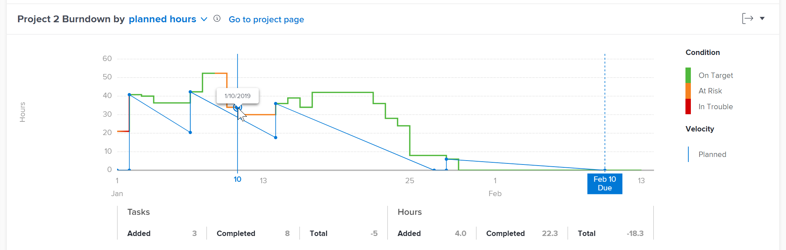
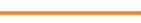

# Bekijk de Burndown-visualisatie in de uitgebreide analyse

<!-- Audited: 12/2023 -->

De burndown visualisatie toont de onderbreking van een specifiek project in tijd en helpt u het verband tussen projectvoorwaarde, snelheid, en het blijven uren-of dagen begrijpen.

## Toegangsvereisten

U moet de volgende toegang hebben om de stappen in dit artikel uit te voeren:

<table style="table-layout:auto"> 
 <col> 
 <col> 
 <tbody> 
  <tr> 
   <td role="rowheader">Adobe Workfront-plan</td> 
   <td>
      
Nieuw: alle

      
of

      
Huidig: Zakelijk of hoger
</td>
  </tr> 
  <tr> 
   <td role="rowheader">Adobe Workfront-licentie</td> 
   <td>
      
Nieuw: Licht of hoger

      
of

      
Huidig: Controleren of hoger

   </td> 
  </tr> 
  <tr> 
   <td role="rowheader">Configuraties op toegangsniveau</td> 
   <td> 
Toegang tot projecten weergeven
 </td> 
  </tr> 
  <tr> 
   <td role="rowheader">Objectmachtigingen</td> 
   <td> 
Weergave
 </td> 
  </tr> 
 </tbody> 
</table>

Zie voor meer informatie over de informatie in deze tabel [Toegangsvereisten in Workfront-documentatie](/help/quicksilver/administration-and-setup/add-users/access-levels-and-object-permissions/access-level-requirements-in-documentation.md).

## Vereisten

Voor eerste vereisten voor het gebruik van Enhanced Analytics raadpleegt u de sectie &quot;Voorwaarden&quot; in [Overzicht van uitgebreide analyses](../enhanced-analytics/enhanced-analytics-overview.md#prerequisites).

## Begrijp de Burndown visualisatie

De effen blauwe lijn toont de geplande snelheid vanaf de begindatum tot de geplande einddatum. Deze lijn past zich aan aangezien het werk wordt toegevoegd, verwijderd of bijgewerkt, en het verandert in een onderbroken verticale lijn wanneer het project de geplande voltooiingsdatum bereikt.

De daadwerkelijke lijn toont het aantal uren-of dagen-besteed aan het project in tijd. De kleur van deze lijn wijst op de voorwaarde van het project elke dag:

* **Groen**: Het project is op doel.

  

* **Oranje**: Het project loopt gevaar.

  

* **Rood**: Het project zit in de problemen.

  

Zie voor meer informatie over deze projectvoorwaarden [Overzicht van het type Projectvoorwaarde en Voorwaarde](../manage-work/projects/manage-projects/project-condition-and-condition-type.md).

Wanneer de daadwerkelijke lijn verticaal omhoog beweegt, is het werk toegevoegd aan het project. Wanneer de lijn verticaal naar beneden beweegt, is het werk verwijderd of voor het project voltooid.

Onder de x as van de visualisatie, kunt u meer informatie over zien hoe de taken en uren-of dagen-veranderd op een bepaalde dag (de toegevoegde hoeveelheid, de voltooide hoeveelheid, en het verschil tussen twee).

Door al deze informatie te bekijken in de Burndown-visualisatie kunt u beter bepalen:

* De gezondheid van het afzonderlijke project in de loop van de tijd
* De invloed van problemen die zich voordoen (of ongeplande werkzaamheden) op de geplande werkzaamheden
* Welke gebeurtenissen uw project voorbij de originele voltooiingsdatum verlengden

Ga voor meer informatie over de beste gegevens voor deze visualisatie naar [Overzicht van uitgebreide analyses](../enhanced-analytics/enhanced-analytics-overview.md).

## De Burndown-visualisatie weergeven

{{step1-to-analytics}}

1. (Optioneel) Als u een ander datumbereik wilt gebruiken, selecteert u nieuwe begin- en einddatums in het filter voor het datumbereik.

   

   Voor informatie over het gebruik van het filter Datumbereik raadpleegt u [Filters toepassen in uitgebreide analyse](../enhanced-analytics/use-enhanced-analytics-filters.md).

1. (Voorwaardelijk) als u de reeks van projectgegevens moet beperken, selecteer en pas de filters toe die u wilt gebruiken.

   Zie voor meer informatie over het toevoegen van filters in Verbeterde analysemogelijkheden [Filters toepassen in uitgebreide analyse](../enhanced-analytics/use-enhanced-analytics-filters.md).

   Nadat u filters hebt toegevoegd, worden er gegevens voor maximaal 50 projecten weergegeven en blijven de filters actief, zelfs nadat u de pagina hebt verlaten of zich hebt afgemeld bij Workfront.

1. (Optioneel) Als u wilt inzoomen op een datumbereik, selecteert u een punt in de visualisatie voor het begin van het datumbereik en sleept u het punt naar het einde van het datumbereik.

   Alle andere visualisaties worden bijgewerkt naar hetzelfde datumbereik en er wordt automatisch een tijdframefilter gemaakt.

   

1. Voor het Vluchtplan of de visualisatie van de treemap van het Project, klik een project om meer informatie te bekijken.

   De Burndown- en Taken in vluchtvisualisaties worden weergegeven.

   >[!NOTE]
   >
   >Zie voor meer informatie over deze andere visualisaties:
   >
   >   * [Bekijk de visualisatie van het vliegplan in de uitgebreide analyse](../enhanced-analytics/flight-plan-overview.md)
   >   * [Bekijk de visie van de projectreemap in Verbeterde analyse](../enhanced-analytics/project-treemap-overview.md)
   >   * [De taken tijdens de visualisatie van de vlucht bekijken in Verbeterde analyse](../enhanced-analytics/tasks-in-flight-overview.md)
   >

1. (Optioneel) Wijzig de weergave van geplande uren in **duur**.

   Geplande uren zijn standaard geselecteerd.

   >[!NOTE]
   >
   >Selecteren **duur** Hiermee wijzigt u alle uren informatie in dagen.\
   >\
   >Zie de sectie over de weergave Duur in het gedeelte Verbeterde analyse voor meer informatie over de duur in het gedeelte Verbeterde analyse. [Overzicht van uitgebreide analyses](../enhanced-analytics/enhanced-analytics-overview.md#duration-view).

1. Klik op een punt in de lijngrafiek.

   De nauwkeurige datumvertoningen en verdere informatie over taken en uren-of dagen-voor de geselecteerde dag toont onder de grafiek.

   

   >[!NOTE]
   >
   >Als de daadwerkelijke snelheid een vlakke lijn is die langs de x as (gealigneerd met 0 uren of 0 dagen) van visualisatie loopt, betekent dit dat geen geplande uren-of dagen-werden toegevoegd aan het project.\
   >Als de werkelijke snelheid een vlakke lijn boven de x-as is (in lijn met een aantal uren of dagen) die nooit omlaag gaat, betekent dit dat er geen taken zijn uitgevoerd binnen de gefilterde tijdsperiode.

1. (Optioneel) Als u de visualisatiegegevens wilt exporteren, klikt u op **Exporteren** pictogram in de rechterbovenhoek van de visualisatie en selecteer de exportindeling:

   * Diagram (PNG)
   * Gegevenstabel (XSLX)

1. (Optioneel) Als u meer informatie wilt over de voortgang van taken in het geselecteerde project, bekijkt u de taken in de visualisatie van de vlucht die onder de Burndown-visualisatie wordt weergegeven. Zie voor meer informatie [De taken tijdens de visualisatie van de vlucht bekijken in Verbeterde analyse](/help/quicksilver/enhanced-analytics/tasks-in-flight-overview.md).
