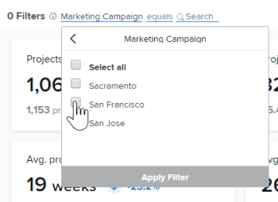

# Filters toepassen in uitgebreide analyse

De filters in het Verbeterde analysegebied helpen u zich op specifieke projecten of specifieke soorten gegevens concentreren. De typen filters die u gebruikt, kunnen u inzicht geven in:

* Projecten die u bezit
* Specifieke portfolio- of programmaweergaven
* Belangrijkste prestatie - indicatoren voor een specifiek tijdsbestek (week, kwartaal, boekjaar)

Desgewenst kunt u filters toevoegen en verwijderen en behoudt Adobe Workfront de filters die u toepast, ook als u zich afmeldt.

## Toegangsvereisten

Om deze taak te voltooien, moet u het volgende hebben:

<table style="table-layout:auto"> 
 <caption style="text-align: left;">
  *Neem contact op met uw Workfront-beheerder om te weten te komen welk abonnement, licentietype of toegang u hebt.
 </caption> 
 <col> 
 <col> 
 <tbody> 
  <tr> 
   <td> 
<a href="https://www.workfront.com/plans" target="_blank">Workfront-plan</a>*
 </td> 
   <td>Zakelijk of hoger</td> 
  </tr> 
  <tr> 
   <td> 
<a href="../administration-and-setup/add-users/access-levels-and-object-permissions/wf-licenses.md" class="MCXref xref">Overzicht van Adobe Workfront-licenties</a>*
 </td> 
   <td> 
Controleren of hoger
 </td> 
  </tr> 
  <tr> 
   <td><b>Toegangsniveau*</b> </td> 
   <td> 
Toegang tot projecten weergeven
 
U moet de toegang van de Mening tot Taken, Portfolio's, en Gebruikers ook hebben om specifieke de filteropties van het projectgebied te zien.
 
Opmerking: als er beperkingen zijn geselecteerd in de sectie Aanvullende beperkingen instellen van het dialoogvenster Toegangsniveau bewerken, ziet u mogelijk niet alle informatie in de filters of op de pagina Uitgebreide analyse nadat het filter is toegepast. Voor informatie over hoe een beheerder van Workfront uw toegangsniveau kan veranderen, zie <a href="../administration-and-setup/add-users/configure-and-grant-access/create-modify-access-levels.md" class="MCXref xref">Aangepaste toegangsniveaus maken of wijzigen</a>.
 </td> 
  </tr> 
  <tr> 
   <td> 
<b>Objectmachtigingen</b> 
 </td> 
   <td> 
Weergave
 
Voor informatie over het aanvragen van aanvullende toegang raadpleegt u <a href="../workfront-basics/grant-and-request-access-to-objects/request-access.md" class="MCXref xref">Toegang tot objecten aanvragen </a>.
 </td> 
  </tr> 
 </tbody> 
</table>

## Vereisten

Voor eerste vereisten voor het gebruik van Enhanced Analytics raadpleegt u [Vereisten](../enhanced-analytics/enhanced-analytics-overview.md#prerequi) in [Overzicht van uitgebreide analyses](../enhanced-analytics/enhanced-analytics-overview.md).

## Het filter voor het datumbereik wijzigen {#change-the-date-range-filter}

Standaard worden in de visualisaties in het gedeelte Enhanced Analytics gegevens weergegeven voor de laatste 60 dagen en de volgende 15 dagen. U kunt een nieuw datumbereik selecteren en dit toepassen op alle visualisaties in het gedeelte Uitgebreide analyse. Als u bij de pagina vandaan navigeert, wordt het standaarddatumbereik toegepast de volgende keer dat u terugnavigeert.

>[!TIP]
>
>U kunt ook met de toetsen op het toetsenbord naar een datumbereik in de kalenderwidget navigeren, deze openen en selecteren.\
>Zie de klasse [Sneltoetsen](../enhanced-analytics/enhanced-analytics-overview.md#keyboard) in het artikel [Overzicht van uitgebreide analyses](../enhanced-analytics/enhanced-analytics-overview.md).

Een nieuw datumbereik selecteren:

1. Klik op het pictogram Hoofdmenu selecteert u vervolgens **Analyse**.
1. Klik in de rechterbovenhoek van het scherm op het datumbereikveld om de kalenderweergave te openen.
1. Gebruik de pijlen boven de kalender om van de maand van uw begindatum de plaats te bepalen, dan selecteer de begindatum.

   

1. Gebruik de pijlen boven de kalender om van de maand van uw einddatum de plaats te bepalen, dan selecteer de einddatum.
1. (Optioneel) Als u wilt inzoomen op een kleiner datumbereik, sleept u de muis van een bepaalde datum naar een andere datum op een van de visualisaties.

   Alle visualisaties op het scherm worden bijgewerkt zodat deze overeenkomen met het geselecteerde tijdframe en er wordt een tijdframfilter weergegeven naast bestaande filters. Dit filter blijft niet behouden als u zich afmeldt of wegnavigeert van het gebied Uitgebreide analyse.

   

## Een filter toevoegen

U kunt filters toevoegen die op standaardprojectgebieden, de gebieden van de Vorm van de Douane, en huisteams worden gebaseerd die aan projecten worden toegewezen.

>[!TIP]
>
>U kunt ook de toetsen op het toetsenbord gebruiken om naar een nieuw filter te navigeren en dit filter toe te voegen.\
>Zie de klasse [Sneltoetsen](../enhanced-analytics/enhanced-analytics-overview.md#keyboard) in het artikel [Overzicht van uitgebreide analyses](../enhanced-analytics/enhanced-analytics-overview.md).

* [Een projectveldfilter toevoegen](#add-a-project-field-filter)
* [Een projectveldfilter toevoegen](#add-a-project-field-filter)
* [Een teamfilter toevoegen](#add-a-team-filter)

### Een projectveldfilter toevoegen {#add-a-project-field-filter}

Met projectveldfilters kunt u gegevens filteren voor projecten en taken op basis van de waarden die zijn ingevoerd in velden die standaard zijn opgenomen in projecten.

De volgende filtertypen voor projectvelden zijn beschikbaar:

| **Project** | De gegevens van vertoningen voor slechts geselecteerde project(en) |
|---|---|
| **Programma** | Gegevens worden alleen weergegeven voor projecten in de geselecteerde programma&#39;s |
| **Portfolio** | Gegevens worden alleen weergegeven voor projecten in de geselecteerde portfolio(s) |
| **Voorwaarde** | De gegevens van vertoningen voor slechts projecten die onlangs de geselecteerde voorwaarde(n) hadden (op doel, bij risico, of in probleem) |
| **Status** | Hiermee geeft u alleen gegevens weer voor projecten met de meest recente geselecteerde status (voltooid, huidig, in de wachtstand, geannuleerd, enzovoort) |
| **Sponsor** | Hiermee geeft u gegevens weer voor alleen projecten met de geselecteerde sponsor(en) |
| **Projecteigenaar** | De gegevens van vertoningen voor slechts projecten met de geselecteerde projecteigenaar(s) |

{style="table-layout:auto"}

Aangepaste formulierfilters werken anders. Zie voor meer informatie [Een projectveldfilter toevoegen](#add-a-project-field-filter).

Een projectveldfilter toevoegen:

1. Klik op het pictogram Hoofdmenu selecteert u vervolgens **Analyse**.
1. Klik in de linkerbovenhoek van het scherm op **Filter toevoegen** Selecteer vervolgens het gewenste filtertype.

   >[!NOTE]
   >
   >Verschillende filtertypen geven verschillende gegevens weer. U kunt slechts één filtertype in een filter gebruiken. Na geselecteerd, is een filtertype niet beschikbaar om in een andere filter van het projectgebied te gebruiken.

1. Zoek de waarden waarvoor u gegevens wilt zien door ten minste 3 tekens tekst in te voeren in het dialoogvenster **Zoeken** selecteert u vervolgens elke waarde die u in het filter wilt opnemen.

   Klik op **Alles selecteren**.

   

1. Klik op **Filter toepassen**.\
   Het aantal projecten in de rechterbovenhoek van de pagina wordt bijgewerkt met de filters die u hebt toegepast.
1. Herhaal deze stappen voor elk filter dat u wilt toevoegen.

   Terwijl u filters toevoegt, worden gegevens in de onderstaande visualisaties weergegeven voor maximaal 50 projecten.

   >[!TIP]
   >
   >Om gegevens voor meer dan 50 projecten te zien die door gebrek tonen, kunt u:
   >
   >   
   >   
   >   * Gebruik de pijlen in de linkerbenedenhoek om de volgende 50 projecten in die visualisatie te tonen.\
   >     
   >   
   >   * Gebruik de Soort door drop-down menu op een visualisatie om de projecten in een verschillende orde te bekijken.\
   >     
   >   
   >   
   >

   Als u het datumbereik wilt aanpassen, raadpleegt u [Het filter voor het datumbereik wijzigen](#change-the-date-range-filter).

### Een projectaangepast formulierfilter toevoegen

Het filtertype van de Vorm van de Douane staat u toe om gegevens voor projecten en taken te filtreren die op de waarden in de gebieden van de Vorm van de Douane op projecten worden gebaseerd. In tegenstelling tot andere filtertypen voor uitgebreide analyse kunt u meerdere aangepaste formulierfilters toevoegen. Elk filter Aangepast formulier bevat waarden die alleen worden ingevoerd in het geselecteerde veld op een specifiek aangepast formulier.

Een aangepast formulierfilter toevoegen:

1. Klik op het pictogram Hoofdmenu selecteert u vervolgens **Analyse**.
1. Klik in de linkerbovenhoek van het scherm op **Filter toevoegen** selecteert u vervolgens **Aangepast formulier**.

   

1. Zoek het gewenste aangepaste formulier door ten minste 3 tekens in te voeren in het tekstvak **Zoeken** en selecteert u het aangepaste formulier.
1. Selecteer het gewenste veld en voer een van de volgende handelingen uit op basis van het type veld dat u aan het filter toevoegt:

   >[!NOTE]
   >
   >Niet alle veldtypen Aangepast formulier kunnen aan een filter worden toegevoegd. Uitgebreide analyses ondersteunen momenteel alleen de hierboven vermelde veldtypen.

   * **Selectievakje**, **vervolgkeuzelijst**, of **keuzerondje**: Selecteer elke waarde in het geselecteerde veld die u in het filter wilt opnemen of klik op de knop **Alles selecteren** selectievakje.\
     

   * **Datum**: Gebruik de pijlen om naar een bepaalde maand te navigeren en selecteer vervolgens de datum in het geselecteerde veld die u in het filter wilt opnemen.\
     

   * **Tekst**: Voer de tekst in het geselecteerde veld in die u in het filter wilt opnemen.\
     

   * **Getal**: Voer het nummer in het geselecteerde veld in dat u in het filter wilt opnemen.\
     

1. Nadat u de waarden hebt ingevoerd of geselecteerd waarvoor u wilt filteren, klikt u op **Filter toepassen**.

   Het aantal projecten in de rechterbovenhoek van de pagina wordt bijgewerkt met de filters die u hebt toegepast.

1. Herhaal deze stappen voor elk filter dat u wilt toevoegen.

   Terwijl u filters toevoegt, worden gegevens in de onderstaande visualisaties weergegeven voor maximaal 50 projecten.

   >[!TIP]
   >
   >Om gegevens voor meer dan 50 projecten te zien die door gebrek tonen, kunt u:
   >
   >   
   >   
   >   * Gebruik de pijlen in de linkerbenedenhoek om de volgende 50 projecten in die visualisatie te tonen.\
   >     
   >   
   >   * Gebruik de Soort door drop-down menu op een visualisatie om de projecten in een verschillende orde te bekijken.\
   >     
   >   
   >   
   >

   Als u het datumbereik wilt aanpassen, raadpleegt u [Het filter voor het datumbereik wijzigen](#change-the-date-range-filter).

### Een teamfilter toevoegen {#add-a-team-filter}

1. Klik op het pictogram Hoofdmenu selecteert u vervolgens **Analyse**.
1. Klik in het linkerdeelvenster op **Mensen**.

   

1. Klik in de linkerbovenhoek van het scherm op **Filter toevoegen** en selecteert u vervolgens de **Team** filter.
1. Zoek de teams waarvoor u gegevens wilt zien door ten minste 3 tekens tekst in te voeren in het dialoogvenster **Zoeken** selecteert u vervolgens elk team dat u in het filter wilt opnemen. Om alle teams te selecteren, klik **Alles selecteren**.

   

   >[!NOTE]
   >
   >Alle teams zijn inbegrepen als filteropties, ongeacht uw toegangsniveau.

1. Klik op **Filter toepassen**.

   Terwijl u filters toevoegt, worden de gegevens weergegeven in de onderstaande visualisaties.

   Als u het datumbereik wilt aanpassen, raadpleegt u [Het filter voor het datumbereik wijzigen](#change-the-date-range-filter).

## Een filter verwijderen

U kunt op elk gewenst moment een filter verwijderen. Als u een filter verwijdert, wordt het de volgende keer dat u het uitgebreide analysegebied bezoekt, niet weergegeven.

>[!TIP]
>
>U kunt ook toetsen op het toetsenbord gebruiken om naar een bestaand filter te navigeren en dit te verwijderen.\
>Zie de klasse [Sneltoetsen](../enhanced-analytics/enhanced-analytics-overview.md#keyboard) in het artikel [Overzicht van uitgebreide analyses](../enhanced-analytics/enhanced-analytics-overview.md).

Een filter verwijderen:

1. Klik op het pictogram Hoofdmenu selecteert u vervolgens **Analyse**.
1. Als u een werkfilter wilt verwijderen, blijft u in het dialoogvenster **Werk** gebied.

   of

   Als u een filter Mensen wilt verwijderen, selecteert u **Mensen** in het linkerdeelvenster.

1. Zoek het gewenste filter en klik op de knop **X** om het te verwijderen.

   

   Het filter is niet meer actief en wordt alleen weergegeven als u het opnieuw toevoegt.
