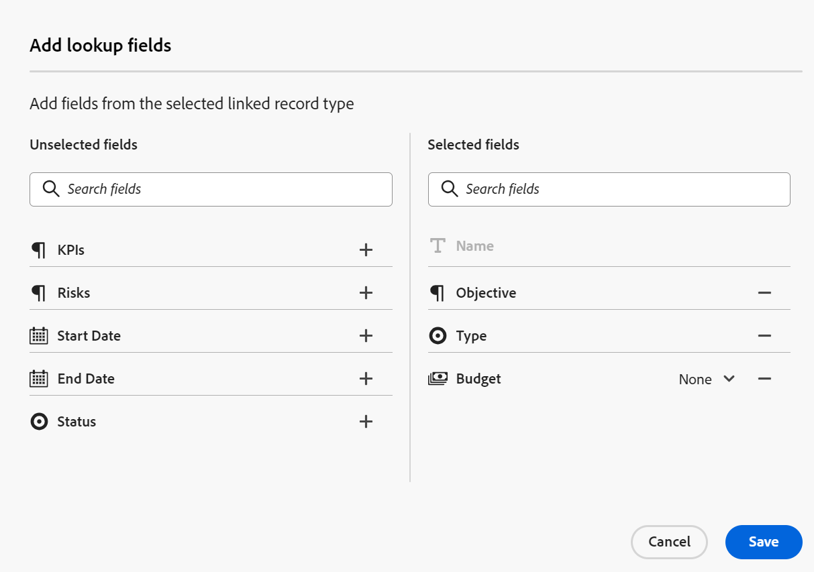

<!-----
title: Connect record types
description: A way to indicate how individual record types relate to one another is to connect them. Also, you can connect Maestro record types with object types from other applications to enhance your users' experience and keep their focus in one application.
hidefromtoc: yes
hide: yes
feature: Work management
role: User
author: Alina
--->

<!--update the metadata with real information when making this avilable in TOC and in the left nav-->
<!--************ THIS MIGHT NO LONGER BE A 'RELATIONSHIP' TYPE FIELD, BECAUSE THEY WILL SHOW IT IN THE CONNECTION TAB*****************************-->

# Verbind recordtypen

>[!IMPORTANT]
>
>Adobe Maestro maakt momenteel deel uit van een bètaprogramma dat voor een beperkt aantal klanten toegankelijk is.
>
>Neem contact op met uw accountvertegenwoordiger voor meer informatie over deelname aan het bètaprogramma voor Maestro.
>
>Zie voor meer informatie [Overzicht van Adobe Maestro](../maestro-overview.md).

Met Adobe Maestro kunt u volledig aanpasbare werkruimten ontwerpen die recordtypen bevatten die in uw organisatie nodig zijn. Een manier om aan te geven hoe individuele recordtypen op elkaar betrekking hebben, is ze met elkaar te verbinden. Bovendien kunt u Maestro-recordtypen verbinden met objecttypen van andere toepassingen om de gebruikerservaring te verbeteren en de focus in één toepassing te houden.

U kunt het volgende verbinden:

* Typen maestro-operationele registers
* Operationeel Maestro-recordtypen naar taxonomische recordtypen
* Operationele recordtypen van Maestro en objecttypen van andere toepassingen.

Op deze manier kunt u velden van het gekoppelde record of objecttype weergeven op een andere Maestro-record.

In dit artikel wordt beschreven hoe u twee Maestro-recordtypen of een Maestro-recordtype kunt verbinden met een object uit een andere toepassing.

Nadat de verbinding tussen record- of objecttypen tot stand is gebracht, kunt u afzonderlijke records met elkaar verbinden.

Zie voor meer informatie over het verbinden van een Maestro-record met een object vanuit een andere toepassing [Connect-records](../records/connect-records.md).

Zie voor een voorbeeld van het verbinden van recordtypen [Voorbeeld van het verbinden van recordtypen en records](../architecture-and-fields/example-connect-record-types-and-records.md).

<!--ensure this last linked article is right; the title and the link should have changed-->

## Toegangsvereisten

U moet de volgende toegang hebben om de stappen in dit artikel uit te voeren:

<table style="table-layout:auto">
 <col>
 </col>
 <col>
 </col>
 <tbody>
    <tr>
<tr>
<td>
   
 Adobe
 </td>
   <td>
   
 Adobe Workfront
 </td>
  </tr>  
 <td role="rowheader">
Adobe Workfront-overeenkomst
</td>
   <td>

Uw organisatie moet zijn ingeschreven voor het afgesloten bètaprogramma van de Adobe Maestro. Neem contact op met uw accountvertegenwoordiger voor meer informatie over dit nieuwe aanbod. 

   </td>
  </tr>
  <tr>
   <td role="rowheader">
Adobe Workfront-plan
</td>
   <td>

Alle

   </td>
  </tr>
  <tr>
   <td role="rowheader">
Adobe Workfront-licentie
</td>
   <td>
   
Alle
 
  </td>
  </tr>

<tr>
   <td role="rowheader">Toegangsniveau</td>
   <td> 
Alle
  
</td>
  </tr>

<tr>
   <td role="rowheader">Lay-outsjabloon</td>
   <td> 
Uw systeembeheerder moet het gebied Maestro in uw lay-outmalplaatje toevoegen. Zie voor meer informatie <a href="../access/grant-access.md">Toegang verlenen tot Adobe Maestro</a>. 
  
</td>
  </tr>
 </tbody>
</table>

<!--Maybe enable this at GA - but Maestro is not supposed to have Access controls in the Workfront Access Level: 
>[!NOTE]
>
>If you don't have access, ask your Workfront administrator if they set additional restrictions in your access level. For information on how a Workfront administrator can change your access level, see [Create or modify custom access levels](../administration-and-setup/add-users/configure-and-grant-access/create-modify-access-levels.md). -->

<!-- Notes to add for the table: for the "Workfront plans" row: the above is only for closed beta; when going to GA - activate the following plans:    

Current plan: Prime and Ultimate

Legacy plan: Enterprise
-->

<!-- Notes for the table: for the "Workfront access" row: 
For more information, see <a href="../../administration-and-setup/add-users/access-levels-and-object-permissions/wf-licenses.md" class="MCXref xref">Adobe Workfront licenses overview</a>.
-->

## Overwegingen bij het verbinden van recordtypen

* U kunt de volgende entiteiten verbinden in Maestro:

   * Twee typen operationeel record
   * Twee taxonomieën
   * Een operationeel recordtype en een taxonomie
   * Een operationeel recordtype en een objecttype van een andere toepassing.

     >[!TIP]
     >
     >    U kunt een taxonomie recordtype niet verbinden met een operationeel recordtype of met een objecttype van een andere toepassing.

* U kunt de volgende objecten vanuit de volgende toepassingen verbinden met Maestro-recordtypen:

   * Adobe Workfront:

      * Projecten
      * Portfolio&#39;s
      * Programma&#39;s
      * Bedrijven
      * Groepen

* Nadat u een recordtype met een ander verslagtype of met een objecten type van een andere toepassing verbindt, bestaan de volgende scenario&#39;s:

   * Wanneer u twee recordtypen verbindt: Een Gekoppeld verslaggebied wordt gecreeerd op het verslagtype u van verbindt. Er wordt een vergelijkbaar veld voor gekoppelde records gemaakt op het recordtype waarmee u verbinding maakt.

     Als u bijvoorbeeld het recordtype ‘Campagne’ aansluit op het recordtype ‘Product’, wordt een gekoppeld recordveld met de naam ‘Gekoppeld product’ gemaakt op het recordtype ‘Campagne’ en wordt een gekoppeld recordtype met de naam ‘Campagne’ gemaakt op het recordtype ‘Product’.

   * Wanneer u een recordtypeveld verbindt met een taxonomie: Een verbonden verslaggebied wordt gecreeerd op het verslagtype u van verbindt. Er wordt geen gekoppeld recordveld gemaakt in de taxonomie waarmee u verbinding maakt.

     Als u bijvoorbeeld het recordtype &#39;Campagne&#39; verbindt met het taxonomie-recordtype &#39;Publiek&#39;, wordt een gekoppeld recordveld met de naam &#39;Gekoppeld publiek&#39; gemaakt in het recordtype &#39;Campagne&#39;. Er wordt geen gekoppeld recordveld met de naam &quot;Campagne&quot; gemaakt in het recordtype Audience taxonomy. <!--this might be temporary-->

   * Wanneer u een recordtypeveld verbindt met een objecttype van een andere toepassing: Een verbonden verslaggebied wordt gecreeerd op het verslagtype u van verbindt. Er wordt automatisch geen gekoppeld recordveld gemaakt voor het Workfront-project in Workfront. Een gekoppeld recordveld wordt alleen in het recordtype van het Workfront-object gemaakt wanneer de feitelijke objecten met de Maestro-records zijn verbonden.

     Zie voor meer informatie [Connect-records](../records/connect-records.md).

* Nadat u de recordtypen hebt verbonden, kunt u meerdere velden van het ene recordtype verbinden met een ander recordtype. Deze velden worden &#39;gekoppelde velden&#39; of &#39;opzoekvelden&#39; genoemd.
* Gekoppelde recordvelden worden voorafgegaan door een relatiepictogram .
* Nadat u afzonderlijke records voor een recordtype hebt gemaakt, kunt u de records waarmee u verbinding maakt, selecteren in het veld voor het gekoppelde recordtype. Zie voor meer informatie [Connect-records](../records/connect-records.md).
* U kunt de gegevens van de gekoppelde velden niet bewerken vanuit het recordtype waaruit u een koppeling maakt, omdat deze automatisch worden ingevuld vanaf het oorspronkelijke recordtype waartoe ze behoren zodra u de gekoppelde records selecteert.

## Verbind recordtypen

<!--when changes here, also update the article for "Connect records"-->

1. Klik op de knop **Hoofdmenu** pictogram  in de rechterbovenhoek van Workfront <!---or the **Main menu** icon   in the upper-left corner, if available--> klik vervolgens op **Maestro** .

   De laatst geopende werkruimte moet standaard worden geopend.

1. (Optioneel) Vouw de pijl omlaag naar rechts uit van de naam van een bestaande werkruimte en selecteer de werkruimte waaruit u recordtypen wilt verbinden.
1. Klik op de kaart van een recordtype om de pagina met recordtypen te openen.
1. Klik op de knop **+** in de rechterbovenhoek van de tabelweergave klikt u op de knop **Nieuwe verbinding** tab.

   
1. In de **Recordtype** Selecteer een van de volgende opties in het veld: <!--is the field name spelled right? lowercase "t"?-->

   * Een ander type operationeel record
   * Een taxonomie
   * Een Workfront Project, Portfolio, Programma, Bedrijf, of Groep.

   

   >[!TIP]
   >
   > Alleen recordtypen en taxonomieën uit de geselecteerde werkruimte kunnen worden geselecteerd.

1. Werk de volgende gegevens bij:

   * **Naam**: De naam van het verbonden veld, zoals deze wordt weergegeven in de tabelweergave of op de pagina Details van het oorspronkelijke recordtype. Hiermee maakt u de gekoppelde recordkolom in de tabelweergave van het oorspronkelijke recordtype of het gekoppelde recordveld voor de oorspronkelijke records. <!--ensure they updated this; and update the screen shot: it used to be "Label"-->

   >[!TIP]
   >
   >We raden u aan de naam van de record waarnaar u een koppeling maakt, op te nemen in de naam van het verbonden recordveld om vast te leggen van welk recordtype het nieuwe veld afkomstig is. De naam van de gekoppelde record is niet zichtbaar in het nieuwe gekoppelde recordveld of de gekoppelde velden ervan.

   * **Beschrijving**: Aanvullende informatie over het verbonden recordveld. De beschrijving van een veld wordt weergegeven wanneer u de cursor op de kolom van het veld in een tabel plaatst.
   * **Meerdere records toestaan**: Selecteer deze optie om aan te geven dat gebruikers meerdere records mogen toevoegen wanneer het veld voor het gekoppelde recordtype wordt weergegeven op de oorspronkelijke records. Dit is standaard geselecteerd.
   * **Opzoekvelden selecteren**: Selecteer deze optie om velden van het geselecteerde recordtype toe te voegen. Dit is standaard geselecteerd.

1. Klikken **Maken**.

1. (Voorwaardelijk) Als u het Uitgezochte raadplegingsgebied dat in de vorige stap selecteerde, **Opzoekvelden toevoegen** wordt geopend.

   Klik op de knop **+** pictogram om velden toe te voegen van de **Niet-geselecteerde velden** gebied.

   of

   Klik op de knop **-** pictogram om velden te verwijderen uit het dialoogvenster **Geselecteerde velden** gebied

   

   >[!NOTE]
   >
   >Als u geen van de velden selecteert, worden de **Naam** van de gekoppelde record is het enige zichtbare veld in de tabelweergave van de oorspronkelijke record. De **Naam** veld kan niet worden verwijderd.

1. (Optioneel en voorwaardelijk) Als u een getal, valuta, percentage of datumveld wilt koppelen, selecteert u ook een aggregatorwaarde. De waarden voor de gekoppelde velden worden gescheiden door komma&#39;s of als een geaggregeerde waarde weergegeven volgens de aggregator die u kiest, wanneer gebruikers meer dan één gekoppelde record selecteren in het veld voor gekoppelde records.

   

   Selecteer een van de volgende opties:

   * **Geen**: Geeft de waarden weer die afkomstig zijn van meerdere records gescheiden door komma&#39;s. Dit is de standaardselectie.
   * **MAX**: geeft de hoogste waarde weer van alle waarden die afkomstig zijn van meerdere records die in het gekoppelde recordveld zijn geselecteerd.
   * **MIN**: geeft de laagste waarde weer van alle waarden die afkomstig zijn van meerdere records die in het gekoppelde recordveld zijn geselecteerd.
   * **SUM**: geeft het totaal weer van alle waarden die afkomstig zijn van meerdere records die in het gekoppelde recordveld zijn geselecteerd.
   * **AVG**: geeft het gemiddelde weer van alle waarden die afkomstig zijn van meerdere records die in het gekoppelde recordveld zijn geselecteerd.

   >[!NOTE]
   >
   >U kunt bijvoorbeeld een koppeling maken naar de productrecord (gekoppelde record) in de campagnerecord (oorspronkelijke record) en deze de naam &quot;Productveld&quot; geven. U kunt er ook voor kiezen om het veld Begroting van de productrecord te koppelen aan de campagnerecord en deze &quot;Productbudget&quot; te noemen. Als u meerdere records in het veld &quot;Product&quot; mocht selecteren, kunt u Product 1 selecteren met een budget van € 120.000 en Product 2 met een budget van € 100.000. U kunt de volgende begrotingsinformatie in het gekoppelde veld van de oorspronkelijke record weergeven, afhankelijk van de aggregator die u kiest:
   >
   >* **Geen**: $120.000, $100.000
   >* **MAX**: $120.000
   >* **MIN**: $100.000
   >* **SUM**: $ 220.000
   >* **AVG**: $110.000
   >

1. (Optioneel) Gebruik de opdracht **zoeken** pictogram  om een veld te zoeken.

1. (Optioneel) Klik op **Overslaan** als u geen velden van het verbonden recordtype wilt toevoegen.

1. Klikken **Velden toevoegen** om uw wijzigingen op te slaan.

   Het volgende wordt toegevoegd:

   * Het gekoppelde recordveld waarin de records van het gekoppelde recordtype worden weergegeven nadat u ze handmatig hebt toegevoegd. De naam van het gekoppelde recordveld is de naam die u in stap 6 hebt geselecteerd. <!-- ensure this is still accurate-->

   * Het gekoppelde veld (of velden) waarin informatie uit de velden van het gekoppelde recordtype wordt weergegeven nadat u de records handmatig hebt toegevoegd in het gekoppelde recordveld. De gekoppelde velden worden alleen gemaakt wanneer de **Opzoekvelden selecteren** Deze instelling wordt geselecteerd bij het maken van de verbinding. De gekoppelde velden krijgen een naam volgens dit patroon:

     `<Name of the original field on the linked record> (from <Name of your linked field>)`

   * Een gekoppeld recordveld op het recordtype waarnaar u koppelt. De naam van het gekoppelde recordveld in het gekoppelde recordtype is de naam van het recordtype dat u koppelt.

     Als u bijvoorbeeld het recordtype &quot;Product&quot; koppelt aan het recordtype &quot;Campagne&quot; en u het verbonden veld van de campagne &quot;Gekoppeld product&quot; een naam geeft, wordt een veld &quot;Campagne&quot; gemaakt voor het recordtype product.

     <!--is the statement in the note below still accurate?? they were working on removing this from taxonomies-->

     >[!NOTE]
     >
     >Het gekoppelde recordveld waarin het recordtype wordt weergegeven dat u koppelt, wordt niet toegevoegd aan recordtypen wanneer u een recordtype verbindt met het volgende: <!--is this temporary for taxonomies??-->
     >        
     >   * Een taxonomie.
     >   * Een objecttype uit een andere toepassing.

1. (Optioneel) Klik in het oorspronkelijke recordtype of in de tabelweergave van het gekoppelde recordtype op de vervolgkeuzelijst rechts van het gekoppelde recordveld en klik op een van de volgende opties:

   * **Veld bewerken**: U kunt het dialoogvenster **Naam** en de **Beschrijving** informatie over het veld.
   * **Opzoekvelden bewerken**: Voeg de velden van een gekoppelde record toe of verwijder deze.

   

   Als u velden wilt toevoegen of verwijderen, volgt u de aanwijzingen in stap 7-12 hierboven. <!--ensure these step numbers stay accurate-->

1. (Optioneel) Klik op de pijl omlaag in de koptekst van de gekoppelde record of velden en klik vervolgens op **Verwijderen**.

   Het recordveld en eventuele aanvullende opzoekvelden worden verwijderd en de velden en de gegevens ervan kunnen niet worden hersteld.

   >[!TIP]
   >
   >    Het gekoppelde recordveld in de record dat is gekoppeld vanuit de oorspronkelijke record, wordt niet verwijderd. <!-- is this still accurate?! -->

