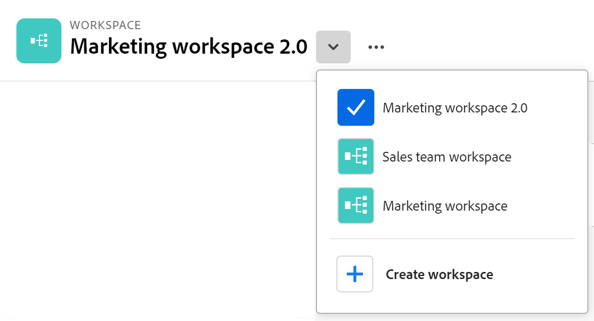

<!--udpate the metadata with real information when making this avilable in TOC and in the left nav-->

# Werkruimten maken

>[!IMPORTANT]
>
>De informatie in dit artikel heeft betrekking op Adobe Maestro, een nieuw aanbod van Adobe.
>
>Adobe Maestro maakt momenteel deel uit van een bètaprogramma dat voor een beperkt aantal klanten toegankelijk is.
>
>Neem contact op met uw accountvertegenwoordiger voor meer informatie over deelname aan het bètaprogramma voor Maestro.
>
>Zie voor meer informatie [Overzicht van Adobe Maestro](../maestro-overview.md).

In Adobe Maestro, zijn de werkruimten gecentraliseerde plaatsen voor teams om het werk te plannen.

Een werkruimte is een inzameling van operationele verslagtypes en taxonomieën die door een team worden gebruikt en vertegenwoordigt de het werklevenscyclus van het team. U kunt werkruimten volledig aanpassen in Maestro.

## Toegangsvereisten

U moet de volgende toegang hebben om de stappen in dit artikel uit te voeren:

<table style="table-layout:auto">
 <col>
 <tbody>
<td>
   
 Adobe
 </td>
   <td>
   
 Adobe Workfront
 </td>
  </tr>  
 <td role="rowheader">
Adobe Workfront-overeenkomst
</td>
   <td>

Uw organisatie moet zijn ingeschreven voor het afgesloten bètaprogramma van de Adobe Maestro. Neem contact op met uw accountvertegenwoordiger voor meer informatie over dit nieuwe aanbod. 

   </td>
  </tr>
  <tr>
   <td role="rowheader">
Adobe Workfront-plan
</td>
   <td>

Alle

   </td>
  </tr>
  <tr>
   <td role="rowheader">
Adobe Workfront-licentie
</td>
   <td>
   
Alle
 
  </td>
  </tr>

<tr>
   <td role="rowheader">Toegangsniveau</td>
   <td> 
Alle
  
</td>
  </tr>
<tr>
   <td role="rowheader">Lay-outsjabloon</td>
   <td> 
Uw systeembeheerder moet het gebied Maestro in uw lay-outmalplaatje toevoegen. Zie voor meer informatie <a href="../access/grant-access.md">Toegang verlenen tot Adobe Maestro</a>. 
  
</td>
  </tr>
 </tbody>
</table>

<!--Maybe enable this at GA - but Maestro is not supposed to have Access controls in the Workfront Access Level: 
>[!NOTE]
>
>If you don't have access, ask your Workfront administrator if they set additional restrictions in your access level. For information on how a Workfront administrator can change your access level, see [Create or modify custom access levels](../administration-and-setup/add-users/configure-and-grant-access/create-modify-access-levels.md). -->

<!-- Notes to add for the table: for the "Workfront plans" row: the above is only for closed beta; when going to GA - activate the following plans:    

Current plan: Prime and Ultimate

Legacy plan: Enterprise
-->

<!-- Notes for the table: for the "Workfront access" row: 
For more information, see <a href="../../administration-and-setup/add-users/access-levels-and-object-permissions/wf-licenses.md" class="MCXref xref">Adobe Workfront licenses overview</a>.
-->

## Overwegingen over werkruimten

* U kunt werkruimten voor specifieke organisatorische eenheden binnen uw organisatie tot stand brengen, om de unieke manier aan te passen elke eenheid werkt.
* De recordtypen en taxonomieën die een werkruimte bevat, moeten de levenscyclus van het werk van een organisatie weerspiegelen.
* Wanneer u een werkruimte maakt, kan iedereen in uw organisatie deze weergeven, bewerken of verwijderen.  <!--this will change with access levels and permissions-->
* U kunt maximaal 1.000 werkruimten in uw organisatie hebben.
* Werkruimten bevatten recordtypen die uniek zijn voor elke werkruimte. <!--this might change-->

## Een werkruimte maken

1. (Voorwaardelijk) Als u geen werkruimten in uw systeem hebt, klikt u op de knop **Hoofdmenu** pictogram  in de rechterbovenhoek van Workfront <!--or the **Main menu** icon   in the upper-left corner, if available--> klik vervolgens op **Maestro** .

   Of klik in een bestaande werkruimte op de knop voor het naar beneden wijzen rechts van de naam van de werkruimte en klik vervolgens op **Werkruimte maken**.

   

   Hiermee opent u het gedeelte Werkruimten van Maestro.
1. (Optioneel en voorwaardelijk) Klik op **Voorvertoning** binnen een van de volgende vooraf gedefinieerde werkruimtjablonen:

   * Marketing management
   * Verkoopbeheer
   * Productbeheer

   Er is een indicatie van welke operationele recordtypen, taxonomieën en hoeveel velden aan elke sjabloon zijn gekoppeld.

   

   Voor informatie over Maestro werkruimtemalplaatjes, zie [Lijst met werkruimtemalplaatjes](../architecture-and-fields/workspace-templates.md).

1. Klikken **Sjabloon gebruiken** om de werkruimte te maken op basis van de geselecteerde sjabloon

   of

   Klikken **Werkruimte maken** om een werkruimte helemaal opnieuw te maken.

   Er wordt een werkruimte gemaakt voor de volgende typen werkruimten:

   * Een lege werkruimte waarin u recordtypen handmatig kunt toevoegen.
   * Een werkruimte met voorbeeldrecordtypen die u verder kunt aanpassen.

1. Klik binnen de naam van de werkruimte in de koptekst van de nieuwe werkruimte om de naam ervan te wijzigen en druk vervolgens op Enter

   of

   Klik op de knop **Meer** menu rechts van de naam van de werkruimte in de koptekst klikt u op **Naam wijzigen**.

1. (Optioneel) Klik op **Recordtype toevoegen** om recordtypen toe te voegen aan de werkruimte.

   Zie voor meer informatie [Recordtypen maken](../architecture-and-fields/create-record-types.md).

1. (Optioneel) Klik op **taxonomie toevoegen** om taxonomieën toe te voegen aan de werkruimte.

   Zie voor meer informatie [taxonomieën maken](../architecture-and-fields/create-a-taxonomy.md).
