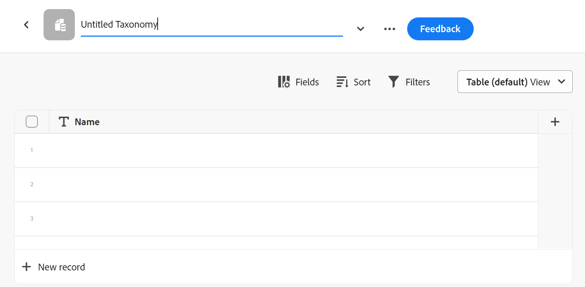

<!--udpate the metadata with real information when making this avilable in TOC and in the left nav-->

# Overzicht van recordtypen en taxonomieën

>[!IMPORTANT]
>
>Adobe Maestro maakt momenteel deel uit van een bètaprogramma dat voor een beperkt aantal klanten toegankelijk is.
>
>Neem contact op met uw accountvertegenwoordiger voor meer informatie over deelname aan het bètaprogramma voor Maestro.
>
>Zie voor meer informatie [Overzicht van Adobe Maestro](../maestro-overview.md).

In Workfront waar de objecttypen vooraf zijn gedefinieerd, kunt u in Adobe Maestro uw eigen objecttypen maken. In Workfront zijn bijvoorbeeld al de objecttypen Programma, Portfolio, Project, Taak of Probleem gemaakt.

Maestro-objecttypen worden &#39;recordtypen&#39; genoemd. Recordtypen zijn de bouwstenen van een Maestro-werkruimte. Zie voor informatie over werkruimten [Werkruimten maken](../architecture-and-fields/create-workspaces.md).

## Overzicht van recordtypen

In Maestro, kunt u de types van douaneverslag tot stand brengen die aan de behoeften van uw organisatie voldoen.

* Hieronder vindt u de volgende gegevenstypen van Maestro:

   * [Type operationeel record](#operational-record-type): Een recordtype dat strategische plannen, initiatieven of gepland werk vertegenwoordigt. Campagne, Activiteit, Tactiek, Opportunity kunnen bijvoorbeeld operationele recordtypen zijn.
   * [Taxonomie](#taxonomy): Typen opnemen die kenmerken vastleggen over een operationeel recordtype. Regio, Adres, Publiek kunnen bijvoorbeeld taxonomieën zijn.

* Wanneer u een recordtype maakt, kan iedereen in uw organisatie het recordtype weergeven, bewerken of verwijderen. <!--this will change with access levels and permissions-->
* U moet een werkruimte maken voordat u recordtypen voor de werkruimte kunt maken.
* U kunt in één werkruimte in totaal 1.000 typen operationele records en taxonomieën hebben. Dit omvat recordtypen of taxonomieën die u helemaal zelf maakt of die u van andere systemen importeert.

### Type operationeel record{#operational-record-type}

Een operationeel recordtype is een Maestro-recordtype dat werkgerelateerde objecten vertegenwoordigt.

Zie voor meer informatie over operationele recordtypen, zoals hoe u deze kunt maken [Recordtypen maken](../architecture-and-fields/create-record-types.md).

### Taxonomie{#taxonomy}

Een taxonomie is een recordtype dat kenmerken over een operationeel recordtype vastlegt.

Voor meer informatie over taxonomie registreert types, zie [Een taxonomie maken](../architecture-and-fields/create-a-taxonomy.md).

Hoewel het creëren van taxonomieën identiek is aan het creëren van operationele verslagtypes, maakt Maestro conceptueel onderscheid tussen een operationeel verslagtype en een type van taxonomiverslag. Het doel van taxonomieën is het verbeteren van de types van operationele verslagen. Taxonomieën mogen geen werkobjecten direct vertegenwoordigen.  <!--this is no longer true, but might be later?!: A taxonomy is a record without dates, like a static list of attributes.-->

<!--mimic what you did above for operational record types to say that we can also import taxonomies from other applications too - this will be possible later; for example Team would be a taxonomy record type, etc -->

Bijvoorbeeld, de Publiek, het Gebied, of het Adres kunnen taxonomie-type verslagtypes zijn.

Zie voor meer informatie [Een taxonomie maken](../architecture-and-fields/create-a-taxonomy.md).

## Gelijkwaardigheid en verschillen tussen de typen operationele registers en taxonomieën

De volgende tabel illustreert enkele overeenkomsten en verschillen tussen de typen operationele registers en taxonomieën:

| Recordtype en -kenmerk | Type operationeel record | Type taxonomirecord |
|-------------------------------------------------------------|:-----------------------:|:--------------------:|
| Ze maken deel uit van een werkruimte | ✓ | ✓ |
| U kunt ze automatisch maken vanuit een werkruimtemalplaatje | ✓ | ✓ |
| U kunt ze handmatig maken, helemaal opnieuw | ✓ | ✓ |
| U kunt deze maken door gegevens uit een extern bestand of een externe lijst te kopiëren en te plakken | ✓ | ✓ |
| U kunt een Excel- of CSV-bestand importeren | ✓ |                     |
| U kunt alleen-lezen recordtypen maken door vanuit andere toepassingen verbinding te maken met objecttypen | ✓ |                     |
| Zij vertegenwoordigen werkgerelateerde objecten | ✓ |                      |
| Ze vertegenwoordigen kenmerken van werkgerelateerde objecten |                         | ✓ |
| U kunt helemaal zelf maken | ✓ | ✓ |
| U kunt een Excel- of CSV-bestand importeren | ✓ |                      |
| U kunt het recordtype verbinden met een object vanuit een externe toepassing | ✓ |                      |
| U kunt verbinding maken met andere Maestro-recordtypen | ✓ |                    |
| U kunt de bijbehorende records in een tabelweergave bekijken | ✓ | ✓ |
| U kunt de bijbehorende records weergeven in een tijdlijnweergave | ✓ | ✓ |
