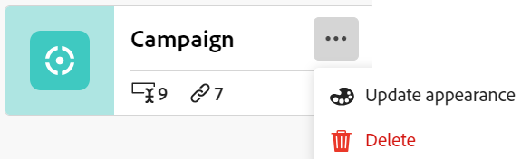

<!--update the metadata with real information when making this available in TOC and in the left nav
---
title: Edit record types
description: You can edit record types after they have been saved. Record types are the objec types of Adobe Maestro.
author: Alina
role: User
feature: Work Management 
topic: Architecture
hidefromtoc: yes
hide: yes
---

-->

# Recordtypen bewerken

>[!IMPORTANT]
>
>De informatie in dit artikel verwijst naar Adobe Maestro, een nieuw aanbod van Adobe Workfront.
>
>Adobe Maestro maakt momenteel deel uit van een bètaprogramma dat voor een beperkt aantal klanten toegankelijk is. U moet een Workfront-klant zijn om Maestro-mogelijkheden te kunnen gebruiken.
>
>Neem contact op met uw accountvertegenwoordiger voor meer informatie over deelname aan het bètaprogramma voor Maestro.
>
>Zie voor meer informatie [Overzicht van Adobe Maestro](../maestro-overview.md).

Recordtypen zijn de objecttypen van Adobe Maestro. U kunt de weergave van recordtypen bewerken die u of iemand anders heeft gemaakt. Voor informatie over het maken van Maestro-recordtypen raadpleegt u [Recordtypen maken](../architecture/create-record-types.md).

## Toegangsvereisten

U moet de volgende toegang hebben om de stappen in dit artikel uit te voeren:

<table style="table-layout:auto">
 <col>
 </col>
 <col>
 </col>
 <tbody>
    <tr>
<tr>
<td>
   
 Product
 </td>
   <td>
   
 Adobe Workfront
 
Als u Maestro-recordtypen wilt verbinden met Experience Manager Assets, hebt u een Adobe Experience Manager Assets-licentie nodig en moet het Workfront-exemplaar van uw organisatie zijn aangemeld bij het Adobe Business Platform of de Adobe Admin Console.
 </td>
  </tr>  
 <td role="rowheader">
Adobe Workfront-overeenkomst
</td>
   <td>

Uw organisatie moet zijn ingeschreven voor het afgesloten bètaprogramma van de Adobe Maestro. Neem contact op met uw accountvertegenwoordiger voor meer informatie over dit nieuwe aanbod. 

   </td>
  </tr>
  <tr>
   <td role="rowheader">
Adobe Workfront-plan
</td>
   <td>

Alle

   </td>
  </tr>
  <tr>
   <td role="rowheader">
Adobe Workfront-licentie
</td>
   <td>
   
Alle
 
  </td>
  </tr>

<tr>
   <td role="rowheader">
Configuraties op toegangsniveau
</td>
   <td> 
Er zijn geen toegangsniveaucontroles voor Maestro
  
</td>
  </tr>

<tr>
   <td role="rowheader">
Machtigingen
</td>
   <td> 
Machtigingen beheren in een werkruimte</a> 
  
   
Systeembeheerders hebben machtigingen voor alle werkruimten, inclusief de werkruimten die ze niet hebben gemaakt
</td>
  </tr>
<tr>
   <td role="rowheader">
Lay-outsjabloon
</td>
   <td> 
Uw Workfront of groepsbeheerder moet het Maestro-gebied aan uw lay-outsjabloon toevoegen. Zie voor meer informatie <a href="../access/access-overview.md">Overzicht van toegang</a>. 
  
</td>
  </tr>

</tbody>
</table>

<!--Maybe enable this at GA - but Maestro is not supposed to have Access controls in the Workfront Access Level: 
>[!NOTE]
>
>If you don't have access, ask your Workfront administrator if they set additional restrictions in your access level. For information on how a Workfront administrator can change your access level, see [Create or modify custom access levels](../administration-and-setup/add-users/configure-and-grant-access/create-modify-access-levels.md). -->

## Recordtypen bewerken

{{step1-to-maestro}}

De laatst geopende werkruimte moet standaard worden geopend.

1. (Optioneel) Breid de pijl omlaag naar rechts uit naar de naam van een bestaande werkruimte en selecteer de werkruimte waarvoor u recordtypen wilt maken.
1. Houd de muisaanwijzer boven de kaart van een recordtype en klik op de knop **Meer** menu  in de rechterbovenhoek van de recordtypekaart klikt u op **Weergave bijwerken**.

   

1. Werk de volgende informatie bij in het vak Recordtype bijwerken:

   * **Recordnaam**: Bewerk indien nodig de naam van het recordtype. <!--correct this - I asked Garik to change this field to "Record type name"-->
   * **Weergave**: Bewerk de kleur en vorm van het pictogram dat aan het recordtype is gekoppeld. Ga als volgt te werk:
      * Selecteer een kleur om het recordtype te identificeren. Dit is de kleur van het pictogram voor recordtype. Grijs is standaard geselecteerd.
      * Selecteer een pictogram in de lijst of typ de naam van een pictogram om te beschrijven wat het vertegenwoordigt en selecteer het pictogram wanneer het wordt weergegeven. Dit is het pictogram van het recordtype. Een bestandspictogram is standaard geselecteerd.

     

1. Klik buiten het vak Recordtype bijwerken om de wijzigingen op te slaan.
1. (Optioneel) Klik op de kaart met het recordtype in de werkruimte om de pagina met het recordtype te openen.
1. Klik op de knop **Meer** rechts van de naam van het recordtype klikt u op **Naam wijzigen** de naam van het recordtype wijzigen

   of

   Wijzig de naam van het recordtype in de koptekst.  <!--check to see if they renamed this to "Rename" - it kept going back and forth between Rename and Edit-->

    <!--check this screen shot - not sure this is valid ???-->

   U kunt de naam van een recordtype ook wijzigen in de koptekst van de pagina van het recordtype.
1. (Optioneel) Breid de pijl omlaag naar rechts uit van de naam van een recordtype en selecteer een ander recordtype dat u wilt bewerken.
