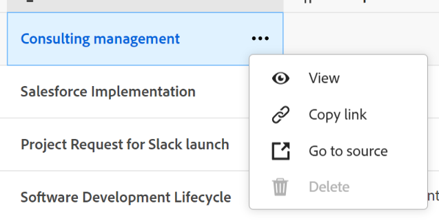
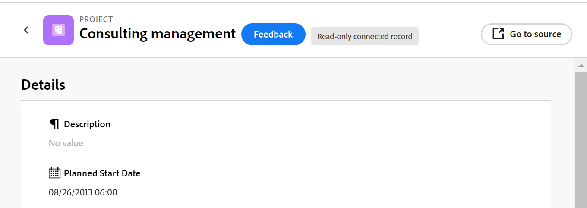

# Voorbeeld van het verbinden van recordtypen en records

{{maestro-important-intro}}

In dit artikel wordt een voorbeeld van het volgende beschreven:

* Hoe te om een verbinding tussen twee de recordtypes van Maestro en twee verslagen tot stand te brengen Maestro.

* Hoe te om een verbinding tussen een Adobe te creëren Maestro verslagtype en een het projectobjecten type van Workfront, evenals een verbinding tussen een verslag Maestro en een project.

Zie ook de volgende artikelen voor meer informatie:

* [Verbind recordtypen](../architecture/connect-record-types.md)
* [Connect-records](../records/connect-records.md)

## Twee Maestro-recordtypen en -records verbinden (voorbeeld)

U hebt bijvoorbeeld een recordtype met de naam Campaign als oorspronkelijk recordtype.

U hebt ook een ander recordtype, Product genaamd, dat een valutaveld heeft, Budget.

U wilt een gebied op het verslagtype van Campagne tot stand brengen waar u de waarden van het gebied van de Begroting op het verslagtypeProduct kunt tonen.

Dit doet u als volgt:

1. Open de tabelweergave voor het recordtype Campagne.
1. Klik op de knop **+** in de rechterbovenhoek van de tabelweergave om een nieuw veld toe te voegen, klikt u vervolgens op **Nieuwe verbinding**.
1. Voeg bijvoorbeeld de volgende informatie toe:

   * **Recordtype**: Product <!--did they change the casing here?-->
   * **Naam**: Productinformatie. Dit is de naam van het gekoppelde recordveld.
   * **Beschrijving**: Dit zijn de producten waaraan ik mijn campagnes wil koppelen.
   * **Meerdere records toestaan**: Als u deze optie ingeschakeld laat, kunnen gebruikers meerdere records selecteren wanneer het veld voor het gekoppelde recordtype (Productinformatie) in de oorspronkelijke records (campagnes) wordt weergegeven. In ons geval kunnen ze meerdere producten selecteren die op één campagne moeten worden aangesloten.
   * **Opzoekvelden selecteren**: Als u deze optie ingeschakeld laat, worden de **Opzoekvelden toevoegen** wordt geopend als u productvelden wilt koppelen aan het type Campagne-record. U kunt deze stap overslaan en productvelden later toevoegen.

   

1. (Voorwaardelijk) Als u de optie **Optie Opzoekvelden selecteren** in de vorige stap, uit de lijst van gebieden verbonden aan **Product** recordtype, klikt u op de knop **+** pictogram voor de **Begroting** veld, klik vervolgens op **Velden toevoegen**. Hiermee maakt u een veld met de naam **Begroting (op basis van productinformatie)**, de naam van het gekoppelde veld. Alle informatie voor het productbudget wordt in dit veld weergegeven voor de campagnebestanden.

   

   >[!TIP]
   >
   >    Als u de begroting van alle geselecteerde producten als één totaal aantal wilt bekijken, selecteer **SUM** in het vervolgkeuzemenu rechts van de veldnaam. Wanneer gebruikers meerdere producten selecteren in het dialoogvenster **Productinformatie** gekoppeld recordveld, **Begroting (op basis van productinformatie)** worden alle begrotingswaarden bij elkaar opgeteld en wordt het totaal weergegeven. <!-- check the shot below - added a bug with a couple of UI changes here-->
   >
   > Als u **Geen**, in plaats van **SUM** De afzonderlijke begrotingen worden gescheiden door komma&#39;s.

   Hiermee worden de volgende velden gegenereerd:

   * In de de lijstmening van het verslag van de Campagne en op de pagina van Details van een campagne:

      * **Productinformatie** (het gekoppelde recordveld): hiermee worden de naam of namen van de producten weergegeven.
      * **Begroting (op basis van productinformatie)** (het daaraan gekoppelde veld): Hiermee worden de budgetten van de op het gebied van productinformatie geselecteerde producten weergegeven.

   * In de de lijstmening van het Productverslag en op de pagina van Details van een product:

      * **Campagne**: Dit geeft aan dat het recordtype Product is gekoppeld vanuit het recordtype Campagne.

     

   >[!TIP]
   >
   >    Gekoppelde recordvelden worden voorafgegaan door het relatiepictogram .

1. Als u de **Productinformatie** veld, van de **Campagne** recordtype, maak een campagne door een nieuwe rij toe te voegen in de lijst van het type van verslagpagina van de Campagne.
1. Klik op de knop **+** pictogram in  **Productinformatie** kolom van de nieuwe campagne . De **Objecten verbinden** wordt weergegeven. De naam van het recordtype waarnaar u een koppeling maakt (Product) wordt in de linkerbovenhoek van het vak weergegeven.

   

1. Selecteer de productrecords die u wilt koppelen aan de Campagne-records en klik vervolgens op **Objecten verbinden**.

   De volgende kolommen worden bevolkt in de lijst van het het verslagtype van de Campagne:
   * De **Productinformatie** wordt voor de campagnerecord gevuld met de geselecteerde producten.
   * **De begroting (op basis van productinformatie)** wordt gevuld met de begrotingswaarde voor elk geselecteerd product of met een totaal van alle budgetten van de geselecteerde producten.

   

   >[!TIP]
   >
   >Wanneer u geen aggregator selecteert voor de meerdere waarden, worden alle waarden gescheiden door komma&#39;s weergegeven.

1. Als u de **Campagne** veld van de **Product** de lijstmening, herhaalt stappen 5-7 die van de het verslagtype van het Product lijstmening beginnen en campagneinformatie selecteren. Hiermee werkt u ook het veld Productinformatie in de tabel met recordtypen voor campagne bij. <!--ensure the step numbers remain correct-->

## Een Maestro-recordtype verbinden met een Workfront-projectobjecttype en een record met afzonderlijke projecten

U hebt bijvoorbeeld een recordtype met de naam Campaign als oorspronkelijk recordtype.

U hebt ook projecten in Workfront met een gebied genoemd &quot;Geplande opbrengst.&quot;

U wilt een verbindingsgebied op het verslagtype van Campagne tot stand brengen waar u de waarden van het Geplande gebied van Inkomsten op het project in Workfront voor bepaalde campagnes kunt tonen.

Dit doet u als volgt:

1. Ga naar een Workspace waar u het type Campagne-record wilt koppelen aan Workfront-projecten.
1. Open de tabelweergave voor het type Campagnerecord in de geselecteerde werkruimte.
1. Klik op de knop **+** in de rechterbovenhoek van de tabelweergave om een nieuw veld toe te voegen, klikt u vervolgens op **Nieuwe verbinding**.
1. Voeg bijvoorbeeld de volgende informatie toe:

   * **Recordtype**: Workfront-project (van de subsectie Workfront) <!--did they change the casing here for the field label and did they take "Workfront" out of the name of the object?-->
   * **Naam**: Projectinformatie. Dit is de naam van het veld voor gekoppelde objecten.
   * **Beschrijving**: Dit zijn de projecten waaraan ik mijn campagnes wil koppelen.
   * 
      * **Meerdere records toestaan**: Als u deze optie ingeschakeld laat, kunnen gebruikers meerdere objecten selecteren wanneer het veld voor het gekoppelde objecttype (Projectinformatie) wordt weergegeven op de oorspronkelijke records (Campagnes).
   * **Opzoekvelden selecteren**: Als u deze optie ingeschakeld laat, worden de **Opzoekvelden toevoegen** wordt nu geopend, zodat u de projectvelden kunt koppelen aan het type Campagne-record. U kunt deze stap overslaan en later projectvelden toevoegen.

   

1. (Voorwaardelijk) Als u de optie **Optie Opzoekvelden selecteren** in de vorige stap, uit de lijst van gebieden verbonden aan **Project** objecttype, klik op de knop **+** pictogram voor de **Geplande inkomsten** veld, klik vervolgens op **Velden toevoegen**. Hiermee maakt u een veld met de naam **Geplande inkomsten (uit projectinformatie)**, de naam van het gekoppelde veld. Alle informatie uit het veld Projectinkomsten wordt in dit veld weergegeven voor de campagnebestanden.

   >[!TIP]
   >
   >    Als u de geplande inkomsten van alle geselecteerde projecten wilt weergeven als één totaal getal, selecteert u **SUM** in het vervolgkeuzemenu rechts van de veldnaam. Wanneer de gebruikers veelvoudige projecten in selecteren **Projectinformatie** gekoppeld objectveld, het **Geplande inkomsten (uit productinformatie)** worden alle waarden bij elkaar opgeteld en wordt het totaal weergegeven. <!-- check the shot below - added a bug with a couple of UI changes here-->
   >
   > Als u **Geen**, in plaats van **SUM**, worden de afzonderlijke geplande inkomsten aangegeven met komma&#39;s.

   

   Hiermee worden de volgende velden gegenereerd:

   * In de de lijstmening van het verslag van de Campagne en op de pagina van Details van een campagne:

      * **Projectinformatie** (het veld voor het gekoppelde object): hiermee worden de naam of namen van de projecten weergegeven.
      * **Geplande inkomsten (uit projectinformatie)** (het daaraan gekoppelde veld): Hierin worden de geplande opbrengsten van de geselecteerde projecten in het veld Projectinformatie weergegeven.

   >[!TIP]
   >
   >    Gekoppelde objectvelden worden voorafgegaan door het relatiepictogram .

1. Als u de **Projectinformatie** veld, van de **Campagne** een tabelweergave met recordtype maken, een campagne maken door een nieuwe rij in de tabel toe te voegen.
1. Klik op de knop **+** pictogram in  **Projectinformatie** kolom van de nieuwe campagne . De **Objecten verbinden** wordt weergegeven. De naam van het objecttype waarnaar u koppelt (Workfront Project) wordt in de linkerbovenhoek van het vak weergegeven.

   

1. Selecteer het project of de projecten u met de verslagen van de Campagne wilt verbinden, dan klik **Objecten verbinden**.

   Het volgende wordt toegevoegd aan de geselecteerde werkruimte:

   * In de lijst van het type van verslag van de Campagne:
      * De **Projectinformatie** wordt voor de campagnerecord gevuld met de geselecteerde projecten.
      * De **Geplande inkomsten (uit productinformatie)** wordt gevuld met de begrotingswaarde voor elk geselecteerd product. Dit is een alleen-lezen veld.

   

   >[!TIP]
   >
   >Wanneer u geen aggregator selecteert voor de meerdere waarden en u meerdere objecten selecteert in het veld voor objectgekoppelde velden, worden alle waarden gescheiden door komma&#39;s weergegeven.

   * Een alleen-lezen Workfront Project-recordtype naar de werkruimte die u hebt geselecteerd.

1. Klik op de pijl die naar achteren wijst links van de naam van de record in de koptekst van de pagina om naar de werkruimte te gaan die u bijwerkt.
1. Open de **Workfront Project** opnametype kaart om de recordtypepagina te openen.

   U ziet het volgende voor de pagina met Workfront-projectrecordtypen:

   * Dit is een alleen-lezen maestro-recordtype dat u niet kunt verwijderen of bijwerken.
   * De projecten u selecteerde om met campagnes te verbinden tonen als afzonderlijke verslagen in de het verslagtype van het Project van Workfront pagina. De projectverslagen zijn ook read-only en hun informatie werkt automatisch bij aangezien de projecten in Workfront bijwerken. U moet meer projecten van het aangesloten verslag van Maestro toevoegen om hen in het het verslagtype van het Project van Workfront te bekijken.
   * Het veld Campagne gekoppeld record bevat de namen van de campagnes die zijn verbonden met projecten op de pagina Type campagnerecord.

1. (Optioneel) Voer een van de volgende handelingen uit om de pagina Workfront-projectdetails te openen in Maestro:

   * Van het recordtype dat u koppelde (**Campagne**), ga naar het Workfront project linked record (**Projectinformatie**) en klik op de naam van een Workfront-project.
   * Van de **Tabel** de **Workfront Project** recordpagina, klikt u op de naam van een Workfront-project

     of

     Klik op de knop **Meer** rechts van een Workfront-project klikt u op **Weergave**.

     

   Hiermee opent u de pagina Maestro Details van het gekoppelde Workfront-project. Dit is een alleen-lezen pagina.

1. (Optioneel) Voer een van de volgende handelingen uit om het gekoppelde Workfront-project te openen in Workfront:

   * Van de **Tabel** de **Workfront Project** pagina, klikt u op de naam van een Workfront-project,

   of

   Klik op de knop **Meer** rechts van de Workfront-projectnaam klikt u op **Ga naar bron**.

   

   Hiermee opent u de Workfront-projectpagina. U kunt informatie over het Workfront-project bewerken als u hiervoor gemachtigd bent.

1. Klik op de knop **Velden toevoegen** pictogram  in de hoger-juiste hoek van de het verslagtype van het Project van Workfront lijst om meer projectgebieden aan het de recordtype van Maestro van het Project van Workfront toe te voegen.
1. Klik op de knop **+** pictogram voor de projectvelden die u wilt toevoegen aan de Workfront Project Maestro-record in het dialoogvenster **Niet-geselecteerde velden** sectie.
1. Klik op de knop **-** pictogram voor de projectvelden die u uit de Workfront Project Maestro-record wilt verwijderen in het dialoogvenster **Geselecteerde velden** sectie.
1. Klikken **Opslaan**.

   >[!TIP]
   >
   >    De velden die u toevoegt aan de Workfront Project Maestro-record, worden alleen toegevoegd op de Workfront Project-pagina en worden niet toegevoegd aan de pagina Campagne-recordtype, als gekoppelde velden. U moet de projectgebieden van het de informatie van het Project verbonden-voorwerp gebied van het het verslagtype van de Campagne toevoegen om hen voor campagnes te bekijken.

1. (Optioneel en voorwaardelijk) Als u ten minste twee datumvelden voor projecten wilt weergeven, klikt u op de knop **Weergave** vervolgkeuzemenu in de tabel met Workfront-projectrecordtypen, en **Weergave maken** > **Tijdlijn** > **Maken** om een tijdlijnweergave te maken en de projecten op een tijdlijn weer te geven.
