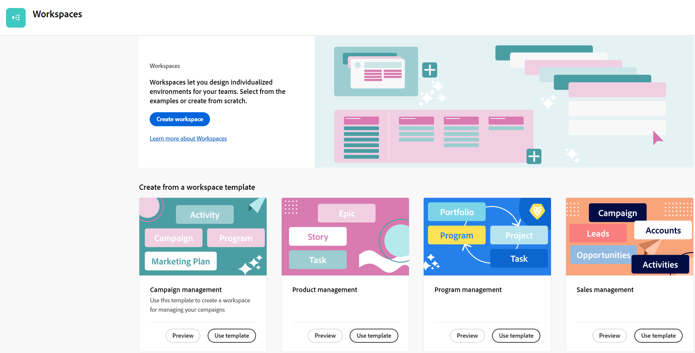
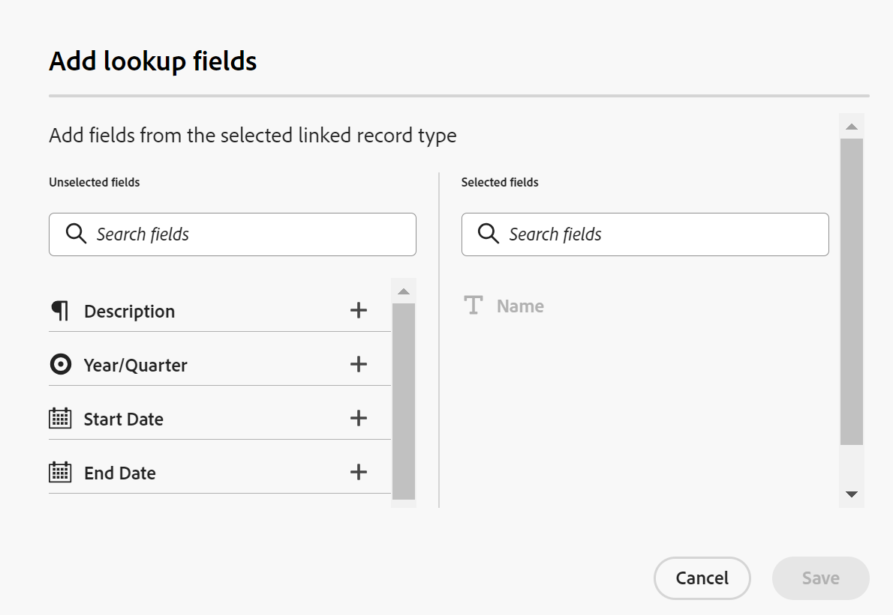
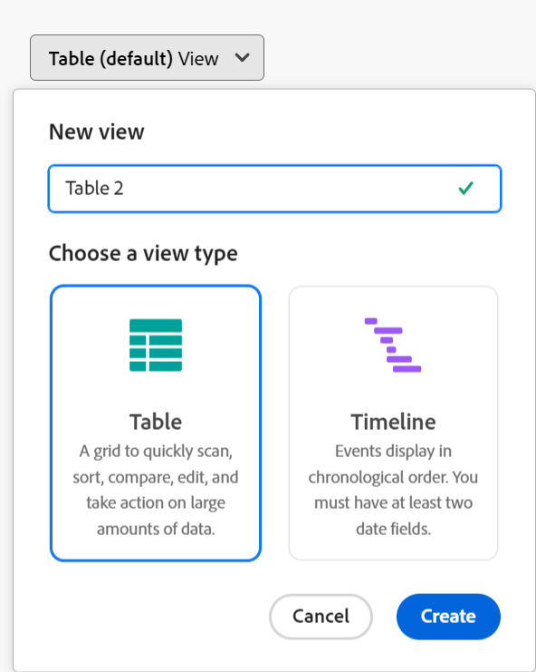
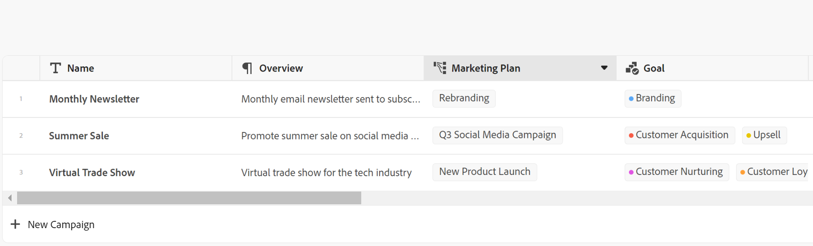

# Overzicht van Adobe Workfront Planning

<!--udpate the metadata with real information when making this avilable in TOC and in the left nav-->

<!-- remove the references to closed beta from the entire article-->

<!--update the video in the IMPORTANT below, when we have something better, especially after Open Beta - remove it-->

>[!IMPORTANT]
>
>De informatie in dit artikel verwijst naar Adobe Workfront Planning, een nieuwe aanbieding van Adobe Workfront.
>
>Adobe Workfront Planning maakt momenteel deel uit van een bètaprogramma dat voor een beperkt aantal klanten toegankelijk is. U moet een Workfront-klant zijn om deze mogelijkheden te kunnen gebruiken.
>
>Neem contact op met uw accountvertegenwoordiger voor meer informatie over deelname aan het bètaprogramma voor Workfront Planning.

<!--[View a video demonstration of Adobe Workfront Planning capabilities.](https://video.tv.adobe.com/v/3424253/){target=_blank}-->

## Inleiding tot Adobe Workfront Planning

Adobe Workfront Planning is een nieuw aanbod van Adobe Workfront. Het doel van de Planning van Workfront is uitvoerige zicht in de operationele details van een organisatie te ontsluiten, en kritieke bedrijfsvragen in elke fase van de het werkbeheerlevenscyclus te beantwoorden.

Teams en leiderschap hebben duidelijke antwoorden nodig op vragen als:

* Hoeveel campagnes voeren we in EMEA voor het vierde kwartaal?
* Hebben we publiek overlappingen tussen gezamenlijke campagnes?
* Hoe goed doen de bewustmakingsprogramma&#39;s op dit moment?
* Hoe zien de middelen eruit voor een bepaalde campagne? Welke daarvan moeten nog worden goedgekeurd?

Om deze vragen te beantwoorden, heeft de leiding een oplossing nodig die een holistische mening van elk stadium van het werk van planning tot uitvoering, van levering tot het meten van de resultaten kan verstrekken. Organisaties beschikken momenteel over gereedschappen die betrekking kunnen hebben op bepaalde onderdelen van het proces, maar vaak hebben ze geen goede verbindingen met alle fasen van het werk en kunnen ze ook geen betrouwbare resultaten opleveren.

Hieronder vindt u een aantal van de belangrijkste mogelijkheden:

* Oplossen van het probleem van het beheer van de werkzaamheden in alle stadia en voor alle belanghebbenden die aan het werkproces deelnemen.
* Pas uw workflows volledig aan, van het bepalen van welke objecttypen (of recordtypen) uw organisatie gebruikt om te configureren hoe deze objecten aan elkaar zijn gekoppeld.
* Koppeling maken naar objecttypen van andere systemen en zo een samenhangend kader creëren voor al uw processen.

## Momenteel beschikbare functies voor Adobe Workfront-planning

In de volgende tabel worden de belangrijkste functies weergegeven die beschikbaar zijn in Workfront Planning en een tijdlijn voor de beschikbaarheid ervan. De lijst bevat niet alle functies.

Voor informatie over nieuwe functies en wanneer deze worden uitgebracht, raadpleegt u [Adobe Workfront Planning Release-activiteit](/help/quicksilver/maestro/release-activity.md).

| Functie | Nu beschikbaar | Binnenkort beschikbaar | Onderzoek |
|----------------------------------------------------|:-----------------------------:|:--------------------------------:|:----------------:|
| Werkruimten maken | ✓ |                                  |                  |
| Recordtypen maken | ✓ |                                  |                  |
| Aangepaste recordvelden maken | ✓ |                                  |                  |
| Recordtypen en velden importeren met een Excel- of CSV-bestand* | ✓ |                                  |                  |
| Koppelingsrecords | ✓ |                                  |                  |
| Records in een tabel weergeven | ✓ |                                  |                  |
| Records in een tijdlijn weergeven | ✓ |                                  |                  |
| Records in een kalender weergeven | ✓ |                                  |                  |
| Filterrecords | ✓ |                                  |                  |
| Groeprecords in de tijdlijnweergave | ✓ |                                  |                  |
| Groeprecords in de tabelweergave | ✓ |                                 |                  |
| Records sorteren in de tabelweergave | ✓ |                                 |                  |
| Records sorteren in de tijdlijnweergave |                               | ✓ |                  |
| Groepen sorteren in de tabelweergave |                               | ✓ |                  |
| Groepen sorteren in de tijdlijnweergave |                               | ✓ |                  |
| Werkruimten verbinden |                               | ✓ |                  |
| Zoeken naar records in de tabelweergave | ✓ |   |
| Zoeken naar records in de tijdlijnweergave | ✓ |   |
| Connect Workfront-planningsrecords verbinden met Workfront-projecten, -programma&#39;s, -portfolio&#39;s, -bedrijven en -groepen | ✓ |                                 |                  |
| Connect Workfront Planning-records verbinden met Adobe Experience Manager-middelen | ✓ |                                  |                 |
| Pagina opnemen met gedetailleerde informatie | ✓ |                                  |                  |
| De indeling van de recordpagina bijwerken |                               | ✓ |                  |
| Werkruimten delen | ✓ | |  |
| Weergaven delen | ✓ | |  |
| Weergaven dupliceren | ✓ | |  |
| Verzoeken verzenden |                               |                                  | ✓ |
| Creatief overzicht |                               |                                  | ✓ |
| De kleur en het pictogram van een record aanpassen | ✓ |                                  |                 |
| Opmerkingen toevoegen aan records | ✓ |                                  |                 |
| Miniaturen toevoegen aan records | ✓ |                                  |                 |
| De geschiedenis van wijzigingen in een record weergeven | ✓ |                                  |                 |
| RTF-opmaak voor alineasvelden | ✓ |                                  |                 |
| Adobe Workfront-planningsmodules voor Adobe Workfront Fusion | ✓ |                                  |                 |
| Informatie van het ene veld naar het andere kopiëren en plakken | ✓ |                                  |                 |

## Adobe Workfront Planning inschakelen voor de gebruikers in uw Workfront-exemplaar

Uw organisatie moet zich inschrijven bij het gesloten bètaprogramma voor Adobe Workfront-planning voordat u toegang krijgt tot de planningsmogelijkheden. Neem contact op met uw accountvertegenwoordiger voor informatie over inschrijving in het bètaprogramma.

Voor meer informatie over het verlenen van toegang tot en het toelaten van anderen om de Planning van Workfront te gebruiken, zie [Overzicht van toegang](/help/quicksilver/maestro/access/access-overview.md).

## Adobe Workfront Planning terminologie

Hoewel Workfront Planning onderdeel is van Workfront, wordt het geleverd met eigen concepten en terminologie. Zorg ervoor dat u bekend bent met de nieuwe concepten voordat u begint met het instellen van Workfront Planning voor uw organisatie.

Het raamwerk voor Workfront Planning is volledig aanpasbaar. U kunt alle recordtypen, hun kenmerken en alle bijbehorende velden maken op basis van de exacte behoeften van uw organisatie.

Hieronder vindt u de belangrijkste Workfront-planningsobjecten en -concepten:

* **Werkruimte**: Een verzameling recordtypen die de operationele levenscyclus van een bepaalde organisatie definiëren. Een werkruimte is het werkkader van een organisatorische eenheid.

  Eén Workfront-instantie kan maximaal 1000 werkruimten hebben.

  

  Zie voor meer informatie [Werkruimten maken](../maestro/architecture/create-workspaces.md).

* **Recordtype**: Het objecttype of Workfront Planning.

  In tegenstelling tot Workfront, waar de objecttypen vooraf zijn gedefinieerd, kunt u in Workfront Planning uw eigen objecttypen maken.

  In Workfront zijn bijvoorbeeld al de objecttypen Programma, Portfolio, Project, Taak of Probleem gemaakt.

  In de Planning van Workfront, kunt u om het even welke verslagtypes tot stand brengen die aan de werkschema&#39;s van uw organisatie voldoen. Later kunt u bepalen hoe de recordtypen op elkaar betrekking hebben of hoe afhankelijk van het formulier is.

  Zie voor meer informatie [Overzicht van recordtypen](../maestro/architecture/overview-of-record-types-and-taxonomies.md).

* **Opnemen**: Een instantie van een recordtype.

  

  Nadat u een recordtype aan een werkruimte hebt toegevoegd, kunt u records van dat type op de pagina van het recordtype toevoegen.

  &#39;Campagne&#39; kan bijvoorbeeld een recordtype zijn en &#39;Zomercampagne voor EMEA&#39; is een record van het type Campagne-record.

  Zie voor meer informatie [Records maken](../maestro/records/create-records.md).

* **Werkruimtemalplaatje**: U kunt een werkruimte maken met vooraf gedefinieerde sjablonen. U kunt de vooraf gedefinieerde recordtypen en -velden gebruiken die in een sjabloon voorkomen, of u kunt uw eigen recordtypen toevoegen.

  

  Adobe Workfront Planning wordt geleverd met een sjabloon voor de werkruimte Verkoop, Marketing en Productbeheer.

  Zie voor meer informatie [Werkruimten maken](../maestro/architecture/create-workspaces.md).

* **Velden**: Velden zijn kenmerken die u kunt toevoegen aan recordtypen. Velden bevatten informatie over het recordtype. <!--check the shot below, "Connection" needs to be in lowercase-->

  

  Overwegingen bij recordvelden:

   * De velden die u voor een recordtype toevoegt, worden automatisch gekoppeld aan alle records van dat type en kunnen worden gebruikt om gegevens over die records vast te leggen.

   * Velden worden weergegeven als kolommen in de tabelweergave die is toegepast op een recordtypepagina. Ze worden ook weergegeven op de pagina van de record.

   * Velden zijn uniek voor een recordtype en worden niet van het ene naar het andere recordtype overgedragen.

   * De gebieden zijn volledig klantgericht en zijn toegankelijk slechts in de Planning van Workfront. U hebt vanuit Workfront geen toegang tot Workfront-planningsvelden.

  Zie voor meer informatie [Velden maken](../maestro/fields/create-fields.md).

  Een nieuw recordtype is standaard gekoppeld aan de volgende vooraf gedefinieerde velden:

   * Naam
   * Beschrijving
   * Begindatum
   * Einddatum
   * Status

  U kunt aangepaste velden maken van de volgende typen:

   * Tekst met één regel
   * Alinea
   * Meerdere selecties
   * Enkel selecteren
   * Datum
   * Getal
   * Percentage
   * Valuta
   * Selectievakje
   * Formule
   * Mensen
   * Gemaakt door
   * Aanmaakdatum
   * Laatst gewijzigd door
   * Laatst gewijzigd

* **Gekoppelde recordtypen**, **Gekoppelde records**, en **Gekoppelde recordvelden**: In Workfront Planning kunt u een verbinding maken tussen de volgende entiteiten:

   * Twee recordtypen.
   * Een recordtype en een Workfront-type project, -programma, -portfolio, -bedrijf of -groepsobject.
   * Een recordtype en een Adobe Experience Manager-middel of -map.

     U moet een Adobe Experience Manager-licentie hebben om recordtypen te koppelen aan Experience Manager-objecten.

     

  Nadat u een verbinding tussen de recordtypen tot stand hebt gebracht, kunt u afzonderlijke records van die typen met elkaar verbinden. De verbinding tussen de records wordt weergegeven als een gekoppeld recordveld.

* **Gekoppelde velden** (of opzoekvelden): Nadat u de verbinding tussen twee recordtypen tot stand hebt gebracht en u afzonderlijke records aan elkaar koppelt, kunt u verwijzen naar de velden van de gekoppelde records in de record waarmee u verbinding maakt.

  Bijvoorbeeld, als u een type van het verslagverslag van de Campagne met een de objecten van het Project van Workfront type verbindt, kunt u het gebied van de Eigenaar van het Project van verbonden projecten op de campagneverslagen tonen.

  

  Zie de volgende artikelen voor informatie over het koppelen van recordtypen, records en gekoppelde velden:

   * [Verbind recordtypen](../maestro/architecture/connect-record-types.md)
   * [Connect-records](../maestro/records/connect-records.md)

<!--not yet:* Fields are reusable across Record Types.  -->

* **Weergaven**: Records worden onder hun respectievelijke pagina met recordtypen weergegeven in verschillende typen weergaven.

  

  Weergaven bevatten gepersonaliseerde instellingen van een specifiek weergavetype, zoals de lijst met velden (kolommen), een lijst met records (rijen), de volgorde (sortering), een toegepast of toepasselijk filter en groepering.

  Hieronder ziet u weergavetypen die u kunt toepassen op de pagina met recordtypen:

   * **Tabelweergave**: Hiermee geeft u records en de bijbehorende velden weer in een tabelindeling. De rijen van de tabel zijn de afzonderlijke records en de kolommen zijn de recordvelden. Dit is de standaardweergave.

     

   * **Tijdlijnweergave**: Hiermee geeft u records weer met ten minste twee datumvelden in een chronologische tijdlijn.

     

   * **Kalenderweergave**: Hiermee geeft u records weer met ten minste twee datumvelden in een kalenderindeling.
     

Zie voor meer informatie [Recordweergaven beheren](../maestro/views/manage-record-views.md).

## Beperkingen van Adobe Workfront-planningsobjecten

In de volgende tabel staan de limieten voor het aantal objecten dat u kunt maken in Workfront Planning. De beperkingen zijn aan verandering onderhevig naarmate we de volgende ontwikkelingsfasen ingaan.

| Object Adobe Workfront Planning | Limiet |
|-------------------------------------------------------------------------------|:---------------------------------------------------------------------------------------------------------------:|
| Aantal werkruimten voor één Workfront-instantie | 1.000 |
| Aantal secties voor één werkruimte | 50 |
| Aantal recordtypen voor één werkruimte | 1.000 (dit omvat recordtypen van alle secties en die die wanneer het gebruiken van een werkruimtesjabloon worden gecreeerd) |
| Aantal records voor één recordtype | 50.000 |
| Aantal velden voor één recordtype of taxonomie | 500 |
| Aantal tekens voor een tekstveld | 1.000 tekens |
| Grootte van het bestand dat u in een tabel met recordtypen kunt plakken | 1 MB |
| Grootte van het bestand dat u kunt importeren via de API voor een recordtype-tabel | 1,5 MB |
| De snelheid waarmee API-aanvragen kunnen worden ingediend | 200 verzoeken per minuut |
| Grootte CSV-bestand dat u kunt importeren* | 5 MB |

>[!IMPORTANT]
>
>*Deze functie is tijdelijk uitgeschakeld en is later beschikbaar.

## Adobe Workfront-planning zoeken

Zorg ervoor dat uw organisatie toegang tot de Planning van Workfront heeft ontvangen en dat uw systeem of groepsbeheerder het Gebied van de Planning aan uw Belangrijkste Menu heeft toegevoegd. Zie voor meer informatie [Overzicht van toegang](/help/quicksilver/maestro/access/access-overview.md).

Workfront-planning zoeken:

1. Meld u aan bij Adobe Workfront.

1. Klik op de knop **Hoofdmenu**  in de rechterbovenhoek, of klik op de knop **Hoofdmenu**  in de linkerbovenhoek, indien beschikbaar.

1. Klikken **Planning** .

   Het gebied Werkruimten wordt geopend.

1. (Optioneel en aanbevolen) Ga door met een aantal van de volgende acties om uw werkstructuur te maken:

   1. Maak een werkruimte helemaal opnieuw of gebruik een sjabloon.

   1. Voeg secties toe aan de nieuwe werkruimte.
   1. Wijzig de naam van de bestaande secties in de nieuwe werkruimte.
   1. Voeg recordtypen toe aan de nieuwe werkruimte.

   1. Klik op de naam van een recordtype om de pagina van het recordtype te openen. De pagina met recordtypen wordt standaard in de tabelweergave geopend.

      U kunt ook een tijdlijn of een kalenderweergave maken.

   1. Voeg in de tabelweergave records toe door rijen toe te voegen

      of

      Voeg recordvelden toe door kolommen toe te voegen.

## Adobe Workfront Planning Release-activiteit

We geven regelmatig nieuwe functies aan Workfront Planning.

Voor een actuele lijst met vrijgegeven functies raadpleegt u [Adobe Workfront Planning Release-activiteit](../maestro/release-activity.md).

