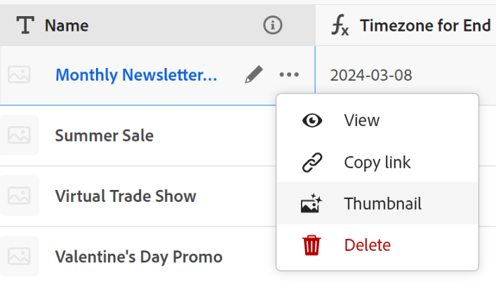

<!--update the metadata with real information-->

# Miniaturen toevoegen aan records

{{maestro-important-intro}}

U kunt records koppelen aan unieke miniaturen in Adobe Maestro, zodat ze gemakkelijk herkenbaar zijn.

U moet recordtypen maken voordat u records kunt maken en bewerken.
Zie voor meer informatie [Recordtypen maken](../architecture/create-record-types.md).

## Toegangsvereisten

<!--************double-check permissions here - asking Isk and Lilit what permissions users need for adding thumbnails-->

U moet de volgende toegang hebben om de stappen in dit artikel uit te voeren:

<table style="table-layout:auto">
 <col>
 </col>
 <col>
 </col>
 <tbody>
    <tr>
<tr>
<td>
   
 Product
 </td>
   <td>
   
 Adobe Workfront
 </td>
  </tr>  
 <td role="rowheader">
Adobe Workfront-overeenkomst
</td>
   <td>

Uw organisatie moet zijn ingeschreven voor het afgesloten bètaprogramma van de Adobe Maestro. Neem contact op met uw accountvertegenwoordiger voor meer informatie over dit nieuwe aanbod. 

   </td>
  </tr>
  <tr>
   <td role="rowheader">
Adobe Workfront-plan
</td>
   <td>

Alle

   </td>
  </tr>
  <tr>
   <td role="rowheader">
Adobe Workfront-licentie
</td>
   <td>
   
Alle
 
  </td>
  </tr>

<tr>
   <td role="rowheader">
Configuraties op toegangsniveau
</td>
   <td> 
Er zijn geen toegangscontroles voor Maestro 
  
</td>
  </tr>
<tr>
   <td role="rowheader">
Machtigingen
</td>
   <td> 
Contribute of hoger machtigingen voor een werkruimte 
  
   
Systeembeheerders hebben machtigingen voor alle werkruimten, inclusief de werkruimten die ze niet hebben gemaakt

</td>
  </tr>
<tr>
   <td role="rowheader">
Lay-outsjabloon
</td>
   <td>  
Aan alle gebruikers, inclusief Workfront-beheerders, moet een lay-outsjabloon worden toegewezen die het Maestro-gebied in het hoofdmenu bevat. 
 
Zie voor meer informatie <a href="/help/quicksilver/maestro/access/access-overview.md">Overzicht van toegang</a>. 
  
</td>
  </tr>

</tbody>
</table>

## Overwegingen bij het opnemen van miniaturen

Als u visueel onderscheid wilt maken tussen records in een tabelweergave, kunt u een unieke miniatuurafbeelding aan elke record koppelen.

Overweeg het volgende:

* U kunt alleen afbeeldingsbestanden als miniaturen toevoegen.
  <!--above: when you know exactly what type of files are allowed, add the exact extensions above-->
* U kunt een miniatuurafbeelding toevoegen aan afzonderlijke records in de tabelweergave.
* Miniaturen horen bij de recordgegevens en worden weergegeven in weergaven waar records worden weergegeven. Miniaturen worden bijvoorbeeld naast recordgegevens weergegeven in de volgende gebieden:

   * Het primaire veld van een record in de tabelweergave
   * De recordbalk in de tijdlijnweergave.
* U kunt geen recordminiaturen toevoegen vanaf de pagina Details van de record of in de tijdlijnweergave.
* Miniaturen worden niet weergegeven op de pagina Details van de record.

## Een miniatuur toevoegen aan een record

{{step1-to-maestro}}

1. Selecteer de werkruimte voor de records waaraan u miniaturen wilt toevoegen en klik op de kaart met recordtype.

   Hierdoor wordt de pagina met recordtypen geopend.
1. Selecteer een tabelweergave in het menu **Weergave** vervolgkeuzelijst. Alle verslagen van het type u selecteerde tonen in een lijst.
1. Klik op de knop **Meer** menu en klik vervolgens op **Miniatuur**.

   

   >[!TIP]
   >
   >   Het primaire veld is het veld dat in de eerste kolom van een tabelweergave wordt weergegeven. Het primaire veld is altijd bevroren en kan niet worden verborgen of verplaatst.

   De **Recordminiatuur** wordt geopend.

   

   <!--update screen shot with correct casing-->

1. In de **Uploaden** slepen en neerzetten van een bestand dat u als miniatuur wilt toevoegen of klikken **Selecteren om te uploaden** Blader vervolgens naar het afbeeldingsbestand dat u wilt toevoegen. Het bestand moet op uw computer worden opgeslagen.
1. (Optioneel) Gebruik het gereedschap Grootte wijzigen om de afbeelding uit te snijden en de grootte ervan te wijzigen.
1. Klikken **Afbeelding gebruiken** om de afbeelding als een miniatuur toe te voegen.
Hiermee sluit u het dialoogvenster **Recordminiatuur** doos.
1. (Voorwaardelijk) Als u ten minste Contribute-machtigingen voor de tabelweergave hebt, klikt u op **Velden** rechtsboven in de tabelweergave.
1. Selecteer de **Miniatuur** schakelen om de miniatuur weer te geven. Deze optie is standaard uitgeschakeld.

   

   De miniatuur wordt links van de waarde van het primaire veld weergegeven.
1. (Optioneel en voorwaardelijk) Als u geen Contribute- of hogere machtigingen voor de weergave hebt, selecteert u een nieuwe weergave in het menu **Weergave** of maak een weergave.
1. (Optioneel) Als u de miniatuur wilt verwijderen, plaatst u de cursor boven het primaire veld en klikt u op de knop **Meer** menu > **Miniatuur** > de **Verwijderen** pictogram en klik vervolgens op **Wijzigingen opslaan**.
