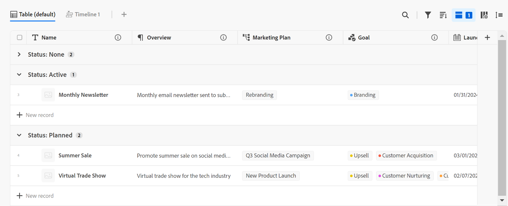

# De tabelweergave beheren

<!--
title: Manage the table view
description: You can display records in a table view when using Adobe Maestro. 
hidefromtoc: yes
author: Alina
feature: Work Management
role: User
hide: yes
-->

<!--update the metadata with real information when making this available in TOC and in the left nav-->

{{maestro-important-intro}}

U kunt records en de bijbehorende velden in een tabelweergave weergeven wanneer u de pagina met recordtypen opent in Adobe Maestro.

Voor informatie over Maestro-weergaven en hoe deze te beheren, raadpleegt u [Recordweergaven beheren](../views/manage-record-views.md).

## Toegangsvereisten

U moet de volgende toegang hebben om de stappen in dit artikel uit te voeren:

<table style="table-layout:auto">
 <col>
 </col>
 <col>
 </col>
 <tbody>
    <tr>
<tr>
<td>
   
 Product
 </td>
   <td>
   
 Adobe Workfront
 </td>
  </tr>  
 <td role="rowheader">
Adobe Workfront-overeenkomst
</td>
   <td>

Uw organisatie moet zijn ingeschreven voor het afgesloten bètaprogramma van de Adobe Maestro. Neem contact op met uw accountvertegenwoordiger voor meer informatie over dit nieuwe aanbod. 

   </td>
  </tr>
  <tr>
   <td role="rowheader">
Adobe Workfront-plan
</td>
   <td>

Alle

   </td>
  </tr>
  <tr>
   <td role="rowheader">
Adobe Workfront-licentie
</td>
   <td>
   
Alle
 
  </td>
  </tr>

<tr>
   <td role="rowheader">Configuratie op toegangsniveau</td>
   <td> 
Er zijn geen toegangsniveaucontroles voor Maestro 
  
</td>
  </tr>

<tr>
   <td role="rowheader">
Machtigingen
</td>
   <td> 
Rechten voor de weergave beheren
  
</td>
  </tr>

<tr>
   <td role="rowheader">Lay-outsjabloon</td>
   <td> 
Uw systeembeheerder moet het gebied Maestro in uw lay-outmalplaatje toevoegen. Zie voor meer informatie <a href="../access/access-overview.md">Overzicht van toegang</a>. 
  
</td>
  </tr>
 </tbody>
</table>

## Een tabelweergave beheren {#manage-a-table-view}

<!--insert screen shot of table view-->

Wanneer u een tabelweergave maakt, worden alle records van het geselecteerde type weergegeven in een tabel. Elke rij is een unieke record en elke kolom is een recordveld. Alle velden en alle records worden standaard weergegeven.

Een tabelweergave beheren:

1. Een tabelweergave maken, zoals wordt beschreven in het artikel [Recordweergaven beheren](../views/manage-record-views.md).

   

1. Werk de volgende weergave-elementen bij zoals in de onderstaande subsecties wordt beschreven:
   * [Kolommen (of velden)](#add-columns-or-fields)
   * [Rijen (of records)](#add-rows-or-records)
   * [Filters](#add-filters)
   * [Groepering](#add-groupings)
   * [Sorteren](#sort-information)

### Kolommen (of velden) toevoegen {#add-columns}

De kolomkoppen van een Maestro- lijstmening tonen gebieden verbonden aan de verslagen in de mening. Dezelfde velden die in de tabelweergave worden weergegeven, worden ook weergegeven in de sectie Details van een Maestro-record. Zie voor meer informatie [Records bewerken](../records/edit-records.md).

<!--this is not available yet:You can display record fields (or columns) in both a table and a timeline view. However, the number of columns displayed in the table of the timeline view is limited and you cannot add columns in addition to those selected by default.-->

Het toevoegen van kolommen aan een weergave is hetzelfde als het toevoegen van velden aan een recordtype.

U kunt maximaal 500 velden (of kolommen) toevoegen aan een tabelweergave.

1. Ga naar een recordtypepagina en selecteer een **Tabel** in het keuzemenu Weergave.
1. Beginnen met het toevoegen van velden (of kolommen), zoals beschreven in het artikel [Velden maken](../fields/create-fields.md).

   De kolommen die u toevoegt, zijn zichtbaar voor alle gebruikers die toegang hebben tot het recordtype en worden toegevoegd als nieuwe velden op de pagina Details van de records van het geselecteerde recordtype.

1. Voer een van de volgende handelingen uit om de kolommen in de tabel opnieuw te ordenen:

   * Pak de kolomkop en sleep deze naar de gewenste positie. De kolom die u kort hebt verplaatst, wordt weergegeven met een blauwe achtergrond totdat u andere aanpassingen in de tabel aanbrengt.

   * Klikken **Velden** in de werkbalk van de tabel, sleept u de velden in de gewenste volgorde en klikt u vervolgens buiten de **Zichtbaarheid en volgorde van velden** te sluiten.

     

     >[!TIP]
     >
     >* Het veld Naam is standaard het eerste veld in de tabelweergave. Dit wordt beschouwd als een primair veld.
     >
     >* U kunt het veld Naam niet naar een andere positie verplaatsen, tenzij u een ander veld als primair veld aanwijst. Ga voor meer informatie verder met stap 4. <!--accurate?-->
     >
     >* U kunt een primair veld niet verbergen of verwijderen.
     >
     >* Het primaire veld is bevroren en maakt geen deel uit van de horizontale schuifbalk.

   * Vervang het veld in de eerste kolom door een ander veld door het primaire veld te wijzigen. Ga voor meer informatie verder met stap 4. <!--accurate?-->

1. (Optioneel) Houd de cursor boven een veldnaam in de kolomkop van een veld dat niet wordt weergegeven in de eerste kolom van de tabel, klik op de pijl omlaag rechts van de veldnaam en klik vervolgens op **Instellen als primair veld**.

   

1. Klikken **Veld instellen** ter bevestiging.

   Het veld wordt een primair veld, wat betekent dat het wordt weergegeven als de eerste kolom van de tabelweergave. Het vorige primaire veld gaat naar de tweede kolom.

   >[!NOTE]
   >
   >   * Alleen velden van de volgende typen kunnen primaire velden zijn:
   >
   >       * Tekst met één regel
   >       * Getal
   >       * Formule
   >
   >   * Het primaire veld is altijd bevroren en kan niet worden verplaatst. U kunt een ander veld selecteren om een primair veld te vervangen als u het naar een andere positie wilt verplaatsen.
   >
   >   * Het wijzigen van het primaire veld in de tabelweergave heeft invloed op de weergave voor alle andere gebruikers die deze selecteren.
   >
   >   * Het wijzigen van het primaire veld in een tabelweergave heeft invloed op alle tabelweergaven.
   >
   >   * U kunt een primair veld niet verwijderen of verbergen.
   >
   >   * De waarde in het primaire veld is altijd gekoppeld aan de pagina Details van de record.

1. Klik en sleep de kolomscheidingslijnen en zet deze op de gewenste plaats neer om de kolommen breder te maken.

   >[!TIP]
   >
   >De wijzigingen die u aanbrengt in de kolombreedte en -volgorde zijn permanent en zichtbaar voor alle gebruikers die toegang hebben tot het recordtype.

1. Houd de cursor boven de kolomkop en klik vervolgens op de pijl omlaag, en klik vervolgens op **Veld verbergen**

   of

   Klikken **Velden** in de tabelwerkbalk en schakelt u de schakeloptie uit die is gekoppeld aan de velden (of kolommen) die u wilt verbergen. De **Zichtbaarheid en volgorde van velden** wordt weergegeven.

   >[!TIP]
   >
   >Het aantal verborgen velden wordt links van het pictogram Velden op de werkbalk weergegeven.

1. Klik op de knop **Velden** en schakelt u de schakeloptie in die is gekoppeld aan de velden die u wilt weergeven in de kolommen van de tabel. Alle velden worden standaard weergegeven.

1. Ga als volgt te werk om snel records te zoeken die overeenkomen met een trefwoord:

   1. Klik op de knop **Zoeken** pictogram  en begint een sleutelwoord te typen verbonden aan om het even welk gebied van een verslag dat op het scherm toont. Het aantal juiste overeenkomsten wordt weergegeven naast het zoekitem en het veld met de juiste overeenkomst wordt gemarkeerd.

      

      U kunt elk woord of speciaal teken gebruiken dat op het scherm zichtbaar is.

      U kunt geen trefwoorden gebruiken die zijn gekoppeld aan velden die zijn verborgen in de tabelweergave.

   1. Druk **Enter** op uw toetsenbord om naar het volgende gevonden veld te gaan.

   1. (Optioneel) Als er meer dan één overeenkomst is, klikt u op de pijl-omhoog of -omlaag rechts van het trefwoord Zoeken om alle overeenkomende items in de tabel te zoeken.

   1. Klik op de knop **x** in het zoekvak om het zoekwoord te wissen.

### Rijen (of records) toevoegen {#add-rows}

De rijen van een Maestro- lijstmening tonen individuele verslagen van het geselecteerde verslagtype.

U kunt tot 10.000 verslagen (of rijen) voor een verslagtype in Maestro hebben.

1. Ga naar een recordtypepagina en selecteer een **Tabel** in het keuzemenu Weergave.
1. Records (of rijen) toevoegen, zoals wordt beschreven in het artikel [Records maken](../records/create-records.md).

   De records die u in de tabelweergave toevoegt, worden direct opgeslagen en zijn zichtbaar voor alle gebruikers met de machtiging Weergave of hoger voor de werkruimte.

1. (Optioneel) Voeg een miniatuur toe aan elke record en klik op **Velden** in de rechterbovenhoek van de tabel selecteert u vervolgens de schakeloptie voor de **Miniatuur** veld dat links van het primaire veld wordt weergegeven. Deze optie is standaard uitgeschakeld.

   Zie voor meer informatie [Miniaturen toevoegen aan records](/help/quicksilver/maestro/records/add-thumbnails-to-records.md).

1. (Optioneel) Selecteer een of meerdere records in een rij en sleep vervolgens de records **handgreep** pictogram  links van de recordnaam om de rijen opnieuw te ordenen.

   >[!NOTE]
   >
   >U kunt rijen niet opnieuw rangschikken als u ten minste één sortering toepast op de tabelweergave.

   <!-- this is not possible right now:

    1. To reorder the rows, click the row header, drag and drop it in the desired location. 

        The changes you make to the row order are permanent and visible to all users who access the record type
    -->

<!-- this section below links from the timeline view; consider splitting them if they become different-->

### Filters toevoegen {#add-filters}

Met filters vermindert u de hoeveelheid informatie die op het scherm wordt weergegeven.

Houd rekening met het volgende wanneer u werkt met filters in de tabelweergave:
<!-- this list is almost identical to the one for the table view - update both-->

* De filters die u voor de tabelweergave maakt, werken onafhankelijk van de filters in de tijdlijnweergave wanneer deze worden toegepast op hetzelfde recordtype.

* De filters zijn uniek voor de weergave die u selecteert. Op twee tabelweergaven van hetzelfde recordtype kunnen verschillende filters worden toegepast. Twee gebruikers die naar dezelfde tabelweergave kijken, zien hetzelfde filter dat op dat moment wordt toegepast.

* U kunt de filters die u maakt en toepast op een tabelweergave niet een naam geven.

* Als u filters verwijdert, worden deze verwijderd van iedereen die toegang heeft tot hetzelfde recordtype als u en wordt dezelfde weergave gebruikt als u gebruikt.

* Filters toevoegen aan de tabelweergave is hetzelfde als filters toevoegen aan de tijdlijnweergave.

Een filter toevoegen aan een tabelweergave:

1. Een tabelweergave maken voor een pagina met recordtypen, zoals wordt beschreven in het artikel [Recordweergaven beheren](../views/manage-record-views.md).
1. Selecteer een tabelweergave en klik op **Filters** rechtsboven in de tabel.
1. Klikken **Voorwaarde toevoegen** en voeg de volgende informatie toe:

   * Selecteer een veld waarop u wilt filteren <!-- the tip below might change-->

   * Selecteer een optie (of een filteroptie) om te bepalen aan welke voorwaarde het veld moet voldoen

     In de onderstaande tabel worden de beschikbare wijzigingstoetsen voor elk veldtype weergegeven.

     >[!TIP]
     >
     > U kunt geen gekoppelde velden selecteren. Zie voor meer informatie [Velden maken](../fields/create-fields.md).

     <table>
        <thead>
        <tr>
            <th><b>Veldtype</b></th>
            <th><b>Modifiers</b></th>
        </tr>
        </thead>
        <tbody>
        <tr>
            <td>Enkele regel, alinea, formule </td>
            <td>
Bevat

            
Bevat niet

            
Is

            
Is niet

            
Is leeg

            
Is niet leeg
</td>
        </tr>
        <tr><td>Enkel selecteren</td>
            <td>
Is

            
Is niet

            
Is om het even welke

            
Is geen van

            
Is leeg

            
Is niet leeg
</td>
        </tr>
        <tr>
            <td>Meerdere selecties, personen</td>
            <td>
Heeft een van de

            
Bevat alle

            
Is exact

            
Heeft geen van

            
Is leeg

            
Is niet leeg
</td>
        </tr>
        <tr>
            <td>Getal, percentage, valuta</td>
            <td>
=

            
≠

            
 &lt; 

            
&gt;

            
≤

            
≥

            
Is leeg

            
Is niet leeg
</td>
        </tr>
        <tr>
            <td>Datum</td>
            <td>
Is

            
Is niet

            
Is na

            
Is voor

            
Is tussen

Is niet tussen

            
Is leeg

Is niet leeg
</td>
        </tr>

     <tr>
            <td>Selectievakje</td>
            <td>
Is

        </tr>
        </tbody>
        </table>

   * Selecteer een waarde voor het geselecteerde veld.

   

   Er is geen limiet voor het aantal filtervoorwaarden dat u kunt toevoegen.

1. (Optioneel) Klik op **Voorwaarde toevoegen** om nog een filteroptie toe te voegen en de bovenstaande stappen te herhalen. Links van het pictogram Filters ziet u het aantal toegepaste filters.
1. Klik op de volgende operatoren om aan te geven hoe de filtervoorwaarden worden gekoppeld en moeten worden toegepast:

   * **en**: Aan alle opgegeven voorwaarden moet worden voldaan.
   * **of**: Aan alle opgegeven voorwaarden moet worden voldaan. Dit is de standaardoptie.

   De lijst met records wordt automatisch gefilterd.  <!--at this time, you can't name and save the filter - but will this change?!-->
   <!-- asked on the task for the simple filters whether there is a limitation for how many statements a filter can have?!-->

1. (Optioneel) Klik op **Filters** en klik vervolgens op de knop **x** pictogram om een filter te verwijderen. <!--right now you cannot "clear all" for filters, but this might come later-->

### Groepen toevoegen {#add-groupings}

<!--this section exists in the timeline view too, but the display is slightly different, so I kept both steps; consider updating both sections if any updates to groupings are introduced-->

U kunt records groeperen aan de hand van vergelijkbare informatie wanneer u een groepering toepast op een weergave.

Het toevoegen van groepen in de tabelweergave lijkt op het toevoegen van groepen aan de tijdlijnweergave.

Overweeg het volgende:

* U kunt groepen toepassen in de tabel- en tijdlijnweergave. De groepen van de tabelweergave zijn onafhankelijk van de groepen in de tijdlijnweergave van hetzelfde recordtype.
* U kunt drie niveaus van groepering in een mening van Maestro toepassen. De records worden gegroepeerd in de volgorde van de groepen die u selecteert.
&lt;!—* U kunt tot 4 niveaus van groepering toepassen wanneer het gebruiken van API. —deze nu controleren—>
* De groepen zijn uniek voor de weergave die u selecteert. Op twee tabelweergaven van hetzelfde recordtype kunnen verschillende groepen worden toegepast. Twee gebruikers die naar dezelfde tabelweergave kijken, zien dezelfde groepering die momenteel wordt toegepast.
* U kunt de groepen die u maakt voor een tabelweergave niet een naam geven.
* Als u groepen verwijdert, worden deze verwijderd van iedereen die toegang heeft tot hetzelfde recordtype als u en die dezelfde weergave weergeeft als u.
* U kunt records bewerken die in een groep worden vermeld.
<!--checking into this: * You can apply up to 4 levels of grouping when using the API. -->
<!-- checking also into this: * You cannot group by a Paragraph-type field.-->

Een groep toevoegen:

1. Een tijdlijnweergave maken voor een recordtype, zoals beschreven in het artikel [Recordweergaven beheren](../views/manage-record-views.md).
1. Klikken **Groepering** in de rechterbovenhoek van de tijdlijnweergave.

   

1. Klik op een van de voorgestelde velden of klik op **Een ander veld kiezen**, zoek naar een ander veld en klik op het veld wanneer het in de lijst wordt weergegeven.

   >[!TIP]
   >
   >U kunt geen gekoppelde velden selecteren.

   De groepering wordt automatisch toegepast op de tabel en records worden weergegeven onder de scheidingslijn voor cijfergroepering.

1. (Optioneel) Herhaal de bovenstaande stappen om maximaal drie groepen samen te voegen.

   Het aantal velden dat voor de groepering is geselecteerd, wordt weergegeven naast het pictogram Groeperen.

   

1. (Optioneel) Binnen de **Records groeperen op** klikt u op **x** pictogram rechts van een veld dat is geselecteerd voor de groep om de groep te verwijderen

   of

   Klikken **Alles wissen** alle velden verwijderen.

1. Klik buiten de **Records groeperen op** te sluiten.
1. (Optioneel) Klik op **+ Nieuw &lt; Naam recordtype >** aan het einde van een groepering om nieuwe records toe te voegen, vernieuwt u de pagina om de nieuwe record aan de juiste groepering toe te voegen. <!--this might need to be changed when they add the Refresh button on the toolbar of the table view-->

### Een sortering toevoegen {#sort-information}

Door een sortering toe te passen, kunt u informatie in een bepaalde orde organiseren.

U kunt de volgende gegevens sorteren:

* Alle records in een tabelweergave. <!--or timeline view. ***********verify this is the case for the timeline view*********************-->
  <!--* All groupings. - this is not available yet-->

Houd rekening met het volgende wanneer u records in de tabelweergave sorteert:

<!-- if this is available for the timeline view, update both when you update one-->

* Sorteren is uniek voor de weergave die u selecteert. Twee tabelweergaven van hetzelfde recordtype kunnen verschillende sorteercriteria hebben. Twee gebruikers die naar dezelfde tabelweergave kijken, zien dezelfde sortering die momenteel wordt toegepast.

* U kunt de tekenreeksen die u maakt en toepast op een tabelweergave niet een naam geven.

* Het sorteren dat u maakt, blijft behouden wanneer u wegnavigeert.

* U kunt sorteren op zoveel velden als u ziet in de tabelweergave van een recordtype.

* Als u sorteercriteria verwijdert, worden deze verwijderd van iedereen die toegang heeft tot hetzelfde recordtype als u en wordt dezelfde weergave gebruikt als u.

Sorteren <!--ungrouped (add this when sorting for groupings will be available--> records, voert u de volgende handelingen uit:

1. Een tabelweergave maken, zoals wordt beschreven in het artikel [Recordweergaven beheren](../views/manage-record-views.md).
1. Klik op de knop **Sorteren** pictogram  rechtsboven in de tabel

   of

   Houd de muis boven de naam van een kolom in de tabelweergave en klik op de pijl omlaag rechts van de kolomkopnaam en klik vervolgens op **Sorteren op dit veld**. Het veld wordt als een sorteerselectie toegevoegd in het pictogram Sorteren rechtsboven in de tabelweergave.
1. In de **Records sorteren op** klikt u op een van de voorgestelde velden of op **Een ander veld kiezen** en zoek naar een ander veld. Klik vervolgens op het veld wanneer het wordt weergegeven in de lijst.

   De sortering wordt automatisch toegepast op de tabelweergave en records worden gesorteerd op de geselecteerde criteria.

   <!-- add a step that you can rearrange the sorting fields here, when this will be possible-->

1. (Optioneel) Herhaal bovenstaande stappen om te sorteren op extra velden.

   Het aantal velden dat u sorteert, wordt links van het pictogram Sorteren in de rechterbovenhoek van de werkbalk weergegeven. U kunt alleen velden kiezen die in de kolommen van de tabelweergave worden weergegeven.

   >[!TIP]
   >
   > U kunt geen gekoppelde velden selecteren. Zie voor meer informatie [Velden maken](../fields/create-fields.md).

1. (Optioneel) In het dialoogvenster **Records sorteren op** klikt u op **x** pictogram rechts van een sorteerveld om de sortering te verwijderen

   of

   Klikken **Alles wissen** om alle velden uit de sortering te verwijderen.

1. Klik buiten de **Records sorteren op** te sluiten.

   

   De gegevens in de tabel worden gesorteerd op basis van de geselecteerde criteria.

   In de velden die u voor de sortering selecteert, wordt een sorteerpictogram weergegeven, gevolgd door een getal dat de volgorde aangeeft waarin de sortering wordt toegepast.

<!-- this is not available yet: 

To sort grouped records: 

1. Create a view, as described in [Create or edit record views](#create-or-edit-record-views). 
1. ************************* add steps here for sorting grouped records****************

-->
