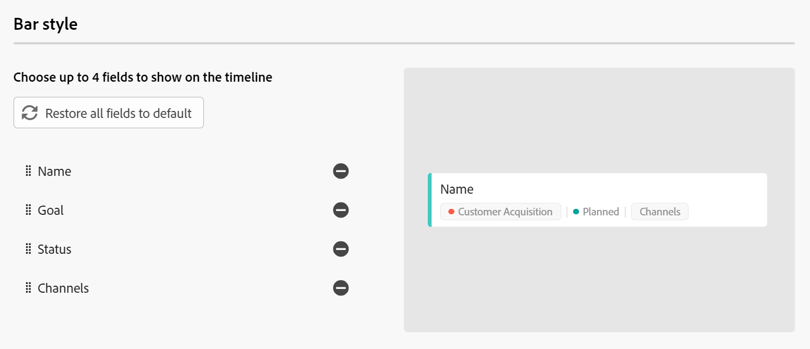

# De tijdlijnweergave beheren

<!--
title: Manage the timeline view in Adobe Maestro
description: You can display records in a timeline view, when accessing the record type page in Adobe Maestro. 
hidefromtoc: yes
hide: yes
author: Alina
feature: Work Management
role: User
-->

<!--update the metadata with real information when making this available in TOC and in the left nav-->

>[!IMPORTANT]
>
>De informatie in dit artikel heeft betrekking op Adobe Maestro, een nieuw aanbod van Adobe.
>
>Adobe Maestro maakt momenteel deel uit van een bètaprogramma dat voor een beperkt aantal klanten toegankelijk is.
>
>Neem contact op met uw accountvertegenwoordiger voor meer informatie over deelname aan het bètaprogramma voor Maestro.
>
>Zie voor meer informatie [Overzicht van Adobe Maestro](../maestro-overview.md).

U kunt records weergeven in een tijdlijnweergave wanneer u de pagina met recordtypen opent in Adobe Maestro.

Voor informatie over Maestro-weergaven raadpleegt u [Recordweergaven beheren in Adobe Maestro](../views/manage-record-views.md).

## Toegangsvereisten

U moet de volgende toegang hebben om de stappen in dit artikel uit te voeren:

<table style="table-layout:auto">
 <col>
 <tbody>
<td>
   
 Adobe
 </td>
   <td>
   
 Adobe Workfront
 </td>
  </tr>  
 <td role="rowheader">
Adobe Workfront-overeenkomst
</td>
   <td>

Uw organisatie moet zijn ingeschreven voor het afgesloten bètaprogramma van de Adobe Maestro. Neem contact op met uw accountvertegenwoordiger voor meer informatie over dit nieuwe aanbod. 

   </td>
  </tr>
  <tr>
   <td role="rowheader">
Adobe Workfront-plan
</td>
   <td>

Alle

   </td>
  </tr>
  <tr>
   <td role="rowheader">
Adobe Workfront-licentie
</td>
   <td>
   
Alle
 
  </td>
  </tr>

<tr>
   <td role="rowheader">Toegangsniveau</td>
   <td> 
Alle
  
</td>
  </tr>
<tr>
   <td role="rowheader">Lay-outsjabloon</td>
   <td> 
Uw systeembeheerder moet het gebied Maestro in uw lay-outmalplaatje toevoegen. Zie voor meer informatie <a href="../access/grant-access.md">Toegang verlenen tot Adobe Maestro</a>. 
  
</td>
  </tr>
 </tbody>
</table>

<!--Maybe enable this at GA - but Maestro is not supposed to have Access controls in the Workfront Access Level: 
>[!NOTE]
>
>If you don't have access, ask your Workfront administrator if they set additional restrictions in your access level. For information on how a Workfront administrator can change your access level, see [Create or modify custom access levels](../administration-and-setup/add-users/configure-and-grant-access/create-modify-access-levels.md). -->

<!-- Notes to add for the table: for the "Workfront plans" row: the above is only for closed beta; when going to GA - activate the following plans:    

Current plan: Prime and Ultimate

Legacy plan: Enterprise
-->

<!-- Notes for the table: for the "Workfront access" row: 
For more information, see <a href="../../administration-and-setup/add-users/access-levels-and-object-permissions/wf-licenses.md" class="MCXref xref">Adobe Workfront licenses overview</a>.
-->

## Een tijdlijnweergave beheren {#manage-a-timeline-view}

<!--insert screen shot of timeline view-->

Wanneer u een tijdlijnweergave maakt, worden alle records van het geselecteerde recordtype weergegeven in een chronologische tijdlijn.

Overweeg het volgende:

* U kunt alleen een tijdlijnweergave maken wanneer u ten minste twee datumvelden hebt gekoppeld aan een recordtype. Wanneer u een of geen datumvelden hebt gekoppeld aan een recordtype, wordt de optie voor de tijdlijnweergave grijs weergegeven.
* Afhankelijk van de datums die aan de records zijn gekoppeld, worden sommige records mogelijk niet in de tijdlijnweergave weergegeven in de volgende scenario&#39;s:

   * Wanneer de begin- en einddatum geen waarden hebben
   * Wanneer de begin- of einddatum geen waarde hebben
   * Wanneer de begindatum na de einddatum ligt

<!--these are NOT available now because there won't be a table for the timeline view for the near future, per Andy: 
* The records displayed in the timeline view also display in a view-only table to the left of the timeline. 
* Each row in the table and each bar on the timeline represent the same record. 
* Each column in the table is a record field. The columns of this table are preconfigured and cannot be customized. 
* Only a limited number of fields (or columns) display in the timeline view table. 
* You cannot do the following in a timeline view:
     * Add rows or records
     * Add columns or fields
     * Edit record information
-->

Wanneer u een tijdlijnweergave maakt, worden alle records van het geselecteerde recordtype standaard in een tijdlijn weergegeven als balken.

Een tijdlijnweergave beheren:

1. Ga naar de pagina met recordtypen waarvoor u de tijdlijn wilt weergeven.
1. Een tijdlijnweergave maken, zoals wordt beschreven in het artikel [Recordweergaven beheren](../views/manage-record-views.md).

   

   De records die gekoppeld zijn aan het geselecteerde recordtype worden in chronologische tijdlijn weergegeven als balken.

1. Voer een van de volgende handelingen uit om door de tijdlijn te navigeren:

   * Klik op de pictogrammen links en rechts of gebruik de horizontale schuifbalk om naar voren en naar achteren in de tijdlijn te gaan.
   * Klikken **Vandaag** om de tijdlijn te centreren op de datum van vandaag.
   * Selecteer een van de volgende opties in het vervolgkeuzemenu voor de tijd om de tijdstappen bij te werken:

      * Jaar
      * Kwart
      * Maand
1. Klikken **Overschakelen naar standaard** weergeven om records in afzonderlijke regels weer te geven <!--check to see if they updated the name of the setting here-->

   of

   Klikken **Overschakelen naar compacte weergave** om de records weer te geven waarvan de datums elkaar niet op dezelfde regel snijden. <!--check to see if they updated the name of the setting here-->

   Records worden standaard weergegeven in de compacte weergave.

1. Werk de volgende weergave-elementen bij zoals in de onderstaande subsecties wordt beschreven:
   * [Filters](#add-filters)
   * [Groepering](#add-grouping)
     <!--* [Sort](#add-sort) not sure if this is present in timeline views?!; also check the anchor and make sure it's correct-->
   * [Instellingen](#edit-the-timeline-view-settings)

### Filters toevoegen

Met filters vermindert u de hoeveelheid informatie die op het scherm wordt weergegeven.

Houd rekening met het volgende wanneer u werkt met filters in de tijdlijnweergave:

<!-- this list is almost identical to the one for the table view - update both-->

* De filters die u voor de tijdlijnweergave maakt, werken onafhankelijk van de filters in de tabelweergave wanneer deze worden toegepast op hetzelfde recordtype.

* De filters zijn uniek voor de weergave die u selecteert. Op twee tijdlijnweergaven van hetzelfde recordtype kunnen verschillende filters worden toegepast. Twee gebruikers die naar dezelfde tijdlijnweergave kijken, zien hetzelfde filter dat op dat moment wordt toegepast.

* U kunt de filters die u maakt en toepast op een tijdlijnweergave niet een naam geven.

* Als u filters verwijdert, worden deze verwijderd van iedereen die toegang heeft tot hetzelfde recordtype als u en wordt dezelfde weergave gebruikt als u.

Het toevoegen van filters in de tijdlijnweergave is hetzelfde als het toevoegen van filters in de tabelweergave.

Zie de sectie Filters toevoegen in het artikel voor meer informatie [De tabelweergave beheren](../views/manage-the-table-view.md).

### Groepering toevoegen

<!-- if groupings are identical between the table and the timeline, consider replacing this section with this: 

Adding groupings in the timeline view is identical to adding filters in the table view. 

For more information, see the "Add filters" section in the article [Manage the table view](../views/manage-the-table-view.md). -->

U kunt records groeperen aan de hand van vergelijkbare informatie wanneer u een groepering toepast op een weergave.

Houd rekening met het volgende wanneer u werkt met groepen in de tijdlijnweergave:

* U kunt groepen toepassen in de tabel- en tijdlijnweergave. De groepen van de tabelweergave zijn onafhankelijk van de groepen in de tijdlijnweergave van hetzelfde recordtype.
* U kunt drie niveaus van groepering in een mening van Maestro toepassen. De records worden gegroepeerd in de volgorde van de groepen die u selecteert.
* U kunt tot 4 niveaus van groepering toepassen wanneer het gebruiken van API.

Een groep toevoegen:

1. Een tijdlijnweergave maken, zoals wordt beschreven in het artikel [Recordweergaven beheren](../views/manage-record-views.md).
1. Klikken **Groepering**.

   

1. Klik op een van de voorgestelde velden of klik op **Een ander veld kiezen** en zoek naar een ander veld. Klik vervolgens op het veld wanneer het wordt weergegeven in de lijst.

   >[!TIP]
   >
   >U kunt geen gekoppelde velden selecteren.

   De groepering wordt automatisch toegepast op de tijdlijn en records worden weergegeven in het groepsvak. Het aantal items in een groep wordt weergegeven op de groeperingsregel.

   <!-- add a step that you can rearrange the groupings here, when this will be possible-->

1. (Optioneel) Herhaal de bovenstaande stappen om maximaal drie groepen samen te voegen.

   Het aantal toegepaste groeperingen wordt links van het pictogram Groeperen in de rechterbovenhoek van de werkbalk weergegeven.

   

1. (Optioneel) Klik op de knop **x** rechts van een groep om de groepering te verwijderen

   of

   Klikken **Alles wissen** alle groepen verwijderen.

1. Klik buiten de **Records groeperen op** te sluiten.

<!-- 

### Add sort

this is not possible right now; if this is the same functionality as the table view, document it there and link from here. 

-->

### De weergave-instellingen voor de tijdlijn bewerken {#edit-the-timeline-view-settings}

Werk de instellingen van de tijdlijnweergave bij om aan te geven welke informatie wordt weergegeven in het tijdlijngedeelte van de weergave.

1. Een tijdlijnweergave maken, zoals wordt beschreven in het artikel [Recordweergaven beheren](../views/manage-record-views.md).
1. Klikken **Instellingen**.
1. Klikken **Datum en tijd** in het linkerdeelvenster selecteert u vervolgens een **Begindatum** en **Einddatum** om weer te geven op de tijdlijn. U kunt de standaardbegin- en einddatum kiezen of een datumveld kiezen dat beschikbaar is. De balken die de records weergeven, beginnen op de datum die u aangeeft voor de begindatum en eindigen op de datum die overeenkomt met de einddatum.

   >[!NOTE]
   >
   >    Records die geen waarden hebben voor de begin- of einddatum of die later een begindatum hebben dan de einddatum, worden niet weergegeven in de tijdlijnweergave.

1. Klikken **Gegevens opnemen** om aan te geven welke velden u op de recordborden wilt weergeven.

   Het veld Naam is standaard geselecteerd.

1. Klikken **Veld toevoegen** om maximaal vier velden aan de recordbalken toe te voegen.
1. Klik in het dialoogvenster **Zoeken in velden** en klik op het veld dat u wilt toevoegen.

   >[!TIP]
   >
   >   * U moet de velden maken voordat u deze aan de recordbalken kunt toevoegen.
   > 
   >   * Er moet ten minste één veld zijn geselecteerd. **Naam** is standaard geselecteerd.

   Aan de rechterkant wordt een voorvertoning weergegeven van hoe de balken eruit zullen zien op de tijdlijn.

   

1. Klikken **Opslaan**.

   De records worden in de tijdlijnweergave weergegeven met de specificaties die u hebt geselecteerd.
