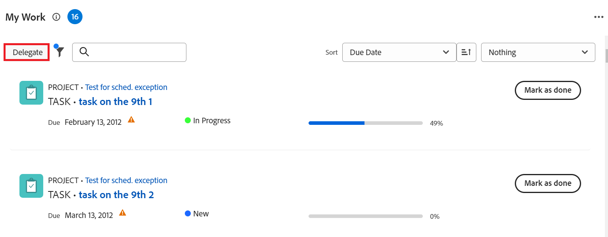
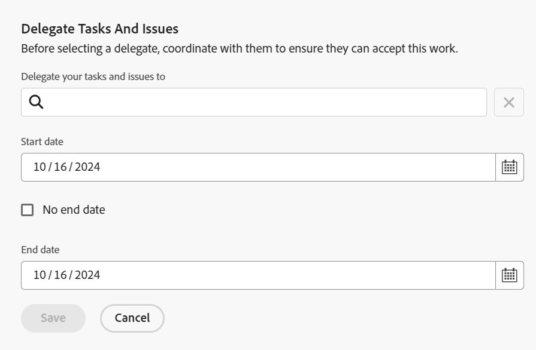

# Taken en problemen delegeren

<!-- Audited: 10/2024 -->

<!--
<NOTE: 
<you might need to change the tile to Delegate PTI, etc, when that functionality is added. Named it this so it will not conflict with the TOC article for Delegate section which was also "Delegate work"
I wrote this as a "Manage..." article and I did not add three separate articles, to match what we have for delegating approval requests)
-->

U kunt het werk tijdelijk delegeren u aan wordt toegewezen terwijl u uit het bureau bent.

U kunt taken delegeren en taken uitgeven, of u kunt goedkeuringen delegeren. In dit artikel wordt beschreven hoe taken kunnen worden gedelegeerd en hoe taken kunnen worden uitgegeven.

Voor algemene informatie over het delegeren van het werk, zie [&#x200B; het werkoverzicht van de Afgevaardigde &#x200B;](../../manage-work/delegate-work/delegate-work-overview.md).

## Toegangsvereisten

+++ Breid uit om de toegangseisen voor de functionaliteit in dit artikel weer te geven.

>[!IMPORTANT]
>
>* De gebruikers die u als afgevaardigden selecteert, ontvangen de zelfde toestemmingen zoals uw toestemmingen op de taken en de kwesties u aan hen delegeert.
>* De toestemmingen moeten binnen hun toegangsniveaus werken, en soms zouden hun toegangsniveaus lager kunnen zijn dan van u.
>
>   
>   Bijvoorbeeld, als een gebruiker slechts de toegang van de Mening tot taken op hun toegangsniveau heeft en u hebt leiden toestemmingen op de taken u aan hen delegeert, ontvangen zij leiden toestemmingen aan de taken u aan hen delegeert. Ze kunnen echter niet dezelfde handelingen uitvoeren als u met betrekking tot gedelegeerde taken. Om taken in uw afwezigheid bij te werken, moeten zij Edit toegang tot Taken van de systeembeheerder verzoeken.
>
>   
>   Voor informatie over hoe een systeembeheerder uw toegangsniveau kan wijzigen, zie [&#x200B; tot douanetoegangsniveaus &#x200B;](../../administration-and-setup/add-users/configure-and-grant-access/create-modify-access-levels.md) leiden of wijzigen.
>
>* Voor punten die worden toegewezen nadat de delegatie reeds is begonnen, kan het tot één uur nadat het punt voor [!DNL Workfront] werd toegewezen duren om de onlangs-toegewezen punten met de afgevaardigde te delen.

U moet de volgende toegang hebben om de stappen in dit artikel uit te voeren:

<table style="table-layout:auto"> 
 <col> 
 <col> 
 <tbody> 
  <tr> 
   <td role="rowheader">Adobe Workfront-pakket</td> 
   <td> 
Alle
 </td> 
  </tr> 
  <tr> 
   <td role="rowheader">Adobe Workfront-licentie</td> 
   <td> 
Medewerker of hoger

Controleren of hoger

>[!NOTE]
>
>Hoewel u aan het werk kunt worden toegewezen wanneer u een vergunning van het Verzoek hebt, kunt u uw werk niet aan anderen delegeren. [!DNL Workfront] raadt niet aan werk toe te wijzen aan gebruikers van Reviseren, aanvragen of Medewerkers.

</tr> 
  <tr> 
   <td role="rowheader">Configuraties op toegangsniveau</td> 
   <td> 
Toegang tot taken en problemen bewerken 
     
 </td> 
  </tr> 
  <tr> 
   <td role="rowheader">Objectmachtigingen</td> 
   <td> 
De toestemmingen van de mening of hoger aan de taken of de kwesties die u aan wordt toegewezen
 
    </td> 
  </tr> 
 </tbody> 
</table>

Voor informatie, zie [&#x200B; vereisten van de Toegang in de documentatie van Workfront &#x200B;](/help/quicksilver/administration-and-setup/add-users/access-levels-and-object-permissions/access-level-requirements-in-documentation.md).

+++

<!--note from the table for Object permissions:
     
Contribute or higher permissions to the projects where you are designated as the Project Owner (NOTE: you cannot delegate projects yet)

    -->

## Vereisten

Voordat u de in dit artikel beschreven activiteiten kunt uitvoeren, moet u het volgende controleren:

* Uw [!DNL Workfront] of groepsbeheerder liet [!UICONTROL **toe staat gebruikers om hun taken &amp; kwesties**] het plaatsen in de [!UICONTROL Tasks & Issues Preferences] sectie in het [!UICONTROL Setup] gebied van uw [!DNL Workfront] instantie te delegeren.

  Voor meer informatie, zie [&#x200B; taak voor het hele systeem vormen en voorkeur uitgeven &#x200B;](../../administration-and-setup/set-up-workfront/configure-system-defaults/set-task-issue-preferences.md).

## Taken en problemen delegeren aan een andere gebruiker

Alvorens het werk aan anderen te delegeren, adviseren wij dat u hen bereikt en hen op de hoogte brengt dat zij als afgevaardigden op uw het werkpunten zullen worden aangewezen. Vraag om hun mondelinge goedkeuring alvorens werk te delegeren om ervoor te zorgen zij de tijd nodig hebben om het werk te voltooien terwijl u uit het bureau bent.

Voor algemene informatie over het delegeren van taken en kwesties, zie [&#x200B; de taken en kwesties van de Afgevaardigde overzicht &#x200B;](/help/quicksilver/manage-work/delegate-work/delegate-work-overview.md).

Uw taken en problemen delegeren aan anderen:

1. Ga naar het [!UICONTROL **Begin**] gebied.
1. Verzeker u [!UICONTROL **Mijn Werk**] hebt, [!UICONTROL **Mijn Taken**], of [!UICONTROL **Mijn Uitgeven**] widgets toegevoegd aan uw [!UICONTROL **Huis**].

   Voor informatie, zie [&#x200B; toevoegen, uitgeven, of verwijder widgets in Huis &#x200B;](/help/quicksilver/workfront-basics/using-home/using-the-home-area/add-edit-remove-widgets-in-new-home.md)

1. Klik [!UICONTROL **Afgevaardigde**] in de upper-left hoek van [!UICONTROL **Mijn Werk**], [!UICONTROL **Mijn Taken**], of [!UICONTROL **Mijn Kwesties**] widgets.

   

1. Werk het volgende bij:

   * [!UICONTROL **delegeer uw taken en kwesties aan**]: Begin typend de naam van een gebruiker die u uw taken en kwesties wilt worden gedelegeerd aan, dan het selecteren wanneer het in de lijst toont. U kunt slechts één gebruiker selecteren.

     De gebruiker die u als afgevaardigde selecteert ontvangt de zelfde toestemmingen zoals uw toestemmingen op de taken en de kwesties u aan hen delegeert.

   * [!UICONTROL **datum van het Begin**]: Selecteer een datum van de kalender wanneer de delegatie van uw het werkpunten zou moeten beginnen.

     >[!TIP]
     >
     >De begindatum kan niet in het verleden zijn.

   * [!UICONTROL **Geen einddatum**]: Selecteer deze optie als u niet de einddatum voor uw delegatie wilt specificeren.

   * [!UICONTROL **einddatum**]: Selecteer een datum van de kalender wanneer de delegatie zou moeten ophouden.

     >[!TIP]
     >
     >Als u het veld Einddatum leeg laat en de optie Geen einddatum is niet geselecteerd, wordt de delegatie alleen voor de huidige dag ingesteld.

     
     <!--check screen shot - submitted bug for casing-->

1. Klik [!UICONTROL **sparen**].

   De volgende dingen gebeuren:

   * Uw werk wordt gedelegeerd aan de opgegeven gebruiker. Eventuele onvolledige taken of problemen die datums hebben binnen de door u geselecteerde tijd (inclusief de nieuw toegewezen taken nadat de delegatie is ingeschakeld) worden gedelegeerd.

     >[!TIP]
     >
     >   Voltooide werkitems met datums binnen de tijdsperiode van de delegatie worden niet gedelegeerd.

   * U ontvangt een bericht onder aan het scherm om te bevestigen dat u de delegatie van uw werk aan een andere gebruiker hebt toegelaten. De naam van de afgevaardigde gebruiker toont in het bevestigingsbericht.

   * Een indicatie dat uw taken en problemen zijn gedelegeerd aan andere gebruikers, wordt weergegeven in de meeste gebieden waar u toewijzingen kunt zien in [!DNL Workfront] . Voor meer informatie over welke gebieden de namen van afgevaardigden niet omvatten, zie [&#x200B; het werkoverzicht van de Afgevaardigde &#x200B;](delegate-work-overview.md).

   * De [!UICONTROL **Afgevaardigde**] knoop in het [!UICONTROL **3&rbrace; gebied van het Huis &lbrace;verandert in**] delegatie [!UICONTROL **uitgeven om erop te wijzen dat er een delegatie op zijn plaats is.**]
     <!--
      <MadCap:conditionalText data-mc-conditions="QuicksilverOrClassic.Draft mode">
      (NOTE: is this shot correct? See UI - this is a mock)
      </MadCap:conditionalText>
      -->

      uit

   * Als uw gebeurtenismeldingen en uw persoonlijke meldingen zijn ingeschakeld, ontvangt u ook een e-mailbevestiging van uw delegatie.

   * De gebruiker u als uw afgevaardigde selecteerde ontvangt een e-mail over de delegatie, als hun gebeurtenisberichten worden toegelaten.

     Voor informatie over het toelaten van persoonlijke e-mailberichten, zie [&#x200B; uw eigen e-mailberichten wijzigen &#x200B;](../../workfront-basics/using-notifications/activate-or-deactivate-your-own-event-notifications.md).

## Delegatie bewerken of stoppen

U kunt een delegatie laten verlopen, als u een Einddatum selecteerde, of u kunt het manueel tegenhouden. U kunt ook het tijdkader voor de delegatie wijzigen als de datums voor de delegatie zijn gewijzigd.

1. Ga naar het [!UICONTROL **gebied van het Huis**], dan klik [!UICONTROL **delegatie**] in om het even welke volgende widgets uitgeven: **Mijn Werk**, **Mijn Taken**, of **Mijn Kwesties**.
1. Voer in het vak [!UICONTROL Stop delegating tasks and issues] een van de volgende handelingen uit:
   * Wijzig de [!UICONTROL **datum van het Begin**] of de [!UICONTROL **datum van het Eind**]
   * Klik [!UICONTROL **delegatie van het Einde**]

   >[!TIP]
   >
   >    U kunt alleen de einddatum van een delegatie bewerken als de delegatie al is gestart.

   

1. (Voorwaardelijk) klik [!UICONTROL **sparen**] om de nieuwe delegatiedata te bewaren

   of

   Klik [!UICONTROL **delegatie van het Einde**] in de bevestigingsdoos om het tegenhouden van de delegatie te bevestigen.

   De delegatie heeft de datums bijgewerkt of is gestopt en de gedelegeerde gebruikers zijn uit uw taken en problemen verwijderd. Hun machtigingen voor de taken en problemen blijven bestaan.

## Zoeken naar gedelegeerde werkzaamheden en gedelegeerde gegevens

<!--(if this was released, make sure that viewing delegated approvals has not changed, as documented here: /Content/Review and approve work/Manage Approvals/delegate-approval-requests.html) 
-->

Wanneer taken en kwesties worden gedelegeerd, zijn er verscheidene gebieden in [!DNL Workfront] waar u het gedelegeerde werk kunt zien of wie de afgevaardigden zijn.

* [Delegaties zoeken in het vak Toewijzingen](#locate-delegates-in-the-assignments-box)
* [Gedelegeerde werkzaamheden zoeken in [!UICONTROL Home]](#locate-delegated-work-in-home)

### Delegaties zoeken in het vak [!UICONTROL Assignments]

Wanneer uw systeem of groepsbeheerder werkdelegatie in uw systeem toelaat, [!UICONTROL Assignments] toont de doos de volgende lusjes overal u tot het kunt toegang hebben:

* [!UICONTROL **Toewijzingen**]: De gebruikers die aan de taak of de vertoningskwestie hier worden toegewezen.
* [!UICONTROL **Delegaties**]: De gebruikers die als afgevaardigden door de wijzers op de taak worden aangewezen of hier vertoning van de kwestie.

U kunt het vak [!UICONTROL Assignments] openen in de volgende gebieden:

* De taak- of uitgiftekop

  Het veld [!UICONTROL Assignments] in de taak- of uitgiftekop verandert in [!UICONTROL Assignments and delegations] .

  

* De [!UICONTROL Workload Balancer] bij het handmatig toewijzen van taken of uitgaven

  

>[!NOTE]
>
> U kunt afgevaardigden niet weergeven in de [!UICONTROL Assignments] -sectie van een taak of in het bewerkvak voor uitgaven.

Als een taak of een kwestie wordt gedelegeerd en subtab [!UICONTROL Delegations] leeg is, kan een van de volgende scenario&#39;s bestaan:

* U bent niet toegewezen aan de taak of uitgave.
* De taak of de uitgiftedata zijn buiten het tijdkader van de delegatie.

>[!TIP]
>
>De geplande of Werkelijke Uren voor gedelegeerde taken en kwesties worden niet in hulpmiddelen van het middelbeheer, zoals [!UICONTROL Workload Balancer] of [!DNL Resource Planner] voor de gedelegeerde gebruikers in aanmerking genomen. De uren blijven alleen gekoppeld aan de toegewezen gebruiker.

### Gedelegeerde werkzaamheden zoeken in [!UICONTROL Home]

1. Ga naar het [!UICONTROL **1&rbrace; gebied van het Huis &lbrace;in**] Mijn Werk [!UICONTROL **widget.**]
1. Klik op de vervolgkeuzelijst met filters en selecteer een of meer van de volgende opties:
   * [!UICONTROL **Gedelegeerde**]: aan meningstaken en kwesties die aan u of door u worden gedelegeerd.
   * [!UICONTROL **&#x200B;**] Gedelegeerde aan me: aan meningstaken en kwesties die aan u door een andere gebruiker worden gedelegeerd.
   * [!UICONTROL **Gedelegeerde door me**]: aan meningstaken en kwesties die door u aan andere gebruikers worden gedelegeerd.

      uit

1. (Optioneel) Klik op het vervolgkeuzemenu [!UICONTROL **Sorteren**] om de lijst op de volgende criteria te sorteren:
   * [!UICONTROL Due Date]. Dit is de standaardoptie voor sorteren.
   * [!UICONTROL Name]
   * [!UICONTROL Percent Complete]
   * [!UICONTROL Status]
1. (Facultatief) breid het groeperingsdrop-down menu in het hoger-recht van [!UICONTROL **Mijn werk**] widget, en groep door één van de volgende criteria uit:
   * Niets. Dit is de standaardoptie voor groeperen.
   * [!UICONTROL Project]
   * [!UICONTROL Status]
   * [!UICONTROL Due Date]

1. Bekijk een van de volgende items die u hebt gedelegeerd of die aan u zijn gedelegeerd:

   * Voor punten die u aan anderen delegeerde, vind de naam van de afgevaardigde onder het statuut van de taak of de kwestie, na [!UICONTROL **Gedelegeerde aan**].

   * Voor punten die aan u worden gedelegeerd, vind de naam van de ontvanger onder het statuut van de taak of de kwestie, na [!UICONTROL **aan u door**] worden gedelegeerd.

     >[!TIP]
     >
     >    Als de delegatie op een datum na de datum van vandaag moet beginnen, de begindatum van de delegatie ook in [!UICONTROL Work List] toont. De gedelegeerde items worden weergegeven in de groep die u selecteert voor de [!UICONTROL Work List] , afhankelijk van het type van de groep. Als u bijvoorbeeld groepeert op [!UICONTROL Planned Completion Date] , worden de gedelegeerde items weergegeven in de groep die overeenkomt met de geplande voltooiingsdatums.
